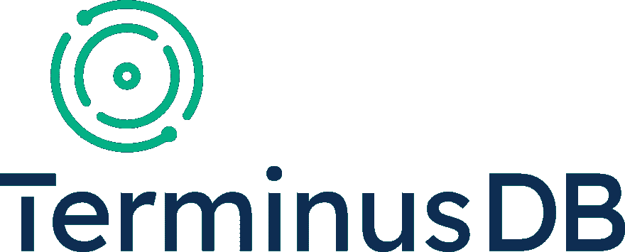
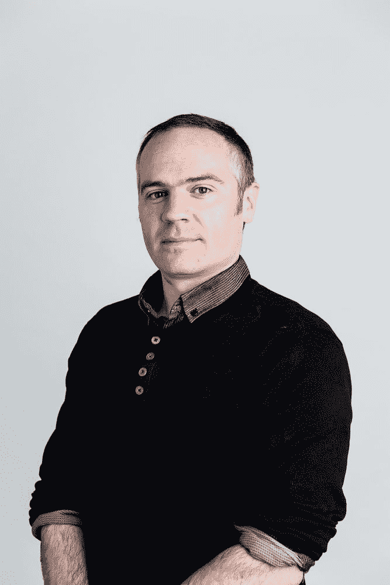
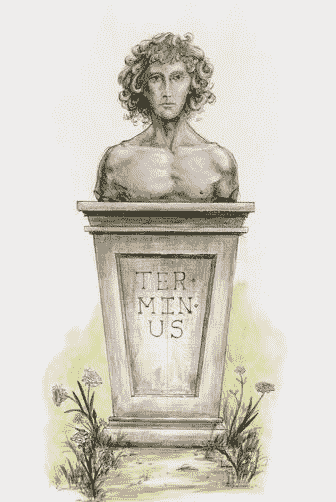
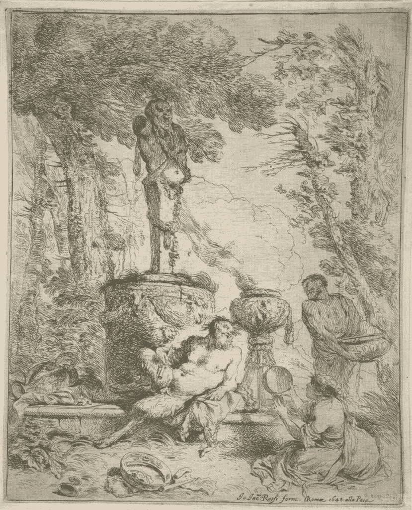
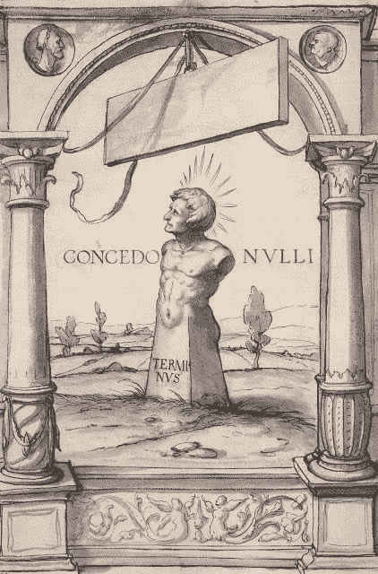
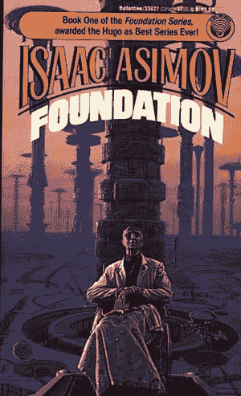
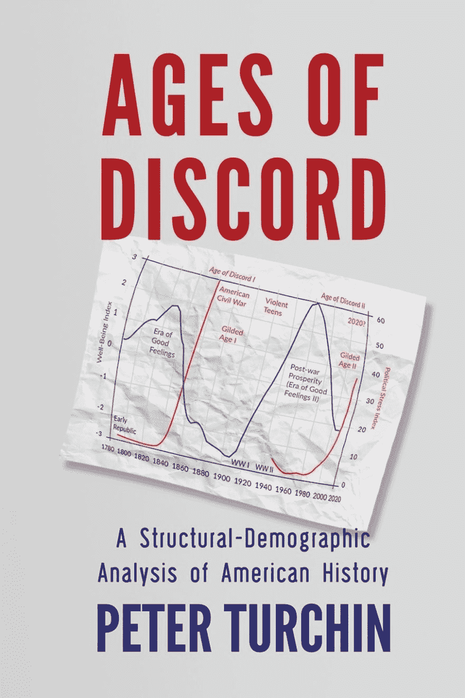

# TerminusDB —名称中有什么？

> 原文：<https://dev.to/terminusdb/terminusdb-what-s-in-a-name-58nd>

TerminusDB 是一个开源的模型驱动的图形数据库，用于专门为网络时代设计的知识图形表示。我们的上市日期是今年 10 月 1 日。

核心开发团队正忙着将各个部分放入适当的位置，我们都非常兴奋能够将 TerminusDB 推向世界。

未来几周，我们将推出大量关于数据库功能的内容和文档。

我们长期以来一直梦想着这样一个未来:数据库通过从现有的网络数据源和用户那里自动提取信息来不断提高它们所包含信息的可靠性和准确性。我们希望建立一个能够自动生成复杂的监管和分析工具的数据库，以允许用户访问和管理它们包含的数据，并将这些分析的结果输入到实时自动化工作流和学习算法中。这是一个很大的要求，但 TerminusDB 将是实现这一目标的有力一步。

我们仁慈的终身独裁者是独一无二的加文·孟德尔·格里森。他是一个数据库狂人，梦想着逻辑、数学和形式方法。Gavin 和团队的其他成员为构建 TerminusDB 倾注了多年的高强度工作。建立数据库需要大量的理论和实践创新。我们不仅不得不自己编写软件，而且还不得不为数据密集型系统开发并正式建立一个新的计算机编程理论模型；为数据对象开发、形式化并证明一种新的模块化逻辑；并设计、开发和部署一种新的通用逻辑方法来描述和查询图形形状并约束它们的转换。这是所有贡献团队的心血。

特斯是罗马的界限之神。他是一个古老的罗马神——可能是罗慕路斯在建城后引入的。有一个关于罗马末代国王的著名故事(他是如此不受欢迎和骄傲，以至于被推翻并宣布成立共和国)——他想将罗马重塑为一个帝国首都，并参与了一项大规模的建设计划。作为他工作的一部分，他着手重建国会山的朱庇特神庙。塔尔坎认为，在罗穆卢斯供奉的遗迹上建造一座巨大的神庙将会巩固他作为罗马伟大国王的地位。为了便于重建，旧的供奉各种神的神龛必须拆除；然而，当他们试图移动 Terminus 的神龛时，神龛纹丝不动。终端是国会大厦不可移动的岩石。就连众神之王朱庇特也不得不向特斯姆下跪。

伟大的罗马诗人奥维德在 500 年后写下了这些事件:

> 新国会大厦建成时发生了什么？
> 
> 在那里他被发现，并与伟大的朱庇特分享神庙。
> 
> 即使现在寺庙的屋顶上还有一个小洞，
> 
> 所以他头顶上除了星星什么也看不见。
> 
> 从那时起，特米斯，你就不能自由漫步了:
> 
> 呆在那里，呆在你被安置的地方，
> 
> 不要屈服于你邻居的祈祷，
> 
> 免得你把人看得比木星更重要。'

Terminus 作为边界之神，特别适合我们的数据库管理系统。所有好的数据库都需要边界——你需要知道里面有什么，没有什么。我们在构建 TerminusDB 方面的主要创新之一是实现了 OWL 的封闭世界版本，这是一种 web 本体语言。在语义网学术传统中，OWL 有一个开放世界假设，这意味着一个陈述的真值可能是真的，而不管它是否已知是真的。对于 TerminusDB，任何为真的陈述也必须被认为是真的。这使得数据库实用，并可用于广泛的工业应用。

罗马神 Terminus 的口号“Concedo Nulli”——不向任何人让步——对 TerminusDB 的核心团队也特别有吸引力。正如任何交付过生产就绪数据库的人都知道的那样，您必须穿墙才能完成它，并且不向任何人让步。我们承受着这些战争的创伤。

阿西莫夫的粉丝们也将认可特斯联是基金会的母星。心理史学的发明者哈里·谢顿预言，在一个新帝国崛起之前，会有 3 万年的野蛮黑暗时期。谢顿设计了一个计划，将这个间隔期从 30，000 年缩短到 1，000 年。该基金会是作为一个致力于在 1000 年的混乱中保存所有人类知识的组织而成立的。谢顿建立基金会的真正意图是保护科学，并为第二帝国提供一个政治起点。基金会从特米斯开始成长，成为一个由特米斯直接控制或在其势力范围内的行星联盟。

TerminusDB 为全球历史数据库 Seshat 提供支持，该数据库类似于基金会，因为 Seshat 致力于在一个地方汇集关于人类历史的最新和最全面的知识。历史信息的海量收集，让研究人员可以严格检验关于大规模社会和人类历史兴衰的不同假说。核心 TerminusDB 团队活跃于 Cliodynamics 社区。气候动力学将历史视为科学——实践者开发解释这种动态历史过程的理论，将这些理论转化为数学模型，然后根据数据测试预测。

气候动力学之父彼得·图尔钦(Peter Turchin)最近写了一本书《不和谐的时代》(Ages of Discord)，该书使用气候动力学方法和全球历史数据库中的数据来洞察未来。

这与阿西莫夫的心理历史非常相似。Cliodynamics 是心理史学的真实世界版本，而 Seshat 是基础的真实世界版本。TerminusDB 类似于基础宇宙中的 Terminus。

我们希望世界各地的人们都能使用我们的数据库，但我们也希望你能为这个项目做出贡献。我们相信自由软件运动的理想。因此，我们将在 GPL V3 下发布 TerminusDB。这将允许每个人检查和使用完整的代码库。

我们相信以数据为中心的开发方法。在专有和复杂的应用程序中囤积数据是一个错误。验证逻辑应该嵌入到它所属的数据层中，而不是包含在维护应用程序代码的昂贵代码中。在我们从事这个项目时，数据所有权的长期成本是一个巨大的考虑因素。TerminusDB 贡献者将在未来几周和几个月在这个博客上发帖。

加入以数据为中心的革命！