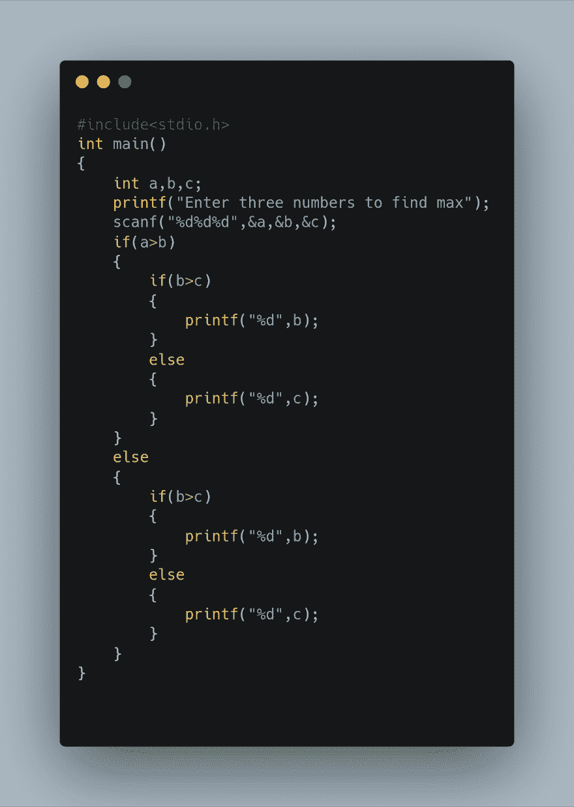
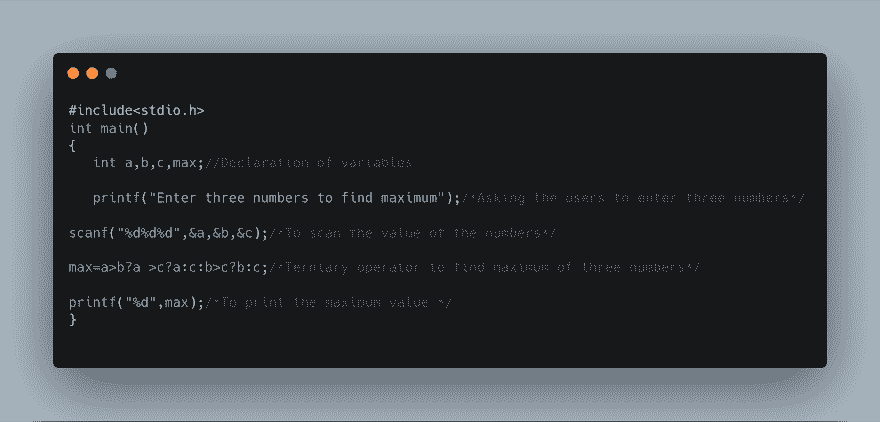
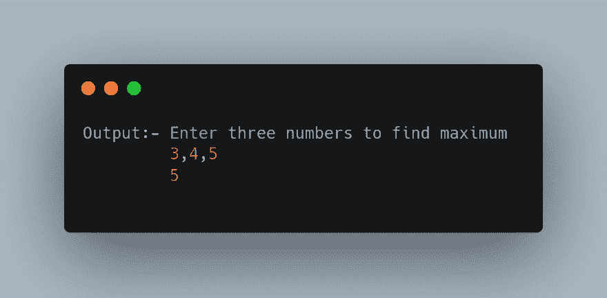

# C 语言中的三元运算符

> 原文：<https://dev.to/swapnil7000/terniary-operators-in-c-language-2o6p>

如何在不使用 IF-ELSE 语句的情况下编写一个 C 程序来比较三个数？

**备注:-**
条件运算符(？:)是一个三元运算符(它需要三个操作数)。条件运算符的工作方式如下:

●第一个操作数隐式转换为 bool。在继续之前，对其进行评估并完成所有副作用。

●如果第一个操作数的计算结果为 true (1)，则计算第二个操作数。

●如果第一个操作数的计算结果为假(0)，则计算第三个操作数。

条件运算符的结果是计算第二个或第三个操作数的结果。条件表达式中只计算最后两个操作数中的一个。

条件表达式具有从右向左的结合性。第一个操作数必须是整数或指针类型。以下规则适用于第二个和第三个操作数:

●如果两个操作数属于同一类型，则结果属于该类型。

●如果两个操作数都是算术或枚举类型，则执行通常的算术转换(包含在标准转换中)将它们转换为通用类型。

●如果两个操作数都是指针类型，或者一个是指针类型，另一个是计算结果为 0 的常量表达式，则执行指针转换，将它们转换为通用类型。

●如果两个操作数都是引用类型，则执行引用转换，将它们转换为通用类型。

●如果两个操作数都是 void 类型，则公共类型是 void 类型。

●如果两个操作数属于相同的用户定义类型，则公共类型为该类型。

●如果操作数具有不同的类型，并且至少有一个操作数具有用户定义的类型，则使用语言规则来确定通用类型。(参见下面的警告。)

不在前面列表中的第二个和第三个操作数的任何组合都是非法的。结果的类型是通用类型，如果第二个和第三个操作数属于同一类型并且都是左值，则结果是左值。

**使用嵌套 IF ELSE 语句:**

**使用三元运算符:-**

int main()
{
int a，b，c，max//变量声明

printf("输入三个数求最大值")；/ *要求用户输入三个数字* /

scanf("%d%d%d "，&a，&b，& c)；/ *扫描数值* /

max=a>b？a >c？甲:丙:乙>丙？b:c；/ *寻找最多三个数字的三元运算符* /

printf("%d "，max)；/*打印最大值*/
}

**给定代码的解释:-**

在这个程序中，我们首先声明四个变量三个要比较的数字和一个存储最大值的 max 变量，然后我们要求用户输入三个数字，然后我们使用三个运算符来比较三个数字，然后找到三个数字中的最大值并将其存储到 max 变量中。首先，它将检查 a>b，如果 a>b，那么它将检查 a>c，如果这是真的，它将在 max 中复制 a 的值 如果 ac 为真，那么 b 将被赋值给 max，b 将被打印，如果不为真，那么 c 将被赋值给 max，并且将被打印。

**三元运算符的语法:-**

条件？真实陈述:虚假陈述

结果:-
最后我想总结一下，你可以使用嵌套的 if-else 语句以及三元运算符来编写上面的程序。与嵌套的 if else 相比，我更喜欢三进制操作符，因为它的代码行更少，使你的代码更具可读性。这是我写博客的主要原因。我希望你喜欢 it❤❤.