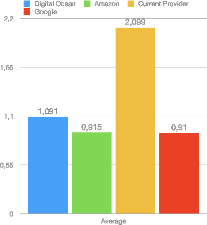
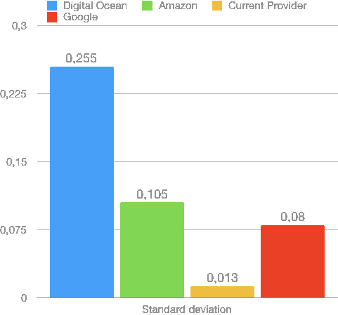

# 测试云服务提供商的速度

> 原文：<https://dev.to/oi_emil/testing-cloud-service-providers-for-speed-1g22>

在本文中，我解释了我如何测试一些云服务提供商的文件交付速度，以便选择一个在我的公司使用。具体来说，我测量了他们的对象存储返回足够的文件供测试应用程序使用所需的时间。(另外，这是我在 Dev(以及生活中)上的第一个帖子，所以不仅仅是测试方法，还有写作本身的反馈都是受欢迎的。)

首先简单介绍一下背景。请随意[跳过这一部分](#skip-context)

我工作的初创公司通过一个应用程序提供服务，高质量的视频在我们如何向用户提供价值方面发挥着关键作用。由于开发速度是根本，而资源稀缺，我们选择了一个通用的托管后端作为我们的“基础设施”。

好家伙，我们是来享受美食的。

本周，当我们准备向公众发布我们的服务时，我们的后端提供商决定将单个文件的大小限制在 15 MB。15 MB！你知道 1080p@60fps 的视频多少秒适合 15 MB 吗？答:[不多](https://toolstud.io/video/filesize.php?dimensions_w=1920&dimensions_h=1080&framerate=60&timeduration=35&timeduration_unit=seconds)。

但那是另一次的咆哮。我们在和时间赛跑。我们继续测试吧。

# 0。认识一下参赛者

*   数字海洋空间+他们的标准 CDN
*   亚马逊 S3 + Cloudfront CDN
*   谷歌云存储(默认有一个 CDN)
*   我们当前的提供商(使用上传完成后他们提供给我们的链接)

## 1。测试环境

所有服务都以最快的默认设置(如果可用)进行配置，选择离我们大多数用户最近的数据中心(巴西最南端)。这意味着:

*   数字海洋的纽约 3
*   亚马逊 S3 的美洲/圣保罗
*   Google 云存储的南美-东方 1(圣保罗)
*   美国西北部(根据一个 IP 追踪器)为我们目前的供应商

为了尽可能接近地模拟使用场景，同时仍然为我们的参赛者提供 isonomic 环境，相同的文件(m4v 视频)被上传到每台服务器，并且用 Swift 编写了一个测试应用程序。

为了减少外部因素的影响，测试设备连接到 150 Mbps 的专用链路。

## 2。测试程序

所有的测试都应该自动完成。因此，在启动之后，测试应用程序将

1.  启动计时器；
2.  尝试从其中一个服务加载视频；
3.  播放视频的第一帧；
4.  停止计时器或；
5.  2 秒后超时；
6.  下一次服务时，从过程 2 开始重复。

在通过所有 4 个服务 100 次之后，它将停止。然后将每个候选人的“第一帧时间”的最低 90%进行平均，得出我们的获胜者。

免责声明:我不是统计学专家。但是，从我对的调查来看，90 的样本量似乎足以弥补 0.25 秒的加载时间差异。

## 3。履行

为了使测试应用程序尽可能简单，但仍然类似于我们生产应用程序中的用例，我们将在后者中使用的相同框架之上执行测试:AVFoundation 和 UIKit。

该应用程序的代码可在[这里](//github.com/emilrb/test-cloud-video-playback-app)获得。

我没有费心让应用程序能够导出测试结果。相反，这些值被 CSV 编码并打印在控制台上。

## 4。结果

测试运行顺利，大约 10 分钟就完成了。每一次尝试都有 3 秒钟的时间限制，所以测试最多持续 20 分钟。
在所有 400 个负载中，只有一个提供商(Digital Ocean)达到了该限制。但是因为我们只考虑了前 90%的负载，所以数据点被丢弃了。

对测试数据进行数字分析后，结果似乎很清楚。图 1 显示了每个提供商的平均“第一帧时间”(秒):

<small>Figure 1</small>

我们当前提供商的 3 个备选方案持续提供更好的结果，甚至最慢的(平均)竞争者在一半的负载上也快了 50%以上。

值得一提的是，我们的提供商在更可预测的时间内交付数据，这在某些情况下是可取的。图 2 显示了每项服务的标准偏差:

<small>Figure 2</small>

数字海洋中发现的较高的标准差似乎是由一些路由现象引起的。他们的网站上还有一条关于另一个数据中心正在进行维护的警告消息，这可以解释这些结果，但这只是猜测。

## 5。进一步的工作

该测试只考虑了一个小于 15 MB 的单个文件(一个 720p 视频)的“第一帧时间”。应该在更差的网络条件下，对增量更大的文件(更高的视频质量和更长的持续时间)进行更多的调查。测试应用程序也可以改进，允许在测试前选择样本大小(它现在是硬编码的)。其他测试也可以播放视频更长时间，以检查播放中断。

## 6。结论

如果我们没有调查此事，似乎我们的客户会浪费很多时间等待他们的视频加载。现在，我们将保持我们的数据库和业务逻辑在我们目前的供应商的方式。在我们的发布周迁移一切是不明智的(委婉地说),而且成本太高。幸运的是，我们的视频不会改变太多，现在可以手动管理，所以我们将把它们迁移到我们选择的提供商。

所有 3 个备选方案的性能都非常相似，因此在选择将文件移动到哪里时，可以考虑其他因素，如成本和可用性。目前，我们倾向于谷歌云存储，但还需要更多的测试。

我试图保持这篇文章的简洁，同时为其他人提供足够的信息，使他们能够在自己的环境中重现这些测试。你有没有什么不同的做法？你经常做这种测量吗？我真的很感谢你的意见。谢谢你通读这一切。

封面照片由 Veri Ivanova 在 Unsplash 上拍摄