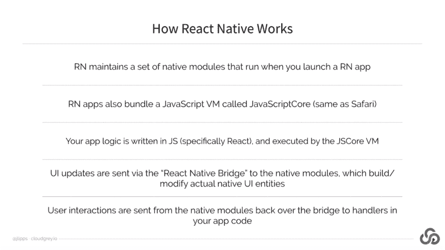
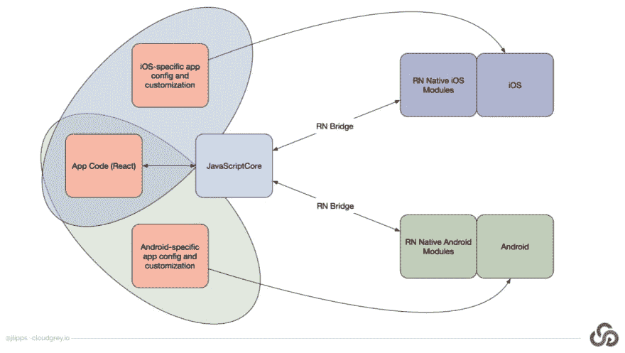
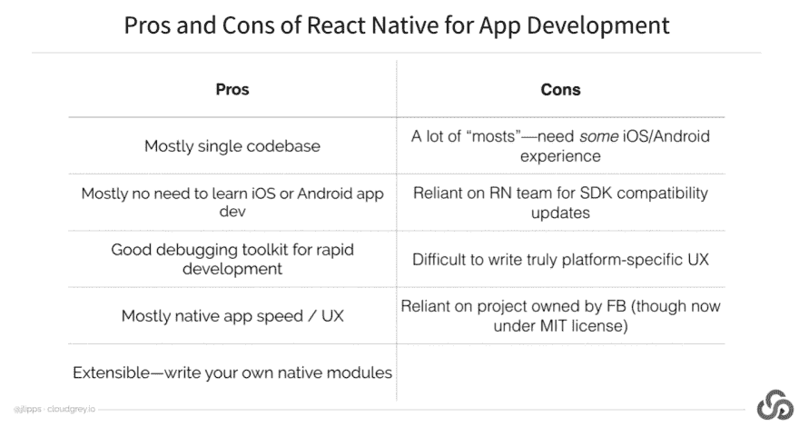
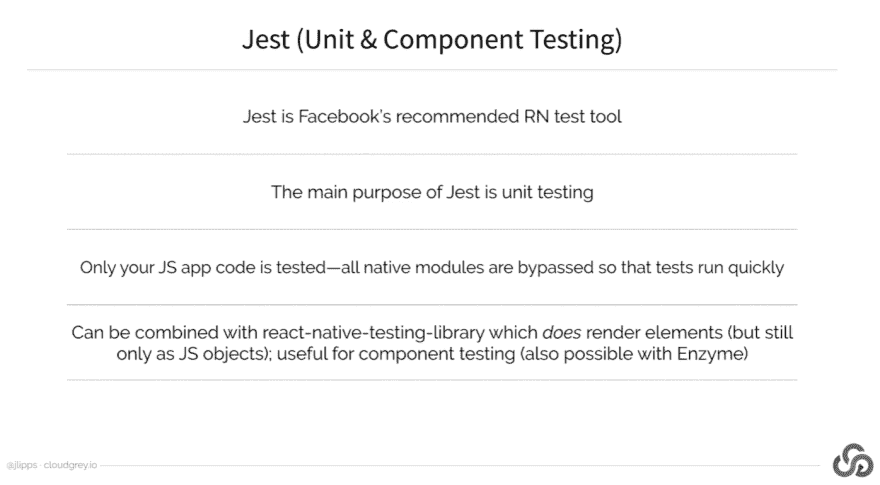
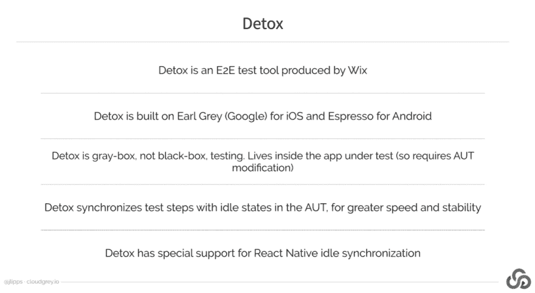
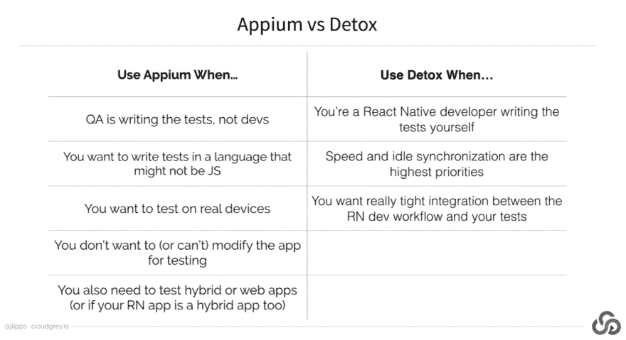

# 使用 Appium 测试 React 本机应用程序

> 原文：<https://dev.to/headspin_io/testing-react-native-apps-with-appium-38cp>

[查看完整视频和文字记录](https://www.headspin.io/blog/testing-react-native-apps-with-appium?utm_source=devto&utm_medium=referral&utm_campaign=rss)

## 总结

Appium 爱好者乔纳森·立普斯在 6 月份加入了 HeadSpin 团队，参加了一个关于使用 Appium 测试 React Native 应用程序的网络研讨会，讨论了使用 React Native 进行应用程序开发的利弊，使应用程序可由 Appium 测试，以及 Appium 与 Jest 和 Detox 等其他应用程序测试方法的比较。

乔纳森·立普斯经营着一家名为 Cloud Grey 的咨询公司——他们主要为企业客户处理移动自动化战略——自 2013 年初 Appium 成立以来一直在为其编写代码。

以下是网上研讨会的简要概述。有关上述主题的详细说明，请观看本总结末尾的网络研讨会！

首先，人们认为原生应用比混合应用或网络应用更快更好。编写原生应用程序需要使用操作系统供应商自己提供的原生 SDK，这意味着他们可以访问给定设备上可用的所有底层 API。这里的缺点是，如果你同时为 iOS 和 Android 用户开发一个应用程序，你将不得不开发两个独立的代码库，这将增加工作量。

乔纳森·立普斯说:“React Native 为你提供了两个世界的最佳选择，因为它允许你使用你在 web 开发中熟悉的语言，如 JavaScript、CSS 等，针对 iOS 和 Android 的原生 SDK。

这里有一个视觉上的分解。

作为一名 React 原生开发人员，您最终会得到一个用 JavaScript 编写的核心共享代码库，以及持续维护的特定于平台的代码。

**那么，在使用 React Native 开发的应用上运行 Appium 测试有什么独特之处呢？**

因为 React 原生应用本质上是原生应用，所以操作系统像对待任何其他原生应用一样对待 React 原生应用。换句话说，iOS 和 Android 不知道一个 JavaScript 引擎正在调用本机模块——从操作系统的角度来看，这是隐藏的。由于 Appium 使用苹果和谷歌提供的标准自动化工具，从这些工具的角度来看，一切都像普通的原生应用程序。

“就像使用 Appium 的一组 desire 功能开始 Android 测试，并传递 APK 文件的路径一样，当处理 React Native 时，你会经历相同的步骤，”乔纳森·立普斯说。不需要使用任何特定的功能或命令。iOS 也是如此:只需使用标准的 iOS 平台功能和 React 本地应用程序的路径。

**下表讨论了 Appium 与 Jest 和 Detox 等其他应用测试方法的对比。**

谈到 React Native，人们在测试应用程序时会使用各种工具。

这些资源提供了大量关于 Appium 和 React Native 的信息。

1.  Wim Selles 在 Appium + React Native 上的 AppiumConf 2018 [talk](https://www.youtube.com/watch?v=10Zzlf5DmSI)
2.  React 本机[辅助功能文档](http://facebook.github.io/react-native/docs/accessibility)
3.  乔纳森·立普斯的 React Native [测试应用](https://github.com/cloudgrey-io/the-app)
4.  乔纳森·立普斯的每周简讯 [Appium Pro](https://appiumpro.com/)

[查看完整视频和文字记录](https://www.headspin.io/blog/testing-react-native-apps-with-appium?utm_source=devto&utm_medium=referral&utm_campaign=rss)

