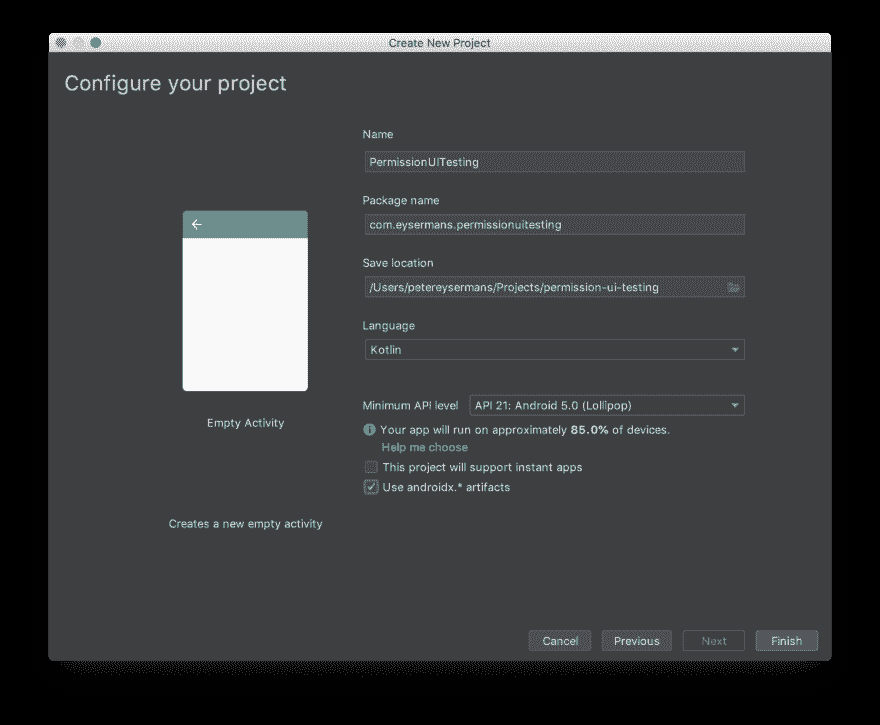
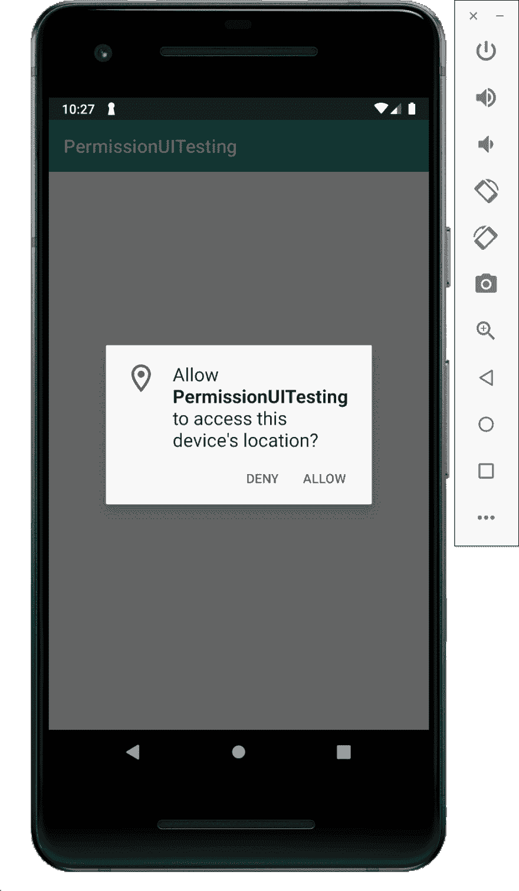
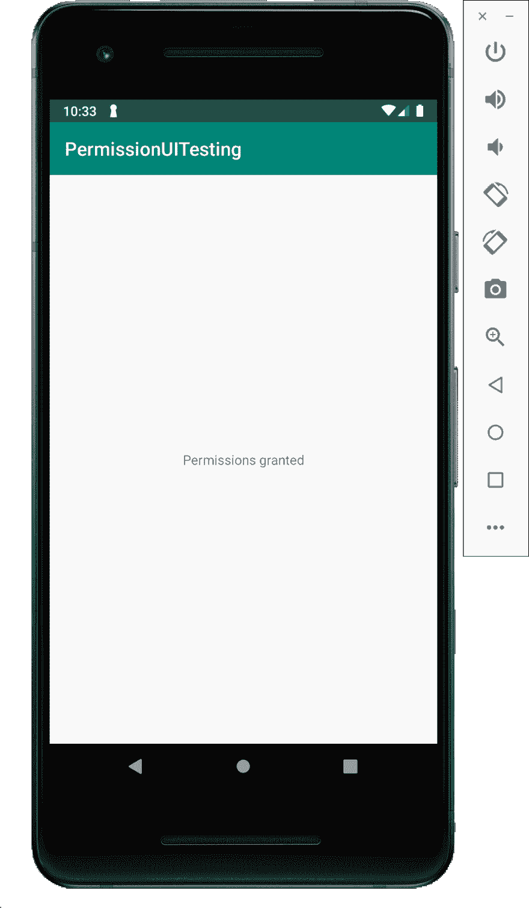
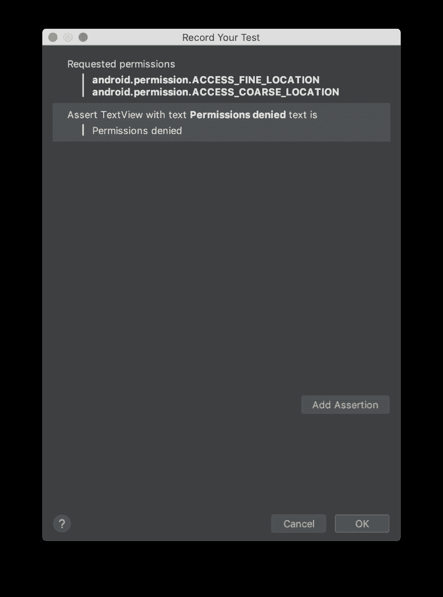
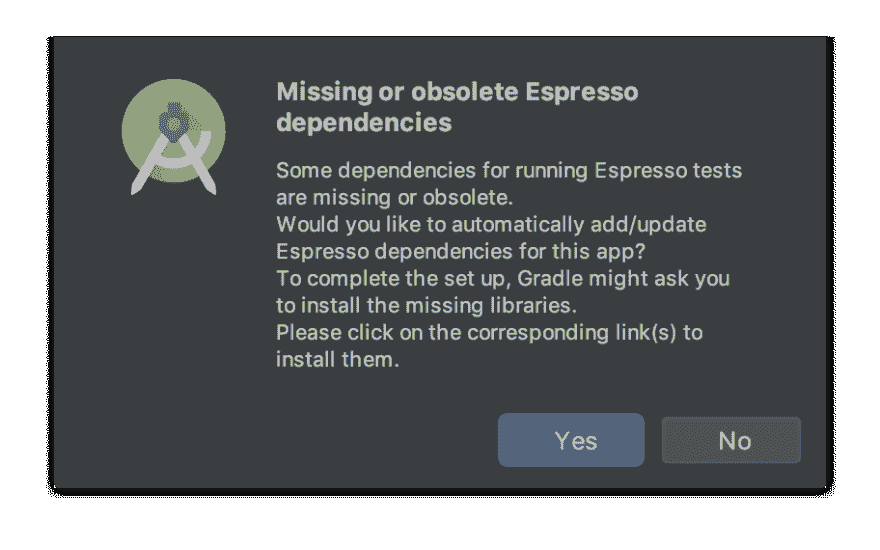

# 在 Android 应用程序中测试请求权限

> 原文：<https://dev.to/petereysermans/testing-request-permissions-in-an-android-application-26em>

最初发布于 2019 年 7 月 15 日我自己的博客。

在开发一个 Android 应用程序时，我想测试权限请求。此应用程序需要位置权限，通常这是一个只编写一次的代码，当它被标记为完成时，就不会再被查看。我想创建一些 UI 测试，以确保一切正常，并且在未来仍能正常工作。

让我们从创建一个示例应用程序开始。它是用 Kotlin 编写的，API 23 是最低 API 级别，它也使用 androidx。*神器。

[](https://res.cloudinary.com/practicaldev/image/fetch/s--0wtiqipx--/c_limit%2Cf_auto%2Cfl_progressive%2Cq_auto%2Cw_880/https://eysermans.cimg/articles/testing-request-permissions-in-an-android-application/Screenshot_2019-07-13_at_22-4b0a5092-dde1-4210-a438-9b8566148325.07.27.png)

在`AndroidManifest.xml`文件中添加了以下权限:

```
<uses-permission android:name="android.permission.ACCESS_FINE_LOCATION" />
<uses-permission android:name="android.permission.ACCESS_COARSE_LOCATION" /> 
```

创建活动时，应用程序将检查是否授予了位置权限。如果他们还没有被授予，应用程序将请求他们。当权限被拒绝时，app 会向用户显示`Permissions denied`。当权限被授予时，它将显示`Permissions granted`。非常简单。

这是被覆盖的`onCreate`方法:

```
override fun onCreate(savedInstanceState: Bundle?) {
        super.onCreate(savedInstanceState)
        setContentView(R.layout.activity_main)

        if (ContextCompat.checkSelfPermission(this, Manifest.permission.ACCESS_FINE_LOCATION) 
               != PackageManager.PERMISSION_GRANTED && 
            ContextCompat.checkSelfPermission(this, Manifest.permission.ACCESS_COARSE_LOCATION) 
               != PackageManager.PERMISSION_GRANTED) {

            requestPermissions(
                arrayOf(
                    Manifest.permission.ACCESS_FINE_LOCATION,
                    Manifest.permission.ACCESS_COARSE_LOCATION
                ), LocationPermissionRequestCode)
        }
    } 
```

这段代码检查是否已经授予了`ACCESS_FINE_LOCATION`和`ACCESS_COARSE_LOCATION`权限。如果没有，将向用户请求它们。`LocationPermissionRequestCode`变量是一个标识请求的常量。在示例应用程序中，它被设置为`1`。

[](https://res.cloudinary.com/practicaldev/image/fetch/s--YqucK1Wi--/c_limit%2Cf_auto%2Cfl_progressive%2Cq_auto%2Cw_880/https://eysermans.cimg/articles/testing-request-permissions-in-an-android-application/Screenshot_2019-07-13_at_22-1ea4eba7-19ea-4334-bdef-51c1fc7515df.27.16.png)

接下来，我们需要处理用户的响应。为此，活动提供了一个可以被覆盖的方法。`onRequestPermissionsResult`方法被覆盖，switch 语句决定接收哪个请求的响应。注意，上面使用了相同的`LocationPermissionRequestCode`变量。根据请求的结果，`feedbackLabel`的文本被更改。

```
override fun onRequestPermissionsResult(requestCode: Int, permissions: Array<out String>, grantResults: IntArray) {

        when(requestCode) {
            LocationPermissionRequestCode -> {

                if((grantResults.isNotEmpty() && grantResults[0] == PackageManager.PERMISSION_GRANTED)) {
                    feedbackLabel.text = "Permissions granted"
                } else {
                    feedbackLabel.text = "Permissions denied"
                }
                return
            }
            else -> {

            }
        }
    } 
```

注意:要访问`feedbackLabel`，我使用的是 [Kotlin Android 扩展](https://kotlinlang.org/docs/tutorials/android-plugin.html)。

[](https://res.cloudinary.com/practicaldev/image/fetch/s--VfHE2_a8--/c_limit%2Cf_auto%2Cfl_progressive%2Cq_auto%2Cw_880/https://eysermans.cimg/articles/testing-request-permissions-in-an-android-application/Screenshot_2019-07-13_at_22-61b9fafd-eaf0-4b38-96d6-6f53fd13e768.33.49.png)

现在示例应用程序正在运行，让我们进入测试部分。像这样的代码通常只写一次，测试一次，然后就再也不用碰了。开发人员会授予许可，然后继续他的生活。如果有虫子爬进来，人们会发现得太晚或者根本没有发现。因此，让我们编写一些 UI 测试来验证应用程序的行为是否符合预期。Android 上的 UI 测试通常使用 Espresso 来完成，而且效果很好。Android Studio 甚至内置了一个[浓缩咖啡测试记录器，可以快速记录测试。](https://www.thedroidsonroids.com/blog/android/espresso-test-recording)

让我们记录我们的第一个 Espresso 测试，如果用户拒绝许可，`feedbackLabel`应该读为`Permissions denied`。在 Android Studio 中，从菜单中选择`Run > Record Espresso Test`。

[](https://res.cloudinary.com/practicaldev/image/fetch/s--9_GFsF62--/c_limit%2Cf_auto%2Cfl_progressive%2Cq_auto%2Cw_880/https://eysermans.cimg/articles/testing-request-permissions-in-an-android-application/Screenshot_2019-07-13_at_22-5f7cc541-7df5-4c98-b2dd-85bcf9466246.39.27.png)

测试记录器将打开，并显示设备上发生的所有操作的日志。点击`Deny`按钮后，断言`feedbackLabel`具有预期值。

[](https://res.cloudinary.com/practicaldev/image/fetch/s--7uO1x88y--/c_limit%2Cf_auto%2Cfl_progressive%2Cq_auto%2Cw_880/https://eysermans.cimg/articles/testing-request-permissions-in-an-android-application/Screenshot_2019-07-13_at_22-e00c1d8f-81fb-4353-9767-8f75414be00b.40.35.png)

如果 Espresso 尚未添加到应用程序的 gradle 文件中，Android Studio 会建议为您添加。

[](https://res.cloudinary.com/practicaldev/image/fetch/s--09zlECUE--/c_limit%2Cf_auto%2Cfl_progressive%2Cq_auto%2Cw_880/https://eysermans.cimg/articles/testing-request-permissions-in-an-android-application/Screenshot_2019-07-13_at_22-932c51ce-c5aa-4a87-ad3f-77235c3f9d3c.40.50.png)

不幸的是，浓缩咖啡不能用于这种测试。 [Espresso 只对当前包](https://stackoverflow.com/a/50383212/145585)有效，权限对话框中的`Allow`和`Deny`按钮来自另一个包。正如你在测试记录中看到的，点击`Deny`按钮并没有被记录到动作列表中。

然而有一个解决方案，紧挨着 Espresso 的还有 [UI Automator 测试框架](https://developer.android.com/training/testing/ui-automator)。这个框架从另一个包中访问元素没有问题。我们不能使用测试记录器，所以必须对测试进行编码，但这非常简单。gradle 文件中的这一行将添加 UI Automator:

```
androidTestImplementation 'com.android.support.test.uiautomator:uiautomator-v18:2.1.3' 
```

测试变成了:

```
@RunWith(AndroidJUnit4::class)
class MainActivityTests {

    private var device : UiDevice? = null

    @get:Rule
    var mainActivityTestRule = ActivityTestRule(MainActivity::class.java)

    @Before
    fun setUp() {
        this.device = UiDevice.getInstance(InstrumentationRegistry.getInstrumentation())
    }

    @Test
    fun testFeedbackLocationPermissionDenied() {
        val denyButton = this.device?.findObject(UiSelector().text("DENY"))
        val permissionDeniedMessage = this.device?.findObject(UiSelector().text("Permission denied"))

        denyButton!!.click()

        assert(permissionDeniedMessage!!.exists())
    }

    @Test
    fun testFeedbackLocationPermissionAllowed() {
        val allowButton = this.device?.findObject(UiSelector().text("ALLOW"))
        var permissionAllowedMessage = this.device?.findObject(UiSelector().text("Permission allowed"))
        allowButton!!.click()
        assert(permissionAllowedMessage!!.exists())
    }
} 
```

当许可被允许时，`testFeedbackLocationPermissionAllowed`测试将检查消息，当许可被拒绝时，`testFeedbackLocationPermissionDenied`将检查消息。

然而，这些测试有一个问题。一旦许可被允许，测试将在再次运行时失败。如果你仔细想想，这并不奇怪。因为权限已经被授予，权限弹出窗口将不再显示第二、第三、第四，...测试运行的时间。

要解决这个问题，需要在每次运行测试时清除授予的权限。[使用`pm revoke`可以清除权限。](https://stackoverflow.com/questions/43462172/android-revoke-permission-at-start-of-each-test)这些命令被添加到`After`方法中来清理权限。

```
@After
fun tearDown() {
   InstrumentationRegistry.getInstrumentation().uiAutomation.
       executeShellCommand("pm revoke ${InstrumentationRegistry.getInstrumentation().targetContext.packageName} android.permission.ACCESS_COARSE_LOCATION")

   InstrumentationRegistry.getInstrumentation().uiAutomation.
       executeShellCommand("pm revoke ${InstrumentationRegistry.getInstrumentation().targetContext.packageName} android.permission.ACCESS_FINE_LOCATION")
    }
} 
```

当`tearDown`执行 logcat 时，记录以下内容:

```
2019-07-15 11:09:43.639 21138-21154/com.eysermans.permissionuitesting W/UiAutomation: UiAutomation.revokeRuntimePermission() is more robust and should be used instead of 'pm revoke' 
```

所以我们应该用 [`revokeRuntimePermission`](https://developer.android.com/reference/kotlin/android/app/UiAutomation#revokeRuntimePermission%28kotlin.String,%20kotlin.String%29) 来代替`pm revoke`。

```
@After
fun tearDown() {
    InstrumentationRegistry.getInstrumentation().uiAutomation.revokeRuntimePermission(
        InstrumentationRegistry.getInstrumentation().targetContext.packageName,
        Manifest.permission.ACCESS_COARSE_LOCATION)

    InstrumentationRegistry.getInstrumentation().uiAutomation.revokeRuntimePermission(
        InstrumentationRegistry.getInstrumentation().targetContext.packageName,
        Manifest.permission.ACCESS_FINE_LOCATION)
} 
```

不幸的是，这也不起作用。每次`testFeedbackLocationPermissionAllowed`测试运行都失败，表明可以在 logcat 中找到更多信息。然而，我没有在 logcat 中发现任何额外的错误记录。它就是不起作用。

```
Test failed to run to completion. Reason: 'Instrumentation run failed due to 'Process crashed.''. Check device logcat for details 
```

让我们探索另一个选项，使用 [Android 测试协调器](https://developer.android.com/training/testing/junit-runner#using-android-test-orchestrator)。将依赖项添加到 gradle 文件:

```
androidTestUtil 'androidx.test:orchestrator:1.2.0' 
```

然后将下面一行添加到 gradle 文件的`defaultConfig`部分:

```
testInstrumentationRunnerArguments clearPackageData: 'true 
```

并将`testOptions`部分添加到`android`部分:

```
testOptions {
    execution 'ANDROIDX_TEST_ORCHESTRATOR'

    unitTests {
        includeAndroidResources = true
    }
} 
```

gradle 文件现在看起来像这样:

```
apply plugin: 'com.android.application'

apply plugin: 'kotlin-android'

apply plugin: 'kotlin-android-extensions'

android {
    compileSdkVersion 28
    defaultConfig {
        applicationId "com.eysermans.permissionuitesting"
        minSdkVersion 23
        targetSdkVersion 28
        versionCode 1
        versionName "1.0"
        testInstrumentationRunner "androidx.test.runner.AndroidJUnitRunner"
        testInstrumentationRunnerArguments clearPackageData: 'true'
    }
    buildTypes {
        release {
            minifyEnabled false
            proguardFiles getDefaultProguardFile('proguard-android-optimize.txt'), 'proguard-rules.pro'
        }
    }

    testOptions {
        execution 'ANDROIDX_TEST_ORCHESTRATOR'

        unitTests {
            includeAndroidResources = true
        }
    }
}

dependencies {
    implementation fileTree(dir: 'libs', include: ['*.jar'])
    implementation"org.jetbrains.kotlin:kotlin-stdlib-jdk7:$kotlin_version"
    implementation 'androidx.appcompat:appcompat:1.0.2'
    implementation 'androidx.core:core-ktx:1.0.2'
    implementation 'androidx.constraintlayout:constraintlayout:1.1.3'
    testImplementation 'junit:junit:4.12'
    androidTestImplementation 'androidx.test:runner:1.2.0'
    androidTestImplementation 'androidx.test.espresso:espresso-core:3.2.0'
    androidTestImplementation 'androidx.test:rules:1.3.0-alpha01'
    androidTestImplementation 'com.android.support.test.uiautomator:uiautomator-v18:2.1.3'

    androidTestImplementation 'androidx.test.ext:junit:1.1.1'
    androidTestUtil 'androidx.test:orchestrator:1.2.0'
} 
```

现在可以完全删除`tearDown`方法，并且可以反复运行`testFeedbackLocationPermissionAllowed`方法。

这需要一些工作，但这个解决方案的工作。每次测试前，权限都会被清除。我更喜欢使用`tearDown`方法，因为它更简单。但不幸的是，它并没有像预期的那样发挥作用。

GitHub 上提供了示例应用程序。

更多相关链接:

*   [测试运行时权限:经验教训](https://blog.egorand.me/testing-runtime-permissions-lessons-learned/)
*   [Android 在每次测试开始时撤销许可](https://stackoverflow.com/questions/43462172/android-revoke-permission-at-start-of-each-test)
*   [Android 测试协调器暴露](https://medium.com/stepstone-tech/android-test-orchestrator-unmasked-83b8879928fa)
*   [启用 Android 测试协调器](https://developer.android.com/training/testing/junit-runner#ato-gradle)