# 用 React.js 和 Jest 像老板一样测试你的应用

> 原文：<https://dev.to/softchris/testing-your-apps-like-a-boss-with-react-js-and-jest-1hkh>

在 [Twitter](https://twitter.com/chris_noring) 上关注我，很乐意接受您对主题或改进的建议/Chris

在本文中，我们将介绍测试框架 Jest。我们将学习如何:

*   编写测试，编写测试并在特定条件下断言是轻而易举的事情
*   **管理我们的测试套件**，利用模式匹配功能运行特定的测试以及特定的测试文件
*   调试我们的测试，通过增加 VS 代码，我们可以在测试中设置断点，创造一个非常好的调试体验
*   **掌握快照**，了解如何使用快照增强您的信心，让您相信在您做出更改后，您的组件仍在工作
*   利用嘲讽，嘲讽依赖可以确保你只测试你想测试的东西，而 Jest 在嘲讽方面有很大的缺陷
*   覆盖报告，我们已经开始期待一个好的覆盖工具被包含在所有好的测试库中。Jest 也不例外，运行覆盖率报告并快速找到代码的哪些部分可以从更多的测试中受益是非常容易的

[](https://res.cloudinary.com/practicaldev/image/fetch/s--dIMbYSmp--/c_limit%2Cf_auto%2Cfl_progressive%2Cq_auto%2Cw_880/https://thepracticaldev.s3.amazonaws.com/i/e4sxd09l07dzghz35f81.jpg)

笑话通过说它是推销自己

> 令人愉快的 JavaScript 测试

什么是令人愉快的？它自诩拥有*零配置*体验。

好了，我们离答案越来越近了。

*   由于工作人员的努力，并行运行的测试实现了出色的性能。
*   内置覆盖工具
*   由于有了 [ts-jest](https://github.com/kulshekhar/ts-jest) ，可以使用 typescript

## 开始使用

我们试着设置一下，看看需要多少配置。如果你只是想试一试，有一个 [Jest REPL](https://repl.it/languages/jest) 在那里你可以写测试和其他东西。

## 编写我们的第一个测试

为了让测试运行者找到测试，我们需要遵循三个惯例中的一个:

*   **创建**一个`__tests__`目录并将你的文件放在那里
*   **使**文件匹配`*spec.js`
*   **使**文件匹配`.test.js`

好了，现在我们知道 Jest 将如何找到我们的文件，写一个测试怎么样？

```
// add.js

function add(a, b) { 
  return a + b; 
} 

module.exports = add; 

// add.spec.js

const add = require('../add'); 
describe('add', () => { 
  it('should add two numbers', () => { 
    expect(add(1, 2)).toBe(3);   
  }); 
}); 
```

我们在上面看到，我们正在使用`describe`来创建一个测试套件，并且它在测试套件中创建一个测试。我们还看到，我们使用了`expect`来断言结果。`expect`让我们可以访问很多`matchers`，一个*匹配器*是我们在 expect 之后调用的函数:

> 期待(某事)。匹配器(值)

正如你在我们的测试例子中看到的，我们使用了一个名为`toBe()`的匹配器，它将 expect 中的内容与匹配器中的内容进行匹配，例如:

```
expect(1).toBe(1) // succeeds 
expect(2).toBe(1) // fails 
```

有大量的匹配器，所以我强烈建议你看看现有的匹配器，并尝试使用合适的匹配器

## 运行我们的测试

我们可以做的最简单的事情就是使用`create-react-app`创建一个项目，因为 Jest 已经在那里设置好了。一旦我们创建了项目并安装了所有依赖项，我们就可以简单地运行:

> 纱线测试

[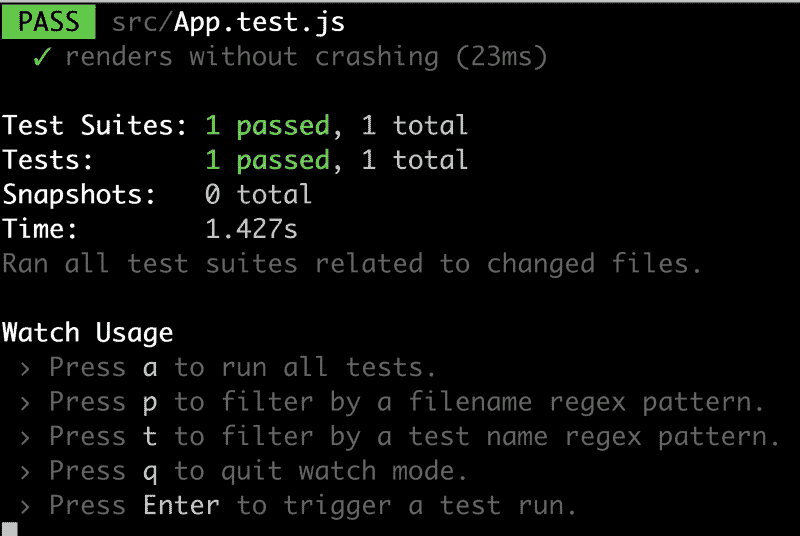](https://res.cloudinary.com/practicaldev/image/fetch/s--yk_4pl9Z--/c_limit%2Cf_auto%2Cfl_progressive%2Cq_auto%2Cw_880/https://thepracticaldev.s3.amazonaws.com/i/n8inzr2jxdit6qw29nvg.png)

它将显示上面的图像，其中包含:

*   一个被执行的测试套件，
*   **一次通过测试**和一系列命令，我们稍后会探讨。好像已经运行了文件`src/App.test.js`。

让我们来看看这个文件:

```
import React from 'react'; 
import ReactDOM from 'react-dom'; 
import App from './App'; 

it('renders without crashing', () => { 
  const div = document.createElement('div'); 
  ReactDOM.render(<App />, div); 
  ReactDOM.unmountComponentAtNode(div); 
}); 
```

正如我们所看到的，它已经使用它创建了一个测试，并且还使用`ReactDOM.render(<App />, div)`创建了一个组件，然后通过调用`ReactDOM.unmount(div)`进行自我清理。在这一点上，我们还没有真正做任何断言，我们只是试图创建一个结果没有错误的组件，这是很好的了解。

我们试试添加`add.js`文件及其相应的测试怎么样？

我们先加上`add.js`，像这样:

```
// add.js

function add(a,b) { return a + b; } 
export default add; 
```

其次是测试:

```
// add.spec.js

import add from '../add'; 

it('testing add', () => { 
  const actual = add(1,3); 
  expect(actual).toBe(4); 
}); 
```

我们的 Jest 会话仍在终端中运行:

[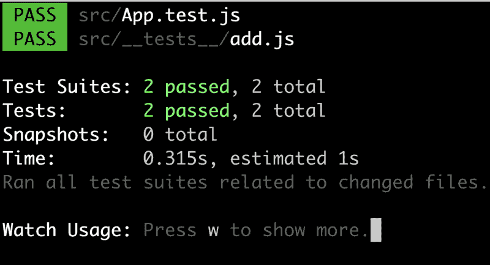](https://res.cloudinary.com/practicaldev/image/fetch/s--s4v26H6f--/c_limit%2Cf_auto%2Cfl_progressive%2Cq_auto%2Cw_880/https://thepracticaldev.s3.amazonaws.com/i/s64h8twfsg2ap32steei.png)

我们可以看到，我们现在有两个通过测试。

## 调试

任何像样的测试运行人员/框架都应该给我们调试测试的能力。它应该让我们有能力:

*   **运行**特定测试
*   **忽略**测试
*   **设置断点**，让我们在我们的 IDE 中添加断点(更多由 IDE 供应商来完成)
*   **在浏览器中运行**，让我们在浏览器中运行我们的测试

### 运行特定的测试文件

让我们看看如何做这些事情，让我们从运行特定的测试开始。首先，我们将添加另一个文件`subtract.js`和相应的测试。

```
// subtract.js

function subtract(a,b) { 
  return a - b; 
} 
export default subtract; 
```

还有测试:

```
// subtract.spec.js

import subtract from '../subtract'; 

it('testing subtract', () => { 
  const actual = subtract(3,2); 
  expect(actual).toBe(1); 
}); 
```

让我们再看一下我们的终端，尤其是它的底部:

[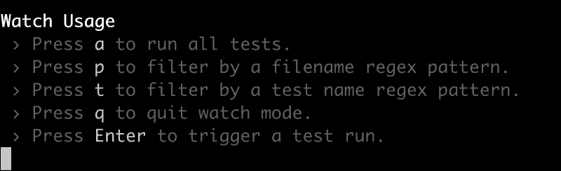](https://res.cloudinary.com/practicaldev/image/fetch/s--vWCxdy7q--/c_limit%2Cf_auto%2Cfl_progressive%2Cq_auto%2Cw_880/https://thepracticaldev.s3.amazonaws.com/i/k3zdrw8lmvh4p0gfeqxm.png)

如果看不到，按屏幕上的指示按`w`。上面给出了一系列命令，这些命令将使我们的调试更加容易:

*   `a`，运行所有测试
*   `p`，这将允许我们指定一个模式，通常我们要在这里指定一个文件的名称以使它只运行那个文件。
*   它和 p 做的一样，但是它让我们指定一个测试名
*   `q`，退出手表模式
*   `Return`，触发试运行

根据上面的描述，我们将尝试过滤它，只测试`add.js`文件，因此我们键入`p`:

[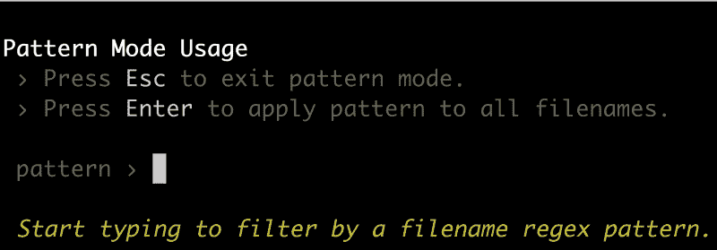](https://res.cloudinary.com/practicaldev/image/fetch/s--DP6h30Wf--/c_limit%2Cf_auto%2Cfl_progressive%2Cq_auto%2Cw_880/https://thepracticaldev.s3.amazonaws.com/i/oxo80iea0c4ph27v3gzs.png)

这将把我们带到一个模式对话框，在这里我们可以输入文件名。我们做到了:

[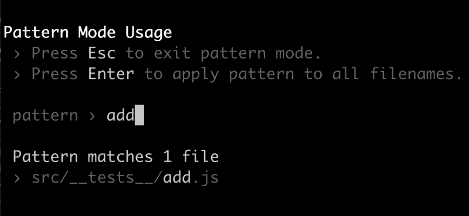](https://res.cloudinary.com/practicaldev/image/fetch/s--C2sbe9ME--/c_limit%2Cf_auto%2Cfl_progressive%2Cq_auto%2Cw_880/https://thepracticaldev.s3.amazonaws.com/i/9up0r4g2q8wxjpdjvoc0.png)

从上面我们可以看到，只有`add.js`文件会成为目标。

### 运行特定测试

我们已经学会了如何将范围缩小到特定的文件。即使使用`p`，模式方法，我们也可以将范围缩小到特定的测试。首先，我们需要添加一个测试，这样我们就可以过滤掉它:

```
//add.spec.js

import add from '../add'; 

it('testing add', () => { 
  const actual = add(1,3); 
  expect(actual).toBe(4); 
}); 

it('testing add - should be negative', () => { 
  const actual = add(-2,1); 
  expect(actual).toBe(-1); 
}); 
```

此时，我们的终端看起来像这样:

[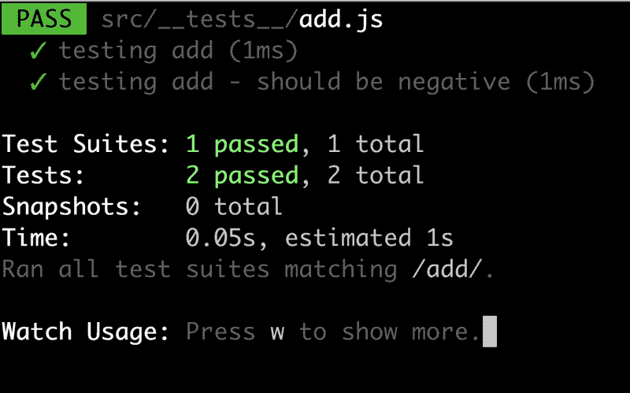](https://res.cloudinary.com/practicaldev/image/fetch/s--sbPLkFSN--/c_limit%2Cf_auto%2Cfl_progressive%2Cq_auto%2Cw_880/https://thepracticaldev.s3.amazonaws.com/i/lxhjwxojn9iba0alo96m.png)

因此，我们在同一个文件中有两个通过测试，但我们只想运行一个特定的测试。我们通过在测试中添加`.only()`调用来实现，就像这样:

```
it.only('testing add', () => { 
  const actual = add(1,3); 
  expect(actual).toBe(4); 
}); 
```

终端现在看起来是这样的:

[ function")](https://res.cloudinary.com/practicaldev/image/fetch/s--CKqCjiEg--/c_limit%2Cf_auto%2Cfl_progressive%2Cq_auto%2Cw_880/https://thepracticaldev.s3.amazonaws.com/i/6qo8onxowr9eqxkxxqxm.png)

我们可以看到，如果我们只想运行那个测试，添加`.only()`确实很好。我们可以使用`.skip()`让测试运行者跳过一个特定的测试:

```
it.skip('testing add', () => { 
  const actual = add(1,3); 
  expect(actual).toBe(4); 
}); 
```

生成的终端清楚地表明我们跳过了一个测试:

[ function")](https://res.cloudinary.com/practicaldev/image/fetch/s--n6JVWc5a--/c_limit%2Cf_auto%2Cfl_progressive%2Cq_auto%2Cw_880/https://thepracticaldev.s3.amazonaws.com/i/nt8qpin8o37sssgf2zf7.png)

## 带断点调试

现在，这个有点依赖于 IDE，在这一节中，我们将讨论如何用 VS 代码来实现。我们要做的第一件事是安装一个扩展。前往扩展菜单，搜索 Jest。应显示以下内容:

[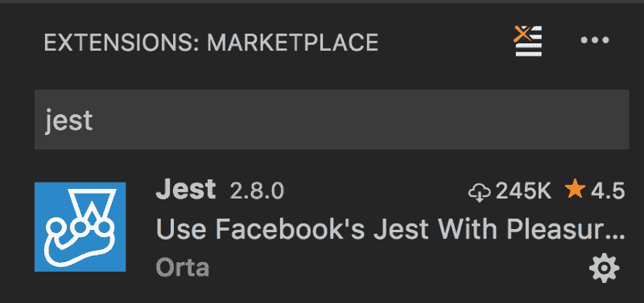](https://res.cloudinary.com/practicaldev/image/fetch/s--aAyWkxCl--/c_limit%2Cf_auto%2Cfl_progressive%2Cq_auto%2Cw_880/https://thepracticaldev.s3.amazonaws.com/i/qjtycapctzj1qbgqfgbd.png)

安装这个扩展，然后回到您的代码。现在我们增加了一些功能。我们所有的测试都应该有一个`Debug link`。

此时，我们可以添加一个断点，然后按下我们的`Debug link`。您的断点现在应该被命中，看起来应该是这样的:

[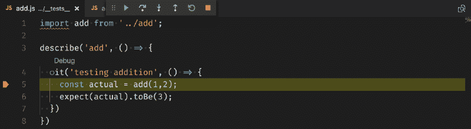](https://res.cloudinary.com/practicaldev/image/fetch/s--C7vKxKmF--/c_limit%2Cf_auto%2Cfl_progressive%2Cq_auto%2Cw_880/https://thepracticaldev.s3.amazonaws.com/i/sm9uriw3jfhes6s25dti.png)

## 快照测试

快照是关于创建快照的，快照是呈现组件时 DOM 外观的视图。它用于确保当您或其他人对组件进行更改时，快照会告诉您，您进行了更改，更改看起来如何？

如果您同意所做的更改，那么您可以很容易地用它现在呈现的 DOM 更新快照。所以快照是你的朋友，保护你免受无意的改变。

让我们看看如何创建快照。首先，我们可能需要安装一个依赖项:

> 纱线添加反应-测试-渲染器-保存

下一步是编写一个组件和一个测试。它应该是这样的:

```
// Todos.js

import React from 'react'; 
const Todos = ({ todos }) => ( 
  <React.Fragment> 
   {todos.map(todo => <div>{todo}</div>)}   </React.Fragment> );  export default Todos;
// Todos.spec.js
import renderer from 'react-test-renderer'; 
import React from 'react'; 
import Todos from '../Todos'; 
test('Todo - should create snapshot', () => { 
  const component = renderer.create( 
    <Todos todos={['item1', 'item2']} />   ); 
  let tree = component.toJSON(); 
  expect(tree).toMatchSnapshot(); 
}) 
```

注意如何导入我们将要测试的组件:

> 从'导入待办事项'../Todos '；

接下来使用渲染器创建组件的实例。下一步是将该组件转换成 JSON 表示，就像 so `component.toJSON()`一样，最后，我们通过调用`expect(tree).toMatchSnapshot()`对此进行断言，这将调用一个快照，该快照将自己放置在测试目录下的`__snapshots__`目录中。

### 管理快照

好了，我们有了快照，现在做什么？让我们对我们的 todo 组件做一个改变，就像这样:

```
// Todos.js

import React from 'react'; 
const Todos = ({ todos }) => ( 
  <React.Fragment> {
    todos.map(todo => ( 
      <React.Fragment> 
        <h3>{todo.title}</h3> <div>{todo.description}</div> 
      </React.Fragment> 
    ))}
   </React.Fragment> ); 

export default Todos; 
```

我们看到我们的`todo`是一个对象而不是一个字符串，所以它有一个`title`和`description`属性。这将使我们的快照做出反应，它将显示以下内容:

[](https://res.cloudinary.com/practicaldev/image/fetch/s--T7xnNPPe--/c_limit%2Cf_auto%2Cfl_progressive%2Cq_auto%2Cw_880/https://thepracticaldev.s3.amazonaws.com/i/mp16bab37i44pu8tnkw8.png)

它清楚地表明有些东西是不同的，并要求我们检查代码。如果我们对更改感到满意，我们应该按`u`将快照更新到新版本。所以看看代码，是的，这是一个有意的改变，所以我们按下`u`。我们以下面的图像结束，告诉我们一切正常:

[](https://res.cloudinary.com/practicaldev/image/fetch/s--NTf_849L--/c_limit%2Cf_auto%2Cfl_progressive%2Cq_auto%2Cw_880/https://thepracticaldev.s3.amazonaws.com/i/zn3gr1kh0wnr9jbdwtt8.png)

## 嘲讽

嘲讽是那些需要好好工作的事情之一。开玩笑很容易。您需要在与您的模块相邻的目录中创建模拟，或者更像是模块的子目录。让我们用代码来说明我的意思。假设您有以下模块:

```
// repository.js

const data = [{ title: 'data from database' }]; 

export default data; 
```

让我们来看一个测试:

```
// repository.spec.js

import data from '../repository'; 

describe('testing repository data', () => { 
  it('should return 1 item', () => { 
    console.log(data); 
    expect(data.length).toBe(1); 
  }); 
}); 
```

不是最好的测试，但它是一个测试。让我们创建我们的模拟，使我们的文件结构看起来像这样:

```
// directory structure

repository.js // our repo file
__mocks__/repository.js // our mock 
```

我们的模拟应该是这样的:

```
// __mock__/repository.js

const data = [{ title: 'mocked data' }]; 
export default data; 
```

为了使用这个模拟，我们需要在我们的测试中调用`jest.mock()`，就像这样:

```
 // repository.spec.js

import data from '../repository'; 
jest.mock('../repository'); // taking __mock/repository instead of the actual one
describe('testing repository data', () => { 
  it('should return 1 item', () => { 
    console.log(data); 
    expect(data.length).toBe(1); 
  }); 
}); 
```

现在，它使用我们的模拟模块，而不是实际的模块。好吧，你会说，为什么我要嘲笑我想测试的东西。简短的回答是:你不会。因此，我们将创建另一个使用我们的`repository.js`的文件`consumer.js`。所以让我们来看看它的代码和相应的测试:

```
// consumer.js

import data from './repository'; 
const item = { title: 'consumer' }; 
export default [ ...data, { ...item}]; 
```

上面我们清楚地看到了我们的消费者是如何使用我们的`repository.js`的，现在我们想要模仿它，这样我们就可以专注于测试消费者模块。来看看测试:

```
// consumer.spec.js

import data from '../consumer'; 
jest.mock('../repository'); 
describe('testing consumer data', () => { 
  it('should return 2 items', () => { 
    console.log(data); 
    expect(data.length).toBe(2); 
  }); 
}); 
```

我们使用`jest.mock()`并模仿掉这个模块仅有的外部依赖。

像`lodash`或`jquery`这样的库呢，它们不是我们创建的模块，而是依赖于我们的模块。我们可以通过创建一个`__mocks__`目录来为那些最高级别的人创建模拟。

关于嘲讽还有很多可以说的，更多细节请看文档[嘲讽文档](https://jestjs.io/docs/en/mock-functions.html)

## 覆盖范围

我们已经到了本章的最后一节。这是关于意识到我们的代码有多少被测试覆盖。要检查这一点，我们只需运行:

> 纱线测试覆盖率

这将为我们提供一个终端内部的表格，它将告诉我们每个文件的覆盖率百分比。它还会生成一个`coverage`目录，我们可以导航到这个目录并找到我们的报道的 HTML 报告。但是首先让我们修改一下`add.js`文件，添加一个需要测试的逻辑，比如:

```
// add.js

function add(a, b) { 
  if(a > 0 && b > 0 ) { 
    return a + b; 
  } 
  throw new Error('parameters must be larger than zero'); 
} 
export default add; 
```

现在我们可以看到，我们在应用程序中有不止一条路径。如果我们的输入参数大于零，那么我们现有的测试可以覆盖它。

然而，如果一个或多个参数小于零，那么我们进入一个新的执行路径，而这个路径不被测试覆盖。让我们通过导航到`coverage/lcov-report`来看看它在覆盖率报告中是什么样子。我们可以通过键入以下示例来展示这一点

> http-server -p 5000

我们将得到这样的报告:

[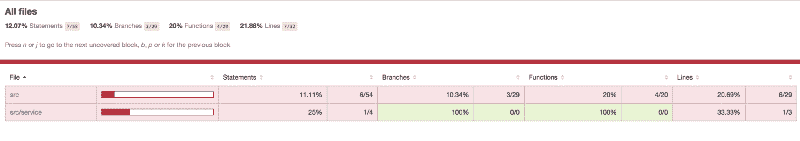](https://res.cloudinary.com/practicaldev/image/fetch/s--QPhnpz5a--/c_limit%2Cf_auto%2Cfl_progressive%2Cq_auto%2Cw_880/https://thepracticaldev.s3.amazonaws.com/i/6b2zqhuz5pu75ata1wu5.png)

现在我们可以导航到`src/add.js`，它看起来应该是这样的:

[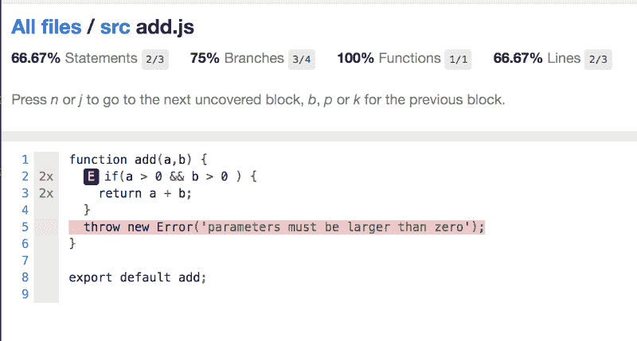](https://res.cloudinary.com/practicaldev/image/fetch/s--9enAffY---/c_limit%2Cf_auto%2Cfl_progressive%2Cq_auto%2Cw_880/https://thepracticaldev.s3.amazonaws.com/i/sjb9z28lst8h4cqkme72.png)

现在我们可以清楚地看到我们添加的代码是如何用红色表示的，我们需要添加一个测试来覆盖新的执行路径。

接下来，我们添加一个测试来解决这个问题，就像这样:

```
// add.spec.js

import add from '../add'; 
describe('add', () => { 
  it('testing addition', () => { 
    const actual = add(1,2); 
    expect(actual).toBe(3); 
  });

  it('testing addition with neg number', () => { 
    expect(() => { add(-1,2); }).toThrow('parameters must be larger than zero'); }) 
  })
) 
```

我们的第二个案例现在应该涵盖导致抛出异常的执行路径。让我们重新运行我们的报道:

[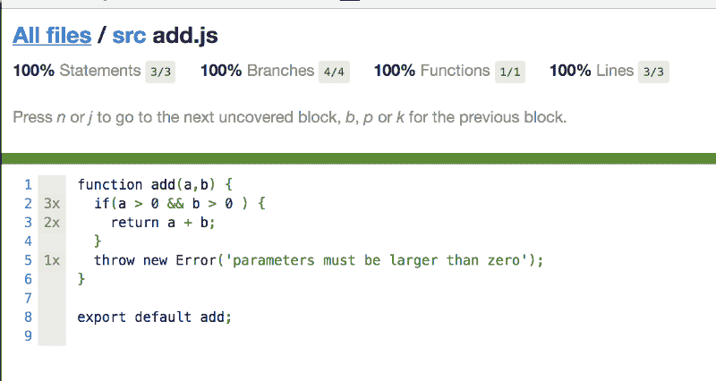](https://res.cloudinary.com/practicaldev/image/fetch/s--Qa8LE1JU--/c_limit%2Cf_auto%2Cfl_progressive%2Cq_auto%2Cw_880/https://thepracticaldev.s3.amazonaws.com/i/xal8rkmf0odrwjjv1lyn.png)

## 总结

我们已经了解了如何编写测试。我们还研究了如何使用来自 VS 代码的扩展来调试我们的测试，该扩展允许我们设置断点。

此外，我们还了解了什么是快照，以及如何最大限度地利用快照。

接下来，我们一直在考虑利用嘲讽来确保我们在测试时完全孤立。

最后，我们已经了解了如何生成覆盖率报告，以及如何帮助您跟踪那些真正可以从更多测试中受益的代码部分。

### 进一步阅读

*   Jest 的官方文件可以在这里找到[官方文件](https://jestjs.io/en/)
*   我的免费[反应书](https://legacy.gitbook.com/book/chrisnoring/react/details)