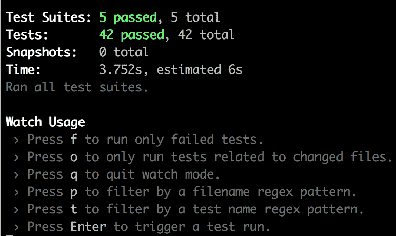

# 用 Jest 和酶测试您的第一个 React 组件

> 原文：<https://dev.to/richardigbiriki/testing-your-first-react-component-with-jest-and-enzyme-p38>

### 简介

如果你最近花了三个月的时间写代码，那么你一定遇到过“测试”或“测试驱动开发”(TDD)的概念。测试您的代码以确保它在任何情况下都能像您期望的那样工作被认为是一种最佳实践。根据我的经验，测试，因为没有更好的词，“迫使”我们更好地编码(考虑可读性、可伸缩性)。

编写可测试的代码本身就是一种技能。例如，单元测试需要将 React 组件拆分成更小的(最好是纯组件)组件。

### 测试环境设置

将 React with jest 设置为默认测试库。为了使我们能够测试 react 组件，我们需要将`enzyme`添加到我们项目的开发依赖项中。

```
yarn add enzyme enzyme-adapter-react-16 --dev OR npm install enzyme enzyme-adapter-react-16 --save-dev 
```

Enter fullscreen mode Exit fullscreen mode

将`setupTests.js`添加到您的`src`目录中。将下面的设置代码添加到其中。

```
// /src/setupTests.js

import { configure } from 'enzyme';
import Adapter from 'enzyme-adapter-react-16';

configure({ adapter: new Adapter() }); 
```

Enter fullscreen mode Exit fullscreen mode

Jest 会自动找到带有后缀`*.test.js`或`*.spec.js`的测试文件。另一个选择是将所有的测试代码放到一个`_tests_`文件夹中。Jest 将找到并运行所有测试文件，而不管相对于`src`的目录位置。

### 语法

正如我喜欢说的，测试只是条件。真或假。实际值和期望值之间的二进制比较。例如，我们期望 1 等于 1。或者我们期望 1 + 1 等于 2。这正是我们测试组件的方式。通过比较预期结果和实际结果。

使用 jest we:

```
expect(actual).toEqual(expected); 
```

Enter fullscreen mode Exit fullscreen mode

或者

```
expect(actual).not.toEqual(expected); 
```

Enter fullscreen mode Exit fullscreen mode

> Enzyme 提供了一个匹配器列表，Jest 为 expect 提供了比较方法

### 测试我们的组件

下面是我们将要测试的组件

[](https://res.cloudinary.com/practicaldev/image/fetch/s--g6bPoBiJ--/c_limit%2Cf_auto%2Cfl_progressive%2Cq_auto%2Cw_880/https://thepracticaldev.s3.amazonaws.com/i/q3nihjtl58cr44srn8g2.png)

我们将保持这个组件的测试简单...为了简洁起见(或者我是这么说的)。

对于这个组件，我想测试:

1.  存在带有电子邮件 id 的输入
2.  存在带有密码 id 的输入
3.  使用`avatar`类显示头像图标。
4.  带有“登录”文本的按钮的存在。
5.  确保电子邮件和密码不为空的验证功能。

我们开始吧！

### 测试

这里是我们的`Login.test.js`

```
import React from 'react';
import { shallow } from 'enzyme';
import Login from './Pages/LogIn';
import { validateEmailAndPasswordPresence } from '../extra/validations';
    describe('Login component tests', ()=> {
        const wrapper = shallow(<Login />);

        it('should have a btn component', ()=> {

            //There should be only one button
            expect(wrapper.find('Button')).toHaveLength(1);

            //Button should be of type button
            expect(wrapper.find('Button')
            .type().defaultProps.type)
            .toEqual('button');

            //Button should have matching text
            expect(wrapper.find('Button').text()).toEqual('LOGIN');
        });

        it('should have input for email and password', ()=> {
            //Email and password input field should be present
            expect(wrapper.find('input#email')).toHaveLength(1);
            expect(wrapper.find('input#password')).toHaveLength(1);
        });

        it('should an avatar', ()=> {
            //Avatar should be present
            expect(wrapper.find('.avatar')).toHaveLength(1);
        });

        it('should have an empty email and password state var', ()=> {
            //Optionally test to check if password and email are empty strings on 
               setup
            expect(wrapper.state('email')).toEqual('');
            expect(wrapper.state('password')).toEqual('');
        });

        it('should test email and password presence', () => {

             //should return true 
             expect(validateEmailAndPasswordPresence('email@email.com', 
             'password').toEqual(true);

             //should return false
              expect(validateEmailAndPasswordPresence('', 
             '').toEqual(false);
        });

    }); 
```

Enter fullscreen mode Exit fullscreen mode

**注:**这里测试的按钮是`react-bootstrap`的按钮组件。替换为您自己的按钮组件。

### 解释

1.  `describe`用来形容我们将要测试的东西。它是一个包装函数，用于测试特定的组件。

2.  `it`描述特定的测试。我用`it`作为一个肩(比较)。所以`it`应该有一个头像。如果电子邮件和密码存在，则`it`应为真。

要运行您的测试，请使用

```
npm test or yarn test 
```

Enter fullscreen mode Exit fullscreen mode

在您的项目目录中。所有测试都应该失败。是啊！！！TDD 的快乐。

### 登录组件

```
 import React, {Component} from 'react'
import {FaUserCircle} from 'react-icons/fa'
import {Form, Button} from 'react-bootstrap'
import { Redirect } from 'react-router-dom'

export default class Login extends Component {
    constructor() {
        super();
        this.state = {
            email: '',
            password: ''
        }
    }

    handleChange = (event) => {
        this.setState({[event.target.name]:event.target.value});
    }

    login = async () => {
        //login here
    }
    render () {
        return(
            <div className="container-fluid box mt-5">
                <div className="loginbox shadow p-5">
                    <FaUserCircle className="avatar" />
                     <Form className="p-2 mt-5">
                        <Form.Group className="mb-3">
                            <Form.Control id="email" type="text" name="email" onChange={this.handleChange} placeholder="Email/Username" className="text-center" />
                        </Form.Group>
                        <Form.Group className="mb-3 mt-4">
                            <Form.Control id="password" type="password" name="password" onChange={this.handleChange} placeholder="Password" className="text-center" />
                        </Form.Group>
                        <Form.Group className="Log-button">
                            <Button onClick={this.login} className="btn" style={{width: '10rem'}}>LOGIN</Button>
                        </Form.Group>

                    </Form>
                </div>
                </div>
        )
    }
} 
```

Enter fullscreen mode Exit fullscreen mode

使用`yarn' or` npm 安装完所有依赖项后，重新运行您的测试，它们应该都通过了。

[](https://res.cloudinary.com/practicaldev/image/fetch/s--ZEnxHugX--/c_limit%2Cf_auto%2Cfl_progressive%2Cq_auto%2Cw_880/https://thepracticaldev.s3.amazonaws.com/i/anxpt45vkylnuo8m4fo1.png)

免责声明:上图中的测试比这里涵盖的要多。

### 结论

测试驱动的开发(TDD)，行为驱动的开发(BDD)，贫困驱动的开发(PDD)，气候驱动的开发(CDD)，以及其他任何存在的东西都导致一件事，一个产品。重要的是我们遵循模式并使用适合我们当前开发周期的最佳实践。

我已经写了几年的代码，刚刚开始写测试，尽管我希望我能更早开始。如果你认为 TDD 不值得，给它几天或几个月或几年，当你最终决定时再见。