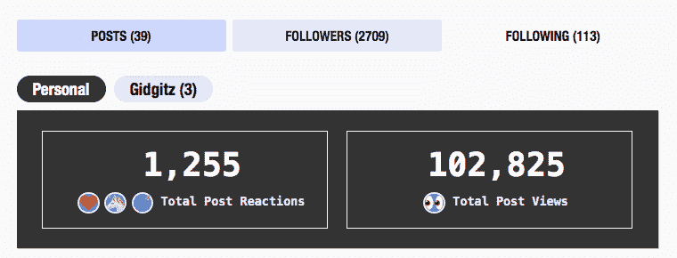

# 感谢 10 万+的浏览量！

> 原文：<https://dev.to/dechamp/thanks-for-the-100k-views-426b>

你好。我是彼得·德昌普·理查森。我只想感谢你们 100K+的浏览量和超过 2700 的关注者！知道我的想法和观点被阅读了这么多次，感觉棒极了。

我确实意识到工作之外的人想知道我的想法。

最棒的是，所有发表评论的人让我知道我帮了他们多少。这是一次非常难忘的经历！

所以谢谢大家！

我很想认识你们所有人。随时给我写信。在这里或 twitter @codefiendio 上添加我。或者 instagram @ codefiend

也检查我的其他职位。

 [## 25 年的编码，而我才刚刚开始

### DeChamp Jan 17 ' 196 分钟读数

#career #discuss #webdev #personal](/dechamp/25-years-of-coding-and-im-just-beginning-442n) [## 修复你的记忆！要么写下来，要么丢掉。

### DeChamp Jun 28 ' 192 分钟读数

#discuss #learning #memory](/dechamp/fix-your-memory-write-it-down-or-lose-it-12cb) [## 职业倦怠，你是如何应对的？

### DeChamp Sep 6 ' 182 分钟读数

#discuss #programming #vent](/dechamp/the-burnout-how-do-you-deal-with-it-4i3g) [## 你值得更好的客户，也许我能帮上忙！

### DeChamp Aug 17 ' 188min read

#career #webdev #discuss](/dechamp/delayed-pay-why-is-bull--2bag) [## 你最喜欢的 Markdown 编辑器是什么？

### DeChamp 1 月 24 日 192 分钟读数

#tools #webdev #discuss](/dechamp/whats-your-favorite-markdown-editor--70) [## 数据突变的示例以及避免数据突变的原因

### DeChamp 1 月 25 日 195 分钟读取

#discuss #webdev #programming #architecture](/dechamp/example-of-data-mutation-and-why-to-avoid-it-4ogj) [## 当无法提供适当的文件，回来困扰你。

### DeChamp Jun 14 ' 193min read

#discuss](/dechamp/when-failing-to-provide-proper-documentation-comes-back-to-haunt-you-eeb) [## 用你同事的一个特征来描述他们

### DeChamp Jun 26 ' 191min read

#discuss #webdev #work #game](/dechamp/describe-your-coworkers-by-a-single-attribute-of-theirs-365b)