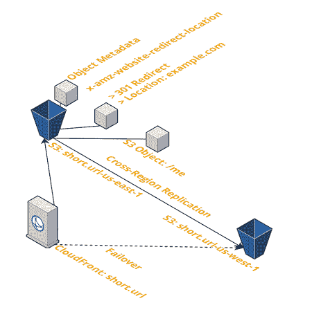

# 那次我需要创建 20k 的短链接，以及如何在 AWS 上创建它们

> 原文：<https://dev.to/intricatecloud/that-time-i-needed-to-create-20k-short-links-and-how-to-create-them-on-aws-4djl>

这个问题不久前落到了我的膝盖上，我看到它一次又一次地出现，所以我想分享一下我们是如何解决它的。我们的营销团队正在为一个客户提交我们的一个产品供审查，它有大量的内容。在产品中有一个很长的深层链接列表，我们希望评论者看到，但是我们需要创建短链接，这样他们就可以将它们嵌入到一些文档中。

最终总共有 20k 个短链接，这意味着:

*   我需要能够一次上传 20，000 个，它需要一个可脚本化的 API
*   我们过去使用的任何东西都需要存在至少 6 个月，以便在某个审查期间可用
*   链接需要工作，并且是可用的
*   我们需要能够从谷歌表单创建重定向
*   他们想知道链接是否/何时被点击

我们最终找到了一个非常便宜的只有 AWS 的解决方案——但是有一些事情我们必须首先考虑。

## 为什么不直接用 bit.ly 之类的？

对于这个特定的案例，根据他们的定价，我们将处于“联系我们以获取报价”计划下的企业范围内，该计划使我们每年花费 400 美元以上(以及与客户经理的“快速通话”),购买我只需要一次的东西。

400 美元/年听起来太贵了...应该....简单又便宜。301 重定向从 1999 年就有了(20 年前！)-为什么这不是一个已解决的问题！(有点像，但不是)

即使不考虑企业因素，

*   bitly 对免费层有自己的限制，甚至像批量重定向这样的事情也需要在他们的企业计划中。
*   他们的基本计划每月 30 英镑对一些 301 来说有点贵，我们可以以更低的价格做到这一点。(尽管你牺牲了一些特性，主要是分析——如果你不在乎这些，那太棒了！)

除此之外，这是一个学习 AWS 的细节的好机会，它不涉及很多服务。如果你熟悉 Cloudformation 或者 Terraform，你可以用那种方式设置它。

## 怎么建？

我们使用 Cloudfront + S3 设计了一个解决方案，其中你的对象附有一个网站重定向位置元数据。我们在一个下午就构建好了它，并生成了所有 30k 个重定向，而且运行起来只需要几美元/月。

假设你有一个 short.url，你想让 short.url/2019barbecue 重定向到一个脸书页面。

从较高的层面来看这个架构(图片由 cloudcraft.co 提供):

你把你的域名(它可以托管在任何地方，不需要被路由 53)指向一个 Cloudfront 发行版，这个发行版位于一个作为网站的 S3 桶的前面。在这个桶中有许多对象，网站重定向位置元数据被设置为重定向到我们的目标 URL——short.url/2019barbecue 重定向到 example.com

### 您的重定向业务是否至关重要？

也许你正在运行一个发布，你需要人们点击一个链接。您现在负责正常运行时间，因此 AWS 的正常运行时间就是您的正常运行时间。

在这种情况下，您的可用性是 Cloudfront 或 S3 的最小值(99.9%) -但是，您确实有一个全球分布式 CDN 的好处…和一个高度持久和复制的对象存储…在它崩溃的情况下可以故障转移到另一个区域-更不用说它的实施成本了。

### 要不要数据分析？

Bitly analytics 非常简洁——这是一个权衡，因为这需要你自己来做——但如果你已经有了一个分析/监控平台，你可以通过它获取数据。对于我个人网站上的东西，我不在乎看到分析-我只想分享一个定制的短链接。

开箱即用，您可以在 Cloudfront 周围获得某种级别的 Cloudwatch 监控，包括错误率、数据输入/输出和总请求。([完整列表此处](https://docs.aws.amazon.com/AmazonCloudFront/latest/DeveloperGuide/monitoring-using-cloudwatch.html#monitoring-console.distributions))

如果你想要更多信息，那么你需要将 Cloudfront 访问日志转储到另一个 S3 桶中，并使用 Athena ( [这里的文档](https://aws.amazon.com/premiumsupport/knowledge-center/analyze-logs-athena/))进行一些快速分析，以查看源 IP、引用、请求路径、响应代码等信息

## 有什么我应该注意的问题吗？

注意更新重定向指向的位置。301 重定向可以被你的浏览器无限期缓存，因为规范指出 301 意味着永久重定向。

如果有人已经点击过你的链接，他们可能会被带到原来的位置一段时间。在实践中，我见过对重定向的旧值的长尾巴请求，有点像这样:

302 重定向意味着临时缓存，所以问题较少。一些架构限制您进行 301 重定向，其他架构则允许您选择进行 302 重定向。在这种情况下，Cloudfront + S3 只允许你做 301s，这只是我们需要处理的一个约束，除非我们想把 Lambda 也加入进来。

## 包装完毕

如果您发现自己需要创建一些定制的短链接或重定向，可以考虑使用 Cloudfront + S3，使用上面的架构来服务它们——如果您已经熟悉 AWS，那么您可以以很小的成本获得企业级解决方案的所有好处。

我正在写一系列的文章来彻底解释如何在 AWS 上建立短链接。接下来，我将介绍如何在控制台中设置短链接，以及如何在 terraform 中设置。

给文章一些❤️和[在这里注册我的邮件列表](https://www.intricatecloud.io/intricate-cloud-newsletter-signup/)这样你就不会错过下一篇文章了！