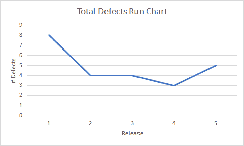
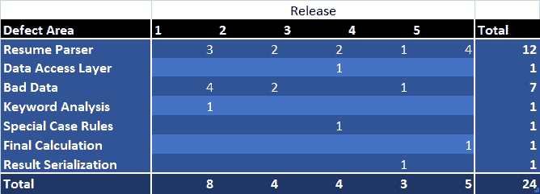
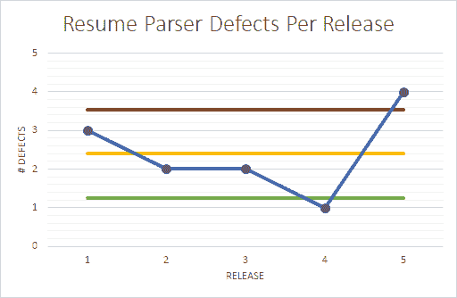
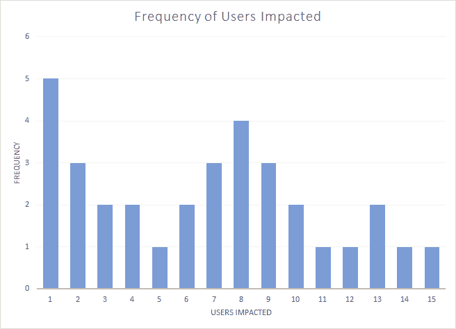
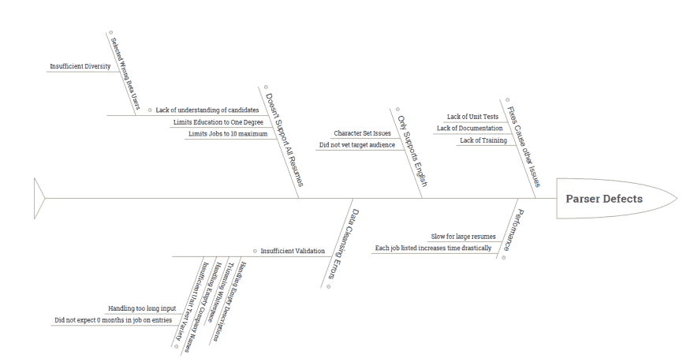
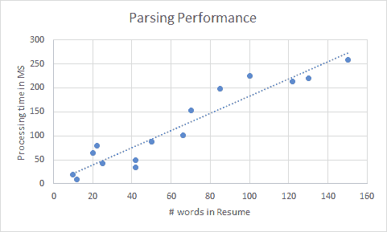
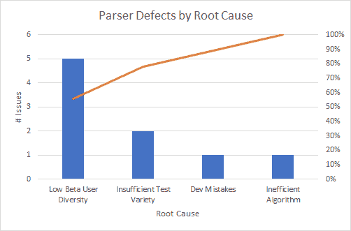

# 软件质量的 7 个基本工具

> 原文：<https://dev.to/pluralsight/the-7-basic-tools-of-software-quality-16i1>

软件质量的七个基本工具是一套与六个适马相关的可视化表示技术。这些工具不需要高级统计知识，可以用来解决您遇到的大多数类型的问题。

这些工具一起帮助您分析软件质量，并提出有效的可视化方法，以易于理解的方式与他人交流。

# 示例应用

正如我的一些其他文章一样，我们将围绕一个虚构的简历评分系统进行讨论，该系统接收简历并向招聘经理或人力资源部门输出分数。

这是一个遗留的应用程序，很容易改变，并且经常出错。在这个假想场景中，我们负责分析缺陷，并向上层管理人员提出建议。

你的老板受够了这个应用程序引起的质量问题。支持负担是压倒性的，用户不满意，找出原因并找到解决方法是你的工作。

你是做什么的？

# 七种基本工具

经过一些研究，你偶然发现了 7 个基本的质量工具，并开始使用它们来理解你的应用。

## 运行图表

运行图是说明数据趋势的简单工具。这里我们有一个简单的每次发布的总缺陷运行图。

图表显示了一个清晰的趋势，即每次发布的缺陷数量都在减少，随后是最近的一次高峰。这并没有说明这些缺陷的严重性或范围，但是告诉我们，我们有一个应用程序，它的质量随着时间的推移而稳定下来，但是突然又复发了。

## 检查工作表

现在我们知道我们有一个问题，让我们通过一个检查表深入一些发布的原始数据。

检查表是一个缺陷列表，它可以按区域和时间限制方面进行组织，比如 sprint、release、year、quarter、month、week、day 或 day of the week。

上面是我们的简历分析应用程序的检查表，按发布的区域突出了缺陷。这些数据证实了上一个版本很糟糕的说法，并强调了 Resume Parser 组件是一个关键原因。

## 控制图

根据我们的运行图，看起来上一个主要版本有问题。检查表数据显示，问题主要出在简历解析器上，所以让我们用控制图来看看这个组件的质量。

控制图告诉我们什么时候数据明显偏离了既定区域。它可用于发现异常值和异常值趋势。

上图是一个控制图，显示了发布的简历解析器组件中的缺陷数量。除了绘制每个版本的缺陷图表之外，这个图表还依赖于 3 条指示平均值的扁平线以及基于标准偏差的上下横条。

这清楚地突出了一个坏的发布和一个好的发布，并且可以让我们关注是什么因素促成了那些发布。

## 直方图

让我们通过使用直方图来更好地了解缺陷的范围。

直方图是按频率显示的数据点。它用于根据出现的频率发现数据中的分布曲线。

在上面的直方图中，我们看到缺陷通常只影响 1 个用户，但是在 8 个用户标记附近聚集了惊人数量的缺陷，甚至更高(尽管在这个例子中，低数量的数据点使得直方图不太可靠)。

上图的数据可以最好地归类为双峰，因为它有两个共同的引力点。这个故事告诉我们，缺陷通常要么只影响一两个用户，要么影响一群用户。

但是，它并没有解释为什么会出现这些问题。

## 因果图

为了确定为什么简历解析器一直有问题，让我们看看我们之前发现的解析器级缺陷，并将它们放入因果图(也称为鱼骨图、鱼骨图或石川图)。

在创建因果图时，我们从一个中心问题开始，这个中心问题就是鱼的“头”。在这种情况下，这只是“解析器缺陷”。在此基础上，我们通过广泛的症状来减少解析器错误，例如与性能相关的问题或缺乏对所有类型简历的支持。然后，我们可以深入到这些分支上的每个点，并开始了解细节以及导致这些细节的因素。您可以在层次结构中进行任意深度的钻取——您的主要目标是深入研究每个分支的影响因素，并理解问题发生的原因。

在这种情况下，鱼骨图说明了许多问题，但主要问题似乎源于对简历中的多样化因素缺乏了解，例如不支持非英语语言、外国字符集、大量工作或多个大学学位。

这是有意义的，因为该应用程序最近才离开测试版，随着越来越多的用户采用它，它变得越来越受欢迎。

## 散点图

由于我们指出性能是一个需要关注的领域，因此深入该领域并确定数据不同方面之间的关系是有意义的。我们可以根据简历的大小和分析时间来收集数据，得出下面的散点图。

散点图用于评估两个或更多变量之间的任何关系或趋势，在这种情况下，处理时间和简历的大小。

从这个图表中，我们可以看到数据与直线或曲线的拟合程度，并确定数据点之间的关系。在这种情况下，我们可以相当有把握地说，有一个相关性，它看起来像一个相当强的线性相关性，处理时间随着简历大小的增加而增加。

这给了我们足够的信息来了解简历的大小是如何与其处理时间联系在一起的，并推断在给定简历包含多少单词的情况下，解析一份简历可能需要多长时间。

## 帕累托图

现在我们已经很好地理解了组件的细节和影响它的问题，让我们开始制定一个行动计划，通过根本原因来看一看 Resume Parser 组件中遇到的错误。

为了做到这一点，我们将每个原因的缺陷计数制成表格，然后将原因从大到小排序，跟踪缺陷的累积百分比。

根据帕累托原则，累积百分比非常重要，该原则规定:

> 对许多事件来说，大约 80%的结果来自 20%的原因

由于这个原因，帕累托原则通常被称为 80 / 20 法则。

我们使用构建的帕累托图来找出导致 80%问题的 20%的原因。

在这个图表中，我们看到 beta 用户多样性的缺乏和单元测试多样性的缺乏是缺陷的两个主要原因。这大约占了组件中所有缺陷的 80%(如指示所有值的累积百分比的黄线所示)。

基于此，我们对如何修复大多数用户问题有了一个很好的想法。

# 起草一份建议书

拿着一系列的图表和表格，你走进老板的办公室，递交你的正式建议，从不同的用户群中找到大量的简历，这些简历在测试阶段没有被代表。调整软件来处理这些简历，同时改进和扩展单元测试，应该可以稳定用户对应用程序的整体体验。

虽然你的老板最初有一些怀疑，但是使用软件质量的七个工具清楚地说明数据消除了争论中的观点和情绪，并且充分地解释了你的思考过程。

她很快建议企业获取更多的简历进行分析，并把更多的精力放在单元测试和支持更广泛的简历上。你和团队的其他成员能够通过调整引擎来完成任务，并发布 6 艘船来满足快速增长的用户群的需求。