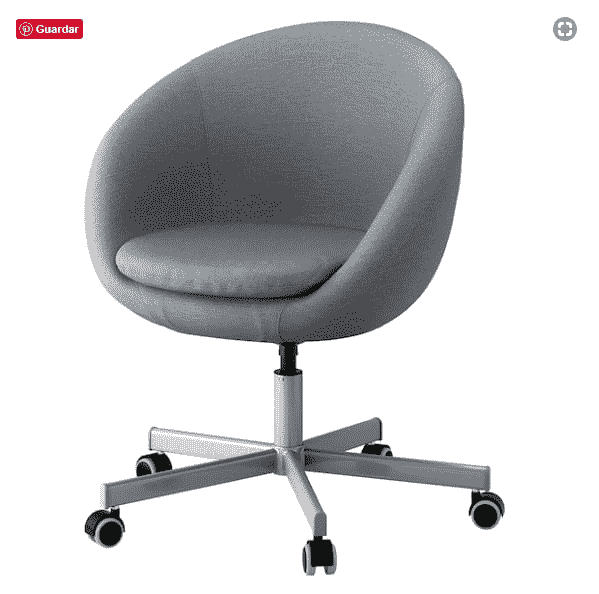
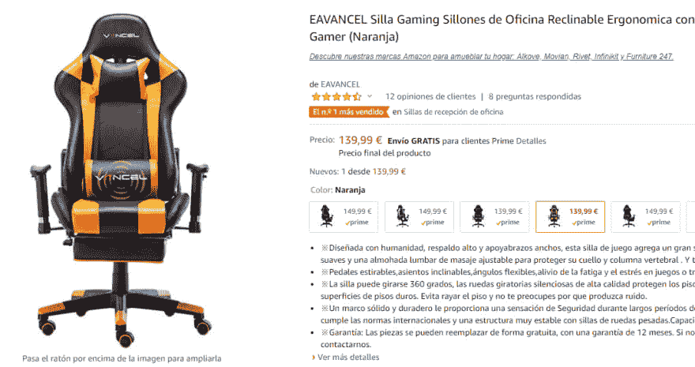

# 在你的地方开始全职在家工作/学习的基本适应(最低投资)

> 原文：<https://dev.to/nanythery/the-basic-adaptations-in-your-place-to-start-working-studying-from-home-full-time-minimum-investment-1o9p>

我过去在办公室工作。作为一名 CMO 人，我每天大概有 12 个小时坐在电脑前。有一把不太坏的办公椅，一张大桌子和许多不符合人体工程学的东西和态度。我有背痛，但肯定不会像现在这样了，因为我已经开始在家工作了。

大约 8 个月前，我甚至没有想过成为一名开发人员。我只是一个电脑和网络迷。因此，我的家只配备了一张小小的转角书桌和一把别致的宜家装饰椅，只有一台 17 英寸的笔记本电脑，甚至没有一直联网。

所以第二天我辞掉了工作，开始在电脑前度过同样的 12 个小时。我发现我的工作/学习环境远非理想、健康甚至舒适。

还有，嘿！我刚刚辞掉了工作和薪水，所以我不能投资太多的钱来改变东西和设备。

所以，6 个月后，这就是我所了解到的关于**现在对我的办公桌**最必要的调整。

## 椅子是钥匙

所以，这张宜家的复古椅子在房间里看起来很棒。但是连续坐两个多小时实在是太可怕了。
 
我想知道我以前怎么从来没有意识到这一点！

我试图通过更加注意自己的坐姿来改善自己的姿势，甚至在下背部加了一个枕头。和一个放脚的纸箱。从长远来看，没有什么实际帮助。

**在我能推荐的所有东西中，这其实是最重要的一个**。

### 一把好的符合人体工程学的椅子就是资本。

最后，背痛和肩痛会把你从工作和注意力中拉出来。

经过长时间的研究，我选择了一款中等价位的游戏椅。这些是设计用来花 24 小时玩视频游戏的，所以它必须用一堆代码才能工作，对吗？

高靠背，充满垫子，非常灵活...我能找到 100 欧元起的好东西。

## 两个屏幕比一个屏幕好

我必须承认，我从来没有像现在这样认为双屏幕是必要的。代码比较、测试以及拥有一个比 14 英寸屏幕更容易阅读的大屏幕真的很有帮助。
不强制，但有区别。

## 光是关键

很抱歉我不是吸血鬼类型的开发者。我需要光，我需要它被控制。当我说受控时，我的意思是:屏幕上没有反射，没有阴影，当然，还有白光！
我有房间灯，但我还发现了一个相当有用的书桌 LED 白光灯。这对我的眼睛很有帮助。

## 独立键盘和鼠标

我很久以前就开始使用笔记本电脑，我必须承认我喜欢笔记本电脑的键盘。但对于长时间的编码，特别是如果你设置了双屏，将键盘和鼠标与笔记本电脑分开会有助于更舒适和休息。由于我喜欢柔软的平板笔记本电脑键盘，我以合理的价格(约 30 欧元)买了一个我认为最相似的键盘:
惠普 Pavilion 300(有线)和惠普鼠标。我不想和电池作斗争。

## 不太重要但很有帮助

如果你用的是笔记本电脑，一个**电脑电梯**也会有帮助。因为它可以让屏幕更靠近你的视线，所以可以改善你的坐姿和颈部休息。

一个**脚架**也会帮助你的腿有更好的血液循环和最佳坐姿。

一个瑜伽健身球。这些球对一般的锻炼和伸展你的背部很有帮助。当然，在上面蹦蹦跳跳，试着在上面打滚也是极其有趣的(呵呵呵)。然而，这并不是非常推荐的 sit ( [见这些治疗师了解更多信息](https://www.youtube.com/watch?v=W3NCOJde29c))。

从现在开始，你可以投资很多很多令人惊奇的东西，但我发现这些是感觉最低限度舒适和照顾你健康的基本设备。