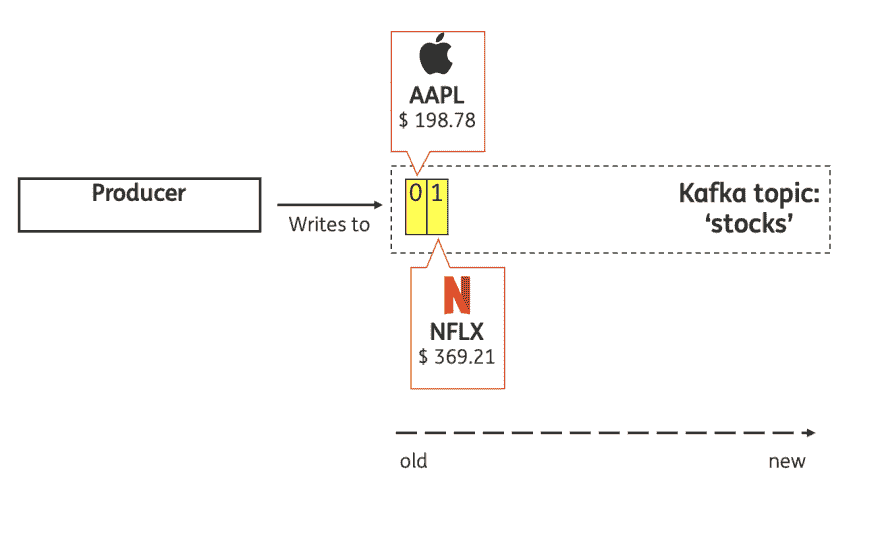
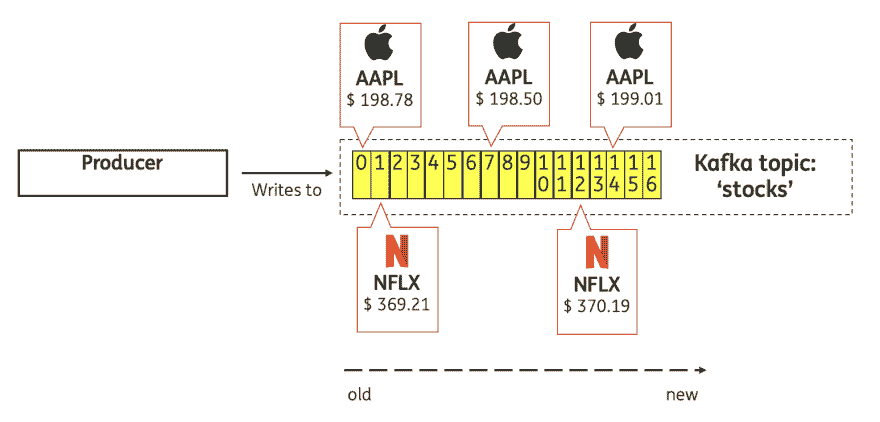
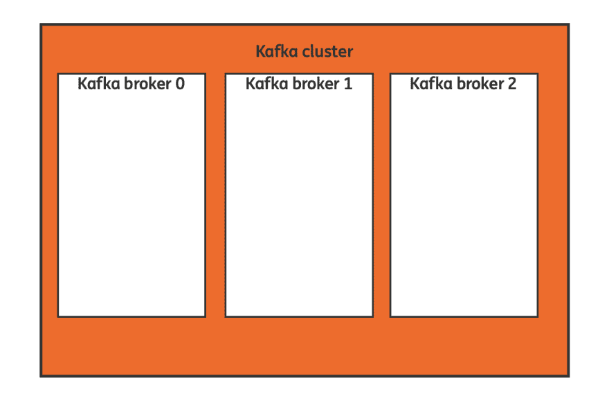
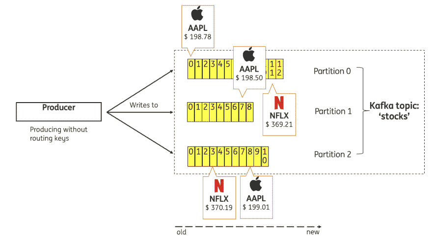
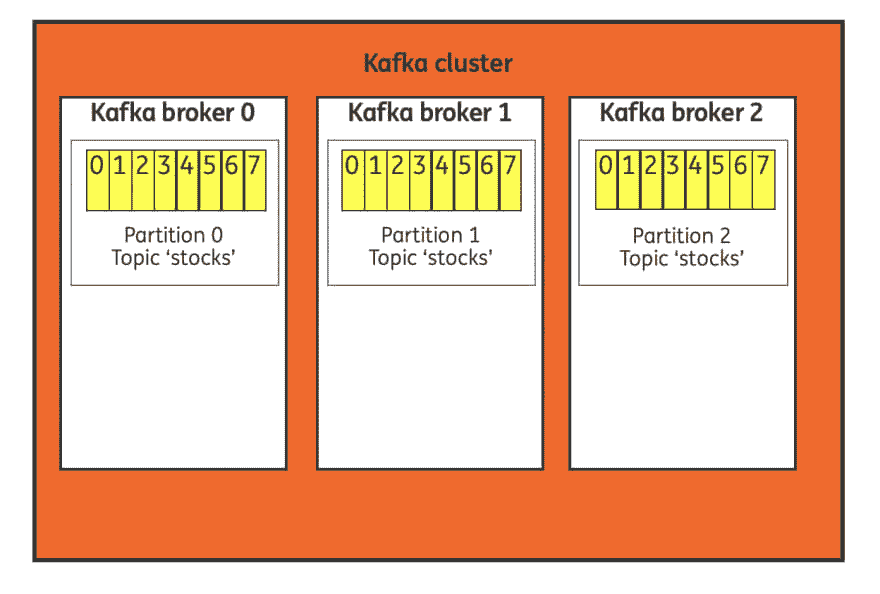
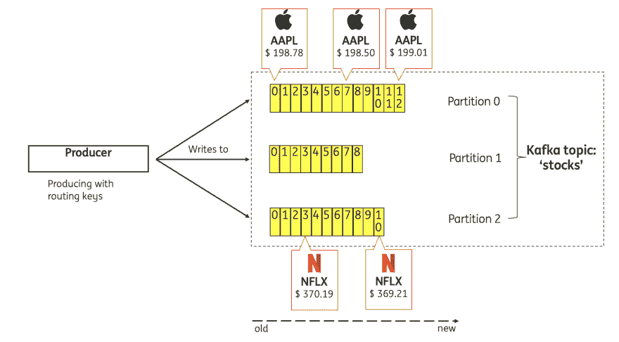
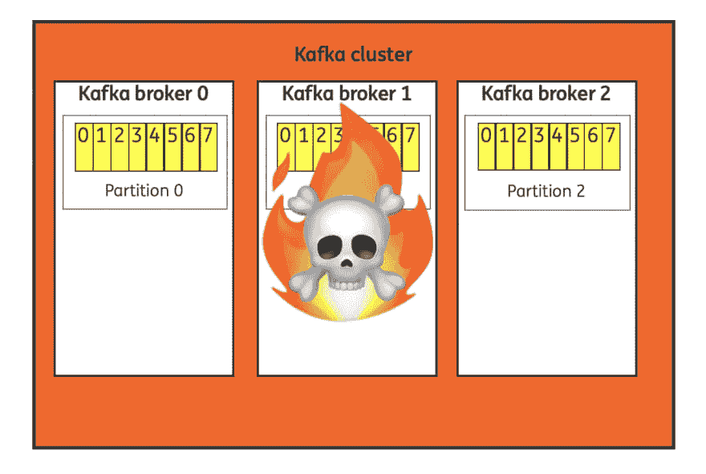
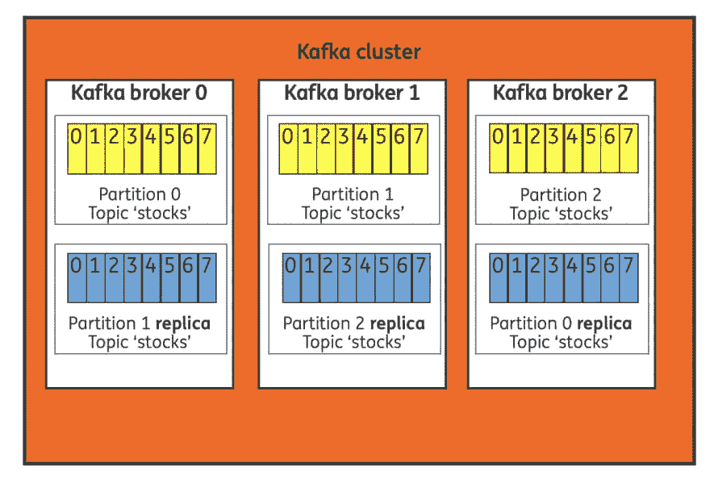
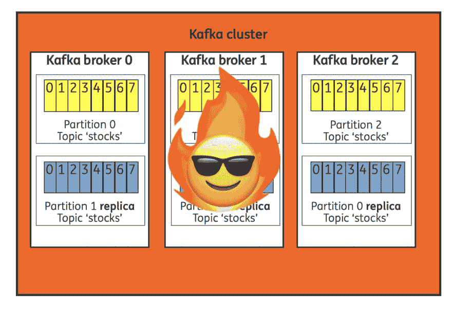

# 用对话向卡夫卡解释产生数据的基础…

> 原文：<https://dev.to/thegroo/the-basics-of-producing-data-to-kafka-explained-using-a-conversation-4c16>

> 这是转贴自朋友的作品，已获其授权发表。原文链接和他的推特账号可以在这篇文章的末尾找到。

学习一门新技术或编程语言有时会让人不知所措，尤其是当你刚接触软件开发时。回顾过去，我清楚地记得我在软件开发研究中读过四人帮写的《设计模式:可重用面向对象软件的元素》这本书。尽管这本书是用荷兰语(我的母语)翻译的，但大部分的模式根本没有印在我的脑海里。

过了一段时间，我发现了《头脑优先设计模式》这本书。我看到卖了！一旦我开始读这本书，我就停不下来。简单、有趣的图画和中肯的解释的结合使这些模式深深地印在我的脑海中，并帮助我通过了考试！受书中“炉边谈话”部分的启发，你将在我今天的博客文章中学习为 Apache Kafka 生成数据的基础知识！快乐阅读。

### 今日炉边聊天:

账单🤓=开发了一些应用程序并且刚刚听说了 Kafka 的热情的新软件开发人员。

喋喋不休的人😎=高级软件开发人员，他熟悉 Apache Kafka，多年来一直在产品中运行利用 Kafka 的应用程序。

🤓:你好，最近我听我的开发伙伴谈论 Apache Kafka，我想了解更多，这样我就可以在我的下一个项目中使用 Kafka。他们都说卡夫卡很酷。你能给我一个速成班吗？

😎:当然，阿帕奇卡夫卡很棒，你会爱上它的！但是请记住，不要使用(新)技术，因为它很酷，它应该适合用例。

🤓:所以 Kafka 只是另一个类似 MySQL 或 PostgreSQL 的数据库，对吗？

😎:与“传统数据库”不同，Kafka 是一个分布式的仅附加日志。

🤓:分布式什么？

😎别担心，我们会到达那里的。为了更清楚，让我解释一下我们正在处理的一个用例。在这个项目中，我们必须处理世界各地证券交易所交易的股票的连续价格更新流。我们收到 2000 到 15000 的股票价格更新。

🤓:每天？

😎:不是，每秒！因此，我们不想将如此大量的数据写入传统数据库。由于我们在项目中还需要实时使用这些数据，所以我们决定为 Kafka 主题生成这些数据。

一只股票的每一次价格更新都是一个记录。每个记录是一个键/值对，被发送到指定的 Kafka 主题。

Kafka 是按主题组织的，您可以为想要存储的每种类型的记录创建一个主题。把一个主题想象成“数据的供给”。为了简单起见，在这个例子中，每个记录都将包含股票的符号和美元价格。我给你看一张照片:

我们收到的每一个股票价格更新都将生成一个名为“股票”的主题，并被附加到日志中。在这个例子中，我们有一只苹果股票(APPL ),价格为 198.78 美元，后来网飞(NFLX)股票的价格更新为 369.21 美元。

🤓:但是我可以想象你在一天之内收到相同股票的多个价格更新，所以你可能需要更新关于该股票的主题，对吗？

😎:不，正如我之前告诉你的，Kafka 不是一个传统的数据库。你不能改变历史，以前存储的记录是不可变的，所以你只能添加新的“记录”到你的主题！记住 Kafka 是一个分布式的只添加日志。因此，当我们收到新的价格时，它们将被附加如下:

注意:在苹果和网飞股票的价格更新之间，我们也收到了其他股票的更新，为了简单起见，我们将重点关注苹果和网飞股票。

🤓:好的，明白了…但是如果你一秒钟收到 15000 条价格更新，你能把所有的数据都存储在一台机器上吗？

😎:好问题！让我告诉你更多关于卡夫卡的分布式本质。你要知道的第一件事是，我们把一台卡夫卡机器叫做卡夫卡经纪人。多个代理在 Kafka 集群中一起工作。

要理解的第二个重要部分是 Kafka 把你的主题日志分成了几个分区。针对“股票”主题生成的记录(在本例中为 3 个分区)将按如下方式划分到各个分区:

当你把这两者结合起来时，你就会明白 Kafka 会把分区分散到多个经纪人身上:

🤓:我注意到主题中的记录现在出现在不同的分区中，这是您想要的吗？

😎:这取决于您是否关心记录稍后的消费顺序。在这种情况下，我们没有为记录提供路由关键字，因为它们以循环方式分布在分区上。

如果您提供了一个路由关键字，Kafka 会确保具有相同关键字的记录会出现在同一个分区中。

> 所以请记住，主题中记录的顺序只能按分区来保证！

你认为当一个卡夫卡经纪人倒下时会发生什么？这不一定是一个经纪人的崩溃，也可能是因为维护。

🤓:我仍然有点困惑，为什么一个主题被分成多个分区，为什么这很重要？

😎:这很重要，因为 Kafka 中的复制是在分区级别实现的。让我通过再次快速查看分区和代理的图片来解释这一点。正如您再次看到的，3 个分区分布在集群中的 3 个代理上。这意味着该主题的全部“数据集”并不存在于一个代理中。

你认为当一个卡夫卡经纪人倒下时会发生什么？这不一定是一个经纪人的崩溃，也可能是因为维护。

🤓:这可能意味着我们将丢失三分之一的数据！

😎比尔，你学得真快！没错，我们会丢失数据，这是不可接受的。为了避免丢失数据，我们可以配置一个 Kafka 主题，为每个分区制作一个或多个副本。Kafka 将确保每一个复制品(这就是我们所说的副本)最终会出现在不同的经纪人手中。

因此，现在我们可以在万一我们的某个经纪人倒下的情况下幸存下来，而不会丢失数据。因为我们所有的分区 0，1，2 都是可用的。

🤓谢谢杰伊，我今天学到了很多。让我们很快再聊一聊！

😎不客气，比尔。下一次我们将从 Kafka 主题中讨论消费数据的基础知识，下次见。

# 参考文献

*   [媒体上的原始帖子](https://medium.com/@TimvanBaarsen/head-first-kafka-the-basics-of-producing-data-to-kafka-explained-using-a-conversation-2df6544462f)

*   [蒂姆的推特账户](https://twitter.com/TimvanBaarsen)

*   [我的推特账户](https://twitter.com/thegroo)

*   [卡夫卡文献](https://kafka.apache.org/documentation/#gettingStarted)