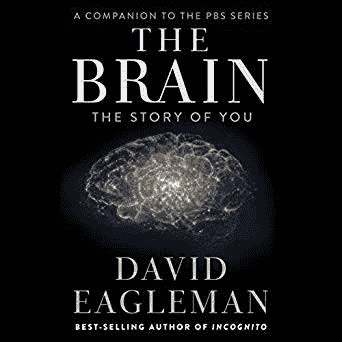

# 你大脑的美丽

> 原文：<https://dev.to/bhavaniravi/the-beauty-of-your-brain-nla>

我喜欢阅读关于大脑的书籍。它的复杂性和独特性让我着迷。随着我对阅读有关大脑的探索的增加，我偶然发现了这段可听见的 ***“大脑你的故事”。*** 这本书与其他心理学书籍不同，并不太专业。这本书的每一部分只有 2-3 分钟长，这对我这个对音频关注有限的人来说再合适不过了。

作为一个额外的奖励，作者在这本书的开头说，他不想用与生俱来的技术细节和伴随大脑而来的术语来烦人们。如果这都不能让你买书，我不知道还有什么能让你买书。

### 你的大脑是愚蠢的。

与动物不同，人类的大脑在出生时是半生不熟的。动物的大脑结构是这样的，它可以在特定的环境中生存。这就是为什么你会看到长颈鹿和小牛在出生后跳起来。企鹅的大脑支持它在寒冷的气候下生存。当你把它放在沙漠里时，它可能会死。但是似乎没有什么能阻止人类去适应他们的环境。也许这就是为什么从南极洲到塔尔，你到处都能看到人类。

你可以把动物的大脑想象成一台预编程的计算机，装有所有的软件，而人类的大脑就像一个新的神经网络，可以根据周围的数据进行学习和进化。(好吧，我得去某个地方玩玩)

### 大脑没有极限。字面上。

嗯，这个我知道，但不能解释是怎么知道的。这些书给出了一个完美的例子。

如果你检查一个钢琴家的大脑，你会发现神经链接交织在一起，反映了演奏钢琴所需的整体知识。钢琴家应该通过长时间的练习来掌握它。还没什么惊喜吗？你应该注意的是，钢琴是在 18 世纪才发明的，这意味着整个人类(大脑)根本不知道什么是钢琴或者如何弹奏钢琴。但是当它成为现实的时候，大脑开始适应，扭曲，转动，融合在一起来玩一个。

这意味着人脑的能力远远超出我们的想象。带来 20 年后将统治我们的技术，我们的大脑会适应它。

### 学习从小开始

称你自己为内向者、外向者、野心勃勃者。你需要周围的人保持理智。先从童年说起。作为孩子，大部分的学习都是因为我们的父母。

这本书引用了一项关于寄养儿童学习障碍的研究。显然，寄养家庭的孩子从未得到过任何形式的关爱。他们被喂养和改变，但任何其他形式的人类接触是严格禁止的。结果呢？收养孩子的父母不得不面对严重的学习障碍。

作为人类，我们需要周围的人来尝试、模仿和更新我们的知识。这就是为什么你需要和最好的人在一起，因为你反映了你周围人的品质。

### 运用你的感官，否则它们会开始利用你。

还有另一项研究，人们被放在一个你什么也看不见、听不见的房间里。测试对象被要求在这个房间里住几个月。当受试者被带回时，他们发现受试者开始想象场景，并开始听到声音和噪音。严格来说，他们是生活在梦中的幻觉。事情发展到如此地步，以至于他们分不清现实和梦想。

为什么？因为你的感觉是两条街。你看不见是因为眼睛在看，大脑在处理。就像*眼睛捕捉→发送到大脑→大脑处理→将图像发送回眼睛。即使你停止感官输入，你的大脑也不会停止处理信息。从而用可用的信息创建它自己的视觉效果。*

### 感同身受是人类

自从塞特亚·纳德拉的书《刷新》出版后，世界一直在谈论移情和情商。但是你的大脑已经掌握了这种技能，甚至在你给它加上“移情”标签之前。尽管我们都觉得自己是这个世界上的一个独立实体，但我们也紧密相连。社会交往和周围的人在你的社交、情感和智力健康中扮演着重要的角色。支持这一观点的研究对象远离人类接触。随着时间的推移，他们失去了同理心和理解他人感受的能力。你的大脑就失去了这种能力。你不断地从你周围的人那里学习和提高。想在喜马拉雅山找到一个洞穴？马上放下。

就像我是如何开始这个博客的，你的大脑确实是一个具有非凡学习和扩展能力的主机器。不要把它浪费在社交媒体的争斗、流言蜚语、刻板印象以及我们以“做好事”的名义所做的数以百万计的其他事情上。

*最初发表于*[*【https://bhavaniravi.com】*](https://bhavaniravi.com/blog/the-beauty-of-your-brain)*。*

* * *