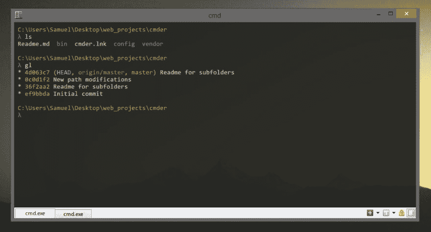
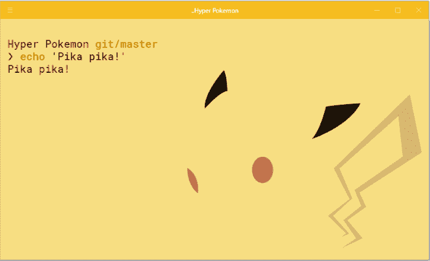
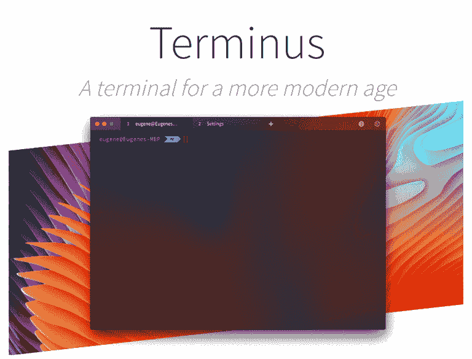
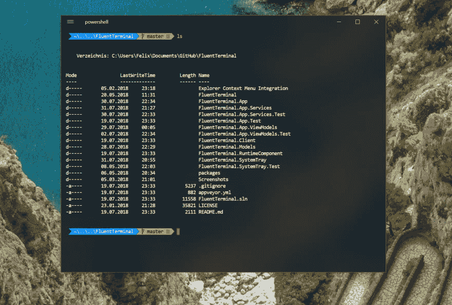
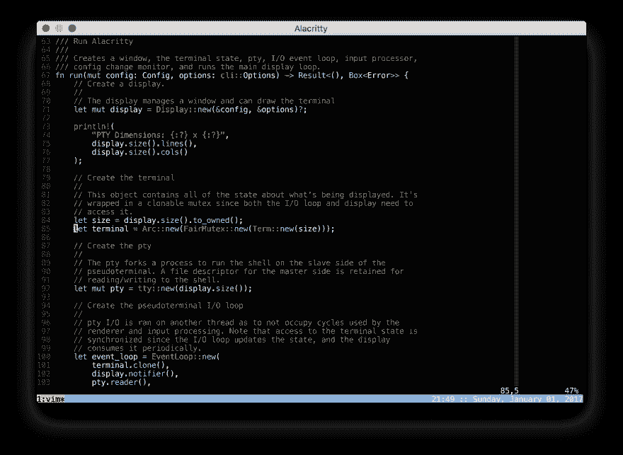

# Windows 终端 Windows 10 的最佳免费独立终端(2020)

> 原文：<https://dev.to/adnanmostafa/the-best-free-standalone-terminals-for-windows-2019-kmj>

如果你是任何试图在 PC 上使用终端的人，我为你的遭遇感到抱歉。下面是一些最好的终端模拟器，可以提升您的工作流程:

### [1。命令](https://cmder.net//)

Cmder 是一个便携式控制台模拟器，建立在已经流行的 [Conemu](https://conemu.github.io/) 之上；Conemu 也值得一试，因为它是 Cmder 的替代产品。Cmders 网站对此做了完美的解释:

> 把 cmder 更多地看作一个软件包，而不是一个单独的应用程序。所有的魔法都是通过科内姆发生的。从[到](https://mridgers.github.io/clink/)的增强。

尽管 Cmder 有时在速度上有问题(尽管它被认为是可移植的)，但它仍然是一个很好的基本控制台模拟器，可以满足您的目标。

### [2。Hyper.is](https://hyper.is/)

Hyper 是一款时尚的终端，可以在 PC 和 MAC 上使用，并且在主题、插件和外壳方面完全可定制。看起来在开发方面还有很多工作要做，因为我在安装 [zsh shell](https://github.com/robbyrussell/oh-my-zsh) 时遇到了一些错误。不管怎样，这都是一个很好的可扩展终端。(注:如果你想拿起口袋妖怪的主题，你可以在这里得到它[！](https://github.com/klaussinani/hyper-pokemon))

### [3。终点](https://eugeny.github.io/terminus/)

 
“现代的终点站”是总站的口号。这个终端看起来类似于一个开发环境，它有分割的窗格，完全可配置的快捷方式，标签和对所有主要外壳的支持。这个终端仍然是新的，它将是令人兴奋的看到什么是未来。

### [4。流畅终端](https://github.com/felixse/FluentTerminal)

PowerShell、CMD、WSL 或自定义 Shell 的终端，甚至可以从 iTerm 中获取主题，具有可编辑的按键绑定和快速可调的设置， [Fluent](https://github.com/felixse/FluentTerminal) 绝对值得一试。

### [5。阿拉维提〔T3〕](https://github.com/jwilm/alacritty)

 
这个有点争议。Alacritty 声称自己是“现存最快的终端模拟器”虽然[的说法可能不完全正确](https://news.ycombinator.com/item?id=16936181)，但许多用户都反映使用 Alacritty 时速度很快，使用速度很慢。因此，虽然它可能不适合每个人，但它可能能够解决您的终端存在的一些延迟/撕裂问题。

这篇文章有帮助吗，或者想补充什么/问问题吗？欢迎[连接](https://dev.to/connect)和[关注](https://dev.to/adnanmostafa)了解更多信息或在下面留下评论！