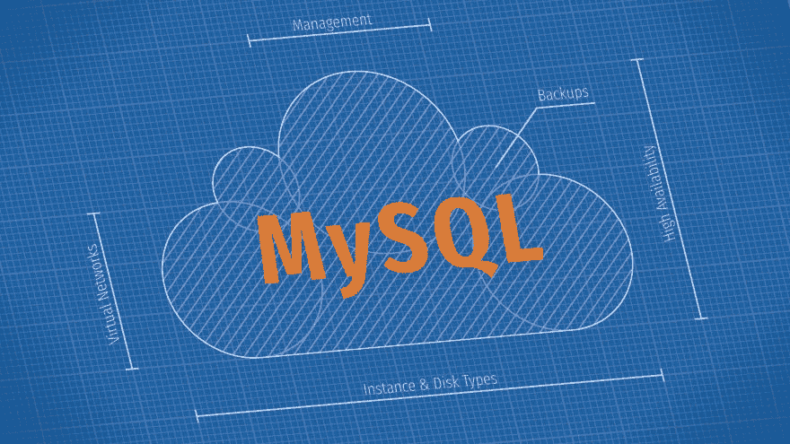
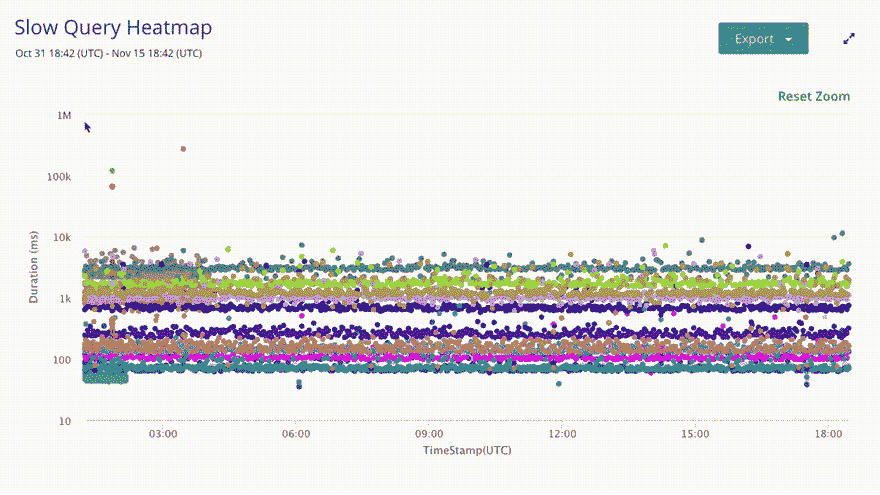

# 在 Azure Cloud 上托管 MySQL 的最佳方式

> 原文：<https://dev.to/scalegrid/the-best-way-to-host-mysql-on-azure-cloud-110p>

您是否希望开始使用世界上最流行的开源数据库，并想知道应该如何设置您的 [MySQL 托管](https://scalegrid.io/mysql.html)？当 MySQL 在 [Azure Cloud](https://azure.microsoft.com/en-us/) 上表现异常出色时，许多人默认使用亚马逊 RDS。虽然 Microsoft Azure 确实提供了一个托管解决方案 Azure Database，但该解决方案有一些主要限制，您应该在迁移 MySQL 部署之前了解这些限制。在这篇文章中，我们概述了在 Azure 上托管 [MySQL 的最佳方式，包括托管解决方案、实例类型、高可用性复制、备份和磁盘类型，用于](https://scalegrid.io/mysql/azure.html)[优化您的云数据库性能](https://scalegrid.io/blog/the-best-way-to-host-mysql-on-azure-cloud/)。

## MySQL DBaaS 与自我管理的 MySQL

在自我管理和 MySQL 数据库即服务(DBaaS)解决方案之间权衡时，首先要考虑的是您有哪些内部资源可用。如果您正在阅读本文，您可能已经了解了与维护生产部署相关的运营任务的规模，但是快速回顾一下，还有配置、取消配置、主从配置、备份、扩展、升级、日志循环、操作系统修补和监控等等。

根据您的应用程序规模，内部 MySQL 专家或 DBA 团队当然可以为您的组织处理这些问题，但问题是您希望您的团队将精力集中在哪里。许多人决定转向 MySQL DBaaS 来自动化这些耗时的任务，这样他们就可以将更多精力放在应用数据库的开发和优化上。缓慢的查询分析就是一个很好的例子。虽然几乎每个 DBaaS 都提供了 MySQL [慢速查询分析器](https://help.scalegrid.io/docs/mysql-monitoring-slow-query-analyzer)工具来帮助识别有问题的查询，但这项任务仍然需要[人的技能和直觉](https://scalegrid.io/blog/the-role-of-the-dba-in-nosql/)来确定如何优化那些影响其应用性能的查询。

无论您是一家初创公司还是一家财富 500 强企业，您都会发现许多组织选择利用数据库即服务来优化其数据库管理员的时间，而相同类型和规模的企业也选择坚持内部自我管理。对于许多企业来说，决策很大程度上取决于定制和控制。这就是为什么我们警告不要默认使用 Azure 数据库，或者它的 AWS 竞争对手 Amazon RDS，因为他们不允许你保留 MySQL 超级用户访问权，甚至不允许 SSH 访问你的机器。此外，定制部署设置的能力非常有限，例如实例类型、RAM、磁盘大小或可以使用的 IOPS。您将在下面了解更多关于最佳实例类型和磁盘的信息，并且您可以查看这个 [MySQL 提供者比较](https://scalegrid.io/mysql/hosting-comparison.html)来了解四大托管 MySQL 解决方案 ScaleGrid、Compose、Azure Database 和 Amazon RDS 的优势和局限性。

## 高可用性部署

如果您在生产中部署，您应该总是[将 MySQL 设置为主从部署](https://help.scalegrid.io/docs/mysql-new-cluster-dedicated-hosting#section-step-2-master-slave "Create a New MySQL Deployment - Master-Slave Setup")。独立部署是没有任何复制的单个节点，应该只用于开发或测试环境。通过主从部署，您能够配置高可用性，因此如果您的一个节点出现故障，您可以故障切换到一个从属节点，而不会出现停机。这通常设置为 3 节点主-从-从或 2+1 节点主-从-仲裁。使用仲裁的优点是成本较低，但缺点是只有 2 个数据承载节点，因为另一个节点充当仲裁节点来确定最佳故障转移过程。如果您的应用程序能够从从属服务器读取数据，那么您需要进行读取扩展，以便它们以最小的延迟从集群卷返回相同的数据。

当使用 MySQL 主从配置时，我们建议设置[半同步复制](https://scalegrid.io/blog/data-integrity-and-performance-considerations-in-mysql-semisynchronous-replication/)，通过数据冗余提高数据完整性。这确保了当提交成功返回时，数据同时存在于主服务器和从服务器中，因此在数据中心宕机的情况下，MySQL 主服务器可以故障转移到从服务器，而不会丢失任何数据。您可以通过异步或半同步复制来实现这一点，并在我们的 [MySQL 高可用性解释-第二部分](https://scalegrid.io/blog/mysql-high-availability-framework-explained-part-2/)博客帖子中了解更多信息。

那么，我们如何在 Azure 上配置 MySQL 的高可用性呢？我们需要跨不同的 Azure 可用性区域(AZ)分布我们的 slave 实例。因此，我们希望确保选择一个至少有 3 个 AZ 的 Azure 区域，将每个实例放在不同的 AZ 中。我们这样做是因为可用性保证是跨 AZ 的，所以如果一个区域宕机，您的应用程序数据库仍然能够通过其他两个 AZ 保持在线。可用性区域对 Azure 来说是相当新的，所以如果你在一个不提供 AZ 的区域工作，你可以选择使用可用性集合。这些比 AZ 的稍弱，但确保您跨不同的域和机架部署，以防止潜在的中断。还有跨区域部署的选项，但这是一个更复杂的设置，因此我们建议在实施之前进行讨论。

## Azure 虚拟网络

保护您的数据库免受 internet 攻击的最佳方法是将其部署在专用子网中，以确保它不会暴露。Azure 通过使用一个可以为你的 MySQL 服务器配置的虚拟网络 (VNET ),让这个设置变得简单。借助 MySQL 的 [Azure VNET，您可以在您的服务器、互联网甚至您的内部私有云网络之间建立安全的通信。这些通常被配置为通过单个网络进行通信，但是如果您需要连接多个区域，您可以创建多个 VNETs 来通过虚拟网络对等进行通信。](https://help.scalegrid.io/docs/cloud-profile-azure-arm-setup "Create an Azure VNET Cloud Profile for MySQL")

此外，您可以通过网络安全组(NSG)规则管理您的 MySQL 访问控制，而不必处理 IP 白名单。这不能通过 MySQL 的 Azure 数据库获得，但 VNET 和 NSG 都可以通过我们在 Azure 上的 MySQL[Bring Your Own Cloud](https://scalegrid.io/pricing.html?db=mysql&cloud=cloud_azure&replica=deployment_standalone&instance=micro#section_pricing_byoc)(BYOC)计划进行配置，您可以通过自己的云帐户托管您的集群。

## Azure 实例类型

另一个需要考虑的重要方面是公共云中 MySQL 实例的性能。Azure cloud 提供了多种可用于 MySQL 托管的实例类型，包括 Es2 v3、Ds2、v2 和 Ls4。

我们建议从内存优化的实例类型开始，因为数据库需要大量 RAM，并且正在寻找尽可能快的磁盘速度以获得最佳性能。Es2 系列通常是大多数应用程序 MySQL 工作负载的良好起点。从那里，您可以进行一些性能测试，看看您是否需要更多的 CPU，在这种情况下，平衡的实例类型或 CPU 密集型实例类型可能更好地满足您的 MySQL 需求，比如 Dv3 实例类型。您的性能测试也可能显示您需要更多的 I/O(输入/输出)，您可以转移到磁盘密集型实例类型。

如果你计划在未来 1-3 年内利用 Azure 作为你的 MySQL 云提供商，并保持相当一致的部署配置，你也可以考虑[保留实例](https://azure.microsoft.com/en-us/pricing/reserved-vm-instances/)。这些基本上是预付费实例，让您可以为 MySQL 主机节省大量成本。平均而言，一年期的保留实例可以节省大约 20%到 30%,三年期的保留实例可以节省 40%到 50%。

## Azure 磁盘类型

在为 MySQL 部署选择 Azure 磁盘类型时，您需要做出的第一个决定是，是选择托管磁盘还是非托管磁盘。非托管磁盘是 Azure 提供的传统磁盘，您必须设置存储帐户，将磁盘映射到存储帐户，并监控该存储帐户的 IOPS 使用和限制。我们强烈建议使用托管磁盘，如果您仍然使用非托管磁盘进行部署，您应该考虑迁移到托管磁盘。

### MySQL 开发/测试环境:标准磁盘

Azure 提供多种托管磁盘类型，默认为标准磁盘。标准磁盘可以支持高达 500 IOPS(每秒输入/输出操作数)，非常适合开发和测试操作，因为它们可以动态调整大小，但不应用于 MySQL 生产部署。

### MySQL 生产部署:高级磁盘

对于您的 MySQL 生产服务器，我们强烈建议利用 Azure premium 磁盘。有各种各样的高级光盘可供选择。对于每个高级磁盘，您可以选择最佳大小，每个大小都有不同的调配 IOPS，因此您可以选择最适合您的应用程序需求的一个。

### MySQL 生产部署:本地 SSD

Azure 本地 SSD 是优质磁盘的高性能替代品，通常最适合大型集群。本地 SSD 提供了更高的 I/O 性能，以及 Azure 中最好的吞吐量。但是，它们有一个缺点，因为它们是短暂的磁盘，而不是永久的存储，所以如果您停止实例，数据就会消失。我们推荐 Ls v2 系列，它非常快，但是要注意 CPU 非常弱，这会导致机器瓶颈。

## Azure 上的 MySQL 备份

在 Azure 上备份 MySQL 数据的最好方法是使用托管磁盘快照。快照是磁盘的只读[时间点](https://docs.microsoft.com/en-us/azure/storage/blobs/storage-blob-snapshots)版本。这些备份可以被读取、复制或删除，但请注意，它们不能被修改。最好进行完整备份，以便在需要恢复 MySQL 数据库时，将所有数据库、用户和设置都备份在实例上。加密您的备份快照也是一个好主意，这样备份只能恢复到进行备份的机器上。

你的 MySQL 备份将导致额外的 Azure 数据存储费用，除非你利用一个全包的 MySQL on Azure 解决方案，如我们在 ScaleGrid 的[专用托管](https://scalegrid.io/pricing.html?db=mysql&cloud=cloud_azure&replica=deployment_standalone&instance=micro#section_pricing_dedicated)计划。为了控制成本，最好通过一个可定制的计划来[自动化您的备份](https://help.scalegrid.io/docs/mysql-backups-scheduled "MySQL Scheduled Backups - ScaleGrid Docs")，该计划允许您配置备份的频率、要保留的最大备份数量以及备份目标。这当然也有助于确保您的 MySQL 数据得到定期备份，以防生产部署中的任何数据丢失，这样您就可以通过最近的备份快速恢复。

如果您对在 Azure 上托管 MySQL 的最佳方式有任何疑问，请在下面给我们留下评论或通过 [support@scalegrid.io](mailto:support@scalegrid.io) 与我们联系。您还可以开始[30 天免费试用](https://console.scalegrid.io/users/register)，探索利用完全托管的 MySQL 服务来提高部署性能的优势。