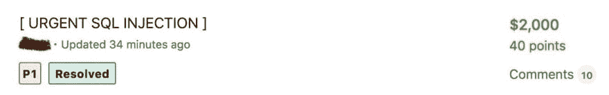

# 价值 2k 美元的 bug

> 原文：<https://dev.to/bilalmerokhel/the-bug-which-worth-2k-48cm>

我在 [Bugcrowd](https://www.bugcrowd.com) 上测试一个公共程序。该计划不允许公开披露，所以我将它称为【redacted.com**，它公开了大约 7 年，许多 1337 ( *1337 = >黑客*)已经尝试了它的安全漏洞，所以我四处测试，非常沮丧，因为那是我的开始。沮丧之余，我休息了一会儿，思考我在做什么，我回到了 1337 方法，即**更加努力**。我休息了一会儿，然后睡着了。醒来后，我意识到一个请求正在获取我保存的项目，所以我立即打开我的笔记本电脑，并开始通过用 [BurSuit](https://portswigger.net) 捕获请求来查找请求。因此，有一个请求获取了我保存的项目，并在输入分号到保存的`saved_items_id`后通过 [GraphQL](https://graphql.org) 发送到服务器。在一周内报告问题后，获得了 2k 美元奖金，并立即对端点进行了修复** 

> @ this _ rex我赚了💲2000 年我的投稿于[@ bug crowd](https://twitter.com/Bugcrowd)[bugcrowd.com/bilalkhan](https://t.co/6YwomSKPDU)[# bug bounty](https://twitter.com/hashtag/bugbounty)[# ItTakesACrowd](https://twitter.com/hashtag/ItTakesACrowd)2019 年 2 月 21 日上午 09:252[15](https://twitter.com/intent/like?tweet_id=1098514139176226816)