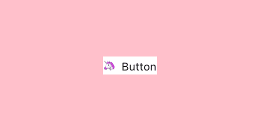
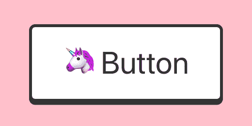
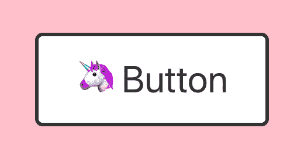
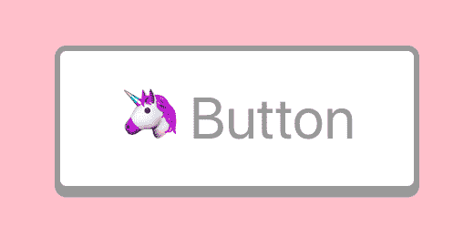
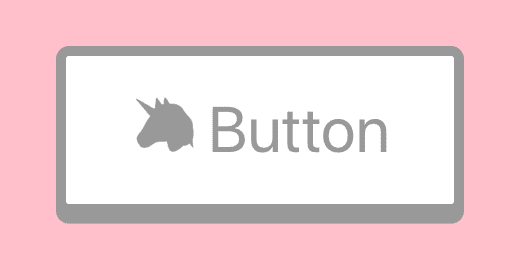
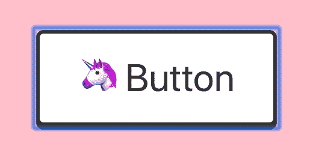
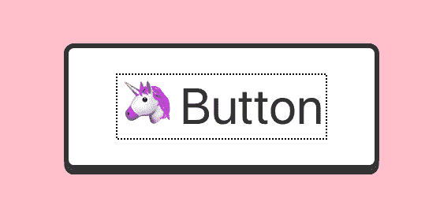
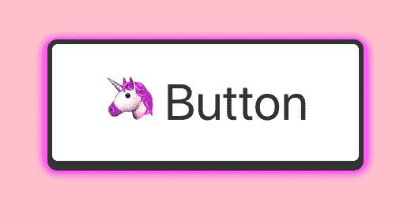
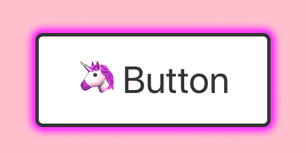

# 按钮

> 原文：<https://dev.to/stereobooster/the-button-3kme>

这里的演示是[这里的](https://stereobooster.github.io/the-button/)。源代码是[这里的](https://github.com/stereobooster/the-button)。

## 使用`<button>`

请不要用`<a>`做按钮。它们有不同的含义和行为。链接对`Enter`键的响应(将触发 onClick 动作)，`<button>`对`Space`的响应。如果用户聚焦于`<a>`，它被设计成按钮并使用`Space`，页面将会滚动而不是动作。`<a>`用于导航，用户可以点击`Ctrl` / `Cmd`打开新标签页。`<a>`在 Firefox 中是不可聚焦的。我想说的`<a>`和`<button>`在行为和语义上有很大的不同。

```
<button type="button">
  <span role="img" aria-label="unicorn">
    🦄
  </span>{"  "}
  Button
</button> 
```

你应该可以在任何地方使用`<button>`，但是如果你想要别的东西，你也可以使用`<div role="button" tabindex=0>`。如果你想要老派的东西，这里有`<input type="button" />`。

> 如果使用`role="button"`而不是语义`<button>`或`<input type="button">`元素，你将需要使元素可聚焦，并且必须为点击和按键事件定义事件处理程序，包括`Enter`和`Space`键，以便处理用户的输入。[参见 WAI-ARIA 官方示例代码](https://www.w3.org/TR/wai-aria-practices/examples/button/button.html)。
> - [MDN](https://developer.mozilla.org/en-US/docs/Web/Accessibility/ARIA/Roles/button_role)

## 重置样式

`<button>`带有预定义的样式，但是如果我们想要定制它，我们可以从重置样式
开始

```
/* reset button styles https://css-tricks.com/overriding-default-button-styles/ */
button {
  border: none;
  padding: 0;
  margin: 0;
  /* not needed in modern browsers */
  -webkit-appearance: none;
  -moz-appearance: none;
} 
```

[](https://res.cloudinary.com/practicaldev/image/fetch/s--erOFQ306--/c_limit%2Cf_auto%2Cfl_progressive%2Cq_auto%2Cw_880/https://thepracticaldev.s3.amazonaws.com/i/0zqd2jled53uheddt7m9.png)

## 初始样式

让我们的按钮看起来像一个按钮

```
<button type="button" className="button"> 
```

```
/* inspired by https://codepen.io/liamj/pen/vvdRdR */
.button {
  --color-dark: #333;
  --color-light: #fff;
  display: block;
  position: relative;
  font-size: 2rem;
  padding: 1rem 2rem;
  border-radius: 0.4rem;
  background: var(--color-light);
  color: var(--color-dark);
  border: 0.2rem solid var(--color-dark);
  box-shadow: 0 0.2rem 0 0 var(--color-dark);
} 
```

[](https://res.cloudinary.com/practicaldev/image/fetch/s--GFC4ElJk--/c_limit%2Cf_auto%2Cfl_progressive%2Cq_auto%2Cw_880/https://thepracticaldev.s3.amazonaws.com/i/lnjvz5hvatav9k0s2wfe.png)

## 活动状态

按钮应该提供活动状态，这样用户就会知道按钮对点击做出响应。

```
.button:active {
  top: 0.2rem;
  box-shadow: none;
} 
```

[](https://res.cloudinary.com/practicaldev/image/fetch/s--uvY12qFP--/c_limit%2Cf_auto%2Cfl_progressive%2Cq_auto%2Cw_880/https://thepracticaldev.s3.amazonaws.com/i/ph8yp9r95ocigrjxyq6r.png)

## 禁用状态

按钮应该提供禁用状态，这样用户就会知道按钮是不可点击的。

```
<button type="button" className="button" disabled> 
```

```
.button:disabled {
  --color-dark: #999;
  cursor: not-allowed;
} 
```

[](https://res.cloudinary.com/practicaldev/image/fetch/s--2y3TyJMj--/c_limit%2Cf_auto%2Cfl_progressive%2Cq_auto%2Cw_880/https://thepracticaldev.s3.amazonaws.com/i/5vktoxz75wcjhd2gtis9.png)

差不多了，但是表情符号不变色。

```
.button:disabled {
  --color-dark: #999;
  cursor: not-allowed;
  /* see https://www.bram.us/2016/10/06/emoji-silhouettes-and-emoji-outlines-with-css/ */
  color: transparent;
  text-shadow: 0 0 0 var(--color-dark);
} 
```

[](https://res.cloudinary.com/practicaldev/image/fetch/s--mf_Z1t-c--/c_limit%2Cf_auto%2Cfl_progressive%2Cq_auto%2Cw_880/https://thepracticaldev.s3.amazonaws.com/i/qntbjvtr9ihlqef17ilt.png)

> 与其他浏览器不同，Firefox 在默认情况下会跨页面加载保持动态禁用状态。将 autocomplete 属性的值设置为 off 将禁用该功能。参见 bug [654072](https://bugzilla.mozilla.org/show_bug.cgi?id=654072) 。
> - [MDN 关于按钮](https://developer.mozilla.org/en-US/docs/Web/HTML/Element/button#Notes)

## 焦点状态

按钮应该提供一个焦点状态，这样用户就知道焦点在哪里，否则，用户需要猜测或跳转到提供焦点的最近的元素。浏览器提供了一个现成的焦点状态:

铬合金:

[](https://res.cloudinary.com/practicaldev/image/fetch/s--nSIpHH_B--/c_limit%2Cf_auto%2Cfl_progressive%2Cq_auto%2Cw_880/https://thepracticaldev.s3.amazonaws.com/i/sycqdn6fg6rx00jzeqcy.png)

火狐浏览器:

[](https://res.cloudinary.com/practicaldev/image/fetch/s--h3pWvna1--/c_limit%2Cf_auto%2Cfl_progressive%2Cq_auto%2Cw_880/https://thepracticaldev.s3.amazonaws.com/i/rmmuozwahxkqdufwgswd.png)

Safari:

[Safari 中的按钮不是“可点击的”](https://allyjs.io/data-tables/focusable.html)🤦

### 自定义焦点状态

让我们移除默认焦点状态:

```
/* https://fvsch.com/styling-buttons/ */
.button:focus {
  outline: none;
}
.button::-moz-focus-inner {
  border: none;
} 
```

**不要删除大纲，除非你提供替代方案**

让我们添加自定义大纲:

```
.button:focus {
  outline: none;
  box-shadow: 0 0.2rem 0 0 var(--color-dark), 0 2px 5px 3px #f0f;
} 
```

[](https://res.cloudinary.com/practicaldev/image/fetch/s--ljdF9grh--/c_limit%2Cf_auto%2Cfl_progressive%2Cq_auto%2Cw_880/https://thepracticaldev.s3.amazonaws.com/i/v7h7ysezgyjye6eluu7a.png)

### 焦点状态+活动状态

因为我们对`:active`和`:focus`都使用了`box-shadow`，它们可能会冲突，我们需要处理特殊情况:

```
.button:active:focus {
  top: 0.2rem;
  box-shadow: 0 0px 6px 4px #f0f;
} 
```

[](https://res.cloudinary.com/practicaldev/image/fetch/s--HdsPrH5Q--/c_limit%2Cf_auto%2Cfl_progressive%2Cq_auto%2Cw_880/https://thepracticaldev.s3.amazonaws.com/i/u2ggpuk01kk0q97ui3aa.png)

### 焦点状态仅针对键盘用户

没有必要为鼠标用户显示焦点，它只对键盘用户有用。于是就有了一个建议，增加 [`:focus-visible`](https://drafts.csswg.org/selectors/#the-focus-visible-pseudo) 状态来做到这一点。同时，我们可以使用 polyfill 或者自己实现这个功能。

```
import "focus-visible"; 
```

```
.js-focus-visible :focus:not(.focus-visible) {
  box-shadow: 0 0.2rem 0 0 var(--color-dark);
}
.js-focus-visible :active:not(.focus-visible) {
  top: 0.2rem;
  box-shadow: none;
} 
```

## 触摸屏

触摸屏对按钮也有特殊要求

### 最小尺寸

根据多方消息( [1](https://www.nngroup.com/articles/touch-target-size/) 、 [2](https://developer.apple.com/design/tips/) 、 [3](https://docs.microsoft.com/en-us/windows/uwp/design/input/guidelines-for-targeting) )触控设备上的按键尺寸应该在 1cm 左右。

```
button {
  min-width: 1cm;
  min-height: 1cm;
} 
```

同样，相邻按钮周围应该有足够的空间，以防止错误的按钮点击。

### 触摸屏的活动状态

当用户点击触摸设备上的按钮时，他们用手指盖住按钮，所以他们看不到按钮的活动状态。因此，他们需要一种特殊的活动状态，这种状态在他们摘下手指后的某个时候是可见的。例如，材质设计为此使用了波纹效果。

```
button {
  user-select: none;
  /* we need to remove the built-in effect */
  -webkit-tap-highlight-color: rgba(0, 0, 0, 0);
} 
```

让我们创建自己的点击后效果

```
/* https://css-tricks.com/touch-devices-not-judged-size/ */
@media (hover: none) {
  /* inspired by https://codepen.io/numerical/pen/XJKeop */
  .button ::after {
    content: "";
    display: block;
    height: 100px;
    position: absolute;
    transform: translate3d(-150%, -50px, 0) rotate3d(0, 0, 1, 45deg);
    width: 200px;
  }

  .button.active ::after {
    background-image: linear-gradient(
      to top,
      rgba(255, 0, 255, 0.1),
      rgba(255, 0, 255, 0.9)
    );
    transition: all 2.2s cubic-bezier(0.19, 1, 0.22, 1);
    transform: translate3d(120%, -100px, 0) rotate3d(0, 0, 1, 90deg);
  }
} 
```

和一点 JS 来切换鼠标抬起后的类

```
const Button = ({ children }) => {
  const [activated, setActivated] = React.useState(false);
  return (
    <button
      className={"button" + (activated ? " active" : "")}
      onMouseDown={() => setActivated(false)}
      onMouseUp={() => setActivated(true)}
    >
      {children}
    </button>
  );
}; 
```

## PS

我用 React 实现了它，但是它也可以用普通的 HTML 和 CSS 来实现。我希望你的主要收获是一个按钮的 UX，而不是代码本身。