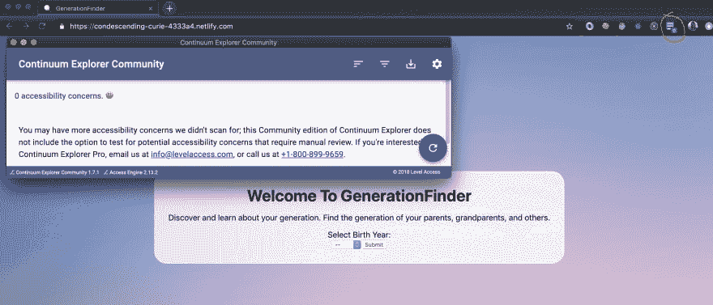
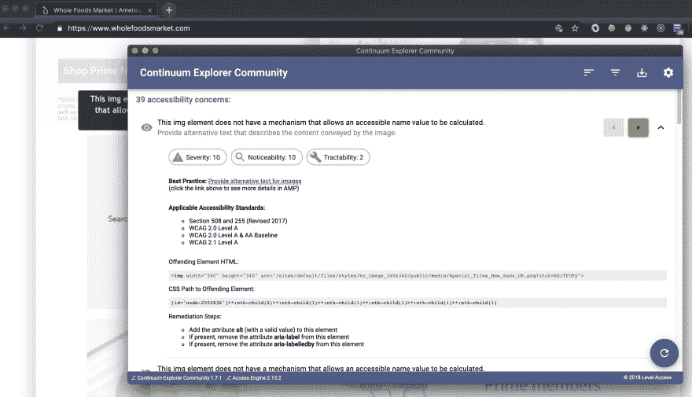
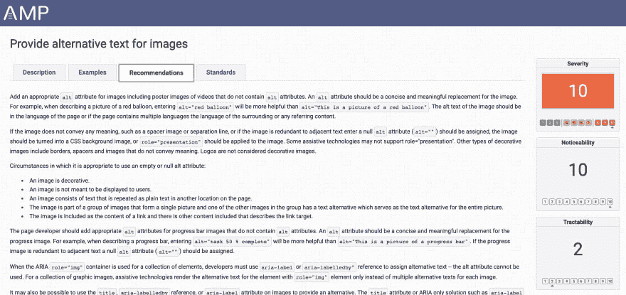

# 所有开发者都需要的 Chrome 扩展

> 原文：<https://dev.to/mollynem/the-chrome-extension-all-devs-need-31j4>

我们知道，从内容到功能再到可访问性，开发者在今天的互联网发展中扮演着至关重要的角色。但是当涉及到我们的激情项目时，我们对可访问性标准有多在意呢？我希望不管项目是什么，关于可访问性标准的尽职调查都是一样的——但是我担心情况可能不是这样。

我之前写过一篇关于 HTML 及其对屏幕阅读器的影响的[帖子](https://dev.to/mollynem/5-ways-your-html-code-affects-a-screen-reader-2cn1)，然后我开始思考更多关于可访问性标准的问题。很容易记住对图像使用 strong/em 标签和 alt 标签——但是对于更复杂的 HTML 元素，我们知道我们是如何影响屏幕阅读器的吗？如果您想要一个没有项目符号的无序列表，该怎么办呢——这个屏幕阅读器友好吗？我想你可以在每次质疑 HTML 选择时做一些研究，但幸运的是，我已经找到了一个有用的 Chrome 扩展来为我们做这项工作。

[Continuum Explorer 社区](https://chrome.google.com/webstore/detail/continuum-explorer-commun/bafnegdlhjhdcmakjaankoogodomfbde?hl=en-US)扩展免费且易于添加到您的 Chrome 浏览器中。在部署到 Heroku/Netlify 之前，我一直使用这个扩展来验证我的激情项目。该工具会扫描网页中的可访问性问题，并给出如何解决任何问题的提示。当我投身到开发人员的职业生涯中时，我发现它非常有帮助和启发性。你永远不知道什么时候你可能会不小心打错一些东西，这可能会阻止屏幕阅读器完成它的工作。可以把这个扩展看作是另一双眼睛来检查你的工作，以确保所有用户都可以解释你的页面并与之交互。

要使用，只需点击浏览器中的扩展图标，该应用程序将扫描您当前的网页，以了解有关可访问性的任何问题。下面，先看一个没有顾虑的页面的例子，接着是一个需要很多帮助的页面！

<figure> 

<figcaption>无错误信息</figcaption>

</figure>

<figure> 

<figcaption>几个待修复错误的错误明细</figcaption>

</figure>

您可以看到，这个扩展在列出错误、严重性方面做得很好，甚至为您提供了一条清晰的路径来识别代码中的违规者。如果您不确定如何解决问题，您可以单击“最佳实践”旁边的链接，转到下面的页面:

<figure> 

<figcaption>有用信息页面了解更多错误</figcaption>

</figure>

这个页面是一个很好的工具，可以让你了解更多关于可访问性标准的知识，并看到一些如何编写屏幕阅读器友好页面的例子。这是该扩展中我最喜欢的部分之一——它不仅告诉你如何修复问题，还提供了一个资源，我可以在那里深入挖掘并了解更多。

我希望你能花时间去探索这个 Chrome 扩展。我发现它在校对我的作品时非常有用。作为开发人员，我们必须时刻注意我们对可访问性的影响。互联网是一个社区、发现、商业、学习等等的地方。无论有没有屏幕阅读器，每个人都应该能够与互联网进行同样的互动。