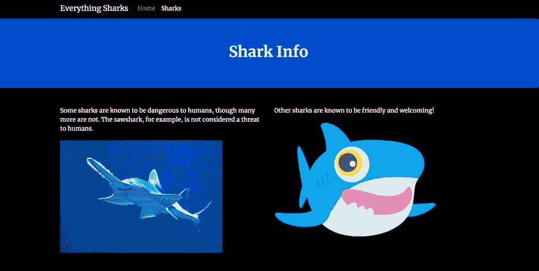

# 数字海洋社区周刊:DNS，Docker，K8s 金丝雀部署等等

> 原文：<https://dev.to/digitalocean/the-digitalocean-community-weekly-dns-docker-k8s-canary-deployments-more-55e>

欢迎来到第二版**[DOCOM 周刊](https://dev.to/t/docomweekly)** ，这是您的每周文摘，收录了在[数字海洋社区](https://digitalocean.com/community)及其周边发表的一些最佳内容。

我是 Lisa，开发人员培训团队的成员，我很高兴能在整个开发人员社区中分享知识。今天的综述包括 DNS 管理、加速 Docker 工作流、用 Istio 和 Kubernetes 部署 canary 等等！

我们将从过去一周数字海洋社区的专题帖子开始:

### [如何在 Ubuntu 18.04 上使用 DNSControl 部署和管理您的 DNS](https://www.digitalocean.com/community/tutorials/how-to-deploy-and-manage-your-dns-using-dnscontrol-on-ubuntu-18-04)

[杰米·斯凯夫](https://www.jamieweb.net/)和编辑[凯瑟琳·汉考克斯](https://dev.to/kathancox)带你了解如何使用 DNSControl 来消除手动 DNS 管理的许多棘手问题。这篇教程是通过我们的[为捐款而写](https://www.digitalocean.com/write-for-donations/)项目发布的，资金将捐给[电子前沿基金会](https://www.brightfunds.org/organizations/electronic-frontier-foundation-inc)。

### [如何使用远程 Docker 服务器加速你的工作流程](https://www.digitalocean.com/community/tutorials/how-to-use-a-remote-docker-server-to-speed-up-your-workflow)

本教程由 [Kamal Nasser](https://dev.to/kamaln7) 撰写，由 [Brian P. Hogan](https://dev.to/bphogan) 编辑，通过演示如何将 Docker 任务卸载到远程服务器，让您的本地机器不必做繁重的工作，帮助您更快地完成工作。

### [如何使用 Istio 和 Kubernetes 进行金丝雀部署](https://www.digitalocean.com/community/tutorials/how-to-do-canary-deployments-with-istio-and-kubernetes)

如果你想用 Istio 和 Kubernetes 构建 canary 部署，你可以通过阅读 Kathleen Juell 的教程来学习如何做。本文将指导您创建一个演示 Node.js 应用程序的 canary 部署，为您自己的工作提供基础。

### 精选 Q & A

我们社区网站的 [DigitalOcean 社区问题](https://www.digitalocean.com/community/questions)部分是一个供您提出开发问题或为他人提供答案的空间。以下是过去一周社区成员心中的一些疑问。

*   一个微滴如何访问另一个微滴并写入文件？
*   [另一个域名指向我的 IP 地址并镜像我的网站](https://www.digitalocean.com/community/questions/another-domain-is-pointing-to-my-ip-address-and-mirroring-my-website)

如果您想了解更多关于云基础设施或软件开发的信息，或者您需要故障排除方面的帮助，[问一个问题](https://www.digitalocean.com/community/questions/new)。

## 数字海洋开启开发

[monty5811](https://dev.to/monty5811) 与 Django 分享了一个关于如何在 DigitalOcean Spaces 上创建对象过期链接的快速教程。

 [## 与数字海洋空间的过期(签名)链接

### 月 5811 年 6 月 12 日 193 分钟读取

#django #digitalocean #python #webdev](/monty5811/expiring-signed-links-with-digital-ocean-spaces-2hck)

在本服务器设置指南中，David Emily 对使用 DigitalOcean Droplets 的远程服务器进行了简要介绍。

 [## 移除 Root 登录和其他第一步

### 大卫艾米丽 6 月 21 日 194 分钟阅读

#ubuntu #beginners #linux](/davidemily/removing-root-login-and-other-first-steps-ubuntu-54le)

## 网络上的数字海洋

[Tom Eyckmans](https://twitter.com/teyckmans) 在这篇文章中详细介绍了如何使用 DigitalOcean 的 Kubernetes 服务建立 KubeRig 环境，**[KubeRig&digital ocean Kubernetes(DOKS)](https://rigel.dev/kuberig-doks/)**。

[Adam A. G. Shamblin](https://twitter.com/AdamAGShamblin) 在他的指南**T3【在数字海洋 T5【在 Kubernetes 上安装 Kong w/ Ingress】中描述了他如何在数字海洋 Kubernetes 上安装 Kong 和 Ingress，以便评估 API 网关平台。**

[Elliot Forbes](https://dev.to/elliot_f) 制作了一个视频，展示了他的数字海洋教程[如何在数字海洋上为 Kubernetes 部署一个弹性 Go 应用](https://www.digitalocean.com/community/tutorials/how-to-deploy-resilient-go-app-digitalocean-kubernetes)。

[https://www.youtube.com/embed/g_-U5jddSuM](https://www.youtube.com/embed/g_-U5jddSuM)

## 更多查看开发者社区

焦虑科技 2019 是科技行业的心理健康会议，于 8 月在纽约市举行。加入 DigitalOcean 自己的 [Frédéric Harper](https://dev.to/fharper) ，了解更多关于心理健康和技术的交集，以及如何在工作中倡导更多的心理健康意识。

前端开发者 Ananya Neogi 最近强调了纯 HTML 可以做的一些令人惊讶的事情。请跟随以下内容，了解有关 unsupenged 标记语言的更多信息:

 [## HTML 能做到吗？

### Ananya Neogi ・ Jun 25 '19 ・ 2 min read

#webdev #html](/ananyaneogi/html-can-do-that-c0n)

* * *

祝你黑客生涯愉快，下周再见！