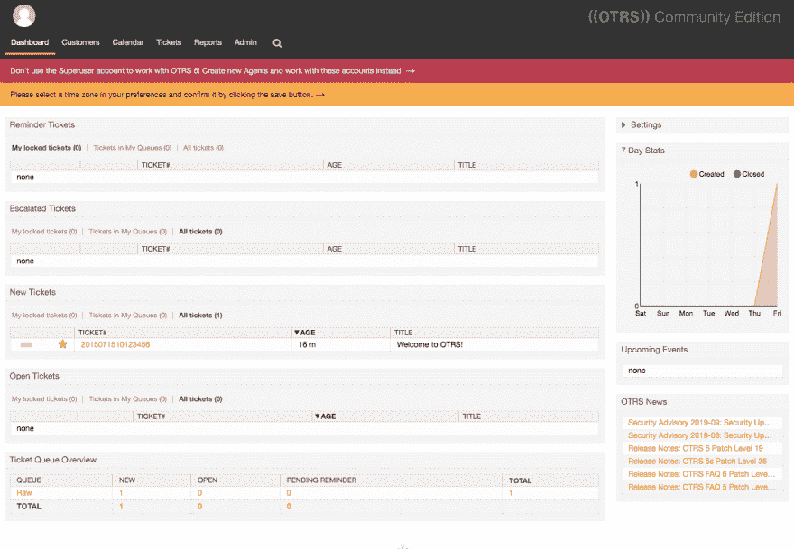

# 数字海洋社区周刊:OTRS、PostgreSQL for Rails、社区更新等等！

> 原文：<https://dev.to/digitalocean/the-digitalocean-community-weekly-otrs-postgresql-for-rails-updates-to-the-community-much-more-23h2>

欢迎来到**DOCOM Weekly**，这是您的每周文摘，收录了上周在和数字海洋社区发布的*和*的一些最佳内容。**

你好！我是马特·考利，社区团队的社区经理。今天的综述包括开源票务请求系统、PostgreSQL for Ruby on Rails、社区的新更新等等！

事不宜迟，以下是本周的特色帖子:

### [如何在 Ubuntu 18.04 上的 Ruby on Rails 应用中使用 PostgreSQL】](https://www.digitalocean.com/community/tutorials/how-to-use-postgresql-with-your-ruby-on-rails-application-on-ubuntu-18-04)

在之前的教程中，我们完成了让 Ruby on Rails 准备好在 Ubuntu 18.04 上运行的步骤。在本教程中，[米切尔·阿尼卡斯](https://twitter.com/thisismitch)和[蒂莫西·e·诺兰](https://twitter.com/d_marmalade)希望通过 PostgreSQL 数据库来支持你的 Ruby on Rails 应用程序。

### [如何在 Ubuntu 18.04 上用 OTRS 设置帮助台系统](https://www.digitalocean.com/community/tutorials/how-to-set-up-a-help-desk-system-with-otrs-on-ubuntu-18-04)

在这个伟大的教程中， [Vadym Kalsin](https://www.digitalocean.com/community/users/neformat) 带我们经历了在你的 Ubuntu 18.04 服务器上运行一个免费和开源的客户票证系统的过程。Vadym 写了这篇文章，作为我们[为捐赠而写](https://www.digitalocean.com/write-for-donations/)项目的一部分，帮助支持[自由软件基金会](https://www.brightfunds.org/organizations/free-software-foundation-inc)。

### [如何在 FreeBSD 12.0 上安装 Apache、MySQL、PHP (FAMP)栈](https://www.digitalocean.com/community/tutorials/how-to-install-an-apache-mysql-and-php-famp-stack-on-freebsd-12-0)

使用由 [Mitchell Anicas](https://twitter.com/thisismitch) 和 [Albert Valbuena](https://www.digitalocean.com/community/users/albertvalbuena) 编写的《FAMP 堆栈安装指南》让你的 FreeBSD 服务器准备好在网络上提供内容——该指南涵盖 Apache、MySQL 和 PHP，是我们[为捐赠而写](https://www.digitalocean.com/write-for-donations/)计划的一部分，并帮助支持[自由和开源基金](https://www.brightfunds.org/funds/foss-nonprofits)。

## 精选 Q & A

这些是上周来自我们社区的一些我们最喜欢的问题(和答案):

*   [无法使用 GitLab CI 部署到 DigitalOcean Kubernetes】](https://www.digitalocean.com/community/questions/unable-to-deploy-to-digital-ocean-kubernetes-using-gitlab-ci)
*   [在 var/www](https://www.digitalocean.com/community/questions/granting-ftp-access-to-one-domain-only-on-a-droplet-in-var-www) 中，仅允许 FTP 访问 droplet 上的一个域
*   [无法使用 s3cmd](https://www.digitalocean.com/community/questions/cannot-setup-digitalocean-space-with-s3cmd) 设置数字海洋空间

参与到社区 Q & A 中来——提出问题并通过提供答案来帮助其他成员！

## 在网络上做

DigitalOcean 社区比我们的社区网站更大，所以这里有一些额外的内容也值得一看:

### [数字海洋云里的卡利 Linux](https://www.kali.org/news/kali-linux-in-the-digitalocean-cloud/)

Thomas d'Otreppe 在 Kali 网站[上写了一篇很棒的博文](https://www.kali.org/),带你了解如何使用 Kali Linux 在 DigitalOcean Droplet 上运行。

### [PowerToFly——如何管理远程团队&在远程友好的文化中茁壮成长](https://powertofly.com/career/live-chats/118116-how-to-manage-a-remote-team-thrive-in-a-remote-friendly-culture)

[PowerToFly](https://powertofly.com/) 主持了一场与我们的工程总监 [Limor Bergman Gross](https://twitter.com/limor_bergman) 的精彩视频聊天，讨论数字海洋如何有效地管理远程团队并确保我们的远程文化繁荣发展。

### [与 DigitalOcean 一起托管 Django 网站](https://www.youtube.com/watch?v=0PJjquyGTOQ)

本周，Mitch Tabian 分享了一段精彩的视频，讲述了用 DigitalOcean Droplet 托管你自己的 Django 网站的全过程。他带你走过从创建数字海洋账户到最终现场的每一步。

[https://www.youtube.com/embed/0PJjquyGTOQ](https://www.youtube.com/embed/0PJjquyGTOQ)

* * *

## 社区更新

作为 DigitalOcean 的社区经理，我看到(并帮助)我们继续开发我们的社区网站，为每个人提供更好的体验。本周，我们为社区网站发布了一系列精彩的新更新，我们希望您会像我们一样喜欢它们！

*   本周，我们改进了教程页面的设计和布局，比如关于如何在 Ubuntu 18.04 上使用 PostgreSQL 和 Ruby on Rails 应用。

    *   教程的目录已经清理，以便更好地处理较长的教程。
    *   右边栏现在根据你当前阅读的内容提供额外的建议教程。
    *   我们做了一些设计魔术来清理空间，使主要教程内容的感觉更具视觉吸引力。
*   在 [Q & A](https://www.digitalocean.com/community/questions) 中的评论线程现在在左手边有垂直的轨迹，这样你可以更容易地在视觉上识别你在回复链中的位置。这方面的一个例子可以从 [Bobby 在](https://www.digitalocean.com/community/questions/why-is-ufw-blocking-https-access-to-nginx?answer=52383)[的回答](https://www.digitalocean.com/community/questions/why-is-ufw-blocking-https-access-to-nginx)中看到，ufw 为什么阻止 https 访问 nginx？。

*   [社区主页](https://www.digitalocean.com/community)上的所有社区团队头像现在都链接到我们的个人资料，因此您可以轻松了解我们的更多信息，并查看我们在网站上的活动。

*   我们还竭尽全力让[社区登录页面](https://www.digitalocean.com/community)表现更好，加载速度更快。

### [market place-Kubernetes 监控栈(BETA)](https://marketplace.digitalocean.com/apps/kubernetes-monitoring-stack-beta)

本周，我们出色的产品和市场团队还在 DigitalOcean Marketplace 上推出了第一款一键式应用，该应用运行在我们的#DOKS 平台上。目前处于测试阶段的 Kubernetes 监控堆栈，提取了集成 Prometheus、Grafana 和 metrics-server 的操作知识，以部署到 DigitalOcean Kubernetes 集群上。

### [由香港崛起的数字海洋孵化](https://events.digitalocean.com/hatch-hong-kong/)

我们杰出的社区团队中的一些人，弗雷德里克·哈珀(Frédéric Harper)和萨曼莎·谢(Samantha Tse)以及 Hatch 团队的许多其他同事将参加下周在香港举行的 RISE 会议。如果您在该地区，我们很乐意向您问好并谈论所有关于创业的事情！

液体错误:内部

* * *

祝你黑客生涯愉快，下周再见！