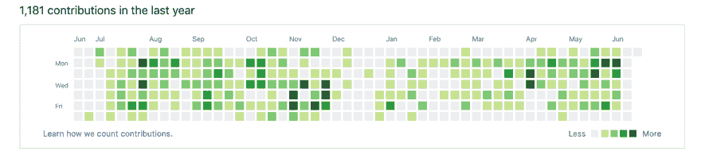

# 决定成为开发者后的第一步

> 原文：<https://dev.to/hellomeghna/the-first-step-after-deciding-to-become-a-developer-and-get-your-first-job-24g6>

这篇文章是专门为那些决心专注于学习编程并提高编码技能以获得第一份技术工作的人写的。任何做出这个勇敢决定的人，离开他们单调或低薪的工作，抓住他们梦想中的技术工作。是的，这是可能的。任何人都有可能！

> 这听起来很棒，谢谢你的激励，但是你是谁来指导我们呢？

我是一名从牙医转为软件工程师的人。

我毕业时获得了印度牙科学士学位。我学习了 5 年，读了很多书。为病人准备假牙时撞到了头。从蜡雕人类牙列中所有牙齿的牙齿解剖，到做根管治疗、拔牙、皮瓣手术，为棘手的正畸患者准备弓杆和锚钩，到用牙科材料修复/填充牙齿，我都做过。对我来说，给病人进行局部麻醉，记录他们的病历是一件平凡的工作。对一些人来说，这听起来很有趣，这就是我 18 岁时报名参加牙科学校的原因。

事情进展缓慢而稳定。我在不同的医院做了几年牙医，写了医学文章，准备了白皮书，作为一个非政府组织的协调员，致力于妇女赋权。然而，事情并没有按照我预期的速度发展，仍然有一些限制，我将在另一篇文章中分享。

所以很快，我决定放弃我的牙科职业，专注于技术领域。

## 为什么？

*   在接下来的几年里，我不想通过上大学来投资学习新技能。

*   我认为这是唯一一个欢迎自学者的行业。其他行业需要相关学位，比如管理。

* * *

所以开门见山地说，我想分享一下当我真的认真考虑要转行时，我迈出的第一步。我非常关注自己的行为，这是我想给刚开始编程之旅的人的两条最重要的建议

1.  *创建 Github 账户*

*   每天推什么学什么。
    *   不管您是否无法从 CLI 完成，创建一个存储库并上传您的简单程序文件。
    *   重要的是养成每天学习和执行这些计划的习惯。
*   显示绿色方框的图表显示了努力工作和激情。它将在网上记录你的旅程。愚蠢的项目，好的项目。

* * *

1.  *创建一个 Twitter 账户*

*   加入 Twitter 上的#100DaysOfCode #CodeNewbie 社区。

    *   我可以自信地说，Twitter 在我的旅程中发挥了很大的作用。我的 feed 里都是我崇拜的人，和我走在同一条路上的人，或者那些刚刚起步的人，这样我就可以提供帮助。
*   当我开始我的旅程时，我选择走自学路线，让我明白这并不容易。在训练营，你会得到更多的中心指导，一个可以遵循的常规，你可以去找的人。但是如果你是一个通过网络资源自学的人，你是在独自学习。

*   有时候你会觉得要放弃(或者可能真的放弃)，觉得自己不属于这里，觉得脑子里什么都没有。但是一旦你浏览推特，你会发现这很自然，也是这个旅程的一部分。有些人能够学得很快，有些人需要相对更多的时间。但是没有人会问你学了多少天的技术来构建一个特定的项目。重要的是每天挑一个概念。试着理解一下。从几个资源中阅读并练习它。

*   编程并不容易。这需要时间！

*   即使有了工作，你也需要每天学习，因为要学的东西实在太多了。当你被录用时，你只会了解这个广阔世界的 10%或 20%，然后你需要继续努力。你要有上进心，有上进心。

*   不要因为想着要覆盖 100%而不知所措。没有人什么都知道。

*   只关注有限的东西，一门编程语言就这样！

*   无论大小，都要靠自己来构建项目。制作作品集，疯狂申请。

* * *

获得开发人员的第一份工作是最难的，但每个人都可以做到！如果我有，你也可以。

练习，坚持，加入到遵循这条路线的人群中，你会感觉不那么孤独，更乐观。