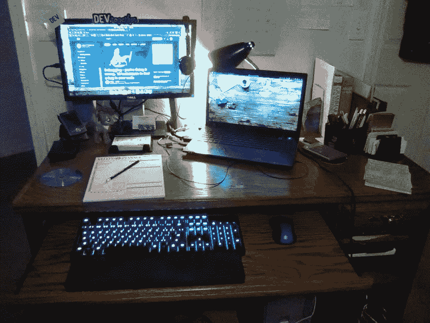

# 我使用的齿轮

> 原文：<https://dev.to/codemouse92/the-gear-i-use-1o6n>

这个帖子给了我灵感...

 [## 我使用的应用程序、工具和装备

### maxence poutord 7 月 23 日 19 分钟阅读

#productivity #developertools #webdev #beginners](/maxpou/apps-tools-and-gear-i-use-7cd)

老实说，我觉得分享这个会是一个有趣的趋势！(使用标签`#mygear`。)所以，这是我的...

# 硬件

*   System76 Gazelle Pro (15 英寸)
*   额外的显示器，这样我可以在一个屏幕上显示代码或手稿，在另一个屏幕上显示研究或文档。
*   **[代码机械键盘](https://codekeyboards.com/)** ，每一点都像宣传的那么牛逼。
*   **罗技 M510** 无线电脑鼠标
*   **JVC HA-NC250** 降噪耳机。这些东西*很棒*，可拆卸的绳子意味着它们会有很长的寿命。
*   TI-89 计算器——我喜欢这个东西！

作为一名作家，我手头也有*《芝加哥文体手册》*、*《作家文摘语法案头参考》*、*斯特伦克和怀特的《文体要素》*。(我通常也会在那里放几本编程参考书。)

是的，在左边，那个*是*一个 Palm 钨 t，它工作了。我用 [JPilot](https://github.com/juddmon/jpilot) 把它同步到我的笔记本电脑上。就手持设备而言，它非常有用，不会让人分心。

我不知道它是否正式算作硬件，但你可以在我的显示器下看到我的医生蹄雕像。他通常只是站岗，但那是我需要做一些橡皮鸭调试时用的。

# 系统

我完全在使用 Ubuntu MATE。我把我的窗口组织成独立的工作区，以帮助减少干扰。

*   Guake 是我日常使用的主要终端，我可以用 F12 调出它
*   **终结者**(或者偶尔[酷复古术语](https://launchpad.net/~vantuz/+archive/ubuntu/cool-retro-term))专用终端环境。
*   我的系统上安装了 Mycroft.ai ，用于定时器、提醒和工作时检查事情。
*   当我需要 VPN 时，我使用 **[ProtonVPN](https://protonvpn.com/)** 。我也用 1.1.1.1 的 T4 作为我的域名。

# [这里](#ide)

我用 **[Visual Studio 代码](https://code.visualstudio.com)** 来做几乎所有的事情，并把它与 C++、Python、Java、HTML、CSS、RestructuredText、Markdown 和 XML 的大量扩展打包在一起。也就是说，无论我在做什么，我都使用:

*   书签
*   括号对着色机
*   代码相似
*   代码拼写检查器
*   评论锚
*   上下文重复
*   缩进-彩虹
*   改写模式
*   雄孔雀
*   重排段落
*   VSCode 大图标
*   瓦卡提时间

我也倾向于根据心情循环播放半打左右的主题。最近用的是海绿主题，LaserWave，和 skGRTT。

# 写作

我几乎所有的写作都是在 LibreOffice 中完成的，尽管我有时会求助于 Focuswriter 或 Visual Studio 代码。

当我真的想要一个不受干扰的环境时，我会拿出我的皇家遗产手动打字机。

# 浏览器

我主要使用 **[勇者网络浏览器](https://brave.com/)** ，用...

*   隐私獾(以防我需要禁用主勇敢护盾)
*   MyWOT
*   Leechblock
*   唱针

有时候，我会求助于 Firefox。

# 生产力

*   **[DuckDuckGo](https://duckduckgo.com) 是我一路的搜索引擎！**
*   **[Hexchat](https://hexchat.github.io/)** 是我的 IRC 客户端，用于连接 Freenode 和 OFTC。
*   我使用 **[Rambox](https://rambox.pro/#home)** 将我所有的其他聊天服务账户集中到一个统一的地方。
*   尽管有几个讨厌的 bug，我还是用 **Evolution** 处理我的电子邮件、日历、联系人和待办事项...
*   同步到我的个人 **Nextcloud** 。
*   **[Simplenote](https://simplenote.com/)** 是我最喜欢的存储笔记的服务。
*   管理和阅读我庞大的电子书库。

# 编码

对于 C++，我使用...

*   C++17
*   LLVM Clang 7
*   海湾合作委员会 8
*   cppcheck
*   CMake

对于 Python，我使用...

*   Python 3.7/3.8
*   文夫
*   点
*   薄片 8
*   我是麦比
*   Pytest
*   强盗
*   黑色

当然，我使用 **Git** 来满足我所有的 VCS 需求。