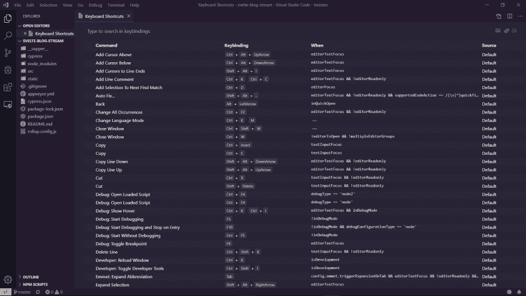

# VS 代码快捷键💻Visual Studio 代码快捷方式指南，更高的生产率和你需要学习的 30 个我最喜欢的快捷方式

> 原文：<https://dev.to/lampewebdev/the-guide-to-visual-studio-code-shortcuts-higher-productivity-and-30-of-my-favourite-shortcuts-you-need-to-learn-mb3>

# 简介

Visual Studio 代码允许您通过命令来访问它提供的几乎所有功能，该命令可通过命令面板或键盘上的快捷方式来访问。

你可能每个工作日工作 8 个小时，希望你能在这些工作时间的大部分时间里编写代码。所以你花了很多时间盯着你选择的代码编辑器。

知道一些捷径可以帮助你更快地完成工作。知道如何更快地找到你需要的文件。运行你的 NPM 命令，你现在就需要，而不是打开一个外部终端。

[](https://i.giphy.com/media/eMxZ6lPl8dW9O/giphy.gif)

# 快捷备忘单

Visual Studio 代码的制作者

*   [窗户](https://code.visualstudio.com/shortcuts/keyboard-shortcuts-windows.pdf)
*   [Linux](https://code.visualstudio.com/shortcuts/keyboard-shortcuts-linux.pdf)
*   [苹果电脑](https://code.visualstudio.com/shortcuts/keyboard-shortcuts-macos.pdf)

你可以下载这些小抄，打印出来，放在你的桌子上作为快速参考，或者在你上班的路上试着学习它们。不要试图一下子学会它们。这需要时间。所以要有耐心，你会全部掌握。

# 按键映射

你是 Vim 用户吗？也许 Emacs 的快捷方式已经印在你的大脑里了？或者，出于某种原因，您使用了 notepad++并且喜欢 notepad++的键盘快捷键😵？

Visual Studio 为你们所有人提供了一个扩展！让我们安装⚛ `Atom Keymap`。我们将在没有我们心爱的老鼠的帮助下(几乎)做到这一点。

1)打开 Visual Studio 代码。

2)打开 Visual Studio 代码后，按下`CTRL+SHIFT+X`。该快捷方式打开扩展列表，并且光标聚焦在搜索栏上。键入下面的`@category:keymaps`。(如果你想知道更多关于扩展是如何工作的，请在下面留下评论！)

3)您现在会看到一个键映射列表。按下`Tab`，然后按下`Down Arrow ⬇`。

4)按下`⬇`，直到您选择了`Atom Keymap`。现在按下`Enter`。

5)遗憾的是，我找不到选择安装按钮的方法。你现在需要 click🖱！

你可以为你能想到的几乎每一个编辑器找到一个键映射。安装你最喜欢的，你有你的快捷方式！酷吧？

# 键盘快捷键设置(JSON)

有多种方法可以查看键盘快捷键设置。其中之一是通过图形界面或者也可以选择使用通过 JSON 文件来编辑的快捷方式。

## 图形界面

我们可以通过按下`CTRL+k`打开图形界面，然后按住`CTRL`你应该按下`CTRL+s`。

[](https://res.cloudinary.com/practicaldev/image/fetch/s--_8rtHdyE--/c_limit%2Cf_auto%2Cfl_progressive%2Cq_auto%2Cw_880/https://thepracticaldev.s3.amazonaws.com/i/3etyosi4ljtp1d9lvk5i.png)

顶部有一个搜索栏，您可以在其中搜索想要检查的命令或键盘快捷键。这些对话框在 Visual Studio 代码中看起来很相似，你会开始经常看到它们。

你可以看到四列。让我们过一遍。

* Command:Visual Studio 代码执行的操作。

*   组合键:你要按下执行动作的组合键。

*   When:这是一个针对 Visual Studio 代码的筛选器，它告诉 Visual Studio 代码快捷方式是否应该在该上下文中可操作。一些过滤器可能是集成终端、源代码中的错误等等。

*   源代码:Visual Studio 代码可以通过多种方式了解快捷方式。最常见的是`Default`这些是 Visual Studio 代码自带的命令。`User`顾名思义就是建议用户创建的命令。第三种方式是通过`Extension`。扩展作者也可以决定添加快捷方式。如果你最喜欢的快捷方式不起作用，这可能是它停止工作的原因之一。

要更改键绑定，双击该行，会弹出一个模式。然后按下你想要的组合键并点击`Enter`。

## 键绑定 JSON 文件

现在我们知道了它的键绑定一般是如何工作的，让我们看看`keybindings.json`文件。

其中有两个默认的`keybindings.json`和用户特定的`keybindings.json`文件。按下`CTRL+SHIFT+P`或`F1`打开命令托盘并输入`keyboard shortcuts`你现在应该在你的命令托盘中看到至少两个条目。

*   首选项:打开默认键盘快捷键(JSON)。这是一个文件，Visual Studio 代码在其中存储所有默认快捷键，并在底部列出未使用的可用快捷键。我会避免在这里改变它们。

*   preferences:Open Keyboard shortcut s(JSON)
    这是一个用户特定的键绑定文件，您应该编辑这个文件。一开始，它只是一个空数组，仅此而已！

要在 JSON 文件中添加快捷方式，你只需要添加一个如下所示的对象:

```
[
    {
        "key": "CTRL+ALT+P",
        "command": "git.pull",
        "when": ""
    }
] 
```

您需要指定密钥和命令。`when`告诉 Visual Studio 代码应该在哪里运行这个命令。如果你让它空着，它会到处找它。我们在上一部分谈到了这一点。

# 有用的快捷键

## 打开命令调色板

你已经知道这个了，但也许你跳过了这一部分😉

*   这将打开 Visual Studio 代码中最强大的功能。命令选项板。只要键入你认为你想要的，它仍然会找到它！

## 打开和关闭侧边栏

有时候你想有更多的水平空间，侧边栏就挡住了你的路！只要按下

*   `CTRL+B`

您可以打开和关闭侧边栏

## 进入禅宗模式

你像 Visual Studio 代码里的什么 Zen Mod？是的，它是内置的！
为此，您需要按:

*   `CTRL+k`，放开两个键，按下`z`。

这将打开和关闭禅宗模式。

## 聚焦综合终端

我最喜欢的特性之一是 Visual Studio 代码中的集成终端。我 99%的时间都在用它！因此，要快速打开或关闭它，您需要按:

*   `CTRL+j`

这将打开集成终端并将光标聚焦在其中。如果你再次按下它，它将关闭，你的光标回到原来的位置。

## 搜索项目中的文件

Visual Studio 代码有很好的文件搜索内置功能。当您使用远程扩展时，它也非常快。要打开它，您只需按:

*   `CTRL+p`

这将打开一个对话框，你可以看到你最近打开的文件，这是非常好的。它还支持模糊搜索。这意味着你可以键入任何单词，它会在文件的路径中查找。所以你不必精确！这种对话还支持更多的东西。像`go-to line`或调试和更多的功能！如果你想知道更多，请在下面评论。

## 切换到最近打开的工作区

你在微服务架构下工作，需要一直切换文件夹？因为你不用单声道回购？我有捷径给你！新闻:

*   `CTRL+r`

这将打开一个对话框，其中列出了最近打开的工作区/文件夹。
额外提示:如果你在对话框中点击`CTRL+ENTER`，Visual Studio 代码会在一个新窗口中打开它。

## 拆分你的编辑窗口

人们喜欢 vim，因为在编辑器中很容易划分视图。Visual Studio 代码也内置了这一点。只要按下

*   `CTRL+\`

创建两列或

*   `CTRL+k`，放开`k`按住`CTRL`按下`\`

创建新行。第二个听起来很难，但是一旦它进入你的大脑，你就会知道如何改变或创造新的捷径😉

## 焦点编辑窗口

既然您已经知道了如何拆分编辑器窗口，那么您还需要学习如何在这些视图之间快速切换。这非常简单，并且有一个默认的键绑定。你需要按

*   `CTRL+[1-9]`

这意味着你需要按下`CTRL`加上你想要关注的窗口的编号。对于第一个按下`CTRL+1`和第二个窗口`CTRL+2`，你得到的想法很容易吧？

## 关闭当前编辑窗口

现在您打开了太多的编辑器窗口，您想关闭它们。这可以通过按压快速完成

*   `CTRL+w`

这将关闭当前打开的窗口。

## 仅关闭已保存的编辑窗口

有时候你打开了太多的编辑器，以至于你不知道什么被保存了。是的，我知道你可以在标签栏中看到这个点，但是，对你来说要集中精力找到正确的文件还是太难了。Visual Studio 代码支持您！只要按下

*   `CTRL+k`然后放开`CTRL`和`k`，按下`u`

这将保存所有窗口，以便您可以检查未保存的窗口并保存它们。

## 打开一个新文件

你需要一个新文件来勾画一些代码？或者，您需要为您喜欢的项目创建一个新文件？压

*   `CTRL+n`

这将打开一个新的编辑器。

## 更改当前文件的语言

您想要在当前文件中切换所选语言，因为您想要的是`Javascript (react)`而不是`Javascript`？压

*   `CTRL+k`然后放开`CTRL`和`k`并按下“m”。

这将打开一个新的对话框，您可以在其中搜索您想要的语言。

## 去行

现在让我们稍微关注一下如何使编辑变得更容易。在第 1042 行有一个错误(如果您文件很长，这就是问题所在)。你不想滚动！压

*   `CTRL+g`

这将打开一个对话框，您需要输入想要跳转到的行号。这一点，结合`CTRL+p`可以非常强大。

## 去符号

你的第一个问题是，什么是象征？在编程语言中，符号通常是变量。在 CSS 中，它们是选择器。看对话新闻

*   `CTRL+SHIFT+O`

这将打开一个对话框，显示当前文件中可用符号的列表。

*   `CTRL+t`

您看到一个只有一个`#`的对话框，您需要键入您想要的符号，如果您使用的语言支持，Visual Studio 代码会在 hole 工作区中搜索该符号。所以你需要自己检查一下。

## 上下移动一行。

有时候你需要把你在`if`中的那条线移出来，或者只是移动一条线，因为它被提前调用了。你可以通过按

*   `Alt+Down`

将当前选定的行下移一行

*   `Alt+Up`

将当前选定的行上移一行

## 复制当前行

你想用一些变量填充数组，但是你懒得写一个循环。那么如何填充`array[0]` `array[1]`和`array[2]`？通过复制第一行两次，只改变你需要的。对新闻界来说

*   `ALT+SHIFT+Up`

这将复制当前选定的行，并将其粘贴到上面的一行中

*   `ALT+SHIFT+Down`

这将复制当前选中的行，并将其粘贴到
下的一行中(该快捷键在这里会很方便)

## 显示一个建议

Visual Studio 代码有内置建议。大多数时候它会自动弹出，但有时不会，你真的需要它。放松，记者

*   `CTRL+Spacebar`

这将打开建议对话框

## 注释掉当前选择

有时你需要隔离代码并注释掉它周围的一切。压

*   `CTRL+/`

如果你选择了多行，它会把它们注释掉。如果你没有选择任何东西，它只注释掉那一行。

## 选择多行代码

要注释掉代码块，需要选择多行。这是通过按压完成的

*   `CTRL+Shift+Up`

从当前行开始选择并向上移动光标。

*   `CTRL+Shift+down`

从当前行开始选择并向下移动光标。

## 折叠和展开您的代码

你有这个很大的功能，但你真的看不到它了，因为它太大了，需要重构，但你没有时间，所以你想忘记它？您可以折叠和展开代码，这样 100 行代码中就有 1 行代码。去做记者

*   `CTRL+SHIFT+[`

折叠(隐藏)代码

*   `CTRL+SHIFT+]`

展开(显示)代码

## 剪一条孔线

对于这一项，您不能选择任何代码。压

*   `CTRL+x`

这将在未选择任何内容时剪切整行。

## 缩进/突出行

人们通常知道如何缩进代码。你可以通过选择你想要缩进的代码并按下

*   `Tab`

想按多少次 Tab 键就按多少次，这样你就觉得好看了。你知道你可以超越吗？将代码从右向左移动？你可以通过按压来完成

*   `SHIFT+tab`

# 结论

有更多的捷径。这些快捷方式是我最常用的。我希望这有助于您了解 Visual Studio 代码中的快捷方式，并且您现在可以创建自己的快捷方式。

我是否忽略了一个每个人都需要知道的有用命令？你错过了什么吗？有什么不清楚的吗？
请写评论。我会尽我所能回答你所有的问题！

**👋说你好！**[insta gram](https://www.instagram.com/lampewebdev/)|[Twitter](https://twitter.com/lampewebdev)|[LinkedIn](https://www.linkedin.com/in/michael-lazarski-25725a87)|[Medium](https://medium.com/@lampewebdevelopment)|[Twitch](https://dev.to/twitch_live_streams/lampewebdev)|[YouTube](https://www.youtube.com/channel/UCYCe4Cnracnq91J0CgoyKAQ)