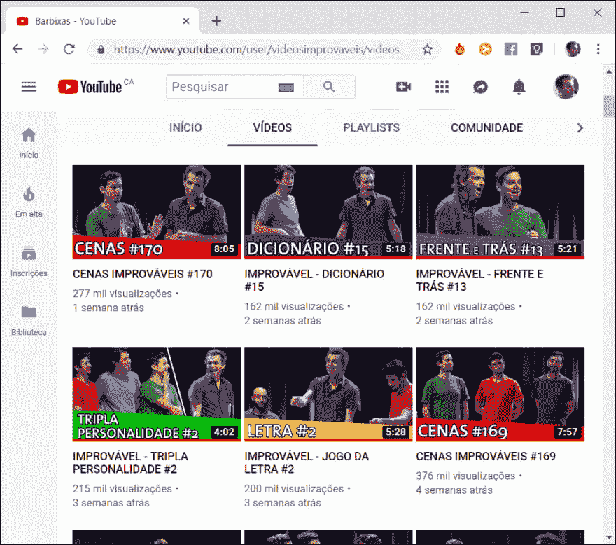

# UX 的影响

> 原文：<https://dev.to/wbgneto/the-impact-of-ux-24ko>

这是 YouTube，世界上最大的公司之一谷歌拥有的视频流。

起初，你可能看不出什么问题，但有一个很大的错误，他们在一个最重要的设计原则上做得很差，**对比**。

我记不清自己浏览了多少次那个频道的新视频，最后只能看重复的视频。当你花了 30 秒钟看一个视频，然后意识到你已经看过了，这是非常令人沮丧的。

进度条的颜色和缩略图背景几乎一样，这样的错误会给用户带来令人沮丧的体验。YouTube 可以简单地通过在进度条上添加边框或者当缩略图有相似的颜色时改变进度条的颜色来解决这个问题。

这只是一个小例子，说明了 UX 设计如何影响你，以及为用户提供一个完美的体验有多难。