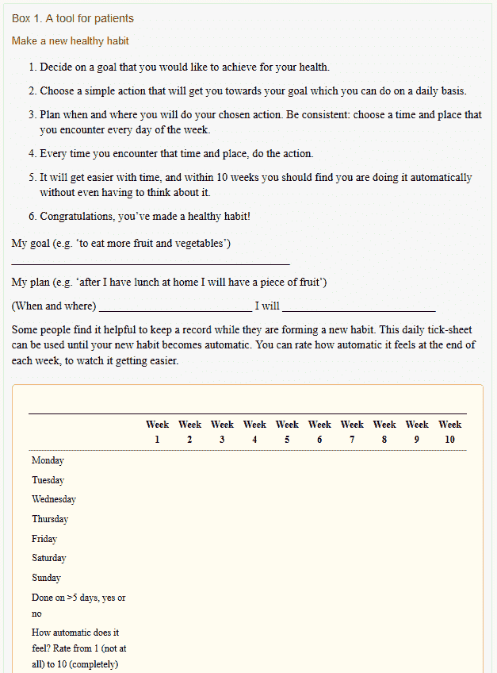

# 习惯的重要性

> 原文：<https://dev.to/rachelsoderberg/the-importance-of-habit-2jdn>

### 什么是习惯？

伦敦大学学院将习惯定义为“因为在过去经常进行而自动进行的行为。这种重复在情境(线索)和行为(行为)之间产生了一种心理关联，这意味着当遇到线索时，行为会自动执行。自动性有几个组成部分，其中之一是缺乏思考"--[养成一个习惯需要多长时间？](https://www.ucl.ac.uk/news/2009/aug/how-long-does-it-take-form-habit)。

从本质上说，习惯是一项任务或行为，我们无需有意识地去完成它。我们每个人都有几十个有益的习惯，我们每天都不假思索地去做——刷牙、洗澡、穿衣服、做早餐、开车，甚至可能是一些日常工作。我们甚至可以通过适当的时间安排和专注来建立良好的基于目标的习惯，就像我们正在学习的语言的日常练习——口语或编程、冥想或练习。

但是习惯也是有害的——在闹钟响的时候打盹太多次，滚动社交媒体太频繁或太长时间(尤其是在睡觉前)，吸烟，拖延，或者在电视节目中漫不经心地看完一整袋薯条。我们甚至可能会有一些坏习惯，比如咬指甲、吮吸拇指或捻头发，这些习惯会在我们焦虑和/或无聊时突然出现。

### 习惯需要时间

比方说，我想养成每天练习法语的习惯，这样几年后当我去那里旅行时，我就能说得更流利了。你知道我要多久才能养成一个习惯，直到它变成一个自动的过程吗？(我不是考虑流畅度，这里只说习惯本身)

许多人会说，养成一个牢固的习惯需要 21 天或 3 周的时间，因为这是我们一直被告知的(我们可以为此感谢 20 世纪 60 年代的心理网络学家！).这实际上只对一小部分人正确。2009 年，英国癌症研究健康行为研究中心的 Phillippa Lally 和他的同事们完成了一项研究，显示了 18 到 254 天的更大范围- [习惯是如何形成的:模拟现实世界中的习惯形成](https://onlinelibrary.wiley.com/doi/abs/10.1002/ejsp.674)。研究小组由 96 名志愿者组成，仅持续了 12 周(84 天)，但将结果与渐近曲线进行匹配，可以让他们估计更远的自动性范围。

换句话说，我必须有意识地在长达 9 个月的时间里每天留出时间来练习法语，然后我会突然发现自己在不知不觉中为法语课推出了 Duolingo 或 Pimsleur。

### 如何养成习惯

养成一个新习惯并不总是像“我要每天都做这件事，直到我自动做到为止”那样简单，有时很难记住去做你想做的事情！《英国全科医学杂志》为想要养成新的健康习惯的患者提供了一个小小的记录模板——[让健康成为习惯:【习惯形成】的心理学与全科医学](https://www.ncbi.nlm.nih.gov/pmc/articles/PMC3505409/)

你可能会从模板中注意到，计划一个一致的时间和地点有助于建立一个牢固的习惯，比如“早餐前”或“下班后”对于我们这些超级电子表格迷来说，我们甚至可以使用每日“自动感觉”评级来创建我们自己的图表，显示我们建立习惯的速度，从而在个人层面上重现拉里的研究！

从中最大的收获是，培养习惯需要有意识地决定去培养习惯，也需要自律和经常练习。它必须成为你日常生活的一部分，并且最好在每天的同一时间发生，这样它才能真正成为你新的日常行动的一部分。

### 打破习惯呢？

正如我前面说过的，不是所有的习惯都对我们有益，有些习惯最好忘记...但是这和培养一个新习惯一样具有挑战性，并且需要同样长的时间。

布莱克莫尔在他们的文章[中提出了一些有助于打破习惯的建议，打破一个习惯到底需要多长时间？](https://www.blackmores.com.au/everyday-health/how-long-does-it-really-take-to-break-a-habit)。用新的积极的习惯取代坏习惯被认为是改变行为的最简单的方法之一。渴望可能会随着替代的积极刺激而消退，也可以增加你对习惯的意识，所以更容易在行动中抓住你自己。一些人使用工具来帮助打破他们的强硬习惯，如咬指甲和吮吸拇指的手套或戒烟的尼古丁贴片。大多数设备都带有应用程序，这些应用程序会在一段时间后或几个小时后切断你的社交媒体。

重建《英国全科医学杂志》的培养习惯记录模板也有助于打破坏习惯。这些步骤可以更改如下:

1.  决定你想打破哪个习惯来改善你的健康或日常生活
2.  选择一个简单的行动来转移你对习惯的注意力，你可以每天(或者根据需要更频繁地)这样做
3.  计划何时以及如何执行你选择的行动。保持一致:选择你一周中每天都会遇到的场景
4.  总是执行选择的行动来代替习惯
5.  随着时间的推移，它会变得更容易，在 10 周内，你应该会发现你正在做选择，而不是坏习惯，而不必去想它。
6.  恭喜你，你已经改掉了一个坏习惯，或者用一个健康的新习惯取代了一个不健康的习惯！

日线图甚至还能派上用场，它可以追踪替代方案的自动化程度，以及你发现自己仍在执行原来的坏习惯的频率。失败没有错，诚实面对失败只会让你在未来更加清醒。

* * *

我一直试图每天早上做法语课，但我倾向于跳过周末，因为这通常是我早上通勤的填充物(我不在周末通勤)。这使得它很难成为一种完全自动的行为，尽管一旦我上了公交车，我往往会毫无问题地翻到 Duolingo 上几堂课。

你有什么一直在养成的习惯吗？打破怎么样？我希望你能在下面分享它们！