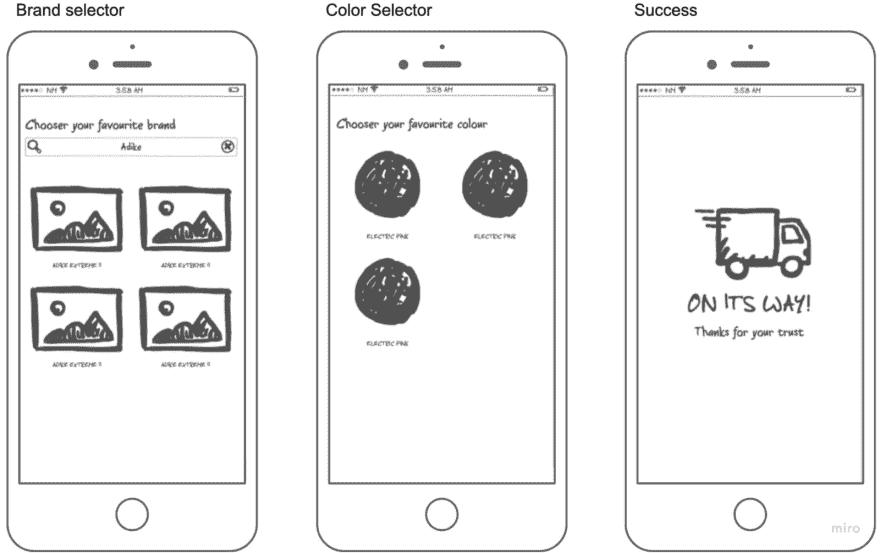
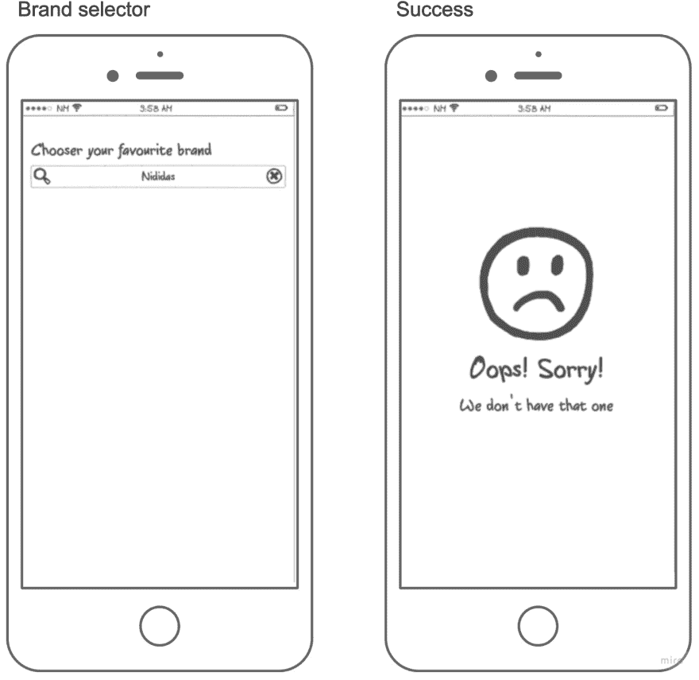
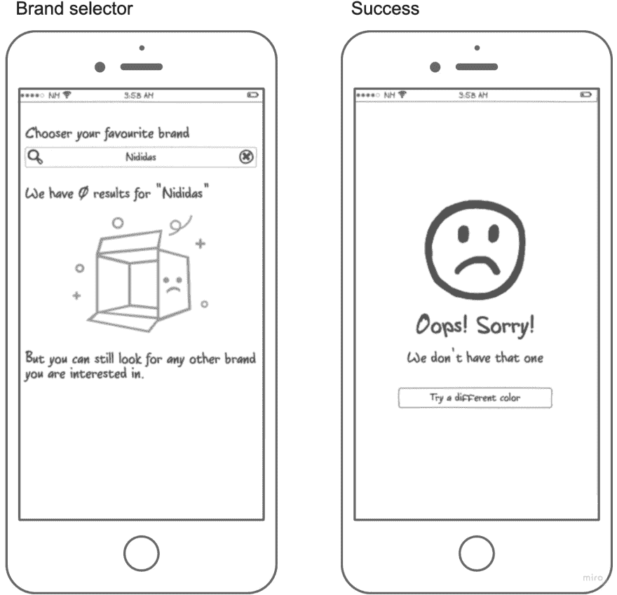
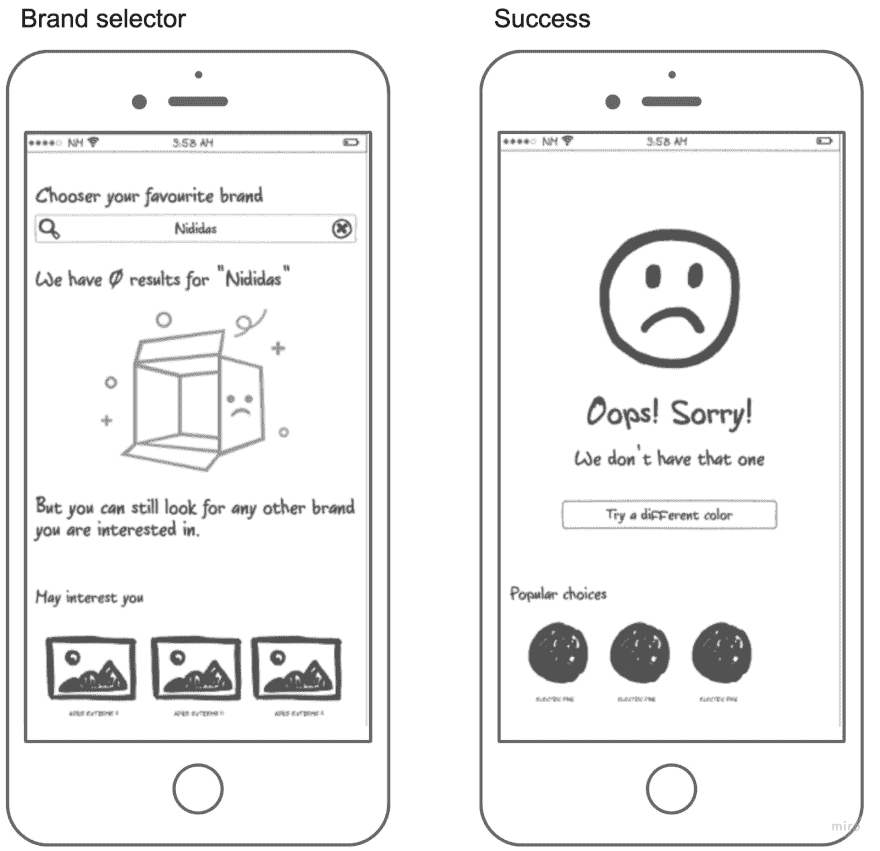

# 空状态在应用程序中的重要性

> 原文：<https://dev.to/mfco/the-importance-of-the-empty-state-in-your-application-3bkl>

## 今天我们要卖鞋子

假设我们正在开发一个应用程序，该应用程序的主要目的是销售鞋子，该在线销售工具有两个主要的用户选择:

*   *寻找你想要的鞋子:*用户可以在搜索栏中输入鞋子的品牌。

*   *为你的产品选择一种颜色:*在选择了一双鞋后，用户必须选择他喜欢的颜色。
    这是一个非常简单的应用程序，但是我们将看到如何通过意识到我们可能产生的空状态来迭代改进它。

## 完美流畅

在一个完美的情况下，我们的用户将输入他喜欢的品牌，然后他将想象一双鞋。他会选择一个他喜欢的，然后他会选择一种颜色，然后进入成功屏幕。

<figure>

<figcaption>Wireframe for perfect flow</figcaption>

</figure>

但是有一点我们没有考虑到:如果最初的搜索没有结果，会发生什么？如果我们的用户选择的特定鞋子/颜色组合没有库存怎么办？

## 并非一切都是完美的

作为第一个解决方案，如果没有任何产品与用户的查询匹配，我们可能会决定不在第一个屏幕上显示任何结果来解决第一个问题。同时，第二个确实有问题，因为此时用户已经做出了两个选择，我们需要告诉他没有股票。

<figure>

<figcaption>Wireframe first solution</figcaption>

</figure>

现在我们进入了真正的问题，空状态，这是一个非常糟糕的管理空状态的方式，在选择器屏幕上用户没有反馈，这真的很糟糕，因为用户可能会感到困惑，不知道他是否需要等待什么，或者他甚至可能认为应用程序崩溃了。在第二个屏幕中，我们告诉用户哪一个是问题，但是他将会面临这样的感觉:“我所做的一切都丢失了”。但更重要的是，在两个屏幕中，除了关闭应用程序，没有明确的下一步操作。

## 引导穿过空虚

是时候让这个空荡的州华丽起来了。作为第一次迭代，我们需要为用户添加一些清晰的反馈，在这种情况下，用户知道发生了什么是很重要的，更重要的是，他需要理解我们的应用程序不是无用的，他可以继续使用它。

<figure>

<figcaption>Wireframe adding some actions in the empty state</figcaption>

</figure>

首先，我们可以在选择器中添加视觉反馈，让用户清楚刚刚发生了什么，除此之外，我们还应该向用户解释如何继续。在这种特殊情况下，搜索栏仍然显示在同一个屏幕上，我们可以简单地告诉他们使用它。

但在成功屏幕中却不是这样，因为我们所有的选择都从我们的屏幕上消失了，在这种情况下，我们可以更积极地添加一个按钮来返回到上一个阶段，这样用户就不会觉得他的所有进展都丢失了。他离拿到鞋子还有两公里远。

这两种解决方案有一些共同点，我们“撤销”最后一步，并要求用户重新做，但有时我们可以从空虚本身向前引导。

## 指引到更光明的下一步

有时，我们可以为用户节省时间，也可以通过向他们展示不同的选择来引导他们进行下一步，从而更接近转化。这样，他们就不需要每次选择一个可能导致空虚状态的选项时都重复上一步，我们也给了他们安全感，让他们相信这个选择会给他们带来想要的结果。

<figure>

<figcaption>Wireframe adding recommendations</figcaption>

</figure>

在我们的应用程序中，第一个屏幕的有效性将取决于我们的系统如何推荐类似的鞋子。如果我们能得到一个好的推荐，我们可能不会失去一个用户。在第二个屏幕中，更多的是显示他们已经选择的产品的快速购买，在一天结束时，这两个新增功能都试图让用户向前迈出一步，而没有重新做一步的摩擦。

## 结论

空状态很重要，你可能会失去客户，因为你的空状态是一个死胡同，没有关于如何继续的行动/解释。我们不应该忘记挫折是一个常见的衰退原因，还有什么比不知道如何继续下去更令人沮丧的呢？