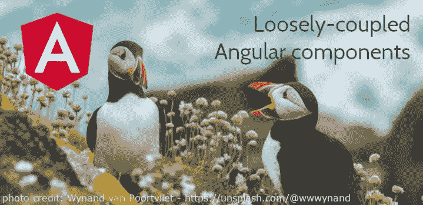

# 松散耦合的角组件的乐趣

> 原文：<https://dev.to/frametrain/the-joy-of-loosely-coupled-angular-components-hj1>

[](https://res.cloudinary.com/practicaldev/image/fetch/s--t72u2c7j--/c_limit%2Cf_auto%2Cfl_progressive%2Cq_auto%2Cw_880/https://www.frameworktraining.co.uk/assets/components/phpthumbof/cache/framework-training-angular-javascript-tutorial-dev-to.7031f067f115e0b2dfc1100c7053a55d.jpg)

我们的 JavaScript 大师 John 已经收集了一个很好的小例子，看看以松散耦合的方式进行通信的 Angular 组件如何处理变化。这篇文章着眼于灵活的**组件通信**方法，我们希望它能激发你的想象力，让你知道如何在自己的应用程序中应用这些方法。

## DNA 序列应用

*   这个小应用程序创建了 DNA 中四种化学碱基的序列:腺嘌呤(A)、鸟嘌呤(G)、胞嘧啶(C)和胸腺嘧啶(T)。

[https://stackblitz.com/edit/angular-dna?embed=1&view=preview&](https://stackblitz.com/edit/angular-dna?embed=1&view=preview&)

*   数据是包含四个基数的对象数组。

```
const fourBases = [
    { name:"adenine", code:"A" },
    { name:"guanine", code:"G" },
    { name:"cytosine", code:"C" },
    { name:"thymine", code:"T" }
]; 
```

*   app 包含两个组件， **base** 和 **draw** 需要以某种方式进行通信。
*   我对遗传学一无所知。内容纯粹是探索 Angular 的载体。

## 基地

*   **垒位组件**每秒随机选择一个垒位

```
private base = null;

constructor() {
    interval( 1000 ).subscribe(n => this.setBase())
}

setBase() {
    let n = Math.floor(Math.random()*this.fourBases.length);
    this.base = this.fourBases[n];      
} 
```

*   模板显示选定基础的名称。
*   **安全航行操作员** ( *基地里的问号后缀？。name* 避免了竞争条件，因为属性基础最初为空。

```
<!-- Example base: { name:"adenine", code:"A" } -->
<section>{{ base?.name }}</section> 
```

## 序列

*   draw 组件显示一系列碱基，使用指令的 **ngFor 迭代数组。**

```
<span *ngFor="let base of sequence" [ngClass]="base.name">{{ base.code }}</span> 
```

*   因为 CSS 包含匹配基本名称的规则，所以 **ngClass** 样式可以工作。

```
.adenine{  background-color: blue; }
.guanine{  background-color: sienna; }
.cytosine{ background-color: orangered; }
.thymine{  background-color: forestgreen; } 
```

## 让我们谈谈:输入&输出

*   这两个组件需要通信。
*   每秒钟**碱基组件**挑选一个需要添加到**抽取组件**序列中的碱基。
*   如果两个组件共享一个**共同的父组件**，默认的解决方案是使用**输入和输出**。
*   基础组件定义并输出一个**自定义事件**。

```
@Output() changeBase: EventEmitter<any> = new EventEmitter();

this.changeBase.emit( this.base ); 
```

*   父模板**监听 changeBase 事件**并调用它自己的类中的方法来构建序列。

```
<base (changeBase)="buildSequence($event)"></base> 
```

*   buildSequence 方法将碱基添加到其序列中。ES6 spread 操作符推送对象的*副本*以避免*引用复制*错误。

```
 private sequence = [];

  buildSequence(base) {
    this.sequence.push({ ...base, code: base.code })
  } 
```

*   父模板将序列作为输入传递给 draw 组件。
*   序列数组的长度每秒都在增长。

```
<draw [sequence]="sequence"></draw> 
```

*   绘制组件定义了一个输入。

```
@Input() dnaSequence; 
```

## 调解人

*   代码以一种松散耦合的方式工作。
*   Base **输出事件**而不知道谁在监听。
*   Draw **inputs** 一个增长序列，而不知道它的父序列是谁。
*   这两个组件共享一个共同的父组件，该父组件作为一个**中介**在其模板中传递它们之间的数据。

```
<base (changeBase)="buildSequence($event)"></base> <draw [sequence]="sequence"></draw> 
```

## 微笑着服务🙂

*   但是当我们**改变**项目的结构时会发生什么呢？如果没有一个**共同的父代**，这种方法就行不通了。
*   我们*可以*通过**中间组件**将@输入传递给它们的后代。然而，随着项目的增长，这可能会变得冗长和不灵活。
*   更好的解决方案是使用一个**服务**作为两个组件之间的**中介**。
*   服务以松散耦合的方式工作。Angulars 的**依赖注入** (DI)实例化一个服务，并通过它的构造函数将服务传递给每个组件。
*   这是第一次尝试创建碱基序列的服务。

```
export class MessageService {

  private sequence = [];

  addBase( base ) {
    this.sequence.push( {...base} );
  }

  getSequence() {
    return this.sequence;
  }
} 
```

*   然而，这个服务没有提供一种方式让**通知监听器**序列已经改变。

## 可观察的对象

*   一个可观察的主题解决了这个问题。基本组件可以向流中添加值。发生这种情况时，绘图组件会得到通知
*   这为**以松散耦合的方式在组件间传递消息**提供了一个理想的机制。

```
export class MessageService {

  private channel = new Subject<string>();

  constructor() {}

  sendMessage(s: any) {
    this.channel.next(s);
  }

  getChannel() {
    return this.channel.asObservable()
  }
} 
```

*   基本组件向服务发送消息。

```
constructor(private ms:MessageService) {}

setBase() {
    this.ms.sendMessage( this.base );
} 
```

*   draw 组件作为侦听器订阅可观察的流，并被服务通知更改。

```
constructor(private ms:MessageService) {}

setBase() {
     this.ms.getChannel().subscribe( base => this.sequence.push({...base}))
} 
```

*   服务成为两个组件之间的中介。
*   所有的输入和输出代码都可以删除。
*   这些组件不需要共享一个公共父组件。
*   即使项目被重构到不同的组件层次结构中，代码仍然可以继续工作。

## 可观察的清理

*   可观测量不是角核的一部分。如果 draw 组件实例被破坏，订阅代码将继续运行，导致**内存泄漏**。
*   我们需要存储一个对可观察对象的引用，然后在 **onDestroy** 生命周期方法中清理。

```
this.subs = this.ms.getChannel().subscribe( ....

ngOnDestroy() {
    this.subs.unsubscribe();
} 
```

## 替代品？

*   本文比较了输入/输出与作为组件间中介的服务的相对优点。有其他值得考虑的方法吗？

## 本地存储

*   浏览器提供了 **localStorage** 用于读写持久的特定于域的字符串。
*   我们可以使用 localStorage 在组件之间共享碱基序列。

```
// Base component
localStorage.bases = JSON.stringify( this.bases );

// Draw component
this.bases = localStorage.bases ? JSON.parse( localStorage.bases ) : [] ; 
```

*   然而，这种方法没有利用 Angular 框架为组件通信提供的机制。
*   并且最终用户可以从浏览器控制台在中间应用中容易地删除/破坏本地存储。

```
localStorage.bases = "rubbish"; 
```

## Redux

*   Redux 提供了一个存储，整个应用程序可以以松耦合的方式与之通信。
*   基本组件可以在选择新的基本组件时分派一个动作。

```
export const BASE : string = "base" ;
export let setBase = ( b ) => ({ type: BASE, data: b }) ; 
```

*   reducer 函数处理动作并更新 Redux 存储。
*   Redux 存储将任何更改通知给侦听器。
*   绘制组件包括监听存储更改的代码。

```
constructor(@Inject(BaseStore) private store:Redux.Store<Base>) {
this.store.subscribe(() => this.sequence = this.store.getState().sequence ); 
```

*   像服务中介一样，这种方法避免了连接输入和输出的需要，并创建了一个松散耦合的架构。
*   Redux 需要一些额外的设置，增加了代码的复杂性。
*   但它确实通过 Chrome Redux 扩展提供了一套有用的调试工具。

## 总结

*   组件是角度应用的基本构件。定义组件之间清晰的通信渠道是该过程的重要部分。
*   这里我倾向于使用服务作为两个组件之间的中介。这提供了一个轻量级的松散耦合的解决方案，它将随着项目的变化而继续工作。

## 关于我们一点

框架培训有限公司是一家总部位于英国的面对面技术培训提供商。我们拥有一个优秀的领域专家家族，涵盖了关键学科，包括 JavaScript、C#、Python、Scala 等语言的软件开发。我们还专注于 DevOps 平台和技术、数据科学、敏捷方法和安全应用程序开发。这是我们的[棱角训练课程](https://www.frameworktraining.co.uk/courses/coding/javascript-js-libraries-frameworks/angular-training-course)大纲，让你了解我们在做什么。

我们很想知道您对本教程的看法，并欢迎您提出问题。