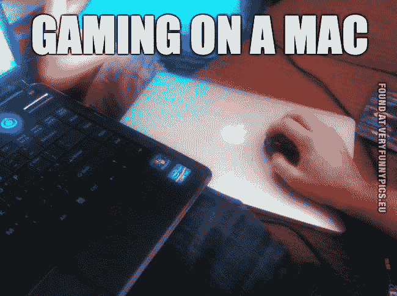
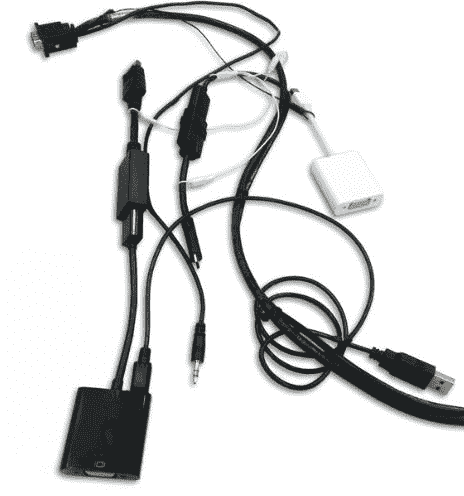
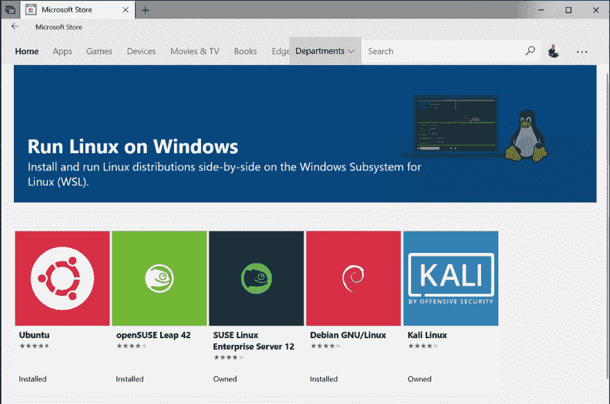

# Windows 开发的“Mac 家伙”指南

> 原文：<https://dev.to/jimboslicethat/the-mac-guy-guide-to-windows-development-4m5c>

从那以后，我一直在 2016 年的 Macbook Pro 上写 NodeJS... *2016* 。而且体验已经 gr8 了。除了一个小问题....

我是一个狂热的电脑游戏玩家。我也不指望“游戏 Macbook Air”会很快问世...除此之外，我还喜欢组装电脑。我知道我的游戏装备中的每一个组件，因为我亲手挑选了一切。它有一种特殊的工艺，一直吸引着我。

当我一天结束回到家，需要一些时间来减压时，我会想到两件事。我想 pwn N00bs，还是做副业？根据我的回答，我将在完全不同的硬件上，这**糟透了**。所以在*的几年里*，我一直试图让我在家里玩游戏&的体验更流畅一点。

事实是，除了游戏之外，你对 Windows 感兴趣的原因可能还有很多。这是我的旅程🚀。

## 阿尔法解:“科迪·麦考德脸”

阿尔法解决方案是一个我很肯定许多阅读这篇文章的人已经知道或知道...我把这个解决方案叫做“Cordy McCord Face”。你要做的是买一个漂亮的笔记本电脑支架，一个显示器切换器，和一个连接中央键盘和鼠标的 USB 集线器。这样你就可以对接你的 MacBook，按下总共 3 个按钮*(切换显示屏，切换 USB，打开设备电源)*然后 BOOM。现在你用鳄梨油做饭，可以👏“无缝”👏转换👏在...之间👏你的👏赌博👏装备👏和👏麦克。

#### 科迪·麦考德面临的问题

如果你想重新布置你的办公室，搬家，更换你的笔记本电脑的端口，或者有很多加密狗...这可能是巨大的痛苦。如果你想让你的办公室看起来“干净”，电缆管理也很糟糕。

## 测试版解决方案:双引导

双启动 Ubuntu *(或其他发行版)*。NodeJS 在 Mac 上的发展如此之大是因为 Linux & Mac 是如此的密切相关。毕竟，MacOS *是基于 Unix 的*。我喜欢使用像`zsh`这样的工具，我开发应用程序所需的大多数依赖项都可以通过`homebrew`或简单的`apt-get`获得。所以我觉得在 Ubuntu 上就像在家里一样。

#### 双重开机问题

让我们面对现实吧。无论 Linux 桌面环境变得多好，T2 都不会像 Mac Windows 一样完美。也许有一天会改变。我希望如此。我个人遇到了 Grub 的一个难以理解的问题，每当我在操作系统之间切换时，它都会将我的 Ubuntu OS 实例重置为全新安装。啊...我相信会有解决办法的。但是我不希望*把时间花在调试这些东西上。我知道这些问题在 Windows 或 Mac 上永远不会出现。如果我要在我的个人电脑上写代码，开发体验需要和 Mac 一样好，否则我不会这么做。*

## 解决方案:全押在 Windows 上

对我来说，全押在 Windows 上需要做一些事情。

1.  我需要能够使用`bash`，或者更好的是:`zsh`和`oh-my-zsh`
2.  我需要我所有的编辑器设置无缝转换。
3.  我需要通过 *[节点版本管理器](https://github.com/nvm-sh/nvm)* 节点
4.  我需要包装管理用的纱线。
5.  我需要码头工人。

### 外壳

在 Windows 上全押最好的部分是，我实际上绕过了所有的 Windows。我的开发环境与我的游戏环境完全隔离。

1.  从 Windows Store 下载 [Ubuntu 应用](https://www.microsoft.com/en-us/p/ubuntu/9nblggh4msv6?activetab=pivot:overviewtab)。一旦安装完成，你就可以在你的电脑上运行 Linux 的 [Windows 子系统](https://docs.microsoft.com/en-us/windows/wsl/install-win10)。 *(WSL 也支持少数其他发行版，我只是更喜欢 Ubuntu)*

1.  从 Windows 应用商店安装新的 [Windows 终端应用](https://www.youtube.com/watch?v=8gw0rXPMMPE)。

新终端 app**圆滑**。它很小，不碍事，它实际上支持重新调整大小*(咳咳命令提示符)*，这是最棒的部分...如果你安装了 WSL，它会自动支持 WSL。只要打开一个新的 WSL 标签和*吊杆*。你运行的是 Linux bois。

*滴麦克风。*

*请注意，终端 app 仍在预览中。截至 2019 年 8 月 28 日，我没有遇到任何问题。*

1.  从那以后，剩下的就是历史了。我可以自由飞翔。我按照 Ubuntu 的特定指南安装 docker、git、yarn、node version manager 和我的所有其他依赖项。工作很顺利，没有打嗝。我试图找到一些东西来戳，但是以我个人的经验来看，事情的工作方式和我在 Ubuntu 中本地使用终端时完全一样。

### 编辑

我用 VS 代码。但是我在 Mac 上配置了很多我想要的小细节，我不想再重新设置。

我在市场上发现了一个叫做[设置同步](https://marketplace.visualstudio.com/items?itemName=Shan.code-settings-sync)的便利扩展，它创造了奇迹。

因为 VS 代码中的所有设置最终都会变成某种`json`对象。设置同步所做的是将你的 VS 代码设置保存到 Github Gist 中。然后，您可以将设置上推到一个要点，并将设置下拉到另一台机器上的新编辑器实例。这是一件美好的事情。

## 潜在的“陷阱”😳

1.  如果你来自 Mac/Ubuntu，那么你所有的行尾都是`LF`。VS 代码在 Windows 上默认使用`CLRF`。你会想确保你去用户设置和设置`files.eol: 'lf'`
2.  在 WSL 中,`code`命令非常好用。如果您使用的是 Webstorm 或不同的 IDE，那么在您的路径中设置命令以便能够从命令行打开 IDE 可能会有点棘手。
3.  您可能希望在 Windows 中设置从`/mnt/c/**` - >用户目录的符号链接，以便您可以在文件资源管理器中找到您的文件。

## TLDR；

1.  使用 WSL
2.  使用新的 Windows 终端应用
3.  使用 VSCode。
4.  像个十足的坏蛋一样在游戏和编码之间切换。
5.  利润。

切换到这种设置让我有了非常棒的体验，我甚至可以在背包里紧紧合上我的 Mac 电脑，完全在 windows 环境下创建一个超级小型作品集网站。我花了很多时间看守，因为这是第一次...*我可以*。