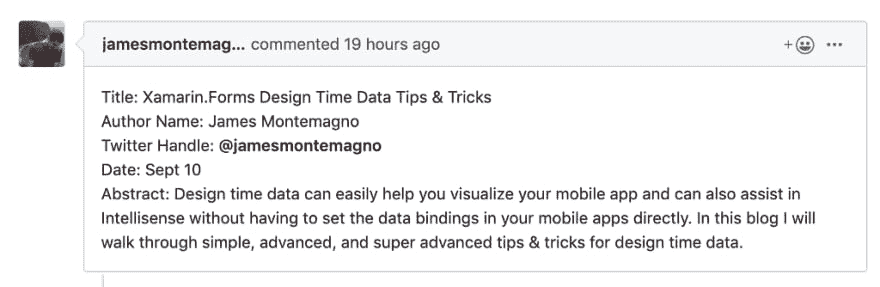

# 十月 Xamarin 最佳实践挑战

> 原文：<https://dev.to/claudiosanchez/the-october-xamarin-best-practices-challenge-2bnm>

### 十月的 Xamarin 最佳实践挑战

你现在可能已经知道了， [Xamarin 相关的挑战](https://www.thewissen.io/introducing-xamarin-ui-july/)在 2019 年非常受欢迎；所以为什么不再来一杯呢。

该挑战将关注 ***在**创建移动应用的所有方面**中已被证实的最佳实践*** (开发运维、项目结构、跨领域关注、数据、API、测试、应用签名等)。

### 它是如何工作的？

如果你已经熟悉之前的挑战——比如来自[史蒂文·泰森](https://twitter.com/devnl)的 [Xamarin UI 七月](https://www.thewissen.io/introducing-xamarin-ui-july/)挑战，或者来自[路易斯·马托斯](https://twitter.com/luismatosluna)的 [Xamarin 月](https://luismts.com/blog/xamarin/xamarin-month-february-2019/)——你会知道这个挑战是以[降临节日历](https://en.wikipedia.org/wiki/Advent_calendar)的形式出现的，其中一篇关于特定主题的文章每天**发布，由一位了不起的贡献者**发布。不过，在这种情况下，文章将作为拉取请求包含在 Challenge [repo](https://github.com/claudiosanchez/SeptemberXamarinChallenge) 中，如果还需要在贡献者自己的博客上发表一篇关于该主题的简短博客文章。这篇文章应该是英文的。

### 我会写些什么？

[**挑战报告**](https://github.com/claudiosanchez/OctoberXamarinChallenge/) 将包含一个目录(ToC)，带有主题大纲——如果列出的主题没有涵盖你想写的内容，你可以从**目录**中选择一个特定的主题，或者添加一个全新的主题。

### 这个我怎么报名？

作为之前的挑战，我们将需要至少 30 名作家-每天一个-但我们肯定会欢迎更多的贡献。请遵循以下步骤:

1.  **通过在回购上提交创建问题来保留位置**。一旦审查完毕，我们将根据您的主题更新目录，并更新**日历**。

 

<figcaption>詹姆斯·蒙特马格诺提出的文章</figcaption>

1.  **提交拉取请求。**将文章写在 [**挑战回购**](https://github.com/claudiosanchez/SeptemberXamarinChallenge) **里面的减价文件中。**

2.  **发表你的博客文章**链接回原始文章和你在回购中的贡献。

3.  **在 Twitter** 上发布标签为#XamarinChallenge 的链接。

### 接下来会发生什么？

与过去的挑战类似，我们将在 10 月份后不久举办一场特别活动来讨论所有的贡献。敬请关注。

### 日历

查看[自述文件。用于最新日历的 MD](https://github.com/claudiosanchez/SeptemberXamarinChallenge/blob/master/README.MD) 文件。