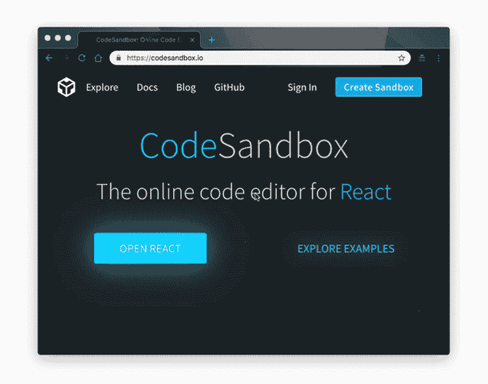

# 会让你大吃一惊的在线 Javascript 游乐场

> 原文：<https://dev.to/vuesomedev/the-online-javascript-playground-that-will-blow-your-mind-58ic>

在线代码游乐场是一个很好的方法，可以在不在本地设置项目和启动 IDE 的情况下试验代码片段。您可以快速验证您的想法，并与他人分享。大多数人对此提供了一个快速而肮脏的解决方案。然而，在处理较大的应用程序时，它们中的大多数都有所欠缺。

### 基础知识

在线代码游乐场提供了各种基本的、我们可以说是必须具备的功能:

*   语法突出显示
*   预览窗口
*   文件预处理(如 Typescript、SASS)
*   包含外部文件和 JavaScript 库
*   通过短网址分享
*   在其他页面中嵌入演示
*   基本功能零成本

符合上述标准的编辑有一长串: [JSFiddle](https://jsfiddle.net/) 、 [CodePen](https://codepen.io/) 、 [JSBin](https://jsbin.com/) 、 [Liveweave](https://liveweave.com/) 、 [PlayCode](https://playcode.io/) 、 [Plunker](http://plnkr.co/) 、 [JSitor](https://jsitor.com/) 。

### 问题

以上操场完全没问题，但我想分享框架 CLI 生成的完整项目(如 [Angular CLI](https://cli.angular.io/) 、 [Vue CLI](https://cli.vuejs.org/) 和[createractapp](https://create-react-app.dev/))。尽管一些游戏场允许你使用前端框架，但这些通常是全局访问的。你不会写下一个生产应用程序的方式。

我想要的功能:

*   使用与生产项目相同的堆栈
*   从 Github 导入
*   使用任何 NPM 软件包

### 解

让我和惊讶并具备以上特性的项目是 [Codesandbox](https://codesandbox.io/) 。

Codesandbox 允许您导入 Github 项目或启动由 CLI 生成的新 React、Angular、Vue 应用程序。它只是工作和启动快。我设法在几秒钟内迁移了 React 钩子中实现的 TodoApp。

它还有一些不错的附加功能:

*   部署到网络或时代
*   VSCode 集成(如快捷方式)
*   实时协作
*   自动完成
*   林挺
*   devtools 功能
*   Github 提交
*   后端应用程序的容器沙箱(Node.js)
*   这是开源的，你可以贡献

## 总结

我对 Codesandbox 的简单性、速度和功能集感到惊讶。这感觉就像我们需要的网上游乐场。我试过其他游乐场，但在这之后，我不会回头。

希望你会有同样的感觉，并尝试这个可怕的网站。