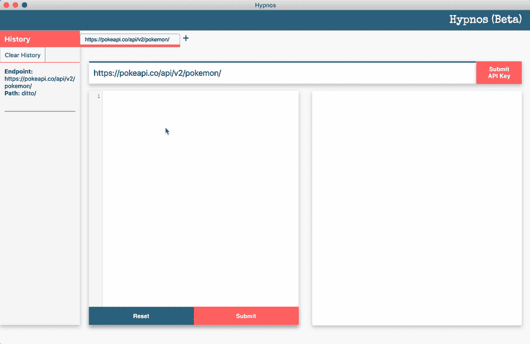
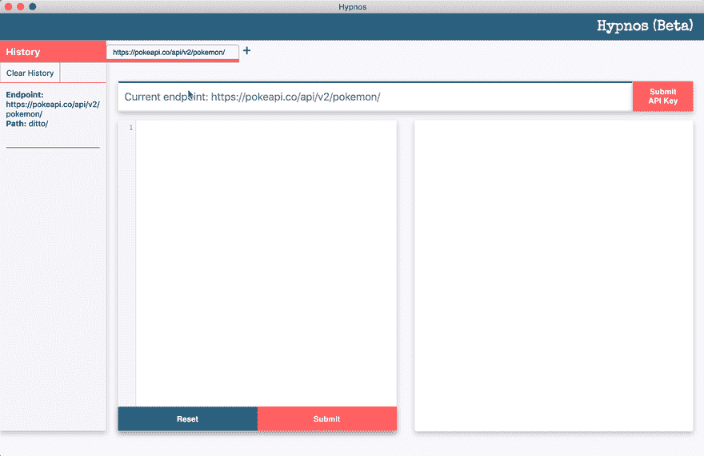
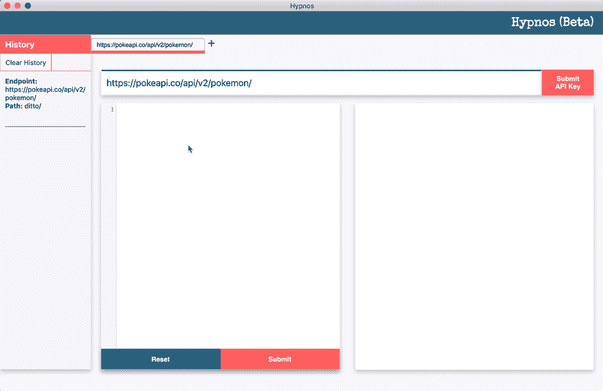

# GraphQL 的力量和 RESTful APIs:认识修普诺斯

> 原文：<https://dev.to/wrobinson91/the-power-of-graphql-with-restful-apis-meet-hypnos-1laf>

讨论 GraphQL 或 Apollo 而不谈论另一个是很困难的。自 2016 年成立以来，Apollo 已经成为在应用程序中利用 GraphQL 的领先客户之一。 [Airbnb](https://medium.com/airbnb-engineering/how-airbnb-is-moving-10x-faster-at-scale-with-graphql-and-apollo-aa4ec92d69e2) ，奥迪，美国消费者新闻与商业频道和 Expedia 都是阿波罗吹捧的采用其技术的工程团队。GraphQL 因其速度和声明式查询而备受称赞；与 REST APIs 不同，GraphQL 查询将客户端请求的内容准确地返回给单个端点，从而提高了互联网连接不良或设备功能较弱的客户端的性能。但是要实现查询语言，就必须对 API 进行彻底的修改，以恰当地服务于 GraphQL 请求。为了测试查询，开发人员必须启动一个快速应用程序和/或编写一个 GraphQL 后端。现有的游乐场是有用的，但它们可能没有对开发者有意义的数据或错误。虽然 GraphQL 非常强大，但错误不是描述性的，即使是在 Apollo 客户端层。这就是修普诺斯的用武之地。

## 什么是修普诺斯？

修普诺斯是一个端点测试者，利用 Apollo 的 link-rest 包对经过认证或未经认证的 RESTful APIs 进行 GraphQL 结构的查询。当进行适当的查询时，屏幕上会呈现一个响应对象，其中包含客户机指定的字段。

## 它是如何工作的？

使用 link-rest 包，Apollo 客户机向给定的 API 和路径发出获取请求。在接收到响应时，客户机解析响应以构造类似于从 GraphQL 端点返回的数据。虽然底层的操作是通过对 REST APIs 的正常读取，而不是一个繁琐的 JSON 格式的对象，其中的字段与客户端无关，但数据是根据查询规范进行解析的。

## 修普诺斯如何相助

Apollo 本身并不以声明方式处理错误。它确实允许开发人员以他们选择的任何方式捕捉 apollo-link-error 包中的错误。然而，如果 GraphQL 错误没有被正确写入(例如在前端)，则反馈可能不清楚。修普诺斯捕捉语法错误，并清楚地描述查询构造中的错误在哪里。
 
对于 GraphQL 来说，如果一个查询被适当地结构化为一个有效的端点，它将总是运行并返回信息和 200 状态码，即使声明的查询字段返回 null。为此，修普诺斯解析响应数据来检查空值。由于 REST APIs 可能有意使用空值，因此仍然会显示整个响应，以及存在空值的堆栈跟踪。

修普诺斯团队([狄龙·加勒特](https://github.com/dillon-garrett)、[索菲·奈](https://github.com/SophieNye)、[威尔·罗宾逊](https://github.com/wrobinson91))对他们的第一次发布感到非常自豪。如果你对修普诺斯(v0.0.1-beta)感兴趣，请查看我们的 [Github 页面](https://github.com/oslabs-beta/hypnos/)，给我们一颗星，并[试用我们的应用](https://github.com/oslabs-beta/hypnos/releases)。

## [OS labs-beta](https://github.com/oslabs-beta)/[hypnos](https://github.com/oslabs-beta/hypnos)

### 测试对 RESTful APIs 的 GraphQL 调用的最佳方式。

<article class="markdown-body entry-content container-lg" itemprop="text">

 

## 许普诺斯

欢迎使用**修普诺斯(beta)** ，这是一个简化的桌面应用程序，它使用来自 Apollo 客户端的 Apollo-link-rest 包来沙箱化对 RESTful APIs 的 GraphQL 调用，并给出详细、有用的错误消息。

我们最近增加了选项卡来处理多个条目！

## 入门指南

**要求**

您所需要做的就是下载各自的操作系统包，安装，然后开始！

**如何安装**

为 Mac 或 Windows 下载(Linux 即将推出！)

**Mac**:[hypnos-0 . 0 . 2 . dmg](https://github.com/oslabs-beta/hypnos/releases/download/0.0.2/Hypnos-0.0.2-mac.dmg)

**Windows 压缩配置** : [hypnos-0.0.2.zip](https://github.com/oslabs-beta/hypnos/releases/download/0.0.2/Hypnos-0.0.2-win.zip)

将应用程序安装到您的应用程序文件夹。

## 如何使用

**输入您的 API 端点**

修普诺斯支持对开放 API 和需要密钥的 API 的调用。未来的版本将包括对需要基本 Auth 和 Oauth2 的 API 的支持

**输入您的 Apollo-link-rest 查询**

提供了一个示例查询。关于 Apollo-link-rest 调用的更多文档可以在 Apollo GraphQL 文档中找到:[https://www.apollographql.com/docs/link/links/rest/](https://www.apollographql.com/docs/link/links/rest/)

**修普诺斯将返回 GraphQL 响应或有意义的错误**

如果有…

</article>

[View on GitHub](https://github.com/oslabs-beta/hypnos)