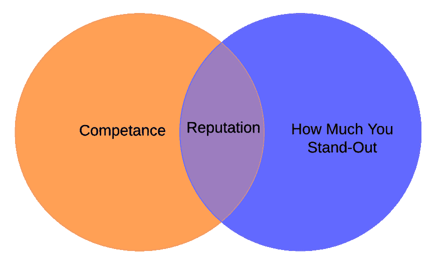

# 关联原则

> 原文：<https://dev.to/jamesmh/the-principle-of-association-98d>

*注:[原籍 yourdevcareer.com](https://yourdevcareer.com/articles/principle-of-association)T3】*

哲学家大卫·休谟写过关于联想的原理。

他的想法是在我们如何“知道”事物(例如认识论)和在想法之间建立联系的背景下。

例如，如果你的母亲总是穿着一种特殊的衣服和某种香水(当你还和她住在一起的时候)，今天你看到别人穿着那件衣服和同样的香水，你的大脑会立即被拉回关于你母亲的记忆或感觉。

我们不会在这里变得哲学化。

但是，我们确实倾向于根据这种联系对人做出决定。

例如，我以前写过的一种关联是与一个著名的公众人物或公司有关联。这可能就像让苹果公司发布一篇博文一样简单。

接下来，你可以在简历、网站等上面“点名”。你提到的品牌和你自己会自然而然地联系在一起。

## 杠杆分

过去，我把这种关联称为“杠杆点”。

这些不是为了证明你有核心技能。就像锦上添花一样。非常美味的糖霜。

你在面试、简历等中提到的这些优势就越多。你就越能在自己和其他人、组织等之间建立起隐含的联系和关联。

当你把它们堆积起来时，它可能是建立你的声誉的关键。

杠杆点，取决于它们是什么，通常将有助于支持我认为形成你的声誉的两个核心部分-能力和突出。

他们让人们更有理由相信你是有能力的，并且会帮助你脱颖而出。

例如，如果你因为写了一篇扎实的技术文章而被谷歌看中，那么把它放在你简历的顶部(成就部分)会立刻让你和谷歌联系起来。

如果其他大部分简历只是列出工作经验、角色和他们拥有的技能，你就会脱颖而出。

你会拥有别人没有的有趣的东西。而且，你已经在自己和谷歌之间建立了一种隐性的联系(希望是一种积极的联系)。

如果有一行“XYZ 的文章以**谷歌的**事物为特色”(是的，以**谷歌**加粗)，简历的读者会想*“好吧，如果谷歌认为他/她有足够的知识来突出他们，很可能他们就是！我们给他们做个采访吧。”*

如果你以某种方式将自己与其他知名的顶尖人物联系在一起，那么它会“影响”你的声誉。

## 我职业生涯中的例子

我写这些是因为这是我职业生涯中最近出现的事情。

大约一年前，我的开源项目 [Coravel](https://github.com/jamesmh/coravel) 开始在。网络社区。该网站的时事通讯也获得了大量的关注(在最初的 8 个月里有超过 1000 名订阅者！).

通过我在这个网站/时事通讯、Coravel 的工作以及写一些技术文章，我获得了一些我从未预料到的绝佳机会。微软在他们的主页上介绍了我。NET 社区网站，史蒂夫·史密斯的播客和最近的 T2。净芯秀——在其他地方。

例如，上史蒂夫的播客会发生什么，现在任何听他节目的人都会以某种方式把我和史蒂夫甚至他的一些嘉宾联系起来。

也是如此。网芯秀。我的脸现在和我尊敬的开发人员出现在同一个网页上！

现在，在我的简历上，我可以指出我在这个平台上出现过的事实，并可能说出也在这些平台上出现过的知名社区人物的名字。这是一个巨大的胜利🎉。

如果你正在招聘一名高级开发人员，而其中一名候选人曾出现在你的一些开发英雄之前做客过的播客上，那会怎样？

那会产生影响吗？

我想是的！

## 建立联想的方式

你如何能建造这些？

*   博客
*   通过推特或在社交媒体上发帖说出你的想法
*   评论行业领导者的社交媒体帖子
*   构建公开可用的项目
*   YouTube 视频
*   写一本书
*   开始播客
*   采访受欢迎的开发者(播客或文章)
*   成为播客的嘉宾
*   参加用户组和聚会，结识朋友
*   在用户群中发言
*   与你尊敬的人建立联系
*   尽你所能帮助别人

请记住，这是一场持久战。我写博客已经很多年了，但我从未见过任何认可的迹象。

这又回到了你职业生涯中复利的想法。

你的职业生涯就像一个花园。这需要时间和坚持不懈的努力。

一些植物需要很长时间才能显示出生长的迹象，可能只有在接近收获季节时才会开花。

## 可以规划一下吗？

你只是努力工作并期待机会到来吗？

有人先联系我，我就有了很多机会。但是，我也曾有过先接触自己的机会。

这就是专注于专业领域的原因。一旦你获得了牵引力，你就获得了牵引力。

尽管开始时，专注于一个领域，并使用上面的策略不断积累。

随着时间的推移，你会得到机会- *抓住它们*！如果你获得了动力，不要害怕接触播客、客座博文平台等。

## 最后但并非最不重要

最后，记下你所有的杠杆点，这样你可以在需要的时候拿出来！