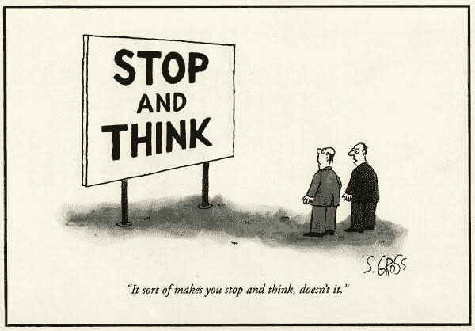

# 医疗保健中机器学习的问题

> 原文：<https://dev.to/seattledataguy/the-problem-with-machine-learning-in-healthcare-3a9l>

由本·罗戈扬

《华尔街日报》的一篇文章最近在网上流传，讨论模型将如何运行世界。我相信这有很多道理。机器学习算法和模型正变得无处不在，越来越受到各行业的信任。反过来，这将导致我们花更少的时间来质疑这些算法的输出，并简单地让系统给我们答案。我们已经依赖像谷歌、脸书和亚马逊这样的公司来通知我们约会的想法、朋友的生日以及什么是最好的产品。当谈到我们从这些公司得到的答案时，我们中的一些人甚至不会三思而行。

作为一名在医疗行业工作的数据工程师，这既令人兴奋又令人恐惧。在过去的一年半时间里，我花时间开发了几款[产品，帮助医疗专业人员做出更好的决策](https://towardsdatascience.com/how-to-develop-a-successful-healthcare-analytics-product-e36e0d4cb141)，专门针对医疗质量、欺诈和药物滥用。

在研究各种指标和算法时，我不断问自己几个问题:

这将如何影响患者的治疗？

它将如何影响医生的决定？

这能改善人们的长期健康吗？

在我看来，大多数医院都像企业一样经营，但也有一些希望，他们的目标不总是仅仅是底线。我希望他们首先努力为他们的病人和社区服务。如果是这样的话，那么我们建立的算法和模型就不能只关注底线(就像其他行业经常发生的那样)。相反，他们需要考虑事情将如何影响患者，它们可能如何影响他们的整体健康，这一指标可能如何以潜在的负面方式改变医生的行为。

例如，华盛顿健康联盟在报告从成本和护理角度帮助改善医疗保健的各种方法方面做得很好，它写了一份报告，专注于通过减少浪费的程序来改善医疗保健成本。真是个好主意！

事实上，我做过一个类似的项目，这是我开始思考的时候。有些医生服用过度调整会怎么样？我确信许多医生会适当地重新校准他们的流程。然而，那些试图过度调整的人呢？

当一些医生因为不想被标记为浪费而试图过多地纠正他们的行为，导致弊大于利时，会发生什么？

我们有可能让医生错过明显的诊断吗？因为他们太担心医院和病人花费太多的钱。或者更糟的是，也许他们过于依赖他们的模型在未来为他们诊断。我知道我在过去受到批评时过度调整了自己的行为，那么如何阻止医生做同样的事情呢？允许一个人做出一个好的决定和强迫他们依靠机器的思维(比如谷歌地图——我们中有多少人真的记得去任何地方?)之间有一条细微的界限。).

但是你思考是因为你被告知要思考吗...还是因为你知道自己在做什么？

有一种风险，那就是更多地关注数字，而不是患者真正在说什么。

医生过于关注数字而不是病人，这是我个人的担忧。

如果一个模型对一家销售礼服衬衫或烤面包机的公司来说是错误的，那就意味着错过了一次销售，错过了一个季度目标。医疗保健中的模型错误可能意味着有人死亡或没有得到适当的治疗。

因此，尽管创造能帮助我们更好地做决定的系统可能有些华而不实，但我确实想知道人类是否有纪律不依赖它们来做最后的决定。

作为医疗保健专业人员和数据专家，我们不仅有义务帮助我们的公司，还有义务为患者着想。我们不仅需要数据驱动，还需要*人驱动*。

我们可能不是护士和医生，但我们现在和未来创造的工具将直接影响护士和医生的决策。我们需要考虑到这一点。作为数据工程师、数据科学家和机器学习工程师，我们有能力制造工具来增强我们所支持的医疗专业人员的能力。我们可以产生巨大的影响。

我同意，模型将慢慢开始越来越多地运行我们的世界(它们已经在贸易、一些医疗诊断、亚马逊购物等领域运行)。这意味着我们需要考虑所有的操作场景，考虑所有可能的结果——好的和坏的。

想要阅读更多关于数据科学和编程的精彩帖子吗？

[Hadoop Vs 关系数据库](http://www.acheronanalytics.com/acheron-blog/hadoop-vs-relational-databases)
[算法如何变得不道德和有偏见](http://www.acheronanalytics.com/acheron-blog/how-do-machines-learn-bias-data-science)
[使用 BigQuery 分析医疗保健数据](https://www.theseattledataguy.com/using-bigquery-and-saturncloud-to-analyze-medical-data/)
[十大商业智能(BI)实施技巧](https://www.theseattledataguy.com/top-10-of-business-intelligence-bi-implementation-tips/)
[未来 5 大大数据工具——从 Hadoop 到 Cassandra](https://www.theseattledataguy.com/5-great-big-data-tools-for-the-future-from-hadoop-to-cassandra/)
[用 Python 创建 3D 打印 WiFi 访问二维码](https://wp.me/paPkDy-K4)
[数据工程师面试学习指南](https://www.coriers.com/the-interview-study-guide-for-data-engineers/)

图片来自:照片由 Piron Guillaume 在 Unsplash 上拍摄