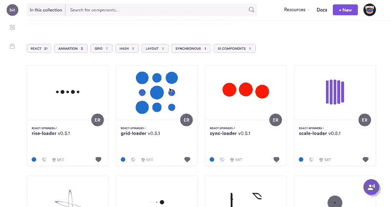
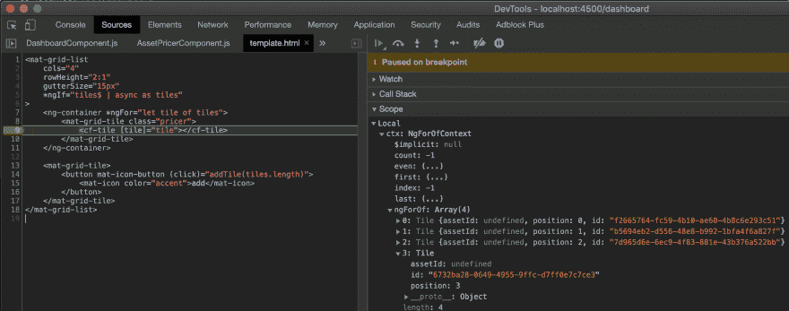

# 2019 年的 Angular 状态

> 原文：<https://dev.to/giteden/the-state-of-angular-in-2019-ein>

Giancarlo Buomprisco 撰写。原载于

Angular 当前状态的详细概述，从最新功能到您可能错过的最热门的话题和趋势

每年的这个时候，世界各地都在举行会议和活动，我们被大量难以消化的信息轰炸。

前端世界是一台永不停止的机器，我们都知道不落后有多难。观看所有的会议需要很多时间，这是可以理解的，在办公室呆了一天后，我们大多数人可能更喜欢网飞！

基于这些原因，我想帮你解压信息过载，在单篇帖子里给你概述一下 Angular 在 2019 年的状态。

这就是我们在本文中要讨论的内容:

*   角的当前状态

*   框架的最新特性

*   最新话题和趋势

*   理解一些你可能在这里或那里看到的，但实际上你还不是很清楚的单词

**提示:**使用 [Bit](https://bit.dev) ( [Github](https://github.com/teambit/bit) )在你的项目中轻松共享和重用 Angular 组件，建议更新，同步变更，更快地组建团队。

[ ](https://res.cloudinary.com/practicaldev/image/fetch/s--XuGB7JRI--/c_limit%2Cf_auto%2Cfl_progressive%2Cq_66%2Cw_880/https://cdn-images-1.medium.com/max/2000/1%2AODhvAjHjB8zPErBYhOFePQ.gif) *组件与位:轻松地作为团队跨项目共享*

## 棱角分明的采用率正在增长

根据 Angular 现任工程经理 Brad Green 在 *ng-conf 2019* 上提供的统计数据，自去年以来，Angular 的采用率增加了约 50%！

不可否认的是，这些统计数据可能会被正在从旧 Angular 1 升级的项目的数量所夸大。x，但这是令人印象深刻的增长。

Angular 不像*svelite*或 *Vue* 那样发展迅速，也不像 *React* 那样被广泛使用，但与你可能在 Reddit 和 Twitter 上读到的相反，Angular 处于健康状态，被数百万开发者和团队使用。

## 棱角分明的生态系统庞大而欣欣向荣

即使框架附带了 Angular 团队自己提供的数量惊人的现成工具，社区提供的生态系统也是巨大而高质量的。

我们有各种各样的东西可以用在 Angular 上:

*   与令人敬畏的快速发展的工具深度集成，如 *Typescript* 和 *RxJS* 、**，随着这些工具取得越来越多的进步，这些工具间接带来了好处**

*   不同风格的状态管理库

*   代码质量工具，例如[代码分析器](https://github.com/mgechev/codelyzer)

*   UI 库、组件、指令、管道等。

*   大型 IDE 插件库

*   测试框架和实用程序库

*   最后但同样重要的是，来自社区和 Angular 团队的关于最佳实践、指南、教程、书籍、视频课程等的大量文档。

在接下来的段落中，我们将看到一些我们可以在 Angular 项目中使用的最佳工具的详细概述。

> The deep integration of tools such as
> 
> # and *TypeScript* and *RxJS ** *indirectly brings benefits from the angle*
> 
> as these tools progress more and more.

## 角度 CLI

### 更新比以往更容易

> # … This is the evidence

正如 Mart Ganzevles 所描述的那样，每年服务于 5 亿用户的 BlueWeb 项目在一天内从版本 7 升级到版本 8，而从版本 2 升级到版本 4 需要 30 天。

这进一步证明了 Angular CLI 是一个多么伟大的工具，它可以将我们的生产力提高到我个人从未体验过的水平。

现在很难想象没有它的工作。

### 示意图

角度示意图是您可能每天都在使用的功能。例如，我确信你经常使用 ng 生成组件 my-component。是的，这是与 CLI 捆绑在一起的示意图。

然而，你可能不知道的是，你可以通过[为你经常重复的代码片段创建你自己的示意图](https://angular.io/guide/schematics-authoring#schematics-concepts)来提高你的生产率。

### 建设者

构建器[允许你扩展或增加现有的命令](https://blog.angular.io/introducing-cli-builders-d012d4489f1b)。例如，您可以创建一个构建器，用 Jest 和 Cypress 而不是 Jasmine 和量角器来执行您的测试，或者使用不同的 Linter。

## 令人兴奋的新功能

在撰写本文时，Angular 最近发布了带有各种改进和特性的版本 8。

没有什么会深刻影响我们使用框架的方式，这在大多数情况下是好消息，但在引擎盖下的改进使 Angular 的项目更小更快，改善了使用框架和几乎完整的新渲染器已经令人敬畏的开发人员体验。

### 差动加载

*差动加载*的概念比它的名字所暗示的要简单。简而言之，编译器将生成两个包:一个用于从所需的 polyfills 中剥离出现代功能的浏览器，另一个用于较旧的浏览器。

最新的浏览器将加载现代包，需要 polyfills 的旧浏览器将加载遗留包。

这是一个巨大的胜利，因为大多数用户可能使用最新的浏览器，所以我们只向我们的一小部分用户提供旧浏览器！

### 网络工作者

你可能已经听说过 Web Workers，所以我们将跳过整个介绍部分。然而你可能没有意识到的是，由于 Angular 的最新发布，将你的网络工作者与 Angular 集成已经变得多么容易。看一下[文档](https://angular.io/guide/web-worker)！

### CDK

[CDK](https://material.angular.io/cdk/categories) 是 Angular Components 团队发布的一套工具。它们提供了由[棱角分明的材料](https://material.angular.io)所使用的抽象概念，但是它们在造型方面是不可知的。

例如，您可以使用如下指令:

*   拖放

*   可自动调整大小的文本区域

*   弹出窗口的覆盖

*   虚拟滚动

CDK 非常有用，因为大多数应用程序可以使用良好的常用功能，而不必使用完整、臃肿的专用组件。有棱角的材料很棒，但是你可以通过使用 CDK 提供的构件来实现你自己的组件。

### 常春藤渲染器

Ivy 是一个非常令人兴奋的正在进行的新开发，将作为 Angular 的第三个渲染器发布。现在还没有，因为默认情况下没有启用，但是从版本 7 开始，您可以选择加入并在您的项目中使用它。默认情况下，它将与 Angular 版本 9 一起发货。

你能从艾薇那里期待什么？

*   较小的束

*   可调试模板

*   更快的构建，更快的测试

*   修复了许多错误

下面是我在 Chrome 控制台中放置断点时的截图:

[](https://res.cloudinary.com/practicaldev/image/fetch/s--0CL6RiEX--/c_limit%2Cf_auto%2Cfl_progressive%2Cq_auto%2Cw_880/https://cdn-images-1.medium.com/max/4642/1%2Aify8X8H_P6wnZjTIMNE1ng.png)

正如您所看到的，ngForOf 指令为我们提供了关于什么被作为值传递的信息。

## 棱角分明地在移动

### **离子**

Ionic 是一个用于构建移动应用的框架。虽然核心组件是使用 Stencil 编写的，但是它们提供了可以用于 Angular(和其他框架)的抽象。

### NativeScript

一个类似 React Native 的框架，用于构建原生移动应用。虽然它们也提供对 Vue 和普通 Javascript 的支持，但它提供了与 Angular 的深度集成。不幸的是，我对它的体验并不太好，我个人也没有把它和 React Native 放在同一水平上，但如果你喜欢移动，你应该试一试。

## 测试

### 茉莉&量角器

尽管不需要介绍，Jasmine 和量角器以及测试框架都默认与 Angular 一起提供。他们经过战斗考验，更新和工作惊人的角度。

### 玩笑话&柏树

由于 Angular CLI 提供了新的定制构建器，用 Jest 和 Cypress 测试 Angular 已经成为可能。

Jest 是一个基于 Jasmine 的单元测试框架，由脸书开发。它是测试 React 项目的实际框架，因其速度而广受好评。总的来说，许多人更喜欢它而不是茉莉，所以如果你是这样的人，你现在可以用它了！

Cypress 是一个备受推崇的 E2E 测试框架，受到了广泛的喜爱，这是有原因的。它不依赖于 Selenium 或 Webdriver，允许通过命令日志进行时间旅行，允许网络流量控制，并承诺不会随机失败的更一致的结果。

### 角度测试库

角度测试库是一套以用户为中心测试 UI 组件的工具。

这意味着本库鼓励您永远不要以编程方式使用组件，而是通过做用户会做的动作来测试行为。

例如，您不会使用:

```
myComponent.onClick(); 
```

但是，您将像用户自然会做的那样模拟点击:

```
const { getByText, click } = await render(CounterComponent, {

    componentProperties: { counter: 5 }

});

点击(getbytetext[+]： 
```

## 
  
状态管理

### NgRx

NgRx 是一个受 Redux 启发的状态管理库，可能是 Angular 社区中使用最多的。顾名思义，它非常依赖 RxJS 流。

### NGXS

NGXS 是一个备选库，它也为 Angular 带来了类似 Redux 的状态管理。与 NgRx 相比，NGXS 大量使用类和装饰器来减少样板文件，如果您喜欢类，这可能是在两者之间选择一个的最重要的方面。

### 秋田

Akita 是 Datorama 公司提供的一个状态管理库，也是基于 RxJS 的，与前两个相比，它还可以用于非角度项目，从长远来看，这可以使您的代码更加可重用。

### 就……RxJS？

是啊！根据您是否喜欢 Redux 库或者您的项目是否需要一个状态管理库，您也可以构建使用 [RxJS Subjects](https://dev.to/avatsaev/simple-state-management-in-angular-with-only-services-and-rxjs-41p8) 存储状态的服务！

## UI 组件库

### 故事书

StoryBook 不是一个 UI 组件库，而是一个工具，它允许你孤立地构建组件，并为我们提供了一个探索所有组件及其变体的简单方法。

这是一个很棒的工具，我羡慕 React 开发人员很久了，但我们现在可以使用它，很难不推荐使用它。

### 有角的物质

臭名昭著的 [Angular 材料](https://material.angular.io)又回来了，并为 Angular 的最新版本带来了一套更漂亮的组件。

## 后端为棱角状

### 火基

Firebase 是谷歌旗下的一个应用程序开发平台，因此，它提供了一个一流的库 [Angular Fire](https://github.com/angular/angularfire2) ，该库使用 RxJS Observables 的功能来传输数据，从而实现了与 Angular 的深度无缝集成。

### GraphQL

你可能认为只有 React 社区才有使用 GraphQL 的乐趣…你可能错了。Apollo 库也可用于 Angular，如果你喜欢使用 GraphQL，它是 Firebase 的一个很好的替代。

### 雀巢公司

[NestJS](https://nestjs.com/) 是一个用于构建服务器应用的节点 Web 框架，从例子中可以看出，它深受 Angular 核心概念的启发，比如模块、控制器、管道等。如果你喜欢棱角分明，那么你可能也会喜欢 NestJS。

如果您使用 [Nx Workspaces](https://nx.dev/fundamentals/build-full-stack-applications) ，用 Angular 和 NestJS 设置一个全栈应用程序只需要一个命令！

## 最后的话

综上所述，Angular 拥有令人难以置信的高质量和丰富的生态系统。

当然，我不能提及我欣赏的几十个库和工具，否则，这个帖子会没完没了。但是我希望这篇文章能够给你一个 Angular 的当前状态的概述，以及可能为你的下一个项目提供动力的潜力。

如果您需要任何澄清，或者如果您认为有些事情不清楚或错误，请留下评论！

*如果你喜欢这篇文章，请关注我的* [*Medium](https://medium.com/@.gc) * *或* [*Twitter](https://twitter.com/home) 以获得更多关于 Angular、RxJS、Typescript 等的文章！*