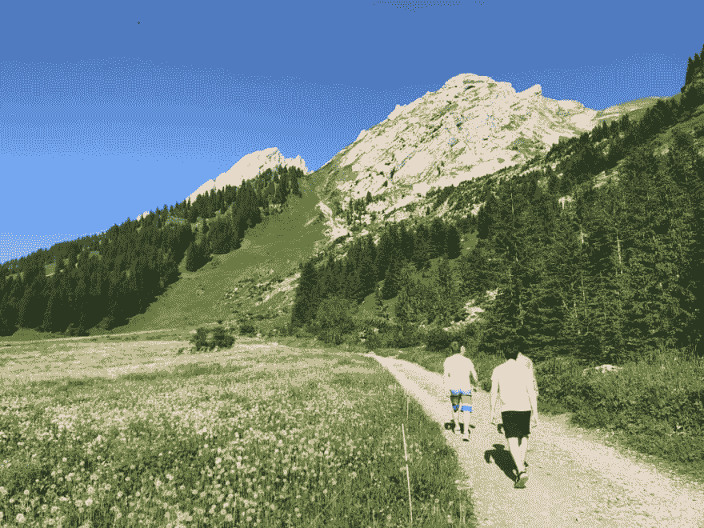
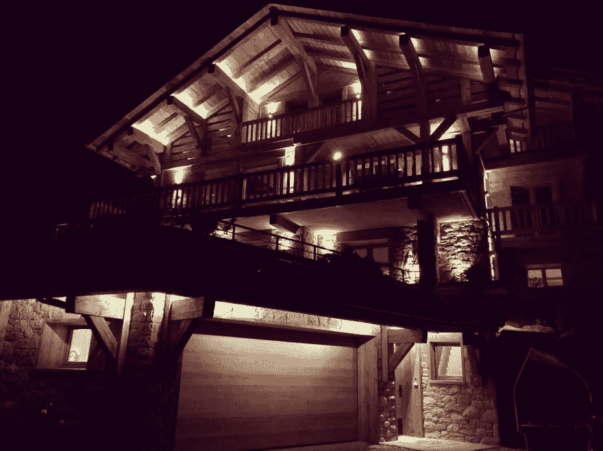
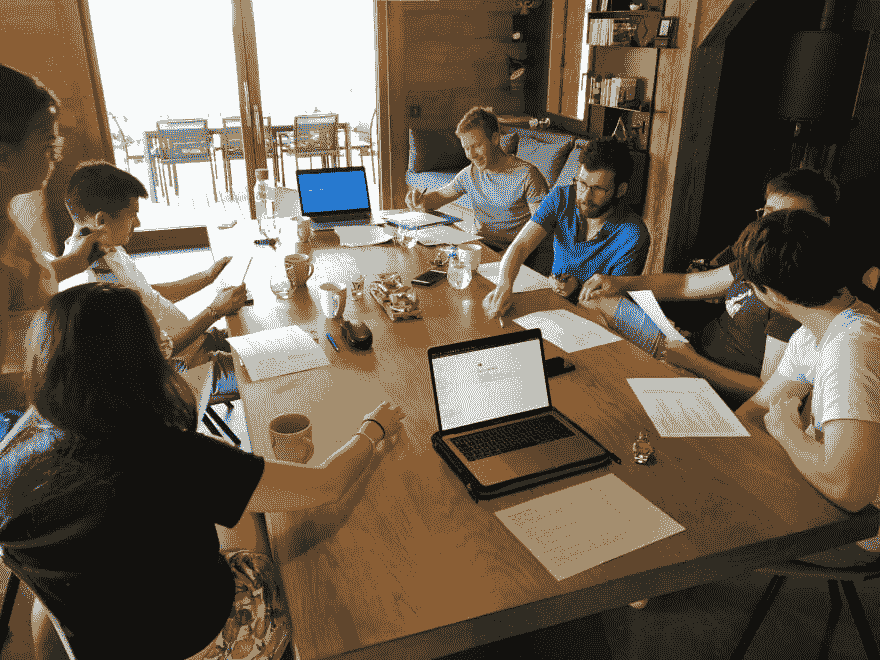
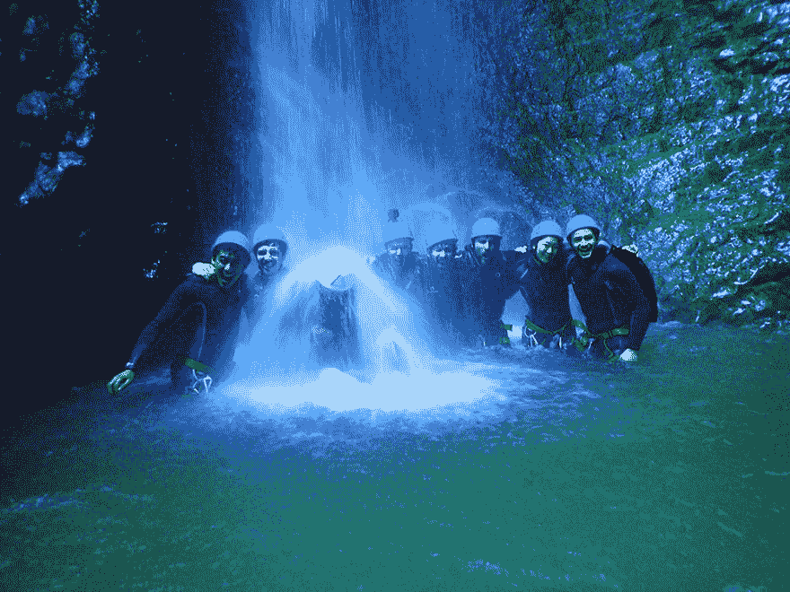
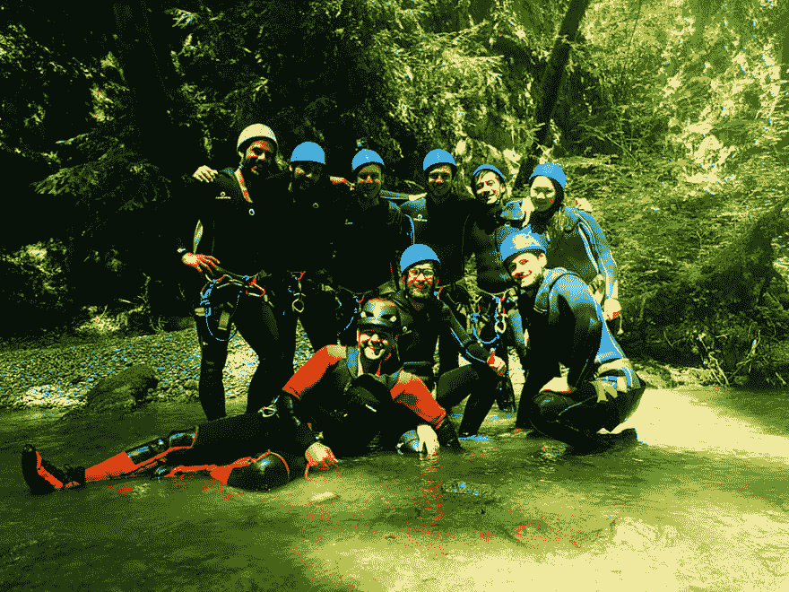
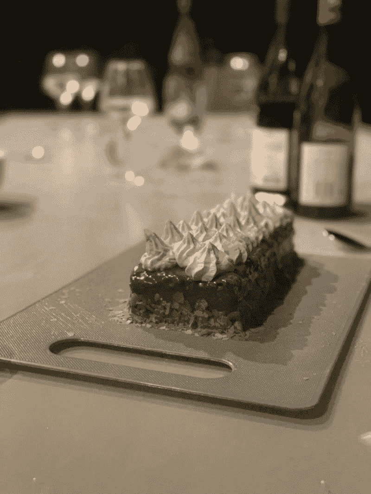
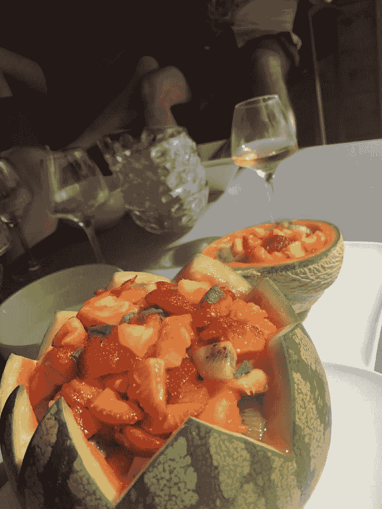
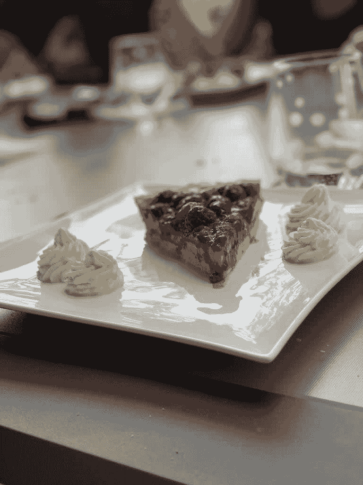
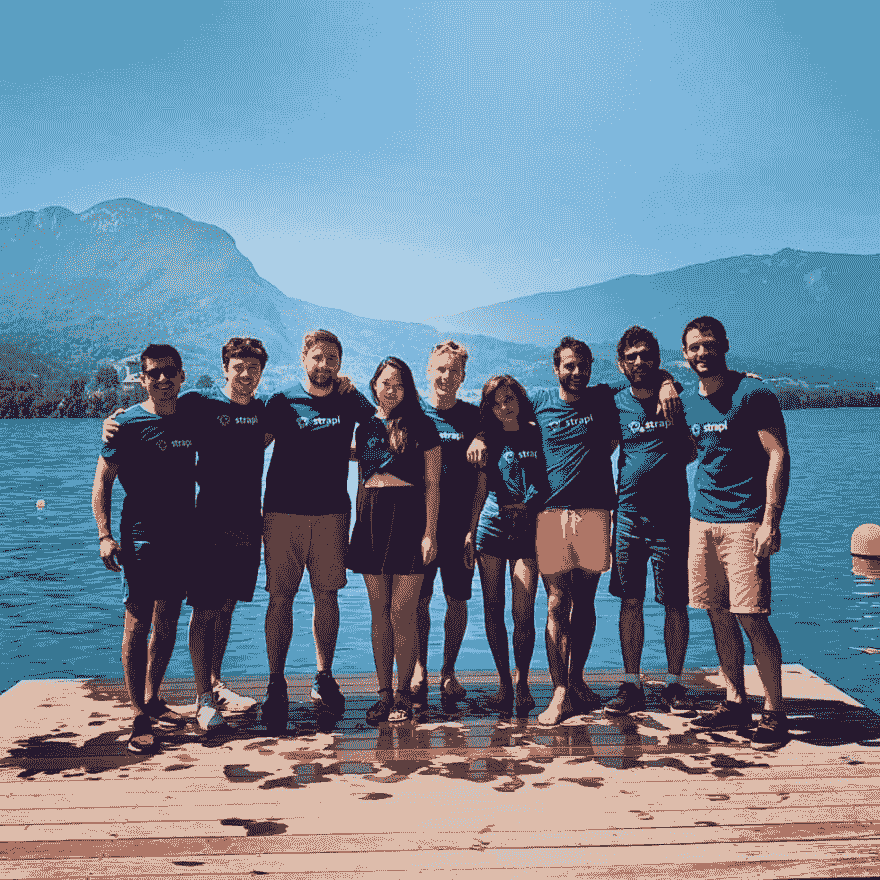

# Strapi 团队离开现场

> 原文：<https://dev.to/strapi/the-steapi-team-goes-offsite-3m87>

### 上个月，Strapi 团队来到山里的一个豪华小屋，集思广益，为项目的未来寻找机会。

 
*徒步登顶！*

自从去年在马拉喀什的异地活动以来，Strapi 已经成长了不少。随着马克西姆今年 7 月[的到来，我们现在是一个 10 人的团队。随着我们规模的扩大，我们觉得有必要将团队聚集在一起，计划未来几个月的工作，并设定我们公司文化的标准。](https://twitter.com/strapijs/status/1146423971329576960)

我们这次异地的目标是塑造 Strapi 的未来。我们计划在一年内增加一倍，我们将如何扩展？两年后我们会在哪里？我们还努力使路线图、入职和公司价值观更加具体。

随着人数的增加，Strapi 社区必须继续享受使用 Strapi 的乐趣。这对用户和贡献者来说意味着清晰的交流和透明的过程。

 
*异地期间我们美丽的办公室。*

在我们到达拉克鲁萨的小木屋并安顿下来后，[皮耶](https://twitter.com/pierre_burgy)解释了我们希望在旅行结束时完成的任务。我们以团队的形式开始了每一天，讨论不同的主题。[苏佩蒂](https://github.com/soupette)想出了分成三组每天做饭的主意。每天不同的团队负责为整个团队做午餐和晚餐！

每一次工作会议都以介绍情况开始，以分享想法、愿景和创意结束，然后是烹饪会议。

# 高亮显示

## 愿景和价值观

随着我们的员工在 6 个月内增加了一倍，一个公开的问题是如何确保适当的扩展，以及如何明确我们在未来 18 个月的发展方向。

在离站之前，我们已经定义了我们作为一个团队最近面临的一些挑战，并且还汇编了从社区收集的反馈。我们按主题对他们进行分类，并通过协作会议深入其中，提出想法和解决方案。

在有机会思考不同类型的挑战后，团队带着清晰的基础离开，并在离开现场后继续探索。

以下是我们决定采取的一些行动:

*   **改善团队沟通和对社区的愿景-** Strapi 的诞生源于对制造一种将改变成千上万人生活的产品的热情。
*   **定义公司文化-** 我们经常提到定义我们互动方式和每天醒来原因的特征。我们现在需要将它们写下来，发布给社区，并使它们具有可操作性。

## 发布流程和沟通

在非现场期间，我们计划了一个关于 Strapi 产品、版本以及我们就它们进行交流的方式的研讨会。

在本次研讨会期间，我们试图回答的主要问题是:

**我们如何改进功能发布&我们就产品进行沟通的方式？**

这个挑战似乎有点宽泛，所以我们决定将它分成 3 个不同的陈述。每个小组都有一个陈述，并有 15 分钟的时间列出相关的痛点。以下是我们研究过的 3 条陈述。

*   **有更好的沟通。**
*   围绕产品有可见且可理解的目标。
*   建立符合团队需求的流程，并改进功能发布。

在为每个陈述辩论并选择了 3 个主要难点后，每个小组还有 15 分钟的时间提出解决这些难点的具体方案。

我们想出了不少立即可行的主意。

例如，我们认为向社区共享路线图是不够的:解释我们为什么做出决策是非常重要的。这就是我们几周前发布的[月度更新](https://blog.strapi.io/monthly-update-july-2019/)和[关于为什么我们要分开管理管理员用户和最终用户](https://blog.strapi.io/why-we-split-the-management-of-the-admin-users-and-end-users/)的最新帖子的目的。

# 活动

这个异地也给了我们一个绝佳的机会，让我们在团队建设活动中欣赏上萨瓦省这一地区的美丽风景。

我们能够发现峡谷，在安纳西湖周围放松，并看到我们作为小型烹饪团队如何相互交流。

## 峡谷

对于那些可能从未听说过这个术语的人来说， [canyoning](https://en.wikipedia.org/wiki/Canyoning) 是使用各种技术在峡谷中旅行，可能包括其他户外活动，如行走、攀爬、攀爬、跳跃、绳降(速降)和游泳。

这对我们中的一些人来说是第一次，我们都很喜欢！对于我们中的一些人来说，被挑战出我们的舒适区是令人兴奋的。

## 烹饪环节

每天，一个 3 人小组负责做一整天的午餐和晚餐！

这是发现每个团队秘方的绝佳机会。在 Strapi，我们喜欢美食，围着可爱的桌子享受美好时光。

这里有一些团队烹制的令人惊叹的菜肴的图片。

 
*亚历山大自制的主菜。*

 
*亚历山大的草莓馅饼*

## 环湖

就在返回巴黎之前，我们结束了在安纳西湖周围的美好时光。之后，精力充沛的它去了巴黎，为 Strapi 社区提供最好的服务！

# 学问

*   价值观很重要。 Strapi 是一家开源公司，受透明、同情或关爱等价值观的驱动。我们喜欢笑话。还有食物。我们将写下我们的公司文化，并将其开源，以允许来自社区的贡献。
*   沟通是关键。我们承诺每月更新一次，解释最新的决策、功能或修复。从内部角度来看，我们正在通过使用更多的异步通信渠道来优化我们的时间，比如针对公司相关问题的 GitHub 存储库。目标是在不丢失信息的情况下减少会议时间。
*   [* *我们应该吃自己的狗粮](https://en.wikipedia.org/wiki/Eating_your_own_dog_food)。**内部会越来越多地使用 Strapi。在**内部黑客马拉松**期间，非技术团队成员将与技术团队成员配对，创建一个运行 Strapi 的应用程序。

你可以在我们的 Instagram 账号[这里](http://instagram.com/strapijs)看看在场外拍摄的照片。别忘了订阅保持联系！

斯特拉皮正在招人！来吧，加入我们重塑内容管理和分发方式的旅程。要查看职位空缺，这里是。

如果你喜欢这篇文章，请花点时间在 Twitter 上分享一下。有意见或问题吗？点击下面的部分！