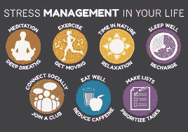

# 新的压力

> 原文：<https://dev.to/bjfairchild/the-stress-of-the-new-4hng>

对绝大多数人来说，学习新的东西是一项困难而有压力的任务，需要奉献和专注。对我来说，我的软件工程师之路的开始就是这样。新的概念和想法每天都压在我的脑海里，当需求开始升级时，很容易被压力和焦虑淹没。幸运的是，我在一个帮助触手可及的环境中学习，但情况并非总是如此。

几年前，我曾有过自学编程的想法。前景令人望而生畏，我也不清楚从哪里开始或者学什么。我开始阅读书籍和使用在线资源，但这个任务对当时仍然必须全职工作谋生的年轻人来说太大了。我努力理解基本原理，坦白地说，我不擅长编码。焦虑、自我怀疑和压力使我的学习脱轨，我从未真正付出应有的努力。

不擅长某件事是很好的。你如何面对这个事实才是最重要的。压力是一头危险的野兽，影响着从学生到 CEO 的每一个人。那些管理好自己的压力水平并保持头脑清醒的人会发现，这比那些在阻碍前进道路的每一个障碍面前都感到绝望和恐慌的人要容易得多。

我经常发现自己回过头来看我第一次编码的尝试，看看哪里出错了。除了我目前通过熨斗接受的结构化教育，最大的不同是我如何管理压力水平和感知失败。如果我能让时光倒流，给年轻时的自己一些建议，我想告诉你两件事。

编码很难，不要因为一开始没有意义而感到难过。如果你开始恐慌，休息一下。去散步或锻炼来释放一些压力。如果你相信你不能解决你面前的问题，很有可能你是对的。

在寻求帮助时，不要害怕或固执。我自己太骄傲了，从不寻求帮助，认为我应该能够解决自己的问题。正如互联网是一个由计算机和服务器组成的巨大网络，我们作为开发者也应该如此。协作和网络是我寻求知识的基础，我的成功很大程度上归功于那些在我需要来自更博学的人的帮助或见解时伸出援手和发出声音的人。

像任何不熟悉的任务一样，学习编码是困难的。如果你没有准备好，或者像我一样容易气馁，那就更难了。慢慢来，需要的时候寻求帮助。我的旅程才刚刚开始，但已经非常令人满意了。

