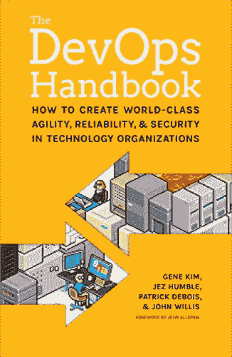
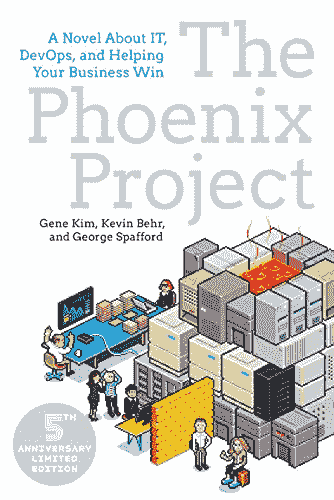
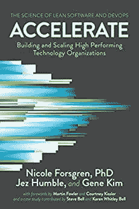
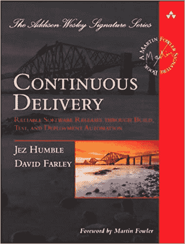
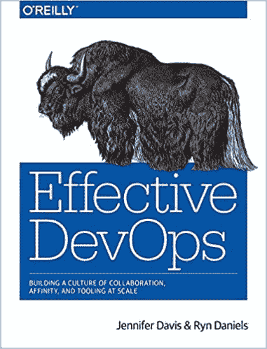
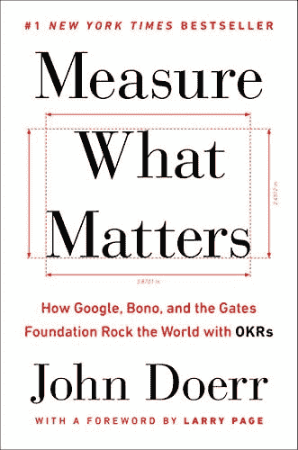
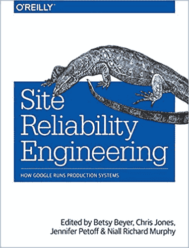
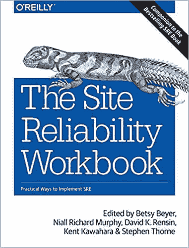
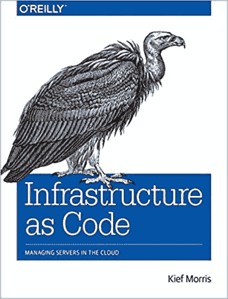
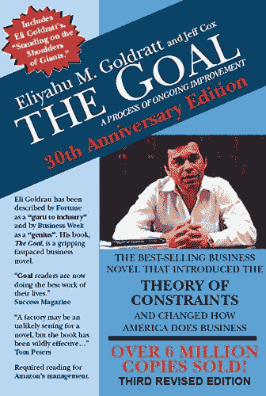

# 你需要阅读的关于 DevOps 的 10 本书

> 原文：<https://dev.to/pluralsight/the-top-10-books-on-devops-you-need-to-read-45m2>

*[在推特上关注我](http://bit.ly/2JWE2uV)！很高兴听到大家对此的看法，以及对新文章的建议。*

我做 DevOps 已经有一段时间了，这些年来，我读了一些对我帮助很大的书。

## 1。DevOps 手册

这本书是大多数 DevOps 专业人员开始阅读的第一本书。到目前为止，我已经读了 3 遍，每次都有新的收获。这是一个很好的开端，让我们对 DevOps 有了一个很好的了解。

**你将从中获得什么**:*devo PS 的一个很好的概括知识。一个很好的起点。*

更多信息:**[《devo PS 手册》](https://amzn.to/33aHACo)**

* * *

## 2。凤凰计划

又一部你必读的经典。这本书的不同之处在于它是以小说的形式出现的，这意味着在你通过 DevOps 手册学习基础知识之后，这本书将以有趣的故事形式展示理论和原则的应用。消化和打通就容易多了。如果你没有阅读这个列表中的其他内容，这两本书会给你一个坚实的基础。

**你将从中获得什么** : *应用你在 DevOps 手册中学到的原则。*

更多信息: **[凤凰计划](https://amzn.to/2YFAlz9)**

* * *

## 3。加速:精益软件和 DevOps 的科学

这本书是 4 年的研究成果，由木偶和 DevOps 的一些顶级头脑，妮可·福斯格伦博士，Jez Humble 和基因金。这是前两本书概述的理论和原则在现实世界中的应用。

**您将从中获得什么** : *来自实施 DevOps 的真实组织的真实经验。*

更多信息: **[加速:精益软件和 DevOps 的科学](https://amzn.to/2ODOCwx)**

* * *

## 4。持续交付:通过构建、测试和部署自动化实现可靠的软件发布

“Jez Humble”和“David Farley”这两个名字过一会儿你就会熟悉了，他们都是这个领域的专家，这本书是他们最好的作品之一。

**您将从中获得什么** : *持续交付的坚实基础，并创造了一个伟大的部署渠道。*

更多信息: **[连续交付:通过构建、测试和部署自动化进行可靠的软件发布](https://amzn.to/2yBF9e7)**

* * *

## 5。有效债务

有了奥莱利的书，你总是可以期待质量，这本书也不例外。这涵盖了 DevOps 的整体情况，并为建立您的 DevOps 组织提供了一些可行的建议。写得很好。

**你将从中得到什么** : *一个精心设计的结构，将你的组织转变为 DevOps，包括工具、文化指导和案例研究。*

更多信息: **[有效债务](https://oreil.ly/2GJH9p4)**

* * *

## 6。衡量什么是重要的

不管你感觉事情进展得有多好，如果你无法衡量，那也没关系。这本书深入探讨了设定目标、衡量目标、做出改变和实现目标。它真正磨练了驱动 DevOps 的迭代过程。

**您将从中获得什么** : *对测量和改进流程的深入了解。*

* * *

更多信息: **[衡量什么最重要](http://bit.ly/2ODzejF)**

## 7。现场可靠性工程

这是谷歌网站可靠性工程师的文章集，他们关注整个生命周期，并介绍了保持快速和弹性运行的有效模式和原则。

**您将从中获得什么** : *直接从谷歌了解 DevOps 如何帮助他们的组织取得成功。*

更多信息: **[现场可靠性工程](https://amzn.to/2YK1i4N)**

* * *

## 8。现场可靠性工作簿

这是前一个的后续，给出了真实的例子和框架来设计你的 SRE 战略。

**你将从中获得什么** : *你从手册中学到的一切的真实世界的例子和应用。*

更多信息: **[现场可靠性工程工作手册](https://amzn.to/2KjoRvK)**

* * *

## 9。基础设施作为代码

这是一个如此简单的概念，但有许多细微差别和原则，需要深刻的理解才能做好。

**你将从中得到什么** : *对代码形式的基础设施以及如何正确利用它的深刻理解。*

更多信息: **[基础设施为代号](https://amzn.to/2GM6EGn)**

* * *

## 10。目标

想读一些有助于你的现代 DevOps 结构的东西吗...80 年代？是的，这听起来很疯狂，但这本书是 DevOps 书籍的祖父，并真正专注于微观程度的过程细化。它是这个列表中第二个的灵感来源，并且是以同样的“小说”格式写成的。

**你将从中学到什么** : *对流程的深刻理解。除了 DevOps 之外，您还可以在许多流程中使用您在这里学到的知识，几乎可以在您工作的任何行业中使用。*

更多信息: **[目标](https://amzn.to/2YJM5Vk)**

* * *

如果你想在 DevOps 开始你的职业生涯，或者只是提升你的技能，这是一套为你打下坚实基础的好书。

技术知识对应用程序很重要，但 DevOps 不仅仅是工具，它是一种文化变革。通过更好地理解基础，你将更有效地让你的组织达到它需要的地方。

如果你在 Windows 中做 DevOps，你知道这是一个不同的世界。我在 Reddit 上开了一个 [Windows DevOps 版块](http://bit.ly/2kQdmmX)。