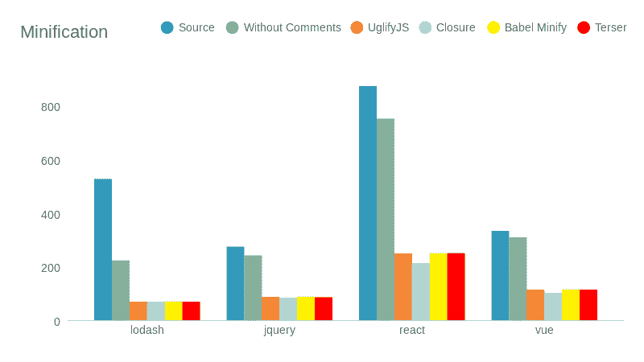
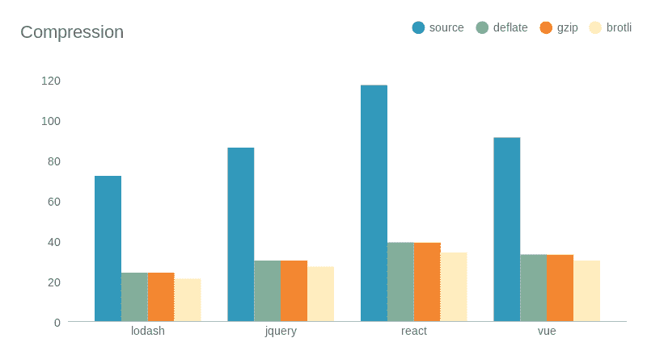
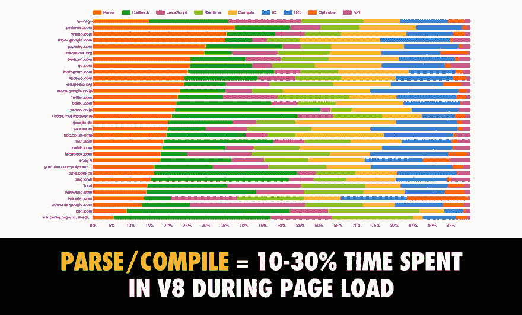
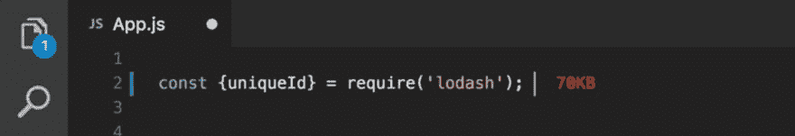
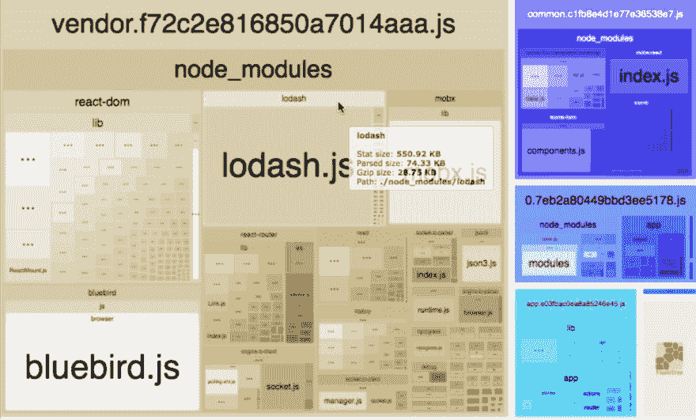
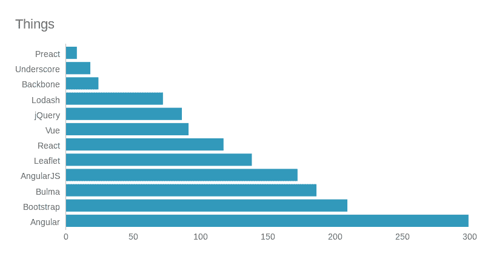
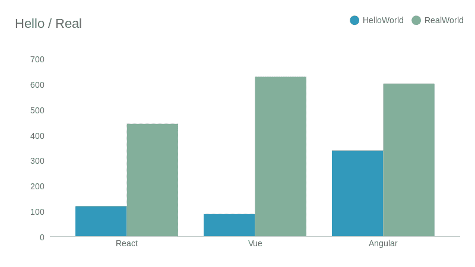

# JS 的重量

> 原文：<https://dev.to/swiip/the-weight-of-js-1aad>

JS 性能有两个主要衡量标准。第一个，也是吸引所有注意力的，是 DOM 更新，它几乎被现代框架挤爆了。它还真正取决于应用程序代码，并且通常对您的应用程序来说并不重要(当您的后端花费 2s 收集数据时，谁会关心毫秒级的渲染性能呢？).

对于第二个问题，框架经常甚至不交流真实的数字，它们把自己隐藏在应该解决问题的特性后面，比如 SSR、树抖动或延迟加载。然而，在许多情况下，这是一个比 JS 应用程序中任何其他问题都重要得多的性能问题。

> 它是您的 JavaScript 代码的权重。

永远不要忽视这样一个事实，即使我们把今天的网站视为功能齐全的应用程序，网络仍然是一个平台，当你打开一个标签时，整个应用程序都在这个平台上被下载、编译和启动。想象一下，对于 Outlook、Word 或 Photoshop 来说！

webapp 加载从下载文件的网络带宽开始，然后 CPU 对其进行解压缩和编译。代码越多，你的应用就越需要带宽和 CPU。即便如此，更多的代码最终将意味着一个更慢的应用。看看任天堂的这条推文。

> 望月隆@ mochi _ wsjSwitch OS UI 会话:在尽可能削减玩家等待时间的情况下，Switch 的 home 菜单设计资源已经不到 200KB。太神奇了。[twitter.com/mochi_wsj/stat…](https://t.co/gnINFXnFPp)2018 年 8 月 22 日下午 14:39望月隆@ mochi _ wsjホームメニューのリソースはなんと200kb 以下 https://t.co/g63Z9W9xOM170391

他们几乎不需要考虑网络问题(据我所知)，但他们非常关心应用程序的性能和流动性。

最后:“代码越少，bug 越少”。我一直很喜欢这句话。交付更少的代码(包括您和第三方的代码)对于稳定性来说总是更好的。

## 工具不能解决一切

我们现在使用的如此丰富的 Web 工具的一个很好的部分是关于限制你的 JS 的大小。所有这些技术都是很好的优化，我推荐使用几乎所有的技术。然而，优化不是解决方案，JS 的实际数量仍然是一个问题。

### 捆绑

我们在处理 JS 性能时使用的第一个工具是捆绑。我们不会为浏览器提供我们开发的那么多文件，因为我们知道对服务器的每个请求都有成本。很多时候，我们编译一个捆绑的一个、两个到五个捆绑的 JS 文件。然而，您仍然拥有和以前一样多的代码。

### 缩小

很长一段时间以来，我们一直在使用 JS minification，这意味着通过删除大部分空格和换行符以及将变量重命名为较短的名称来修改代码，以便拥有几乎相同的代码，但使用更少的字符，然后获得更小的权重。它很棒，除了可读性和可调试性之外几乎没有任何缺点，这可以用源代码地图来处理。

缩小会将你的 JS 的重量从 50%减少到 90%！(如果你有很多意见😀)

### 压缩

降低 JS 权重最神奇的方案是二进制压缩。大多数时候，你甚至不需要配置任何工具，你的 HTTP 服务器会用 Gzip 或 Brotli 压缩你的文件。关于压缩的最佳实践，请看安托万·卡隆 [写的这篇伟大的文章为什么你应该使用压缩 Webpack 插件？](https://open-blog.dev/posts/slashgear/why-you-should-use-compression-webpack-plugin/)。

像其他解决方案一样，压缩也很棒，你绝对应该使用它。然而，这并不意味着你可以免费提供任何数量的 JS。

首先，不管压缩提供了多大的减少百分比，它仍然是你的原始重量的比例:10MB 的 30%仍然是 3MB…

第二，压缩只是网络神器。通过网络传输的数据量减少了，但实际的代码量仍然相同。浏览器仍然需要解析和编译相同数量的代码。更糟糕的是，客户端必须先解压缩文件，然后才能使用它。这些步骤可能看起来不重要，但在旧的智能手机上，它可能真的很慢，有时比网络时间还要长！

以 [6play.fr](https://6play.fr/) 为例:1MB 的 JS，在我的 MacBook 上编译时间为 100ms，在 CPU 节流的情况下最高可达 500ms。

这幅插图来自于 [Addy Osmani](https://addyosmani.com/) 和它的帖子[JavaScript 的成本](https://medium.com/@addyosmani/the-cost-of-javascript-in-2018-7d8950fbb5d4)。他是这方面的重要参考，在这类事情上制定措施可能会很棘手。

请注意，大多数框架只在二进制压缩后才交流它们的大小。“Preact:快速 3kB 替代反应”，但压缩前实际大小为 8.7kB(顺便说一句，这仍然很大)

### 树摇晃

另一个减少代码量的神奇特性叫做树抖动。这是现代 JS 代码中静态分析代码中的导入的能力，以便自动检测未使用的部分并删除它们。

像 Angular 这样的框架已经在摇树上投入了很多。他们优化了自己的源代码，只导入需要的内容。这样，他们可以确保只导入框架中必要的部分，然后生成尽可能小的包。

现在默认情况下，几乎所有捆绑器都有树抖动功能。

### 服务器端渲染

首先，SSR 是 Web 框架在服务器端执行的能力，以便响应来自客户端的初始请求，提供完全计算的页面，允许用户在 JS 加载期间看到一些东西。

我是服务器端渲染的忠实粉丝，但今天我将指出它的局限性。

SSR 将减少我们所说的首次绘画的时间(TTFP)。从用户发出初始请求到用户实际看到某样东西之间的时间。这对内容网站尤其重要，对 SEO 几乎是强制性的(大多数爬虫不会执行 JS)。尽管如此，当 TTFP 发生时，你没有加载任何 JS，你的页面也不是交互式的。

JS 加载后，框架将重新开始，“水合”现有的标记，然后能够处理用户事件。我们称之为，互动时间(TTI)。

在某些方面，SSR 甚至可能适得其反。主要是因为运行框架服务器端返回静态资源时使用时间和资源比较快。还因为大多数框架，为了能够“水合”，需要使用服务器端的上下文输出，这也可以表示一些权重。

### 懒装

在单页面应用程序(SPA)的早期，我们习惯于捆绑所有的 JS 代码。这意味着一旦我们请求一个 webapp，我们就在做任何事情之前发送该应用需要的所有源代码。这很糟糕，幸运的是，框架和工具的发展使得管理 JS 代码延迟加载变得越来越容易。

一个实现良好的惰性加载机制意味着你只需要在开始的时候下载启动应用程序所需的代码。当你需要的时候，你将会加载你的代码的剩余部分。

尽管如此，如果你需要很多代码来运行你的应用程序，你还是需要加载它。

### 编译 vs 运行时

最近出现了一种新的方法。通过编译一些应用程序代码，他们可以减少要加载的库的大小。在编译器中，编译代码使用的公共代码称为运行时。

两个框架说明了这个概念。Angular 从第 4 版开始就提出在构建时编译模板代码(该特性被称为提前编译或 AOT ),以节省多达一半的大小。第二个是 Svelte，第一个框架的概念是根本没有运行时。

编译是一个有趣的策略，但是要小心适得其反。编译后的代码最终会比你的源代码大，并且在某一点上，使用运行时可能会产生一个更小的包。

### 以此类推…

有很多工具和策略可以减轻你的 JS 的重量。我没有提到所有这些，还有缓存考虑，cdn 和我肯定错过了一些。

但是你现在明白了，这些技术没有一个是绝对的，你仍然并且总是必须关心你发布的代码的权重。

## 事物的重量

为了管理你的应用程序依赖，考虑它们的重量，你必须知道东西有多重。

有一些流行的插件，如 [VS 代码导入成本](https://marketplace.visualstudio.com/items?itemName=wix.vscode-import-cost)或 [Webpack Bundle Analyzer](https://github.com/webpack-contrib/webpack-bundle-analyzer) 来显示你在代码中每次导入的权重。

它们非常花哨，但是要小心，因为问题是在代码编辑器中担心重量已经太迟了。当你选择你的筹码时，你必须事先考虑这个问题。

如前所述，通常使用不同的测量方法。主要是压缩前后。为了简单起见，从现在开始，我将使用压缩前(但缩小后)的数字。

### 常用框架和库

没有更大的评论，让我们来看看现在最常用的库的权重(如果你的库不在，很抱歉)

*   Lodash: 72kB
*   jQuery: 86kB
*   主干:42kB(包括下划线，但也需要 jQuery)
*   角度:172kB
*   反应:117kB
*   Angular:带 AoT 的 299 kb(Hello World 应用的捆绑包)，带 JiT 的 663kB
*   视图:91kB
*   预测:8kB
*   ember:733 kb(Hello World 应用程序捆绑包)
*   传单:138kB
*   引导程序:152kB 的 CSS，57kB 的 JS
*   布尔玛:186kB 的 CSS

### Hello 世界体重 vs 真实世界体重

当谈到 JS Web 框架时，数字必须进一步讨论。

现代框架是深度模块化的。Angular 认为每个模块都是框架的一部分，React 认为每个模块都是第三方。然而，您的应用程序通常需要这些模块，因此，只考虑核心框架的重量是错误的。

它可以在仅使用框架的核心模块的 hello world 应用程序和真实世界应用程序的权重之间产生重要的差异。最近大规模使用摇树技术加剧了这个问题。风险在于，一些框架会用一个非常简单的例子用很酷的数字进行交流，什么都不用，当框架的真实大小没有改变时，树的摇动实际上移除了一切。

为了执行这些措施，我将应用程序与框架捆绑在一起，一个状态管理框架，一个路由器和一个材料设计组件库(通过导入所有组件来防止树晃动)。这并不像“真实世界”的应用程序，而是非常相似。

我们看到，一个框架的初始权重并不一定表明最终结果。然而，看起来 Vue 数字主要是由于 Vuetify，它包含了很多组件。

### 你的代码的权重

在我所知道的任何其他平台上(当然它应该存在于硬件开发中),你自己代码的大小并不重要。我记得 Java 应用程序中有数百兆字节的依赖关系 jar，而我的 jar 只有一两兆字节。这不是一个关于 Java 的问题，在这种情况下，这并不重要。

在 frontend JS，你不能这么想。你的依赖必须很小，你的代码可以很快变得比你的框架大。

不一定是错的。大型 web 应用程序是存在的，它们需要代码。但是你应该意识到这是一个问题，你应该使用之前解释的所有技术来最小化重量。

例如，我曾经在一个大的 webapp 上工作，其中供应商大约有 350kb(压缩后)，具体代码也差不多。

### 其他事物的重量

到目前为止，我只谈到了 JS 文件的权重，然而一个网站是由几种不同类型的内容组成的。当你考虑你的 JS 的重量时，你也必须考虑整个图片。

你的网站肯定会包含 HTML，CSS，图像，字体，视频…

*   除了特殊情况，HTML 将会很轻，但是缩小它总是好的。
*   CSS 的重量可以从几百 kB 到超过一 MB。所以不得不考虑。死代码消除，延迟加载，缩小，所有这些技术都可以应用到 CSS 中。
*   图片通常是你网站上加载最重的东西。它们经常被用来作为避免关注 JS 文件权重的借口，因为“它只占整个页面的一小部分”。图片对你的页面权重非常重要。你必须仔细优化它，下载尽可能最小的版本，延迟加载一些，有时只是删除一些其他的。如果小心处理图像，它们会比你的 JS 轻。
*   字体是网页优化中经常被忽略的一种内容类型，但它们非常笨重，是在页面上显示某些内容的渲染瓶颈。
*   视频是一种非常特殊的内容类型。它很重，但通常不会自动启动，压缩得很好(除了 gif😂)并且大部分时间都是流式的，因此在这些情况下，它不会直接影响网站的加载时间。

根据[网站的 HTTP 存档状态](https://httparchive.org/reports/state-of-the-web)，目前平均网站权重在桌面为 1.8MB，在移动端为 1.6MB。JS 在该权重中的份额是 22%或大约 400kB(在线路上)。

### 结论

在网络这个平台上，无论你做什么，你的代码都很重要。我们有一个充满伟大的工具来优化它的生态系统，但没有银弹，在某一点或另一点上，你将不得不付出代价。

它带来了社区推进新的框架，新的特性，而不增加更多的代码行，有时甚至更少(VueJS 比 AngularJS 更小)。

它有一个非常酷的象征，每一行代码都很珍贵，制作精良，社区必须用全新的想法来发展，绝不只是在旧代码上堆积新代码。

这篇文章中的所有数据都是根据 GitHub 知识库计算出来的:

## [Swiip](https://github.com/Swiip)/[js 的重量](https://github.com/Swiip/weight-of-js)

<article class="markdown-body entry-content container-lg" itemprop="text">

# JS 的重量

这个报告旨在支持一篇关于 JavaScript 大小的文章。

下面是文章的**稿**:[https://medium . com/@ Swiip _ 51904/the-weight-of-js-44 ae2f 118506](https://medium.com/@Swiip_51904/the-weight-of-js-44ae2f118506)

你可以发表评论来帮助我，但它还没有准备好发表。

# 部分

目前计划有 4 个部分:

*   缩小:列出，运行和比较主要缩小者

*   压缩:列出，运行和比较主要的压缩算法

*   hello-world:比较不同框架下 hello world 应用程序的权重

*   全应用:比较不同框架下(几乎)真实生活中的应用权重

</article>

[View on GitHub](https://github.com/Swiip/weight-of-js)