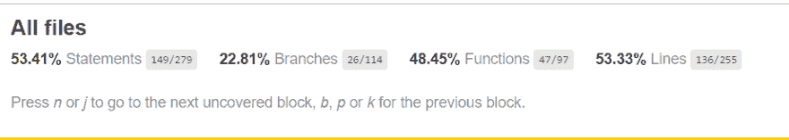

# 什么，为什么和如何反应(用钩子测试)

> 原文：<https://dev.to/mangel0111/the-what-why-and-how-of-react-testing-with-hooks-2aog>

这是关于测试 React 应用的系列文章的第二部分，如果你想查看我们谈论基本概念的第一部分，你可以在这里找到它。

今天我们将更深入地讨论测试。我将解释如何测试 react 应用程序、进行测试的最佳模式、易于使用的实用程序，以及在编写应用程序以使测试更加可靠时使 TDD/BDD 技术变得简单的一些技巧。

注意:在这篇文章中，我将用“反应-测试-库”来代替 enzyme，在我看来，它比 enzyme 更受限制，但同时也迫使你做更好的测试。

# 关于测试还需要学习什么？

在之前的帖子中，我们讨论了什么是测试，基本概念和我们可以使用的一些库，但这只是冰山一角，测试文化不仅仅是你只需要学习缩写词，然后你就可以在你的代码中应用它，它不是开发的一个独立部分。

自从我的上一篇帖子以来，发生了一件事，就是 React v16.8 的发布。当他们在我们的生活中引入 [hooks](https://reactjs.org/docs/hooks-overview.html#state-hook) 概念时，我看到很多人试图解释为什么你应该迁移到这个新事物。他们用例子向你解释了如何用钩子(useEffect，useState 等)替换生命周期的每个内部方法(componentDidMount 等)，但是当我试图找到测试钩子的人时，那里没有太多的信息。

在我的项目中，我试图迁移到 react 的最新版本，然后我将能够使用钩子，因为当我们的 React 组件变成只是一个接收数据和动作的东西时，一个更具功能性的世界的承诺，其中他唯一的责任是调用这个动作并显示他的数据，对我来说这是很容易购买的东西。

当我尝试使用我的第一个钩子时，我相信我的代码和我的测试，我相信我的测试会在出现问题时报告失败，我预计我的测试会失败。如果在用钩子将类组件迁移到组件时出现问题，我的测试应该不会出现问题。UI 应该保持不变，接收的数据应该是相同的，应该调用相同的操作，我只是将实现细节移到了我的组件中。

在我的团队中，我们使用了`just create a Class React Component if you need it`规则，这个规则对我们有用，我们只在需要处理状态时创建类组件，或者在生命周期中做一些事情(挂载、更新或卸载),否则我们使用返回组件的函数，这是一个正常的规则，我知道很多人都遵循这个规则。

当我尝试迁移我的第一个类组件时很容易，因为只使用状态，我只需要用一个`useState`替换类组件的状态。我的类看起来像这样，只是一个愚蠢的输入，当你关注输入时，它会激活标题，没有业务逻辑，没有太复杂的东西要处理。

```
export class Input extends Component {
    constructor(props){
        super(props);
        this.state = {
            focus: false
        };
    }
    render(){
        const { title, value, isFilter } = this.props;
        return(
            <div>
                {title && <LabelTitle value={value} isFocus={this.state.focus}>{title}</LabelTitle>}
                <InputForm 
                    onFocus={()=> this.setState({ focus: true })}
                    onBlur={()=> this.setState({ focus: false })}
                    {...this.props}
                />
                {isFilter && <IconInput></IconInput> }
            </div>); 
    }
} 
```

当我迁移我的组件时，现在看起来像这样:

```
export const Input = ({ title, value, isFilter, type, width, onChange }) => {
    const [focus, changeFocus] = useState(false);
    return (
        <div>
            {title && <LabelTitle value={value} isFocus={focus}>{title}</LabelTitle>}
            <InputForm
                onFocus={() => changeFocus(true)}
                onBlur={() => changeFocus(false)}
                type={type}
                width={width}
                onChange={onChange}
            />
            {isFilter && <IconInput></IconInput>}
        </div>); }; 
```

本质上是相同的组件，相同的行为，代码更少，但是我的测试是红色的，所有与输入行为相关的单元测试都失败了，当我试图理解为什么我意识到我的测试正在验证他的一个断言:

```
expect(input.state('focus')).toBeFalsy(); 
```

我意识到现在我没有一个`.state`函数，因为它不是一个类，只是一个组件，然后我也意识到我在以前的测试中过度使用了`.update()`和`setProps()`，当我编码时我的测试是正常的，但是现在我的测试与我的实现相连，如果我试图迁移到 React 的最新版本，我的测试将会失败，这意味着我需要重构我的所有测试和代码来使用`hooks`。

我正处于十字路口，我可以让代码按原样工作，没有人要求我迁移到钩子，我不需要为了使用新的东西而重构一切，但我意识到我的代码上有比钩子更大的东西，我的测试阻碍了我做出好的代码，这就是为什么我选择重构一切以使代码再次变得伟大。

但是在思考重构之前，我需要理解为什么我的测试如此依赖于实现的细节，我一遍又一遍地检查我的测试，我发现在测试中我使用了`enzyme`的`mount`和`shallow`来渲染组件，然后通过状态和道具进行检查。我也用`setProps`更新 props 来模拟接收到的数据，这在当时是可以的，但是现在 react changes(向后兼容)我不能升级，因为我把我的代码和他的测试结合在一起了。

经过长时间的研究，我发现了一个新的库来帮助我的测试，叫做[反应测试库](https://github.com/testing-library/react-testing-library)，我检查过，这个库给你的东西比酶少，你不能检查状态，道具或操纵生命周期，你只能渲染一次通过道具，通过`testid`找到并等待元素显示，检查这个:

```
test('Fetch makes an API call and displays the greeting when load-greeting is clicked', async () => {
  // Arrange
  axiosMock.get.mockResolvedValueOnce({data: {greeting: 'hello there'}})
  const url = '/greeting'
  const {getByText, getByTestId, container, asFragment} = render(
    <Fetch url={url} />,
  )

  // Act
  fireEvent.click(getByText(/load greeting/i))

  // Let's wait until our mocked `get` request promise resolves and
  // the component calls setState and re-renders.
  // getByTestId throws an error if it cannot find an element with the given ID
  // and waitForElement will wait until the callback doesn't throw an error
  const greetingTextNode = await waitForElement(() =>
    getByTestId('greeting-text'),
  )

  // Assert
  expect(axiosMock.get).toHaveBeenCalledTimes(1)
  expect(axiosMock.get).toHaveBeenCalledWith(url)
  expect(getByTestId('greeting-text')).toHaveTextContent('hello there')
  expect(getByTestId('ok-button')).toHaveAttribute('disabled')
  // snapshots work great with regular DOM nodes!
  expect(container.firstChild).toMatchSnapshot()
  // you can also get a `DocumentFragment`, which is useful if you want to compare nodes across renders
  expect(asFragment()).toMatchSnapshot()
}) 
```

在这个例子中，你有三个明确的分离，准备你的组件，作出行动，并等待断言(给定，当，然后)，它是。测试不使用任何普通用户看不到的东西，实用程序只返回这个:

```
const {getByText, getByTestId, container, asFragment} = render(
    <Fetch url={url} />,
  ) 
```

一些在渲染组件`getByText`和`getByTestId`中找到的函数，在`container`上渲染的 Html DOM 和一个帮助你制作快照的函数`asFragment`，你可以在这里找到[的完整 API](https://testing-library.com/docs/react-testing-library/api)

*注意*:今天我不相信快照，因为它们很难阅读，大多数人(包括我自己)只是通过`--update`来修复问题，我们不是读取自动生成的代码的机器，所以我不相信生成这些快照的价值，但是如果你觉得这样做很舒服，你可以这样做。

如您所见，这个库不允许您访问实现，遗憾的是 enzyme 允许。我决定迁移到这个新的库，不是因为钩子，主要原因是酶让我做让我写错测试的事情，不是酶的错，是我的错误。我总是说库是工具，代码的质量 100%取决于编写的人，而不是使用的语言、框架或库。

所以，现在我们要谈谈 TDD 的另一面，重构。当你完成开发时，重构代码是你工作的一个重要部分，在开始时编写测试有助于你理解需求，当你有需求时，使代码按你的预期工作。此外，您可以确保您的更改不会影响代码给出的值。你应该能够改变你的代码中的一切，如果你的测试总是显示你是绿色的，你可以想改进多少就改进多少，这就是好测试的美妙之处，不仅仅是测试，是保护我的代码免受我攻击的安全网。

# 为什么重构与 TDD 有关？

重构是开发过程中的一个重要阶段，在重构的时候，你不仅要让代码符合需求，你还可以改进架构，使其易于扩展，让代码的职责更加清晰，升级到新的库或功能来改进代码，就像我们用钩子做的例子一样，但是在开始重构之前，你需要很好地理解一些规则:

*   *一次重构不应该改变你软件的接口*，如果你需要改变你代码的行为，创建测试，让它失败，然后修复你的代码让测试通过，然后重构。
*   永远不要重构你不了解的任何东西我们经常发现自己在处理黑盒代码，任何人都真正了解正在做什么，我可以尝试改进这些代码，但是如果你不知道首先应该做什么，你怎么能确定在你改变之后一切都会工作？
*   只在绿色的上重构，你需要确保你的更改是正确的，所以当你的测试表明你错了的时候，永远不要试图改进代码，这里的关键是总是一步一步地编码，少量的代码是控制你的重构的简单方法，如果你使用 git，你可以使用 [fixup 和 autosquash](https://fle.github.io/git-tip-keep-your-branch-clean-with-fixup-and-autosquash.html) 来轻松控制你的更改，然后当你对你的更改满意时再挤压。
*   如果你不信任你的测试，不要重构你的代码，如果你的测试没有给你你所需要的信任，这是非常重要的，创建你所需要的测试，然后重构。

# 如何真正考好？

现在我们将尝试一个真实世界的练习，我们将继续我们的问题，尝试迁移到钩子和用酶做的测试。

我们的测试有这个信任规则，但是我不信任我当前的测试，所以我们要做的是在测试 DOM 交互上创建新的测试焦点，而不是 React 实例。

这篇文章将为我的一个名为 [Brastlewark](https://github.com/mangel0111/brastlewark-hooks) 的旧虚拟项目创建测试，这个应用程序是一个简单的 CRA 应用程序，它获取一个侏儒列表，然后在仪表板上显示侏儒，你可以过滤，当你单击一个侏儒时，你可以看到那个侏儒的详细信息，该项目使用 redux 和 saga，让我们检查我的第一个测试，这是一个验证仪表板显示没有侏儒的测试，如果有任何数据被获取。

```
 describe("Dashboard", () => {
    let store;
    beforeEach(() => {
        const sagaMiddleware = createSagaMiddleware();
        store = createStore(rootReducer, applyMiddleware(sagaMiddleware));

        sagaMiddleware.run(function* fullSaga() {
            const rootWatcher = combineWatchers(rootSaga);
            const watchers = Object.keys(rootWatcher)
                .map(type => createActionWatcher(type, rootWatcher[type]));
            yield all(watchers);
        });
    });
    it("should render empty dashboard", () => {
        const { getByTestId } = render(
            <Provider store={store}>
                <Dashboard />
            </Provider>,
        );

        expect(getByTestId("empty-gnomes-container")).toBeDefined();
        expect(getByTestId("empty-gnomes-container").textContent).toEqual("No gnomes to display");
    });
}); 
```

*注意*:我给我的 react 组件添加了数据属性，使测试变得容易，以适应我使用的新库`data-testid`来识别 UI 上的元素。

我的测试通过了，但现在你可以看到，我的测试依赖于更多的实现细节，之前，我的测试现在知道 redux 和 sagas，有中间件和商店创建，提供者，不只是渲染。但是这并不是完全错误的，因为我的测试依赖于这些东西，但是它们在我需要测试的组件之外。这是我必须能够呈现的最低要求，我的组件与 redux 和 dispatch 操作相连接，使用 React 测试库，我只是确保拥有与真实应用程序相同的基本功能。

我的测试现在不验证组件内部是什么，我不测试当前状态是什么，也不测试任何与内部属性相关的东西，现在我颠倒了测试依赖关系的顺序。

我下一步应该做的是创建一个实用程序，给我那些已经加载的依赖项，并准备好供我的测试使用，以避免重复，我说的是这样的:

```
const renderWithState = (Component, props = {}) => {
    const sagaMiddleware = createSagaMiddleware();
    const store = createStore(rootReducer, applyMiddleware(sagaMiddleware));
    sagaMiddleware.run(function* fullSaga() {
        const rootWatcher = combineWatchers(rootSaga);
        const watchers = Object.keys(rootWatcher)
            .map(type => createActionWatcher(type, rootWatcher[type]));
        yield all(watchers);
    });
    const renderedOptions = render(
        <Provider store={store}>
            <Component {...props} />
        </Provider>,
    );
    return renderedOptions;
}

describe("Dashboard", () => {
    afterEach(cleanup);

    it("should render empty dashboard", () => {
        const { getByTestId } = renderWithState(Dashboard);

        expect(getByTestId("empty-gnomes-container")).toBeDefined();
        expect(getByTestId("empty-gnomes-container").textContent).toEqual("No gnomes to display");
    });
}); 
```

现在你可以看到，使用 redux 和他的传奇创建商店的所有责任都在`renderWithState`函数上，我可以提取到另一个文件，如`test-utility`，我的测试现在看起来更简单了，我为我想要测试的组件提供了整个环境，我再也不用担心实现了。

我的应用程序只实现了 redux 和 saga，但是`renderWithState`函数可以实现和启动你需要的任何东西，你应该在那里包括所有你的基本启动逻辑，像上下文提供者(i18n，样式化组件，自定义 hoc，React 路由器等)，门户和我们的应用程序需要的一切。

这里真正的关键是定义你的测试的限制或界限，正如你现在看到的，我的测试不是单元测试，是验证业务需求的测试，最接近 BDD 对我们测试的期望，但是你可以用这种方式用 TDD 编码，对我们来说重要的是我们的测试变得快速，易于编写和易于理解，记住这一点非常重要，因为易于理解的测试比数百页的文档更好。

但是，现在我们需要测试更多的东西，我们如何将值传递给组件呢？代码调度一个 redux 动作来监听我们的 saga，然后调用端点来检索信息，所以我们现在需要做的是在测试停止时建立黄线。

对于这个测试，极限将是端点调用，我们将到达那里并模拟`fetch`，应用程序的其余部分应该在真实的条件下进行测试，调用真实的动作并像我们的真实环境一样工作。

我们要做的一件事是创建新的 API，它将为我们的测试检索重要信息，这些信息将是分派的操作，我不想我的测试直接使用或实现 redux，为了避免测试实现细节，我将创建一个存储 Utils API，就像这样:

```
class StoreUtil {
    actions = [];

    clearActions = () => {
        this.actions = []
    }

    pushAction = (action) => {
        this.actions.push(action);
    }

    getActions = () => {
        return this.actions;
    };

    getAction = (action) => {
        return new Promise(resolve => {
            let actionFound;
            while (!actionFound) {
                actionFound = this.actions.find(({ type }) => type === action);
            }
            resolve(actionFound)
        })
    }
} 
```

这个类非常简单，我们有这些动作，我们可以:

*   调用所有操作。
*   得到一个具体的行动。
*   将一个动作推送到注册表。
*   删除所有操作。

`getAction`是一个承诺，因为动作分派过程是异步的。当我们渲染我们的应用程序时，所有的 redux magic 都在引擎盖下运行，只有当 redux 改变他以前的状态时，组件才会更新。如果我们不制作`promise`和`while`，我们将会丢失比第一次渲染花费更长时间的动作。

*注意*:承诺将永远等待元素被显示，如果组件没有被渲染，jest 超时将停止测试并给出一个失败的测试，你可以改进这个代码以使它更好地工作，但这非常适合这篇文章，所以我将让它这样，你可以改进它以满足你的需要。

我还创建了一个新的中间件，它将监听每个被调用的动作，并将每个动作推送到`StoreUtil`，现在我们的`renderWithState`包含了这个中间件，并返回了带有其余呈现选项的`storeUtil`。

```
const loggerMiddleware = (storeUtil) => store => next => action => {
    storeUtil.pushAction(action);
    next(action);
};

export const renderWithState = (Component, props = {}) => {
    const storeUtil = new StoreUtil();
    storeUtil.clearActions();
    const sagaMiddleware = createSagaMiddleware();
    const store = createStore(rootReducer, applyMiddleware(loggerMiddleware(storeUtil), sagaMiddleware));
    sagaMiddleware.run(function* fullSaga() {
        const rootWatcher = combineWatchers(rootSaga);
        const watchers = Object.keys(rootWatcher)
            .map(type => createActionWatcher(type, rootWatcher[type]));
        yield all(watchers);
    });
    const renderedOptions = render(
        <Provider store={store}>
            <Component {...props} />
        </Provider>,
    );
    return { ...renderedOptions, storeUtil };
} 
```

*注意*:如果你对中间件、redux 和 saga 术语感到困惑，看看这些帖子，它们很好地解释了[的基本](https://redux-saga.js.org/docs/introduction/BeginnerTutorial.html)和[的复杂](https://medium.com/@alearce_45338/redux-selectors-sagas-middlewares-and-more-6e803e97f21)。

现在在我们的测试中，我们可以验证一个动作被调用:

```
it("should dispatch the fetchGnomes Action", async () => {
        const { storeUtil } = renderWithState(Dashboard);

        const fetchGnomesAction = await storeUtil.getAction("FETCH_GNOMES");

        expect(fetchGnomesAction).toEqual({ "payload": { "params": {} }, "type": "FETCH_GNOMES" });
    }); 
```

我们测试的最后一个断言比较 action redux 对象，对我来说这看起来像是一个实现细节，我们可以做的是替换这个断言来检查有效负载是否用正确的信息调用，就像这样:

```
 it("should dispatch the fetchGnomes Action", async () => {
        const { storeUtil } = renderWithState(Dashboard);

        const fetchGnomesAction = await storeUtil.getAction("FETCH_GNOMES");

        expect(fetchGnomesAction.payload).toEqual({ "params": {} });
    }); 
```

现在，我们的测试对内部动作和模型知之甚少，只是验证调用端点的参数。这意味着我们的测试是验证代码接口，现在赋予了更多的价值，使测试更容易扩展和理解。

我们测试的下一部分验证边界和我们的接口，我现在需要的是检索信息，所以我需要模拟 fetch API 调用来检索我想要的东西，我正在使用 Javascript Fetch native API，显然，我不想我的测试关心这个，我总是想隐藏我在测试中使用的东西，因为我可以使用 Axios、request 或任何其他库，我的测试应该处理模拟， 在不知道使用哪个依赖项的情况下，我创建了一个名为`fetchApi`的包装器来调用资源，这个函数是唯一知道我用什么来发出 REST 请求的函数:

```
export const fetchApi = (url, {
    method = 'GET',
    params,
    cache= 'no-cache',
    headers = {
        'content-type': 'application/json'
    },
    data
}) => {
    let paramText = queryString.stringify(params);
    paramText = paramText ? `?${paramText}` : '';

    return fetch(`${url}${paramText}`, {
        body: JSON.stringify(data),
        cache,
        headers,
        method, // *GET, POST, PUT, DELETE, etc.
    }).then(response => {
        return response.json();
    }).catch(error => { 
        return { error }; 
    });
}; 
```

我将创建一个新的 fectApi 测试工具来模拟它，并为我的测试设置模拟答案。

```
export class FetchUtilsMock {
    mockedFetch;
    constructor(fetchApi) {
        this.mockedFetch = fetchApi.mockReset();
    }

    setResponse = (payload) => {
        this.mockedFetch.mockReturnValue(payload)
    }
} 
```

是一个简单的函数，它将存储模拟，然后我们可以模拟我们想要的响应，构造函数重置模拟以避免测试中的问题，您可以在每次需要时调用 set response 方法，`mockReturnValue`是 jest 模拟允许实现的函数。

```
import fetchApi from '../../utils/api-utils';

jest.mock('../../utils/api-utils');

const emptyResponse = {
    "Brastlewark": []
}

describe("Dashboard", () => {
    let fetchUtil;

    afterEach(cleanup);

    beforeEach(() => {
        fetchUtil = new FetchUtilsMock(fetchApi);
    })

    it("should render empty dashboard", () => {
        fetchUtil.setResponse(emptyResponse);
        const { getByTestId } = renderWithState(Dashboard);

        expect(getByTestId("empty-gnomes-container")).toBeDefined();
        expect(getByTestId("empty-gnomes-container").textContent).toEqual("No gnomes to display");
    }); 
```

这是测试现在的样子，我用`jest.mock('../../utils/api-utils');`模拟我的`api-utils`，在`beforeEach`上，我实例化模拟实用程序，然后每个测试将定义响应。我`mocking`现在是一个空响应，但我们可以模拟多种场景和响应，我们的测试现在允许我们测试不同的可能(和真实)响应来测试我们的应用程序。

您可以模仿应用程序中的任何其他集成，比如 REST 请求、数据库、Redis、队列或任何您需要的东西。这里重要的是始终包裹你的集成边界，使它易于测试和开发，用这种策略你可以改变你的依赖关系而不用重构你的整个应用程序。

下一个逻辑步骤是模拟一个快乐路径场景，我将使用有效数据设置响应，然后验证侏儒是否显示，我将使用 react-testing-library 中的一个名为`waitForElement`的实用程序，您也可以使用其他与 [async-await dom 相关的工具在这里进行测试](https://testing-library.com/docs/dom-testing-library/api-async)，这将等待元素显示并返回具有`data-testid="gnome-box-container"`
的组件

```
const correctAnswer = {Brastlewark: [...]} // mock data with valid information

it("should dispatch the gnomes", async () => {
        fetchUtil.setResponse(correctAnswer);
        const { getByTestId } = renderWithState(Dashboard);

        const boxContainer = await waitForElement(() => getByTestId("gnome-box-container"));

        expect(boxContainer.children.length).toEqual(correctAnswer.Brastlewark.length);
    }); 
```

我会将`correctAnswer`和`emptyAnswer`常量移动到一个文件中，在那里我可以隔离我的模拟数据，这样，如果模型发生变化，我只需要更新一个文件，我的应用程序的所有测试都不必负责创建数据。

# 总是在重构之前进行测试

正如你所看到的，我只是为我现有的代码创建测试，我编写测试来验证我的代码如我所预期的那样工作，然后我将转移到钩子上。对于我的新测试，我使用哪个库的细节是不相关的，他们只关心，显示或不显示 DOM 上的一些东西，接下来我们将测试交互，点击和提交数据，但在我检查我的覆盖范围之前，我使用 CRA3.0 给我的同一个报告器，让我们检查一下:

[](https://res.cloudinary.com/practicaldev/image/fetch/s--tHFFQ-IG--/c_limit%2Cf_auto%2Cfl_progressive%2Cq_auto%2Cw_880/https://thepracticaldev.s3.amazonaws.com/i/o5n3xws42mar07yi4acm.PNG) 
*注意*:为了能够使用 CRA 覆盖率报告，我在我的 package.json 上创建了一个脚本，如下:`"test:ci": "npm test -- --coverage --watchAll=false",`

正如你所看到的，我的覆盖率很低，但我确信我的测试很好，至少我测试的东西如我所想的那样工作，覆盖率是不同值的指示器，`branches`告诉我们，我们有很多开关，if，for 循环等等。我们并没有测试所有可能的场景，在大多数情况下获得 100%的覆盖率是值得的，作为开发人员，我们的一个很好的练习是阅读这些报告，并验证您是否真的需要测试这些条件，在某些情况下，您会发现代码正在保护您免受不可能发生的条件的影响，不要试图达到 100%只是因为这是规则，尝试尽可能覆盖最真实的场景，理解这些案例，然后重构或测试它，如果您觉得您必须这样做。

# 让我们开始互动吧

一个 UI 不仅仅是显示，我们有交互，但是我们如何测试它呢？对我来说，过去一个正常的例子是使用浅层成分的酶实例，它产生了这样的东西:

```
const wrapper = mount(<Stateful />);
const instance = wrapper.instance();

instance.clickButton(); // Internal method

expect(...).toEqual(...); 
```

这给了我覆盖率，在某种程度上，我在测试按钮点击，这种方法有什么问题？嗯，我正在使用`clickButton`方法，我的测试从来没有真正点击过任何东西，我错误地将我的测试与内部方法结合起来，因为现在我想迁移到一个功能组件，而这个测试不支持它，我的测试阻止我改进我的代码。

另一件在我的酶测试中很常见的事情是:

```
const wrapper = mount(<Foo />);

expect(wrapper.find(<Clicks />).children.length).to.equal(0);
wrapper.find('a').simulate('click');
expect(wrapper.find(<Clicks />).children.length).to.equal(1); 
```

这是我接近一件好事，我在寻找一个组件在`Foo`里面，然后在 DOM 上验证他的孩子，我模拟一个真正的点击在`wrapper`上，我不关心内部方法，是一个更好的测试的好步骤，但有一点是错误的，我假设`<Clicks />`将在 Foo 里面，如果我改变组件，我将不得不改变所有使用它的测试， 我还假设`a`元素存在，如果将来`a`变成了`button`会破坏我的测试，这时我不应该关心我点击了哪个 html 元素。 在这里，即使在一个更好的测试中，我也依赖于一个内部实现来使我的测试通过。

为了改进这些测试，你可以这样做:

```
const wrapper = mount(<Foo />);

expect(wrapper.find('[data-testid="clicks-container"]').children.length).to.equal(0);
wrapper.find('wrapper.find('[data-testid="clicks-action"]'').simulate('click');
expect(wrapper.find(wrapper.find('[data-testid="clicks-container"]').children.length).to.equal(1); 
```

现在我基于`data-testid`进行测试，两者都是抽象的，`clicks-container`表示信息`his children's`将指示我点击了多少次，而`clicks-action`表示一个可点击的元素，我不关心是哪种类型，只是可点击的事实在我的测试中很重要。

您可以看到我是如何使用 enzyme 改进我的测试的，为了让您明白不必迁移到新的库来编写更好的测试，这里真正重要的是您如何编写测试，它们有多清晰，运行有多孤立，而不是所使用的库。

有了 react 测试库，你就有了模拟 DOM 上事件的`fireEvent`，这是一个非常强大的工具，在这里查看他的[文档](https://testing-library.com/docs/dom-testing-library/api-events)，我的测试将找到输入，然后将输入值更改为第一个 gnome 名称值，然后验证是否只显示了正确的 gnome。

```
 it('should filter the gnomes', async () => {
    fetchUtil.setResponse(correctAnswer);
    const { storeUtil, getByTestId } = renderWithState(Dashboard);
    const gnomeName = correctAnswer.Brastlewark[0].name;
    const gnomeId = correctAnswer.Brastlewark[0].id;
    const filter = await waitForElement(() =>
      getByTestId('gnomes-filter-input')
    );

    fireEvent.change(filter, { target: { value: gnomeName } });

    await storeUtil.getAction('GNOMES_FILTERED');
    const boxContainer = await waitForElement(() =>
      getByTestId('gnome-box-container')
    );
    expect(boxContainer.children.length).toEqual(1);
    const gnomeDetails = await waitForElement(() =>
      getByTestId(`gnome-box-item-${gnomeId}`)
    );
    expect(gnomeDetails.textContent).toEqual(gnomeName);
  }); 
```

*   假设我收到了正确的信息，我有输入来过滤侏儒。
*   当我寻找我的侏儒时
*   然后我只看到那个侏儒

正如你所看到的，我的测试遵循了给定的模式，我验证了业务需求在我的代码中被提交了。现在我可以开始把我的代码移植到钩子上，测试应该不会中断。

# 变种人身上的代码和角码

让我们假设我们处于正常的流程中，你需要编码一个需求，这个需求有 3 个你需要交付的验收标准，你测试它并编码，3 个原始的需求已经被开发出来，你经常会发现有更多的东西不只是 3 个需求，你有一些奇怪的情况需要验证以避免将来的错误。

作为开发人员，您需要验证的一件事是，您的代码支持这些奇怪的极端情况。如果您对这些新场景中应该有哪些行为有任何疑问，您需要与将接受开发的人(Po、代理 PO、利益相关者、客户等)交谈，他作为所有者应该向您指出应该遵循哪条道路，但无论如何，您都应该忽略这一点。 如果您觉得代码需要测试来验证一个极限情况，您必须创建测试并添加到代码中，因为这将在将来当您或任何人不理解这些极限情况背后的原因时造成更多的痛苦。

TDD 帮助你控制开发，BDD 帮助你理解业务，但是有时候你需要做测试来验证当事情不像你期望的那样正常时代码工作，永远记住墨菲定律:“如果你给他们一个机会，事情在任何给定的情况下都会出错”。

`mutants`是一个不同的话题，突变一代是一种测试策略，你故意修改你的代码，并检查测试是否正常，如果你改变你的代码，比如删除一行，将`>`改为`=>`，包括一个“！”在断言之前，然后你的测试表明一切正常，你的代码是错误的。是一个健康的过程，在你的代码上测试突变体，检查你的测试套件有多健壮，有一些库可以帮助你， [Stryker js](https://stryker-mutator.io/) 是最受欢迎的库之一，当你测试你的应用程序时，你需要考虑所有这些，每种类型的测试给出不同的值，所有这些都有助于你成为一个更好的开发者。

# 结论

今天，我们使用 react 测试库测试 React 应用程序，模拟真实的环境，我们谈论良好测试对创建可维护、可扩展和可理解的代码的重要性，在测试之外拥有实现细节的重要性，以及如何模拟我们的边界，让我们的应用程序像普通应用程序一样运行，如果我们不断改进我们的测试，我们会发现一个安全网，让我们在构建令人惊叹的应用程序时实现、玩和获得乐趣。

考虑到我使用的术语像场景、责任、测试的无实现细节、模拟、创建模拟的实用工具等等，这些词汇是所有开发团队都应该知道和处理的。当一个团队理解了为什么这些词很重要时，你可以说你的团队有一种测试文化，这种文化会让你在周末更加信任你的代码。

# InTheTestsWeTrust

查看我以前的帖子

*   [什么，为什么以及如何反应(测试)](https://dev.to/mangel0111/the-what-why-and-how-of-react-testing-2702)
*   [什么，为什么和如何反应(风格)](https://dev.to/mangel0111/the-what-why-and-how-of-react-styles-2a0k)
*   [什么，为什么以及如何反应(路由器)](https://dev.to/mangel0111/the-what-why-and-how-of-react-routers-41b)
*   [什么、为什么以及如何反应(高阶组件)](https://dev.to/mangel0111/the-what-why-and-how-of-react-high-order-components-3ko1)
*   [什么时候 SCRUM 不是正确的选择？](https://dev.to/mangel0111/when-scrum-is-not-the-correct-choice-ae8)