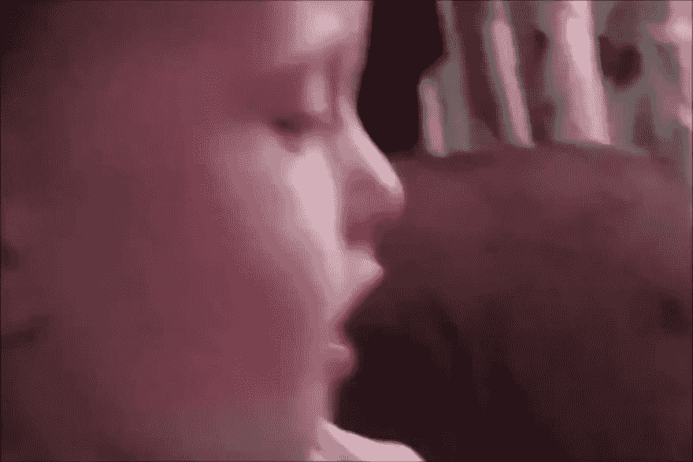
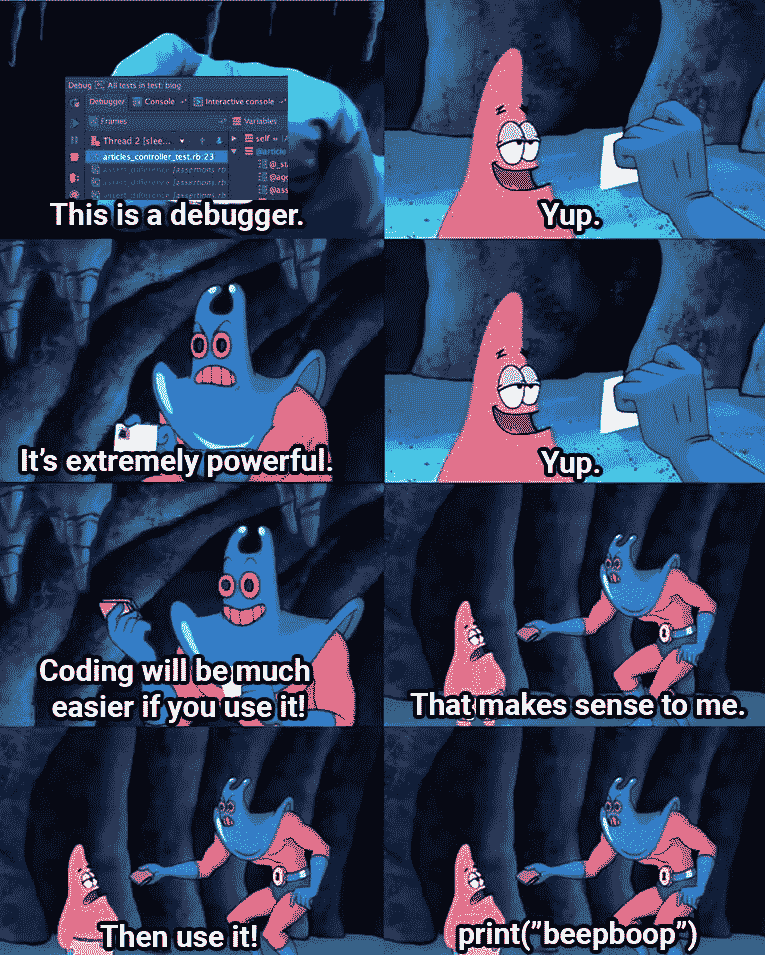

# 凯特最糟糕的一面

> 原文：<https://dev.to/ctrlshifti/the-worst-of-kat-7d9>

我今天已经没有创造力了，所以我只打算汇编我最成功地恐吓 Twitter 的内容。希望你喜欢！

> 卡特琳娜·博罗迪纳@凯瑟琳拉 _作为开发者，我们非常幸运。我们的热情恰好是非常有利可图和受欢迎的。其他职业不会出现这种情况。
> 
> 如果一个医生痴迷于手术，并在空闲时间做手术，他们最终会上新闻01:37AM-01 Jun 20193321352

> Katerina Borodina@ Kathy ra _2019 年 6 月 13:368804185

> <video loop="" controls=""><source src="https://video.twimg.com/ext_tw_video/1139696050564788225/pu/vid/1080x720/jPZYommvmtFkHuiB.mp4?tag=10" type="video/mp4"></video>Katerina Borodina@ kathyra _同事给我看我 3 年前写的代码:你能告诉我它是做什么的吗？
> 
> 我:00:48AM-2019 年 6 月 15 日55210

> 卡特琳娜·博罗迪纳@凯瑟琳拉 _艺术家:
> “我用水彩！”
> “太酷了！我画油画。”
> 
> 音乐家:
> “我弹吉他。”
> “有病！我是鼓手，我们应该找个时间一起演奏。”
> 
> 程序员:
> “我用 React。”
> “有角是最好的，我他妈的要和你打。你住在哪里？我来找你了"07:19AM-2019 年 6 月 17 日13495520

> Katerina Borodina@ Kathy ra _2019 年 6 月 21 日上午 06:552971033

> 卡特琳娜·博罗迪纳@凯瑟琳拉 _我是一名 10x 开发者。我写 10 倍正常量的 bug01:14am-22 Jun 201974554

> 卡特琳娜@凯瑟琳 _💁‍♀️大家好，我正在学习 Javascript！
> T13】🙋‍♂️学反应过来了！
> 🙅‍♂️错了！学棱角！
> 🤷‍♂️你听说过我们的主和救世主吗，Vue？
> 🤦‍♂️和香草 JS 呆在一起！
> 🙆‍♂️用 CSS 做所有的事情！
> 💁‍♂️ Javascript 是垃圾，你们都是白痴。只有后端开发才是真正的开发。
> 
> 🚶‍♀️2019 年 6 月 22 日上午 10:4410476377

> 卡特琳娜·博罗迪纳@凯瑟琳拉 _*找到一个需要 30 分钟编码的解决方案*
> 
> 这不行
> 
> *花接下来的 7 个小时找到一个只需要 20 分钟编码的解决方案*
> 
> 完美。又是一个多产日2019 年 6 月 29 日上午 10:44138928

