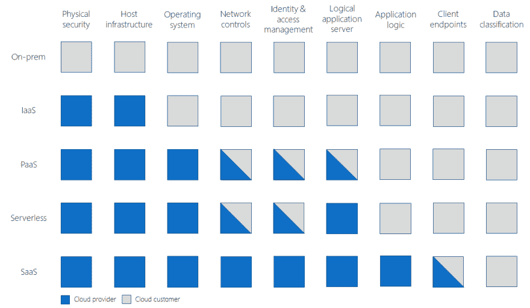

# 如果你没有服务器，他们就不能黑你的服务器，对吗？

> 原文：<https://dev.to/mattchenderson/they-can-t-hack-your-servers-if-you-don-t-have-any-servers-right-246a>

> 本文是 [#ServerlessSeptember](https://dev.to/azure/serverless-september-content-collection-2fhb) 的一部分。在这个无服务器的内容集合中，您可以找到其他有用的文章、详细的教程和视频。9 月份，每天都有来自社区成员和云倡导者的新文章发布，没错，每天都有。
> 
> 在[https://docs.microsoft.com/azure/azure-functions/](https://docs.microsoft.com/azure/azure-functions/?WT.mc_id=servsept_devto-blog-cxa)了解更多关于微软 Azure 如何实现你的无服务器功能。
> 
> 如果你喜欢视频，这篇文章中的一些内容在我在几个无服务器日活动([伦敦 2018](https://www.youtube.com/watch?v=2Oq_U6J82ks) ，[特拉维夫 2019](https://www.youtube.com/watch?v=rJBCRhrfnak) )上的演讲中有所涉及。

我最后谈了很多关于无服务器安全的内容。虽然我还没有从这篇文章的标题中得到确切的问题，但在这些对话中肯定会出现一些*期望*。是的，通过选择无服务器，您已经设置了一个良好的基准安全状态。但是无服务器并不是让你的应用无懈可击的灵丹妙药。我认为完全有理由问:**如果服务器能黑掉你的应用程序，它们还重要吗？**

剧透:他们没有。我们的应用不仅仅是我们的服务器。它们是服务的集合。它们是我们支持的操作实践。他们本身是会犯错误的。

当你提到“云安全”这个词时，几乎可以肯定有人会提出“共同责任模型”，它描述了安全的某些方面是云提供商的负担，而某些方面是云客户的负担。我喜欢这样画它:

[](https://res.cloudinary.com/practicaldev/image/fetch/s--eizGqEEW--/c_limit%2Cf_auto%2Cfl_progressive%2Cq_auto%2Cw_880/https://thepracticaldev.s3.amazonaws.com/i/jcmwa7km5omzvpwmm7fz.png)

在构建无服务器应用时，我们仍然需要关注很多事情。有时，我认为无服务器的炒作周期和一些混乱导致人们忘记了这一点。我一直对“风险补偿”的概念着迷这里的观点是，如果人们感到更安全，他们会冒更大的风险。一个经典的例子是，戴头盔的骑车人比不戴头盔的人更有可能在交通中更具攻击性。那么，从我们不必担心的角度来看，当我们不断谈论“无服务器”时，您认为会发生什么？

# 无服务器中常见的陷阱

开放网络应用安全项目(OWASP)发布了[十大安全漏洞](https://www.owasp.org/index.php/Category:OWASP_Top_Ten_Project)的列表，这些年来你看到了一个可怕的趋势:列表变化不大。这意味着我们总体上仍然很不擅长这些。你猜怎么着？所有这些仍然适用于无服务器应用程序。OWASP 甚至有一个方便的无服务器的[解释。你可能认为你永远不会制造这样的漏洞，但这是制造漏洞最可靠的途径。](https://www.owasp.org/index.php/OWASP_Serverless_Top_10_Project)

我们来看一些行动中的问题。这里有一个很好的小函数，用来感谢在 GitHub 上打开拉请求的人:

```
module.exports = function (context, payload) {
    if (payload.action != "opened") {
        context.done();
        return;
    }
    var comment = { "body": "Thank you for your contribution! We will get to it shortly." };
    if (payload.pull_request) {
        var pr = payload.pull_request;
        context.log(pr.user.login, " submitted PR#", pr.number, ": ", pr.title);
        SendGitHubRequest(pr.comments_url, comment, context); // posting a comment
    }
    context.done();
};

function SendGitHubRequest(url, requestBody, context) {
    var request = require('request');
    var githubCred = 'Basic ' + 'mattchenderson:8e254ed4';
    request({
        url: url,
        method: 'POST',
        headers: {
            'User-Agent': 'mattchenderson',
            'Authorization': githubCred
        },
        json: requestBody
    }, function (error, response, body) {
        if (error) {
            context.log(error);
        } else {
            context.log(response.statusCode, body);
        }
    });
} 
```

你看到了吗？检查我在哪里分配`githubCred`。我好像在源代码里留了一些凭据！这很糟糕，但肯定只会发生在其他人身上，对吗？嗯，这比你想象的要普遍得多，但是有各种各样的工具可以帮助你。值得一提的是，任何传统应用程序都可能发生这种情况。那么，为什么要在无服务器的环境中提出这个问题呢？

你在这里看到的大多数解决方案都依赖于身份和权限。权限是困难的，尤其是当你在函数的粒度上谈论它们的时候。在 Azure 中，我们有一个被称为“功能应用”的概念，它只是共享代码、配置或管理的功能的集合。因此，如果我将具有不同权限需求的函数分组，最终可能会将所有权限授予所有函数。这违反了最小特权原则，这种过度增长非常普遍。我应该尽可能把东西分成不同的功能应用。

那么这个代码怎么样呢？这里怎么了？

```
module.exports = function (context, req) {
    if (req.body && req.body.name)) {
        context.res = {
            status: 202
        };
        context.bindings.outQueueMessage = {
            action: "delete",
            target: req.body.name
        };
    }
    else {
        context.res = {
            status: 400,
            body: "Please pass a name in the request body"
        };
    }
    context.done();
}; 
```

我要说的是，我只是接受输入，并通过队列(通过`target`属性赋值)向下游传递数据。这是一个问题，因为现在*我们不知道下游*是什么。你想知道吗？就是这个:

```
var Connection = require('tedious').Connection;  
    var config = {  
        //... Get from env vars
    };  
var connection = new Connection(config);
connection.on('connect', function(err) {  
    console.log("Connected");
});

//...

module.exports = function (context, myQueueItem) {
    if (myQueueItem.action === "delete") {
        let request = new Request("DELETE FROM Inventory WHERE ItemName='" + myQueueItem.target + "';", function(err) {  
         if (err) {  
            console.log(err);}  
        });  
        connection.execSql(request);  
    }
    context.done();
}; 
```

为什么，这是 SQL 注入的弱点！这种注入可能看起来很极端，但是想象一下这是一个第三方依赖问题，或者真的是其他什么问题。是的，这个函数绝对应该验证输入，但是我认为质疑它之前的函数也是公平的。它可以更好地管理整个应用程序，确保它不会引入恶意负载，让其他人成为牺牲品。

对于许多人来说，这是一个令人不舒服的想法，有时你会看到将微服务部署到一个应用程序的团队之间互相指责。如果你遇到这种情况，请记住这句话“这不是我的错，但这是我的责任。”归根结底，这是一个团队的努力，应用程序安全性是每个人的责任。

# 更安全无服务器

那我们该怎么办？我们如何为无服务器安全的成功做好准备？这是一个有趣的问题，因为我们没有所有的工具，我们可能会习惯于从服务器整天。也就是说，无服务器平台在安全特性和网络选项方面已经有所发展，无服务器安全工具生态系统已经非常成熟。

在一天结束时，我看到团队需要进行的主要调整与您在分布式系统对话中发现的调整是相同的。但是对于许多团队来说，无服务器是他们引入更多分布式架构的重要方式。可观察性是关键，围绕无服务器可观察性有很多很好的讨论。如果你在使用 Azure，一定要为你的应用设置[应用洞察](https://docs.microsoft.com/azure/azure-monitor/app/app-insights-overview)。

一般来说，请利用您的云提供商内置的任何安全功能！我不断发现一些人甚至不知道 Azure 安全中心或 T2 管理的身份。不是所有的东西都是免费的，但是有很多功能是免费的，其中一些就像按下开关一样简单。

还要检查哪些东西可以插入到您的 DevOps 管道中。这是一个为您的组织集中各种安全实施的绝佳场所，同样，有许多事情您只需扳动开关即可实现。总的来说，在 DevSecOps 领域有一些非常酷的发展。我看到越来越多的无服务器技术应用成为自动化工具，来帮助团队提高安全性。这是一个非常有趣的趋势，我认为这里有很大的前景。

这可能不是你希望的迷人答案，但事实是，勤奋和威胁建模始终是良好的实践。老实说，即使在我们现有的应用程序中，我们也可能做得不够。我知道我为此感到内疚。最重要的是要有发展的意愿。从本质上来说，无服务器关乎生产力，但这并不意味着我们要抄近路。也许我们从某些操作中恢复的一些时间可以用于改进我们的安全实践。

# 不断学习

如果你想了解更多，这里有很多很棒的内容。我发现以下几点特别有用:

*   安德烈亚斯·格林的《无服务器世界的实用认证》
*   [Tanya Janca 的 AppSec](https://aka.ms/GettingStartedWithAppSec) 入门
*   [崔琰对无服务器安全的多重威胁](https://hackernoon.com/many-faced-threats-to-serverless-security-519e94d19dba)
*   [呼唤$@*！安全:文化挑战](https://acloud.guru/series/serverlessconf-sf-2018/view/129c63e4-9cbf-9b90-d500-3193d5af9855)

我还发现无服务器社区和 DevSecOps 社区通常都非常容易接近。如果可以的话，我当然会去看看当地的聚会和用户组！这是利用这些技术变得更好的最好方法之一，结果你可能会遇到一些很棒的人！