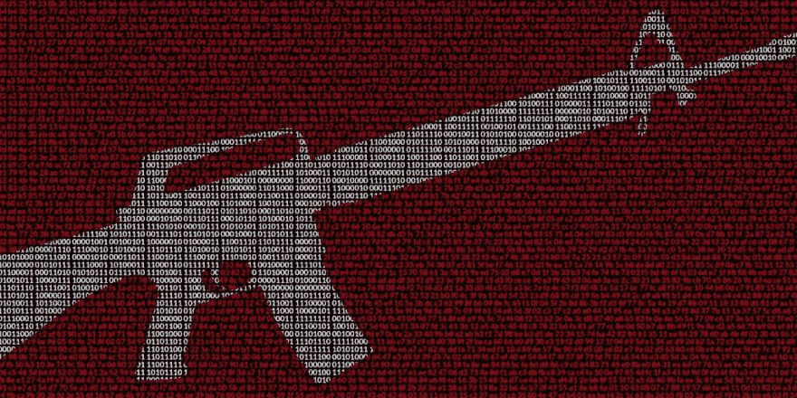
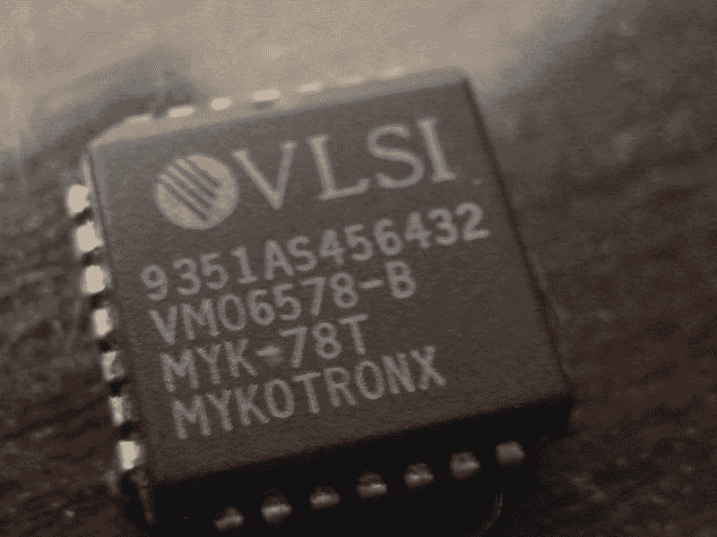

# 控制加密的人

> 原文：<https://dev.to/bootdotdev/they-who-control-encryption-54op>

任何看过电影[模仿游戏](https://en.wikipedia.org/wiki/The_Imitation_Game)或者在学校学习过计算机科学的人，可能至少对[谜](https://en.wikipedia.org/wiki/Enigma_machine)、[艾伦图灵](https://en.wikipedia.org/wiki/Alan_Turing)以及二战期间发生的其他一些有趣的密码学有一个简要的了解。在此期间，直到 20 世纪 70 年代，世界各地的政府几乎完全控制了所有的加密系统。

1976 年，惠特菲尔德·迪菲和马丁·赫尔曼发明了公钥密码学。这种新型的非对称加密技术不仅革新了加密技术，而且首次允许公众使用。

## 暗战

<figure> 

<figcaption>[来源](https://www.dailydot.com/layer8/encryption-crypto-war-james-comey-fbi-privacy/)</figcaption>

</figure>

当公钥加密技术刚被发明出来的时候， [NSA 试图限制访问并保持工作的机密。美国国家安全局和军方是美国唯一有权使用安全加密标准的实体。自从强加密技术向公众开放以来，政府已经使用了许多策略来控制加密技术。](https://www.bbc.com/news/technology-35659152)

冷战期间，美国将加密技术归类为军需品，允许国务院控制该技术的出口。换句话说，即使美国人在技术上有所发现和进步，他们也不一定会与其他国家的人分享这些发现。

clipper 芯片是克林顿政府试图让公司使用一种特定的芯片进行加密，政府可以通过后门进入这种芯片。

<figure> 

<figcaption>削波芯片</figcaption>

</figure>

2013 年，爱德华·斯诺登透露，美国国家安全局有一个名为 [Bullrun](https://www.nytimes.com/2013/09/06/us/nsa-foils-much-internet-encryption.html?pagewanted=2&_r=2) 的秘密项目，目的是破解加密通信，以获取公民的私人信息。

2014 年，时任联邦调查局局长的詹姆斯·科米[呼吁通过提供加密产品的公司交给政府的密钥，对所有安全通信进行前门访问](https://www.schneier.com/blog/archives/2014/10/more_crypto_war.html)。

<figure> 

<figcaption>詹姆斯·科米，FBI</figcaption>

</figure>

2019 年，美国国会议员布拉德·谢尔曼呼吁国会[通过立法，将比特币和加密货币购买定为非法](https://www.youtube.com/watch?v=IkC-uXMoy4c)。

## 它永远不会结束

我们以为随着 2000 年电子通信法案第一部分被删除，开源加密技术被公众广泛使用，2005 年的加密战争已经结束。然而，很明显，仍然有当权者希望政府能够控制和审查所有的金融交易和网上交流。

保持在线安全，牢记你的自由。自由不是政府赋予的，它们是应该不惜一切代价保护的简单人权。