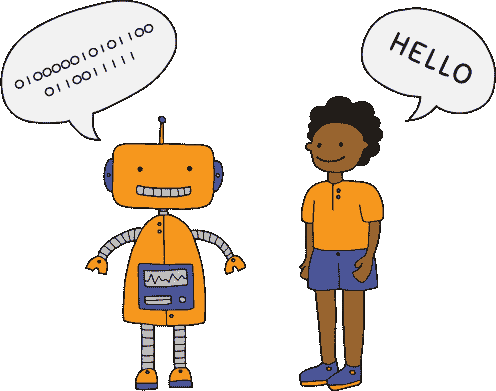
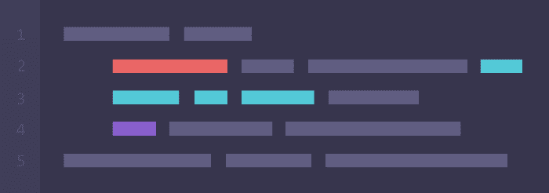
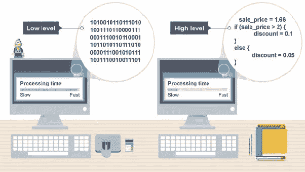
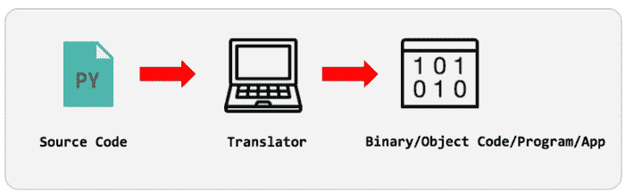

# 学习第一门编程语言之前要知道的事情

> 原文：<https://dev.to/prateekarora/things-to-know-before-starting-your-first-programming-language-4h61>

## 什么是编程语言，我们为什么需要编程语言？？

编程语言是我们用来告诉计算机做什么的。

[](https://res.cloudinary.com/practicaldev/image/fetch/s--99exy6JR--/c_limit%2Cf_auto%2Cfl_progressive%2Cq_auto%2Cw_880/https://miro.medium.com/max/496/0%2AxWveD227uuLHCZCZ.png)

编程语言是我们向电气系统传达信息的一种方式。它可以是一台电脑，一台电子洗衣机，你的手机或任何你使用的电器。

> 简单来说，编程语言充当了用户和系统之间沟通的桥梁。

你知道二进制码 2 是 10 吗？它们代表两种状态:开(1)和关(0)。您可以从[这里](https://codebeautify.org/text-to-binary)转换您的文本

计算机以二进制形式相互交流，就像这样:

`0011101010101111000111`

想象一下，如果市场上没有编程语言，会发生什么？我们必须告诉计算机在屏幕上为网站创建一个红框。

在英语中，我们说:

**创建一个盒子。**

当然，有直边的，有弯边的？

把它变成红色。

等边缘变红还是整个都变红？

让它充满屏幕。

屏幕呢？

屏幕，我正在看的东西。

你在看什么？

哦，算了吧。

现在看到问题了吧？

这个系统不是为理解人类语言而设计的。为了解决这个问题，我们需要一种与系统交流的语言。那么编程语言是做什么的。编程语言允许我们用计算机能理解的语言向计算机发出指令。

[](https://res.cloudinary.com/practicaldev/image/fetch/s--tnP3mszX--/c_limit%2Cf_auto%2Cfl_progressive%2Cq_auto%2Cw_880/https://miro.medium.com/max/700/0%2AwCSm1ixAiZThnV37)

> 程序是一组指令，告诉计算机执行什么任务。编写代码格式和指令集组合的规则称为语法。

语法类似于英语中写句子的拼写、时态和标点符号。

## 编程语言的种类

有两种编程语言:-

## 1。高级语言

## 2。低级语言

[](https://res.cloudinary.com/practicaldev/image/fetch/s--vOT4AhhN--/c_limit%2Cf_auto%2Cfl_progressive%2Cq_auto%2Cw_880/https://miro.medium.com/max/602/1%2ASM50SlPOx2byQEuD7C5SMA.jpeg)

***高级编程语言*** 人类很容易理解。它是由开发人员创建的，这样程序员在与系统交流时就不会遇到任何困难。例如:- JS，Python🐍，等等更多。

*低级语言是为了直接与计算机硬件打交道而设计的。低级语言更接近系统💻。*

 *计算机需要一种方法把我们的程序理解成系统能理解的二进制代码。为此，我们需要一名翻译。

## 译者

翻译器是一个把你的代码转换成机器语言的程序。

[](https://res.cloudinary.com/practicaldev/image/fetch/s--HXj3pDFg--/c_limit%2Cf_auto%2Cfl_progressive%2Cq_auto%2Cw_880/https://miro.medium.com/max/700/0%2AZ3NevxhNIHwBlXEG)

### 不同类型的译者

不同种类的翻译器如下:

*   ***编译器*** :-它翻译整个程序，将代码翻译成二进制代码。它仅在扫描整个程序后才生成错误消息。因此，调试相对来说比较困难，翻译代码需要更多的时间。像 C、C++这样的编程语言使用编译器。

*   ***解释器*** :-它逐行翻译代码。它不断翻译代码，直到遇到第一个错误。由于翻译了代码，逐行调试变得很容易。转换代码需要的时间更少。像 Js、Python、Ruby 这样的编程语言使用解释器。

## 编程语言编写 Hello World 的不同方式

1.  Java 语言(一种计算机语言，尤用于创建网站)

```
public class Hello {  
    public static void main(String []args) {  
        System.out.println("Hello World");  
    }  
 } 
```

1.  计算机编程语言

```
print "hello world" 
```

1.  Java Script 语言

```
Console.log('hello world'); 
```

1.  C++

```
#include <iostream> main() {  
std::cout << "Hello, World.";  
} 
```

1.  尝试

```
#!/bin/sh 
 echo "Hello World" 
```

1.  服务器端编程语言（Professional Hypertext Preprocessor 的缩写）

```
<?php echo “Hello World”; ?>; 
```

* * *

非常感谢您阅读我的关于在开始学习第一门编程语言之前需要知道的事情的文章！。请务必关注我在[推特](https://twitter.com/prateek_codes)上发布的大量关于科技的推文。欢迎在下面发表评论或发微博给我，告诉我你的任何问题。*