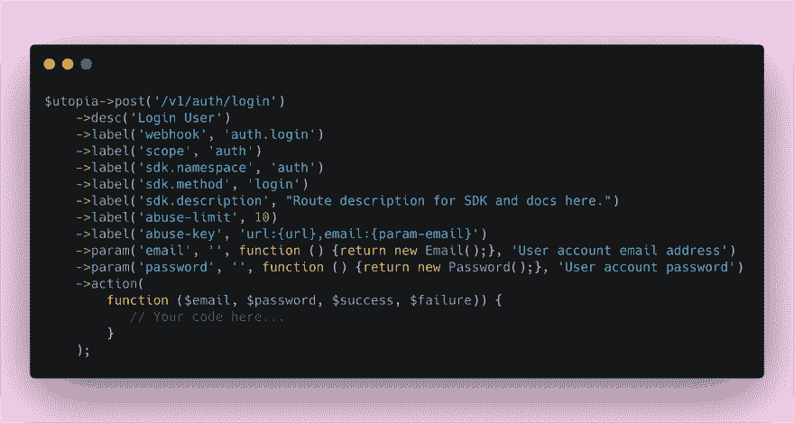

# 这就是我们如何将我们的文档和 SDK 集成为编码过程中的一等公民

> 原文：<https://dev.to/eldadfux/this-is-how-we-integrated-our-docs-and-sdks-as-first-class-citizens-of-our-coding-process-1799>

当我们第一次开始构建开源后端服务器 [Appwrite](https://appwrite.io/) 时，我们的目标是让开发人员的生活更轻松。不同项目甚至公司之间的很多任务都是复杂的，重复的，可以很容易地抽象出来，而这正是 Appwrite 试图做的事情。

Appwrite 为开发人员提供了一套 REST APIs 和工具，有助于抽象复杂性，并帮助开发人员更快、更安全地构建应用程序。

但是构建一个伟大的开源项目不仅仅是写伟大的代码并把它推送到 Github。这是关于建立一个伟大的社区，拥有详细和最新的文档，并允许使用不同的工具和技术轻松集成到我们的 API。

> 构建一个伟大的开源项目不仅仅是编写伟大的代码并上传到 Github

为了让 Appwrite 能够对开发者产生影响，我们希望确保我们将文档和 SDK 视为一等公民，而不是我们必须在开发生命周期的后期阶段解决的问题。

## 宣告一切

Appwrite 后端正在使用一种声明性的方法向我们的每个 API 路径添加新的标签和元数据。这种方法迫使每个 Appwrite 开发人员定义路由用户输入、验证规则、方法描述、SDK 类名和 SDK 方法名(如图所示)。

我们不仅声明了关于路由的简单元数据，如它们的描述或 SDK 方法名称，还声明了复杂的设置，如它们的速率限制阈值、访问控制权限以及是否应该在用户帐户中审计对该路由的 HTTP 请求。当查看我们的路线定义时，我们确切地知道它将在舞台上和后台做什么。

感谢我们定义新路线的声明性方法，我们能够确保我们需要的所有元数据都被正确地设置和使用。使用声明性方法对我们的项目有很大的好处，不仅使代码更容易理解，而且这些元数据还可以帮助我们自动化我们的工作过程。

## 自动化自动化自动化

为了确保我们的 SDK 和文档与我们的任何代码更新保持同步，我们使用 app 对象来获取所有路线并生成 open-api.json 文件。由于我们的路线是非常声明性的，所以我们拥有关于 API 的所有信息，内置于我们的代码中。

现在，我们有了一个 open-api.json 文件来描述我们的整个 api，我们可以使用它来生成我们的文档和 API，作为我们的 CI 或开发生命周期的一部分。

## 现在我们可以试着改变现状

我们创建了一个让我们安心、拥有优秀文档和更少工作的过程，而不是事后才编写冗长的文档，或者有多个来回循环来确保开发人员更新他们的更改。

我们的 SDK 不断地以 5 种不同的语言生成并自动推送到我们的 Github repos(我们还在继续计算)。通常，这项工作需要由具有不同技术背景的多个开发人员来完成。多亏了我们的声明式方法，这项工作是由我们谦逊而勤奋的 CLI 工具代替我们来完成的。

将我们的文档和 SDK 定义声明和视为我们编码过程的一部分，帮助我们改变了思维模式和过程。我们节省了大量时间，我们不再忙于保持我们的生态系统同步，我们可以专注于对我们来说重要的事情，让开发人员的生活更轻松。

## 关于我

我是 Eldad Fux，一名软件架构师、CTO、开源爱好者和 [appwrite.io](https://appwrite.io/) 的创建者。你可以在推特上关注我:【https://twitter.com/eldadfux】T2