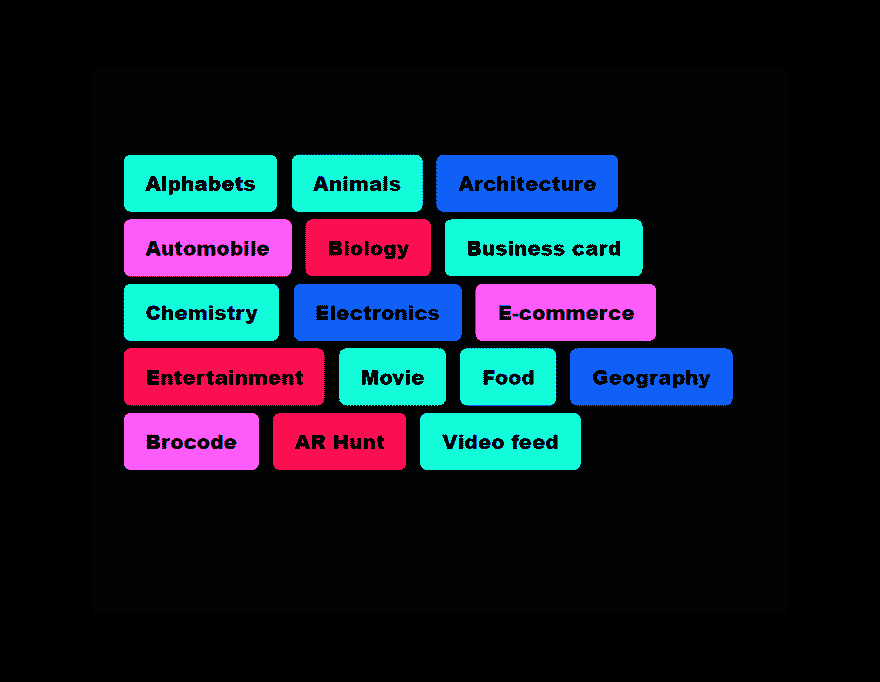

# 这个项目让我在大学里得了 A++💯🎓&这可能是我的最后一篇帖子😭

> 原文：<https://dev.to/liyasthomas/this-project-gave-me-an-a-in-college-this-is-prolly-my-last-post-3ak5>

## **T3】👓lvrT5】**

## 为每个人增强现实

### 随时投稿上 **[GitHub](https://github.com/liyasthomas/lvr)**

TLDR:显然发生了以下事情:
0:我两年前就开始了这个项目🤸‍♀️
1:上个月，这个项目在大学期末考试中给了我一个 A++💯🎓
两个星期前，我去参加了一个面试💁‍♂️在一家初创公司
3:我被✨网站开发员的职位选中了
4:我很快就会加入
5:(这可能是我的最后一篇帖子)

通过 Lvr，我们押注于一个有潜力塑造增强现实未来的游戏规则改变者。Lvr 项目将使创意主管、客户和开发人员能够设计定制的 AR 体验和新形式的网络沉浸式内容🔥

### 先决条件

*   一个支持 [WebGL](https://caniuse.com/#feat=webgl) 和 [WebRTC](https://caniuse.com/#feat=stream) 的设备，带有一个可用的摄像头输入——我们大多数的智能手机和个人电脑都支持这两个😃
*   互联网连接🌐
*   支持网络虚拟现实的网络浏览器(与安卓设备上的 T2 Chrome 配合使用效果最佳)💻
*   [【神奇】](https://en.wikipedia.org/wiki/Wonder_(emotion))！❤️

### 演示:在手机上试试📱 🚀

它可以在所有平台和设备上运行——Android、iOS 和 Windows phone(对于 iOS，你需要更新到 iOS 11)

### 只需两个简单的步骤就能在您的手机上试用，看看吧！

第 0 步:在你手机的 Chrome 浏览器中打开我的[增强现实网络应用](https://liyasthomas.github.io/lvr)。向下滚动并选择任何一个类别(例如:⚗️化学或地理🌍)

步骤 1:授予访问相机和扫描下面的标记图像的权限

在谷歌驱动上可以找到更多标记[。**玩其他标记(A、B、C、D、F、G)和类别(字母、动物、化学、地理等)。)要被逗乐！😱**](https://drive.google.com/drive/folders/1o1FBNNa-GMGJby7ef5nueiZXg8KNNQIR?usp=sharing)

你完了！它将打开一个网页，读取手机的摄像头，定位一个标记，并在其上添加 3D🙀

### 截图

* * *

## 关于项目的一点:tldr

Lvr 的特别之处在于，用户将首次能够在很少或没有技术知识的情况下设计端到端的 AR 体验。[关注 GitHub 上的项目](https://github.com/liyasthomas/lvr)以获得更多见解，并构建自己的 AR 应用程序。

随着计算能力和编程的进步，AR 开始在广告、营销、教育、工业培训等领域得到采用。

用户在超市购物时，可以将手机摄像头对准一种新的奶酪，就可以在手机屏幕上看到它的营养成分和其他成分。

在教育领域，科技公司正在开发解决方案，员工和工程师可以在培训期间将手机指向芯片电路，并查看其各种组件的标签。

这项技术的应用是无限的，下面是一些例子:

*   教育:激发学生在地理、物理、化学、生物、数学、信息技术等方面的想象力。
*   医学:从人体解剖学到内部器官的横断面视图，医学数据，实时诊断和结果。
*   可视化:在生产前可视化产品，3D 建模，建筑，施工，房地产，室内设计，汽车，车辆，电子和电器，制造，电子商务等。
*   虚拟现实:通过身临其境的 3D 体验和用户互动吸引观众。
*   艺术和娱乐:VR/AR 游戏、多媒体流、角色模型等。
*   解释:扫描并获得用户评论，价格，产品的详细信息。
*   交通和导航:获取室内和室外实时导航路线和警报。
*   识别:识别形状、地点、植物、动物、风景等。
*   测量:测量物体之间的距离。
*   转换和翻译:实时单元对话和语言翻译。
*   食物与健康:获取食物和饮料的卡路里消耗量。
*   广告:品牌和广告。
*   电子商务:购买前查看和体验产品。
*   将 2D 印刷材料带入生活:通过将印刷杂志、故事书、产品标签等带入生活来吸引观众。

> “虚幻比真实更有力量。因为任何事情都没有你想象的那么完美。因为只有无形的想法、概念、信念和幻想才会持久。石头碎了。木头会腐烂。人们，嗯，他们会死。但是像思想、梦想、传说这样脆弱的东西，它们可以一直延续下去。如果你能改变人们思考的方式，他们看待自己的方式，他们看待世界的方式，你就能改变人们生活的方式。这是你能创造的唯一持久的东西。”
> —恰克·帕拉尼克

***对我们来说，连天空都不是极限——我们相信“唯一的极限是你的想象力”***

*Lvr 是以 [WebVR](https://webvr.info) 概念为基础，在 [AR.js](https://github.com/jeromeetienne/AR.js) 和 [A-Frame](https://github.com/aframevr/aframe) 之上创建的。本项目还使用了 3D 库 [three.js](https://github.com/mrdoob/three.js) 。*

### 随时投稿上 **[GitHub](https://github.com/liyasthomas/lvr)**

 [## 我在写一本书:解码激情项目📘

### liyas Thomas 5 月 24 日 202 分钟阅读

#books #productivity #startup #watercooler](/liyasthomas/i-m-writing-a-book-de-coding-the-passion-project-2c07)

* * *

如果你想知道我的下一个项目，或者只是想聊聊网络、生活和幸福，请在 Twitter 上关注我💙。如果我的任何项目帮助了你，请考虑[捐赠](https://paypal.me/liyascthomas)。

