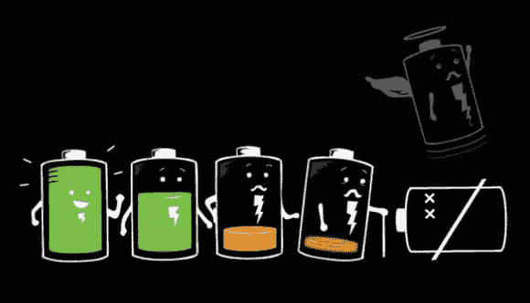
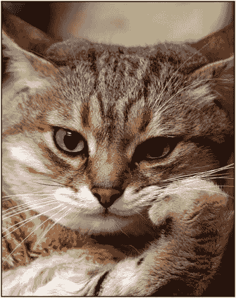

# 关于大学优等生的思考

> 原文：<https://dev.to/elinastef/thoughts-on-getting-ranked-as-top-student-in-university-p6i>

## 值得吗？

绝对不会。！

我们每个人都像蚂蚁中最优秀的团队成员一样围绕着一个无止境的循环**。我相信你们都见过他们带一些食物回家。**

首先，他们用头顶上的小天线识别气味、能量或任何他们需要的东西，然后他们就去找。

当他们找到最好的食物时，他们会展示他们锋利的刀，把它切开并带回家。让我们来看看…之后他们做什么？

他们不停地工作，从未达到工作与生活的平衡！

## 这对你的生活不会有任何影响

嗯，努力工作会让你的生活发生很多变化。

但是，在让你的生活变得更好的工作和让你回到相同循环的工作之间有一条红线；什么都没有改变…没有钱，没有更好的生活，但是嘿，当你猜我为什么写这篇文章时，你会有压力，失去信心，牺牲时间和所有负面的感觉。

让我解释一下，蚂蚁为了一点食物而工作，并把它储存在它们的家里，供长期使用，它们基本上比我们聪明。

正如他们所说，当你是一名普通学生时，你将有时间学习生活中的新技能。这些小技巧将会帮助你耗尽你的电池寿命。

我们做错的是，我们相信如果你的平均绩点是 3.5 或以上，你会成为亿万富翁😆

在你年轻的时候，你只是相信这一点，当你睁开眼睛的时候，你已经失去了你所拥有的:你的宝贵时光，生活的味道！

当然，这很重要。这个糟糕的大学系统夺走了你所有的好东西。

狗屁大学闭上你的嘴，关掉你内心的那点点火花，那点火花可以用最珍贵的东西贡献给这个世界。灵感就这么消失了！

## 接下来我会做什么？

这是最难回答的问题。

但是，我知道该怎么做；通过与更有经验的人交流，通过大量阅读，**和通过更多地融入现实生活**，我不会对大学系统和类似的系统有任何意见。

生命掌握在我们手中。现在让我告诉你，你有两个选择:

要么接受(争取)，要么放弃😉