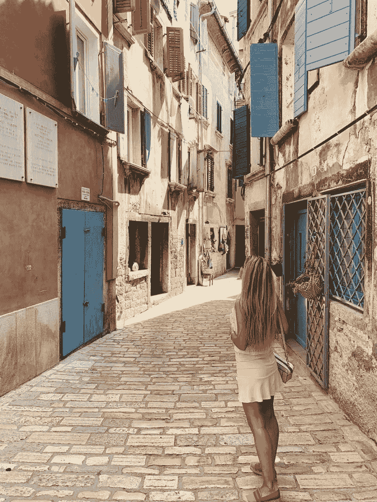

# 你应该参加网络夏令营的三个理由

> 原文：<https://dev.to/blackcat_dev/three-reasons-why-you-should-visit-web-summer-camp-oac>

是的，我用了一个 clickbait 标题，不，我不感到羞耻，一点也不，因为既然你已经点击了，你还不如读它，你显然没有更好的事情要做。

* * *

[网络夏令营](https://2019.websummercamp.com "Web Summer Camp Rovinj 2019")是书呆子们从所有周五部署中恢复的地方，所有那些*只是让它工作我们稍后会适当地重写它*，所有那些*如果它工作了不要重构它没关系它是用梵文写的*时刻或者更确切地说，我应该说是我们留下来生活的决定。

至少在这里，你会被志同道合的专家和有抱负的专业人士所包围，他们渴望知识和提高技能的方法。不需要太多时间，你就可以找到一个肩膀来哭诉你每天都要处理的遗留下来的意大利面条怪物代码库，如果不是，你就是一个幸运的混蛋...

> 网络夏令营是一次很好的经历，我对此有点自私，这是我唯一有点害怕宣传和谈论的会议。

### 知识

Rovinj 网络夏令营阵容强大。你将能够参加行业专家关于软件开发和项目管理的研讨会。你会弄脏你的手，比常规会议更深入。

我参加了 PHP 项目，因为我在工作中不得不处理遗留代码库，我发现了 DDD (领域驱动设计)错误，因为我每天都见证当你走 SDD 路线时会发生什么。这不是巧合，它听起来很像性病，因为它同样糟糕。我说的是销售驱动的设计。一种先*码——后*想的方法。把新功能粘在上面就行了，但是你知道，只要我们有新客户，就很好。没关系，它使你的代码不可维护，看在上帝的份上，它增加了销售！我们以后会考虑可维护性，这只会发生在一切都停滞不前的时候，然后，当然，开发人员是被指责的对象，这是简单的解决方法。

说到绿地项目(感谢 Pim 教我一个新词 lol)我的感觉是 HDD (炒作驱动开发)是流行的方法。我们需要那个新的闪亮的东西来获得成功，否则我们就完了！我们需要 X 框架或 Y 复杂技术，因为可伸缩性和某个 Z unicorn 使用它。有了它，我们肯定会像他们一样成功，看看他们的估值就知道了。尽管我们的用户少了 1 000 000 倍，开发团队只有 3 个人，但是没有其他方法可以解决这个特殊的问题，因为 John 在度假，所以基本上只有 2 个人。

Stefan Priebsch 教授了我们领域驱动设计的核心概念，他的工作室是我最喜欢的。这对我来说是一次大开眼界的经历。各位，我们都做错了！**我们正以相反的顺序做事情，我们正试图对领域建模，以便它适合我们决定使用的技术，而不是挑选适合我们领域的技术。**是的，我知道这对你们许多有经验的人来说已经是昨日黄花了，但我对此还很陌生，所以请耐心听我说，让我大声说出来。

凯文·邓格拉斯的工作室延续了之前的观点。他和 Symfony 团队通过使用 HTTP 的服务器端事件等现有技术，解决了不同客户端(无论是移动客户端还是网络客户端)之间实时应用程序通信的复杂问题。我甚至不知道 SSE 的存在。你看，有时我们不需要在网络套接字之前就存在的最闪亮的新东西。欢迎你上简短的网络历史课。

最后，我非常喜欢托马斯·沃特鲁巴和 T2 的研讨会。他们构建了 [Rector PHP](https://getrector.org/ "Rector PHP") 一个自动化重构代码过程的伟大工具。这就像类固醇上的元编程。我鼓励他们尝试重构一个有很多讨厌的 if 语句和嵌套数组键的旧方法，如果时间允许的话，他们早就解决了。你一定要看看他们的工具，如果你愿意的话，甚至可以贡献一份力量！

### 建立工作关系网

我见过很多了不起的人，我不得不用 excel 表格保存他们的名字和照片，因为我不擅长记名字，我不想冒犯他们。如果你不相信我，你可以去问皮姆·埃尔斯霍夫。我当然是在开玩笑，但是我可能应该做。

正如马里奥·布拉泽克(Mario blaek)所说，“你在哪里有机会和 Symfony 的核心撰稿人[尼古拉斯·格雷卡斯(Nicolas Grekas)](https://twitter.com/nicolasgrekas "Nicolas Greekas Twitter Profile")一起打台球？”或者我什么时候有机会和[佐兰](https://twitter.com/zoran_antolovic "Zoran Twitter Profile")、[皮姆·埃尔斯霍夫](https://twitter.com/Pelshoff "Pim Elshof Twitter Profile")、*、* [克拉斯](https://twitter.com/CEismar "Viking Twitter Profile")我的维京同父异母兄弟和[洪扎·米凯什在海滩上吃一顿*浪漫的晚餐我说的浪漫晚餐是指像猪一样大吃大喝，在蜡烛下喝啤酒。*](https://twitter.com/mikes_honza "Honza Mikeš Twitter Profile")

网络夏令营是一次很好的经历，我对此有点自私，这是我唯一有点害怕宣传和谈论的会议。我的意思是不要误解我，我希望他们变得更大更好，或者无论组织者的目标是什么，我只是不喜欢分享对我来说很珍贵的东西。除了知识，我喜欢分享知识。

真的，这三天我都感觉像是在海边走亲戚。不知何故，我感觉就像在家一样。

### 有趣，非常有趣

网络夏令营是一个 3 天 24 小时的活动。别担心，不是所有的时间都是强制性的，这不是内向者的地狱。组织者真的尽力让你感到受欢迎，不仅为研讨会提供便利，还在研讨会结束后招待你。

真正给我留下深刻印象的是，让我们称他为*首席组织者，* [伊沃](https://twitter.com/ilukac "Ivo Twitter Profile")亲自和大家打招呼并停下来聊天。其余的男生女生也很棒，值得称赞，因为 24/7 的时间都可以参加，这一定很累。

*车间外*计划包括:

*   啤酒专家小组，
*   Unconference
*   两次乘船去附近的岛屿，
*   3 杯饮料和
*   日常锻炼(晨游或跑步)

我的意思是现在来吧？还有谁能提供如此高水平的参与者参与度？

#### Rovinj 本身(奖金原因) 

..好像前面三个理由还不足以让你开始往自己的存钱罐里装钱。Rovinj 是建筑迷的必去之地。这座古城令人叹为观止！事实上，我最初是在 Instagram 的一个*beautiful places kind*页面上发现 Rovinj 老城令人惊叹的建筑的，当我看到它的时候，我就知道我必须去看看，所以我去了。这是我第二次来这里，但我还是不得不把每条街道、每个角落、每栋建筑都拍了一遍。

我用一句著名的半机械人刺客的话来结束这篇帖子: ***我会回来的。**T3】*