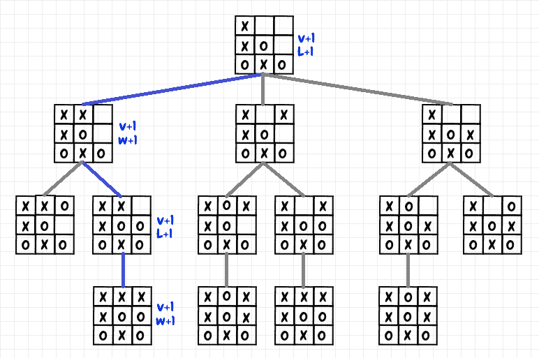
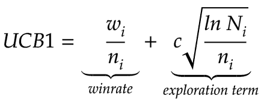
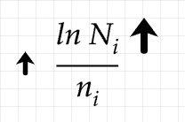
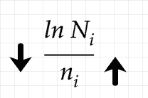
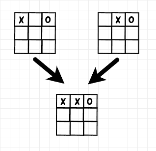
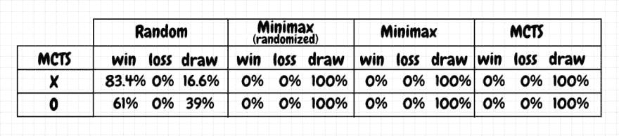

# 与 MCTS 玩井字游戏

> 原文：<https://dev.to/nestedsoftware/tic-tac-toe-with-mcts-2h5k>

到目前为止，在这个系列中，我们已经用 [minimax](https://dev.to/nestedsoftware/tic-tac-toe-with-the-minimax-algorithm-5988) 和[表格 Q-learning](https://dev.to/nestedsoftware/tic-tac-toe-with-tabular-q-learning-1kdn) 实现了井字游戏。在这篇文章中，我们将使用另一种常见的技术，，或蒙特卡罗树搜索。

蒙特卡洛模拟被用于许多不同的计算领域。蒙特卡洛是一个 [*启发式*](https://en.wikipedia.org/wiki/Heuristic_(computer_science)) 。使用试探法，我们不能保证准确地得到正确或最佳的答案，但是我们可以得到一个近似值，这个近似值通常已经足够好了。一些无法通过分析解决的问题，或者(在合理的时间内)无法通过穷尽所有可能性解决的问题，如果我们进行一系列模拟，就会变得容易处理。

在 MCTS，我们进行的模拟被称为*播出*。季后赛是对一场比赛的模拟，通常从开始到结束，但有时从给定的起点到给定的终点。当我们得到游戏的结果时，我们更新在播放期间被访问的每个游戏位置或*节点*的统计数据。想法是运行足够大数量的播出，以统计地评估从给定状态采取给定动作的价值。下图显示了井字游戏单次播放的一部分:

[](https://res.cloudinary.com/practicaldev/image/fetch/s--KXgJHlNA--/c_limit%2Cf_auto%2Cfl_progressive%2Cq_auto%2Cw_880/https://thepracticaldev.s3.amazonaws.com/i/6dpz3fabybointn48xte.png)

在图中，我们为每个位置选择一个移动，直到我们到达游戏的结尾(我们将在下一节看如何做出这个选择)。在这种情况下， *X* 获胜，因此我们增加最终位置的获胜计数和访问次数。我们增加了获胜次数，因为 *X* 的前一步棋导致了 *X* 的获胜。对于前一个位置，我们增加的是亏损数而不是盈利数。这是因为 *O* 走上那个位置的举动最终以 *X* 的胜利而告终:对于那个特定的决赛来说，这是一个失败的举动。我们遍历播放的移动历史，交替更新每个被访问节点的赢和输计数(以及访问计数)。如果 *O* 赢了，那么我们做同样的事情，增加最后位置的赢数，然后我们像以前一样交替。如果是平局，那么我们只需增加季后赛中每个位置的平局计数和访问计数。这与极大极小的工作方式有相似之处，事实上，随着模拟次数的增加，MCTS 接近极大极小。

## 选择和置信上限

我们如何为给定的播放选择移动？事实证明有很多可行的方法。产生播放的简单方法是每次选择随机移动直到游戏结束状态，然后如上所述更新统计。

在本文中，我选择实现 [UCB-1](https://en.wikipedia.org/wiki/Monte_Carlo_tree_search#Monte_Carlo_Method) (置信上限)，这是一种近年来在机器学习中取得重大成功的技术。这种将置信上限应用于 MCTS 的技术有时也被称为 [UCT](https://www.chessprogramming.org/UCT) (置信上限树)。UCT 是一个有趣的想法，用于在季后赛中有效地选择移动。与 epsilon-greedy(在之前的[文章](https://dev.to/nestedsoftware/tic-tac-toe-with-tabular-q-learning-1kdn)中讨论过)一样，目标是在*探索*(尝试一个移动来看看会发生什么)和*利用*(访问在之前的模拟中已经具有高值的节点)之间找到一个合适的平衡。

为了计算置信上限，我们需要以下信息:

*   N <sub>i</sub> :访问父节点的次数(我们选择移动的位置)
*   n <sub>i</sub> :对一个给定子节点的访问次数(选择一个移动产生的位置)
*   w <sub>i</sub> :给定子节点的获胜次数
*   c 是一个可以调整的常数。默认值是 2 的平方根，即 *√2* 。

给定一个起始位置，我们对每个可能的移动产生的位置应用以下公式，然后选择具有最高值的移动:

[](https://res.cloudinary.com/practicaldev/image/fetch/s--EgY9iYGb--/c_limit%2Cf_auto%2Cfl_progressive%2Cq_auto%2Cw_880/https://thepracticaldev.s3.amazonaws.com/i/eh886tke4wwtsywdd8xr.png)

置信上限有两项。第一个是给定节点的 *winrate* 。对于井字游戏，我使用赢和平局的总和，因为我们知道如果双方都没有犯错，平局是最好的结果:

```
class Node:
    # other code omitted...
    def value(self):
        if self.visits == 0:
            return 0

        success_percentage = (self.wins + self.draws) / self.visits
        return success_percentage 
```

第二个学期是*探索学期*。当一个给定的节点相对于其父节点的访问次数来说没有被访问很多时，这个术语会增加。在分子中，我们得到了对父节点的访问次数的自然对数。分母是对当前子节点的访问次数。如果我们不访问给定的子节点，那么随着时间的推移，对父节点的访问次数的增加会逐渐增加探索项。如果有足够的时间，探索项将变得足够高，以便选择该子节点:

[](https://res.cloudinary.com/practicaldev/image/fetch/s--lHr-ghvs--/c_limit%2Cf_auto%2Cfl_progressive%2Cq_auto%2Cw_880/https://thepracticaldev.s3.amazonaws.com/i/qj85q41542hacbmixfj7.png)

如果我们继续增加对父节点的访问次数，而不访问给定的子节点，我们可以看到上面的整体探索项将逐渐增加。但是，因为它是按自然对数缩放的，所以相对于访问次数来说，这种增加是缓慢的。

每当我们访问一个子节点时，分母就会增加，从而导致探索项减少:

[](https://res.cloudinary.com/practicaldev/image/fetch/s--xshtk6dK--/c_limit%2Cf_auto%2Cfl_progressive%2Cq_auto%2Cw_880/https://thepracticaldev.s3.amazonaws.com/i/x6i8btrl4sa55hchrl5l.png)

因为分母不同于分子，它不是按比例缩小的，如果选择子节点没有增加胜率，那么它将非常迅速地降低探索该选择的价值。总的来说，如果探索一个节点在过去没有前途，它可能需要很长时间才能被再次选择，但它最终会发生，假设我们运行足够的播放。

这种解决勘探与开采问题的方法来源于[赫夫丁不等式](https://en.wikipedia.org/wiki/Hoeffding%27s_inequality)。有关更多详细信息，请参见彼得奥尔的论文[使用置信界限进行开采-勘探权衡](http://www.jmlr.org/papers/volume3/auer02a/auer02a.pdf)。

## 实现

我为井字游戏实现的 MCTS 重用了本系列前几篇文章中的`BoardCache`类。该对象将对称的棋盘位置存储为一个键。为了能够利用这种缓存，我必须对我的 MCTS 实现做一些小的调整。特别是，几个不同的位置可以导致相同的子位置，例如:

[](https://res.cloudinary.com/practicaldev/image/fetch/s--FFvUOSvn--/c_limit%2Cf_auto%2Cfl_progressive%2Cq_auto%2Cw_880/https://thepracticaldev.s3.amazonaws.com/i/o7yq2vhssxbhwmtounfv.png)

为了处理这个场景，对于一个给定的子节点，我跟踪它的所有不同的父节点:我使用对父节点的访问总数来计算 N <sub>i</sub> 。以下是 MCTS 井字游戏玩家在季后赛中选择走法的核心逻辑:

```
def calculate_value(node_cache, parent_board, board):
    node = find_or_create_node(node_cache, board)
    node.add_parent_node(node_cache, parent_board)
    if node.visits == 0:
        return math.inf

    parent_node_visits = node.get_total_visits_for_parent_nodes()

    exploration_term = (math.sqrt(2.0)
                        * math.sqrt(math.log(parent_node_visits) / node.visits))

    value = node.value() + exploration_term

    return value 
```

如果一个给定的子节点还没有被访问过，我们把它的值设为无穷大。这样，从一个给定的父节点开始，我们赋予最高优先级来检查每个可能的子节点至少一次。否则，我们将其当前的成功百分比添加到探索项中。请注意，一旦我们完成了延长赛，我们将通过使用可用选项中成功率最高的选项来选择游戏中的实际移动。

## 结果

根据我的理解，随着季后赛次数的增加，UCT 应该会收敛到和 minimax 一样的结果。对于井字游戏，我发现预训练与 *4，000 次*决赛产生了接近 minimax 的结果，并且 MCTS 代理没有输掉任何比赛(基于 *1，000 次*比赛):

[](https://res.cloudinary.com/practicaldev/image/fetch/s--38YuJcPM--/c_limit%2Cf_auto%2Cfl_progressive%2Cq_auto%2Cw_880/https://thepracticaldev.s3.amazonaws.com/i/fzlxjjcv96epvpi2x96j.png)

实际上，我发现 MCTS 经常在“在线”模式下使用。也就是说，MCTS 是实时实施的，而不是提前进行预培训。例如，AlphaGo 的原始版本使用深度学习进行走法选择和位置评估，但它也在真实(即非训练)游戏的每次走法之前进行 MCTS 淘汰赛。它使用神经网络输出和播出结果的组合来决定采取哪一步行动。对于井字游戏，我尝试在每次移动后进行在线播放(没有预先训练),并获得了良好的结果(与上表相当),每次移动有 *200* 次模拟。

## 代码

这个项目的代码可以在 github ( [mcts.py](https://github.com/nestedsoftware/tictac/blob/master/tictac/mcts.py) )上找到:

##  [嵌套软件](https://github.com/nestedsoftware) / [ tictac](https://github.com/nestedsoftware/tictac)

### 尝试玩井字游戏的不同技巧

<article class="markdown-body entry-content container-lg" itemprop="text">

玩井字游戏的不同方法的演示项目。

代码需要 python 3、numpy 和 pytest。对于神经网络/dqn 实现(qneural.py)，pytorch 是必需的。

使用 pipenv 创建虚拟环境:

*   `pipenv --site-packages`

使用 pipenv 安装:

*   `pipenv shell`
*   `pipenv install --dev`

将`PYTHONPATH`设置到主项目目录:

*   在 windows 中，运行`path.bat`
*   在 bash 运行中`source path.sh`

运行测试和演示:

*   运行测试:`pytest`
*   运行演示:`python -m tictac.main`
*   运行神经网络演示:`python -m tictac.main_qneural`

最新结果:

```
C:\Dev\python\tictac>python -m tictac.main
Playing random vs random
-------------------------
x wins: 60.10%
o wins: 28.90%
draw  : 11.00%
Playing minimax not random vs minimax random
---------------------------------------------
x wins: 0.00%
o wins: 0.00%
draw  : 100.00%

Playing minimax random vs minimax not random:
---------------------------------------------
x wins: 0.00%
o wins: 0.00%
draw  : 100.00%

Playing minimax not random vs minimax not random:
-------------------------------------------------
x wins: 0.00%
o wins: 0.00%
draw  : 100.00%

Playing minimax random vs minimax random:
```

…</article>

[View on GitHub](https://github.com/nestedsoftware/tictac)

## 相关

*   [神经网络初级读本](https://dev.to/nestedsoftware/neural-networks-primer-374i)
*   [卷积神经网络:直观入门](https://dev.to/nestedsoftware/convolutional-neural-networks-an-intuitive-primer-k1k)

## 参考文献

*   [MCTS](https://en.wikipedia.org/wiki/Monte_Carlo_tree_search)
*   [蒙特卡洛模拟](https://en.wikipedia.org/wiki/Monte_Carlo_method)
*   [赫夫丁不等式](https://en.wikipedia.org/wiki/Hoeffding%27s_inequality)
*   [利用置信界限进行开采-勘探权衡](http://www.jmlr.org/papers/volume3/auer02a/auer02a.pdf)，作者 Peter Auer