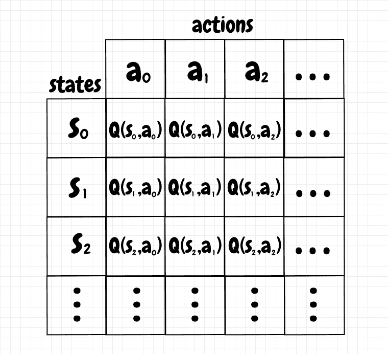
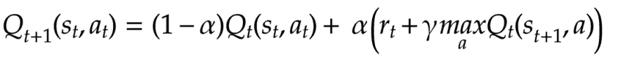
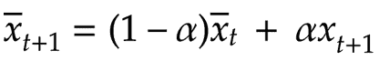
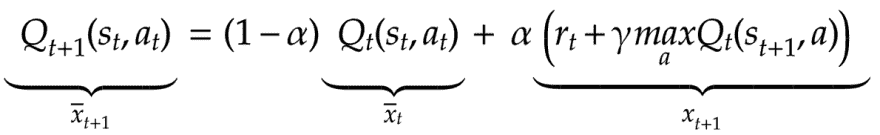
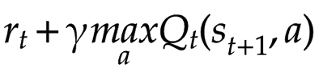
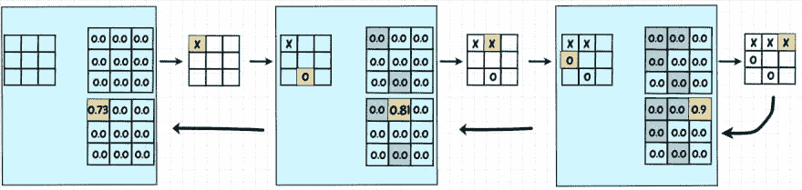
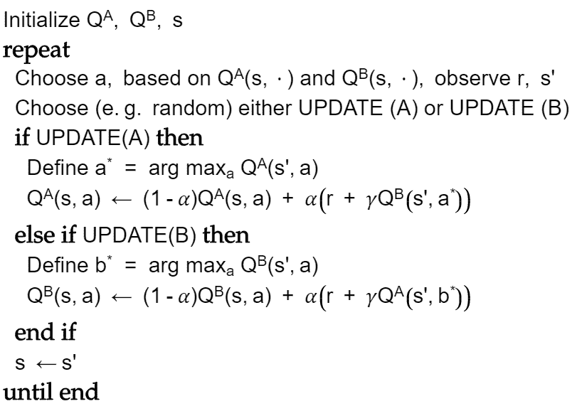
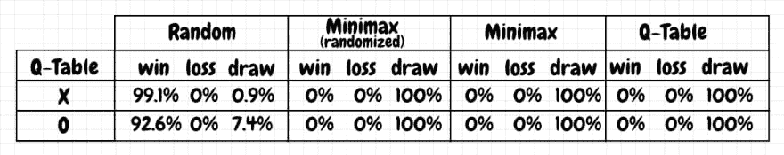
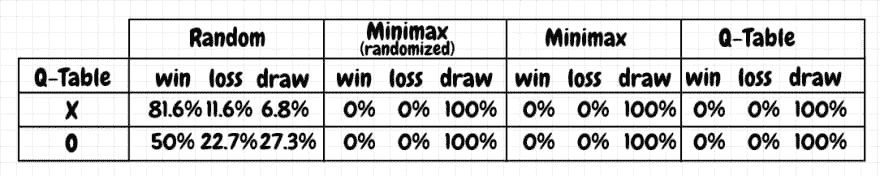

# 表格 Q 学习的井字游戏

> 原文：<https://dev.to/nestedsoftware/tic-tac-toe-with-tabular-q-learning-1kdn>

在上一篇文章中，我们使用 minimax 实现了一个井字游戏求解器。Minimax 很棒，但是它也有一些问题。首先，虽然它不会犯错，但它也没有充分利用对手移动中可能发现的模式。第二，极小极大往往不实用。从历史上看，在国际象棋的例子中，在极大极小算法的基础上结合各种启发式算法的变体实际上是相当成功的。这些策略足以构建出能够打败世界上最优秀的人类棋手的象棋引擎。对于围棋来说，情况就不那么令人满意了:在 DeepMind 于 2015 年用 AlphaGo 取得突破之前，最好的人工智能使用的是蒙特卡罗树搜索(MCTS)，这是 minimax 的近亲。这样的人工智能被认为是相当强的业余选手，但是他们远不能击败职业选手。

DeepMind 通过深度神经网络的应用，彻底改变了国际象棋和围棋等游戏的世界(在某种程度上，也改变了机器学习领域)。这些深度学习实现不仅在强度上优于之前的任何东西，而且在玩游戏的方式上也展示了更具原创性和灵活性的方法，这完全颠覆了许多传统的游戏理论，如国际象棋和围棋。深度学习的成功是非凡的——也让我感到惊讶，因为我对潜在的动力有了更多的了解。比如围棋，深度学习对游戏状态非常微小的差异也能如此细腻敏感，我至今不解。

在本文中，我们将使用井字游戏的表格 Q 学习来实现[强化学习](https://en.wikipedia.org/wiki/Reinforcement_learning)，这是将这种思想应用于神经网络的一个步骤。就像训练一只宠物一样，强化学习就是提供激励来逐渐塑造想要的行为。表格 [Q-learning](https://en.wikipedia.org/wiki/Q-learning) 的基本思想很简单:我们创建一个表格，在一个轴上包含所有可能的状态，在另一个轴上包含所有可能的动作。此表中的每个单元格都有一个 Q 值。Q 值告诉我们从当前状态采取相应的行动是否是一个好主意。高 Q 值是好的，低 Q 值是坏的。下图显示了 Q 表的基本布局:

[](https://res.cloudinary.com/practicaldev/image/fetch/s--DA15r8O3--/c_limit%2Cf_auto%2Cfl_progressive%2Cq_auto%2Cw_880/https://thepracticaldev.s3.amazonaws.com/i/5cxtk1igxig8b0qapwew.png)

在强化学习过程中，我们的代理通过采取行动从一个状态转移到另一个状态。由给定动作产生的从一个状态到另一个状态的转换也可能招致奖励。奖励增加了相关的 Q 值。我们也可以分配一个负奖励作为对一个行为的惩罚，这降低了 Q 值，因此阻止了在未来采取那个特定状态的行为。在训练结束时，对于给定的状态，我们选择对应于最高 Q 值的动作。

我们如何更新 Q 表中状态-动作对的值？Q-learning 定义了一个函数，允许我们迭代地更新表中的 Q 值。如果我们处于给定的状态，并且我们采取了特定的行动，下面的等式显示了我们如何更新相应的 Q 值:

[](https://res.cloudinary.com/practicaldev/image/fetch/s--KUynub0h--/c_limit%2Cf_auto%2Cfl_progressive%2Cq_auto%2Cw_880/https://thepracticaldev.s3.amazonaws.com/i/9tjyket2gkb1g737u84k.png)

在进入细节之前，请注意这个等式是一个指数移动平均，我在以前的[文章](https://dev.to/nestedsoftware/exponential-moving-average-on-streaming-data-4hhl)中已经提到过。下面是指数移动平均线的公式:

[](https://res.cloudinary.com/practicaldev/image/fetch/s--kDgMNQXn--/c_limit%2Cf_auto%2Cfl_progressive%2Cq_auto%2Cw_880/https://thepracticaldev.s3.amazonaws.com/i/vfomfb45vmw6j9vic9ia.png)

在指数移动平均线的情况下，我们接收一个新值*x<sub>t+1</sub>T3】并对其应用 *𝛼* ，一个介于 *0* 和 *1* 之间的值。 *𝛼* 定义了一个新值对平均值的影响程度。该值越接近 *1* ，指数移动平均线就越接近跟踪输入数据。我们通过 *1-𝛼* 调整当前平均值(更新前)，新的平均值成为这两项之和。例如，如果 *𝛼* 为 *0.1* ，一个新值将贡献 *10%* 的更新平均值，所有先前值的组合将贡献 *90%* 。使用更新 q 值的函数，这是相同的想法:我们接收给定状态/动作对的 q 值更新，并对其应用 *𝛼* 。然后，我们将 *1-𝛼* 应用于现有的 q 值。新的 Q 值成为这两个值的和。在下图中，我们可以看到 Q 值更新函数中的项与指数移动平均线中的项是如何对应的:*

[](https://res.cloudinary.com/practicaldev/image/fetch/s--K0oE2EZ9--/c_limit%2Cf_auto%2Cfl_progressive%2Cq_auto%2Cw_880/https://thepracticaldev.s3.amazonaws.com/i/07gksq9nrbgqnksnr8jv.png)

对于井字游戏来说，在我看来，我们实际上并不需要使用移动平均值——我们可能只需要将新值添加到当前总数中。我认为当有大量更新时选择这种方法是有意义的:指数移动平均在数值上更稳定。此外，如果我们在一个状态/动作对的值会随时间变化的领域中工作，这种方法也让我们重视最近的信息而不是旧的信息。

让我们更详细地研究一下 update 函数中的术语。在左边，我们为给定的状态/动作对分配一个新的 Q 值。如果我们知道在时间 *t* 的 Q 值，新的 Q 值对应于时间 *t+1* 。在右边，我们在时间 *t* 获取该状态/动作对的当前 q 值，将其乘以 *1-𝛼* ，并将其添加到 q 值的传入更新中，由 *𝛼* 缩放，如下所示:

[](https://res.cloudinary.com/practicaldev/image/fetch/s--_XEWcPo4--/c_limit%2Cf_auto%2Cfl_progressive%2Cq_auto%2Cw_880/https://thepracticaldev.s3.amazonaws.com/i/bagbjbymaw1ltmfhc74z.png)

*   当我们从一个特定的状态采取一个给定的动作时，我们进入下一个状态， *s <sub>t+1</sub>* 。进入这种新状态的转变可能会给我们带来回报。这就是上式中 *r <sub>t</sub>* 的值。
*   我们还会查看新状态下所有可能动作的 Q 值， *s <sub>t+1</sub>* ，这是在我们采取动作 *a <sub>t</sub>* 之后进入的状态。我们选择下一个状态的最大 Q 值，并用它来更新当前的 Q 值。这个想法是，我们的 Q 值也将取决于我们可以从下面的状态中获得的最佳 Q 值(它取决于之后的状态，以此类推)。
*   我们可以通过在 *0* 和 *1* 之间的折扣因子*𝛾*(γ)来调整来自下一个状态的最大 q 值。如果 *𝛾* 较低，这意味着我们将重视即时奖励，由*r<sub>t</sub>t11】表示，而不是未来奖励，由后续状态的 q 值表征。*

总之，我们通过使用指数移动平均来更新给定状态/动作对的 Q 值。通过平衡在当前状态中获得的回报和来自下一状态的最大 Q 值来获得即将到来的更新。

## Tic-Tac-Toe

为了训练一个表格式的 Q 值代理玩井字游戏，我们将使用棋盘位置作为状态，移动作为动作。我们将为我们遇到的每个这样的状态/动作对定义一个 Q 值。当我们到达游戏结束的状态时，游戏的结果就是分配给导致该结果的移动的奖励。然后，我们可以回溯游戏的历史，并更新 Q 表代理在游戏中采取的每个动作的 Q 值。下图显示了一个示例训练游戏，其中所有的 Q 值都从 *0* 开始。为了说明，我们将使用高 *𝛼* 为 *0.9* :

[](https://res.cloudinary.com/practicaldev/image/fetch/s--QMYPtkD9--/c_limit%2Cf_auto%2Cfl_progressive%2Cq_auto%2Cw_880/https://thepracticaldev.s3.amazonaws.com/i/4vzn7gq5mil1yerqmtlk.png)

*X* 是 Q-table 代理，它正在与一个随机玩游戏的 *O* 玩家进行对抗训练。由于 *X 的*最后一步棋导致了胜利，我们给这个动作奖励 *+1* 。q 值变为 *0 + 𝛼 * 1* ，或 *0.9* 。我们现在可以更新游戏历史中的前一个动作。因为这一步不会结束游戏，所以没有直接的奖励。此外，由于奖励仅分配给 q 表代理采取的最后一个行动，我相信我们可以将折扣因子 *𝛾* 设置为*1*——也就是说，没有必要进一步折扣未来的奖励。下一个状态的最大 q 值是 *0.9* ，因此我们将我们的 q 值更新为 *0 + 𝛼 * 0.9* ，或 *0.81* 。再往前走一个州，我们到达起点。下一个状态的最大 q 值是 *0.81* ，因此我们第一步的新 q 值变为 *0 + 𝛼 * 0.81* ，或 *0.729* (图中四舍五入为 *0.73* )。为了训练我们的 Q-table 代理，我们用许多训练游戏重复这个过程。

请注意，对于 Q-learning agent，它看到的下一个状态将是对手响应后的棋盘状态(或游戏结束状态)。由于它不控制对手，Q 桌玩家认为它的移动结果是对手回应后发生的任何事情。从这个意义上来说，“下一个状态”并不是跟随 Q-table 代理移动的状态，而是由对手的后续移动产生的状态。

## ε-贪婪

如果我们只是通过使用 Q 表中的现有值来更新 Q 值，这可以创建一个反馈循环，强化已经很高的 Q 值。为了缓解这个问题，一种方法是使用[ε-贪婪](https://en.wikipedia.org/wiki/Multi-armed_bandit#Bandit_strategies)策略(又名*ε*-贪婪)。想法很简单:我们在 0 和 1 之间设置一个 *ε* 值。在选择一个动作之前，我们生成一个随机数，也是在 *0* 和 *1* 之间(具有均匀的概率分布)。如果随机数小于 *ε* ，我们选择随机移动。否则我们使用 Q 表选择一个移动。换句话说，我们选择概率为 *ε* 的随机移动，并且我们使用概率为 *1-ε* 的来自 Q 表的移动:选择随机移动被称为*探索*，而使用 Q 表值被称为*开发*。

为 *ε* 选择一个高值，比如说 *0.9* ，意味着我们将在 90% 的时间里随机玩*。在示例代码中，我们从一个高的 *ε* 值开始，逐渐降低到 *0* 。这样，我们在早期做更多的探索，尝试各种不同的想法，然后我们越来越依赖 Q 表值。在培训结束时，我们只使用 Q 表。*

## 双 Q 学习

使用单个表格进行 Q 学习显然会导致对 Q 值的过度估计。这似乎是因为，当我们更新给定状态/动作对的 Q 值时，我们使用相同的 Q 表来获得下一个状态的最大 Q 值，正如我们在前面的井字游戏示例计算中看到的。为了放松这种耦合，双 Q 学习引入了一对 Q 表。如果我们正在更新 Q-table *a* 的 Q 值，那么我们从 Q-table *b* 获得下一个状态的最大 Q 值。相反，如果我们正在更新 Q-table *b* ，我们会从 Q-table *a* 中获得下一个状态的最大 Q 值。参考文献[双 Q 学习](https://papers.nips.cc/paper/3964-double-q-learning.pdf)和[双 Q 学习深度强化学习](https://arxiv.org/pdf/1509.06461.pdf)。我已经修改了下面关于双 Q 学习的论文中的伪代码:

[](https://res.cloudinary.com/practicaldev/image/fetch/s--EluTIjmV--/c_limit%2Cf_auto%2Cfl_progressive%2Cq_auto%2Cw_880/https://thepracticaldev.s3.amazonaws.com/i/55g0ncxr9h18wz7r4nw8.png)

上面的伪代码并没有规定下一个动作是如何选择的。下面是我在我的井字游戏代码里做的(来自 [qtable.py](https://github.com/nestedsoftware/tictac/blob/master/tictac/qtable.py) ):

```
def choose_move_index(q_tables, board, epsilon):
    if epsilon > 0:
        random_value_from_0_to_1 = np.random.uniform()
        if random_value_from_0_to_1 < epsilon:
            return board.get_random_valid_move_index()

    move_q_value_pairs = get_move_average_q_value_pairs(q_tables, board)

    return max(move_q_value_pairs, key=lambda pair: pair[1])[0] 
```

我们用ε-贪婪来决定是否随机移动。如果决定不是随机玩，并且我们使用双 Q 学习，那么我们从两个 Q 表中获得该位置的 Q 值，并对它们进行平均。

我们还可以从伪代码中看到，我们从当前表中获取了最大 Q 值的 action (arg ),但随后我们实际上使用了另一个 Q 表中这个 action 对应的 Q 值。下面是为井字游戏代理执行 Q 表更新的代码(来自 [qtable.py](https://github.com/nestedsoftware/tictac/blob/master/tictac/qtable.py) ):

```
def update_training_gameover(q_tables, move_history, q_table_player, board,
                             learning_rate, discount_factor):
    game_result_reward = get_game_result_value(q_table_player, board)

    # move history is in reverse-chronological order - last to first
    next_position, move_index = move_history[0]
    for q_table in q_tables:
        current_q_value = q_table.get_q_value(next_position, move_index)
        new_q_value = (((1 - learning_rate) * current_q_value)
                       + (learning_rate * discount_factor * game_result_reward))
        q_table.update_q_value(next_position, move_index, new_q_value)

    for (position, move_index) in list(move_history)[1:]:
        current_q_table, next_q_table = get_shuffled_q_tables(q_tables)

        max_next_move_index, _ = current_q_table.get_move_index_and_max_q_value(
            next_position)

        max_next_q_value = next_q_table.get_q_value(next_position,
                                                    max_next_move_index)

        current_q_value = current_q_table.get_q_value(position, move_index)
        new_q_value = (((1 - learning_rate) * current_q_value)
                       + (learning_rate * discount_factor * max_next_q_value))
        current_q_table.update_q_value(position, move_index, new_q_value)

        next_position = position 
```

对于给定游戏历史中的每个位置，我们从 Q-table 代理的最后一步棋开始，并以我们的方式向后移动。因为我们知道最后一个位置的博弈结果，我们用它来更新两个 Q 表的 Q 值。从那里，我们随机选择一个 Q 表来更新，我们从它的同伴 Q 表中获得游戏中下一个状态的 Q 值。上面的代码是通用的——如果只有一个 Q 表，它将继续重用这个表。

根据上面提到的论文，双 Q 学习产生更稳定的结果，并且更快地收敛到更高的分数。然而，在为我的井字游戏玩家实现这一点时，我没有发现任何改进。事实上，使用单个 Q 表的结果似乎更好。

## 结果

即使是这个简单的井字游戏案例研究，在调整这个表格 Q 学习算法时也已经涉及了相当多的复杂性。我们必须为赢、平、输选择奖励值。选择 *+1* 为赢， *0* 为平， *-1* 为输似乎行得通。我们还需要选择默认的起始 Q 值。我并没有过多地摆弄这个，但只是将它们初始化为中性的 *0* 似乎没问题。

然后我们必须为 *𝛼* (学习率) *𝛾* (折现因子)和*ε*(ε-贪婪)选择一个值。最后，我们必须选择什么样的对手来训练我们的 Q-learning agent，以及使用多少训练游戏。我已经成功地用 *0.4* 代替 *𝛼* ，用 *1* 代替 *𝛾* 获得了我希望的合理结果(因为我们只接受游戏结束状态的奖励)。我还使用 0.7 的 *ε* 开始代理的积极探索。这个值每训练游戏 10%减 0.1。在与随机选择招式的对手进行 *7000* 训练游戏后，这些参数通常会产生适用于不同对手的结果，如下所示:

[](https://res.cloudinary.com/practicaldev/image/fetch/s--UmwN2Z_3--/c_limit%2Cf_auto%2Cfl_progressive%2Cq_auto%2Cw_880/https://thepracticaldev.s3.amazonaws.com/i/kii71cee0wmsvpevm8zp.png)

这些结果是从与几个对手中的每一个进行的 *1，000* 场比赛中获得的。对手包括 1)随机移动的玩家；2)随机化的最小最大玩家(其中从几个等值的“最佳移动”中选择一个随机移动)；3)确定性极大极小玩家(其中选择第一个“最佳移动”)；4)另一个 Q 表代理。上面的结果实际上比 minimax 更好:Q-table 玩家不会犯错，就像 minimax 一样，但它在随机玩家面前比 minimax 赢的更多。让我感到惊讶的是，对一个随机出牌的代理人进行训练，对于 Q-table 玩家来说已经足够好了，在面对随机和确定性极大极小游戏对手时都不会出错。

虽然这些结果看起来不错，但我注意到，偶尔，使用这种配置的训练运行可能会产生糟糕的结果，因为 *O* 对抗随机的 minimax 玩家。Q 桌玩家突然输掉了大约 *40%* 的游戏(并在剩下的时间里保持平局)。我知道 DeepMind 已经将 Q 学习应用于神经网络——他们称之为[DQN](https://storage.googleapis.com/deepmind-media/dqn/DQNNaturePaper.pdf)——所以这种明显的过度拟合趋势是我希望深入研究的。

> 更新:写完关于与 MCTS 玩[井字游戏的文章后，我想到尝试增加表格 Q-learning 的和棋奖励(因为只有双方都玩得完美的和棋才有可能)。我把平局的奖励从 0.0 提升到 1.0(和胜利一样)。这似乎解决了一次训练与另一次训练不一致的问题。不过，这似乎确实会降低对随机的胜率，下降到大约 *95%* 为 *X* 和大约 *70%* 为 *O* (剩下的比赛是平局)。](https://dev.to/nestedsoftware/tic-tac-toe-with-mcts-2h5k)

以下是在所有其他参数保持不变的情况下，训练 Q-table 玩家与随机 minimax 玩家的结果:

[](https://res.cloudinary.com/practicaldev/image/fetch/s--URgXQiqt--/c_limit%2Cf_auto%2Cfl_progressive%2Cq_auto%2Cw_880/https://thepracticaldev.s3.amazonaws.com/i/vjlmugkfmwwerjor4838.png)

这些结果并不好。这个代理在与随机移动的玩家的比赛中赢不了多少。更重要的是，它总是犯错，也就是说，它在面对随机移动的玩家时会输掉很多场比赛。当它以 *O* 的身份参赛，只赢了 *50%* ，输了 *22.7%* 的比赛时，它显得特别脆弱。同一个特工只训练随机移动的玩家，在这些游戏中赢了 92.6% 。令我惊讶的是，与一个训练对手“更笨”的代理人相比，这些结果明显更差。我认为原因可能是代理看到的不同状态较少，即使启用了ε贪婪策略。这里，Q-table 在训练后只有 *355* 个棋盘位置(在 *627* 个棋盘位置中，不包括游戏结束状态，并考虑到对称性)。

## 代码

完整代码可从 github ( [qtable.py](https://github.com/nestedsoftware/tictac/blob/master/tictac/qtable.py) )获得:

##  [嵌套软件](https://github.com/nestedsoftware) / [ tictac](https://github.com/nestedsoftware/tictac)

### 尝试玩井字游戏的不同技巧

<article class="markdown-body entry-content p-5" itemprop="text">

玩井字游戏的不同方法的演示项目。

代码需要 python 3、numpy 和 pytest。

使用 pipenv 安装:

*   `pipenv shell`
*   `pipenv install --dev`

确保将`PYTHONPATH`设置为主项目目录:

*   在 windows 中，运行`path.bat`
*   在 bash 运行中`source path.sh`

运行测试和演示:

*   运行测试:`pytest`
*   运行演示:`python -m tictac.main`

以下是最新的演示结果。目前的 qtable 代理玩近乎完美的游戏作为 O 对自己，极小极大，随机。为 X 播放器获得好的结果是非常简单的，但是对于 O 来说，它需要对超参数做一些改动。

最新结果:

```
C:\Dev\python\tictac>python -m tictac.main
Playing random vs random
-------------------------
x wins: 60.10%
o wins: 28.90%
draw  : 11.00%
Playing minimax not random vs minimax random
---------------------------------------------
x wins: 0.00%
o wins: 0.00%
draw  : 100.00%

Playing minimax random vs minimax not random:
---------------------------------------------
x wins: 0.00%
o wins: 0.00%
draw  : 100.00%
```

…</article>

[View on GitHub](https://github.com/nestedsoftware/tictac)

## 相关

*   [神经网络初级读本](https://dev.to/nestedsoftware/neural-networks-primer-374i)
*   [卷积神经网络:直观入门](https://dev.to/nestedsoftware/convolutional-neural-networks-an-intuitive-primer-k1k)
*   [流数据的指数移动平均](https://dev.to/nestedsoftware/exponential-moving-average-on-streaming-data-4hhl)

## 参考文献

*   [强化学习](https://en.wikipedia.org/wiki/Reinforcement_learning)
*   [Q-学习](https://en.wikipedia.org/wiki/Q-learning)
*   [多臂土匪](https://en.wikipedia.org/wiki/Multi-armed_bandit)
*   [双 Q 学习](https://papers.nips.cc/paper/3964-double-q-learning.pdf)
*   [采用双 Q 学习的深度强化学习](https://arxiv.org/pdf/1509.06461.pdf)
*   [通过深度强化学习的人类级控制](https://storage.googleapis.com/deepmind-media/dqn/DQNNaturePaper.pdf)