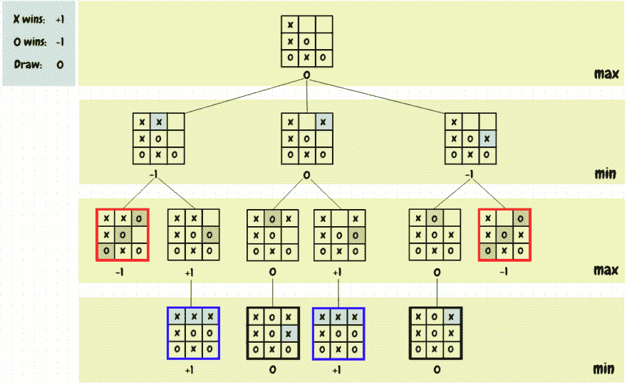
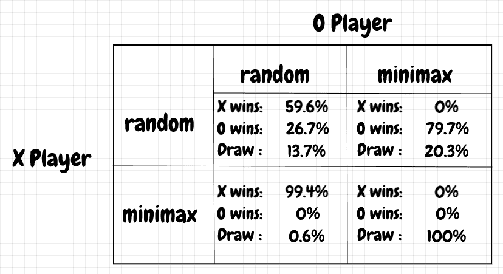

# 用极大极小算法玩井字游戏

> 原文：<https://dev.to/nestedsoftware/tic-tac-toe-with-the-minimax-algorithm-5988>

在本文中，我想展示一个使用 [minimax](https://en.wikipedia.org/wiki/Minimax) 算法的井字游戏解算器的实现。因为这是一个相对较少状态的简单游戏，所以我认为井字游戏将是机器学习和人工智能实验的一个方便的案例研究。在这里，我实现了一个简单的算法，叫做 minimax。

极小极大背后的基本思想是，当我们假设我们的对手会出最好的棋时，我们想知道如何出牌。例如，假设现在是 *X 的*回合， *X* 下了一个特殊的棋。这步棋有什么价值？假设 *O* 能以两种方式之一回应:在第一种情况下， *O* 在下一步棋中获胜。 *O* 的另一步棋导致 *X* 在下一步棋中获胜。既然 O 能赢，我们认为 X*最初的行动是错误的——它导致了损失。我们忽略了这样一个事实:如果*出错，那么 *X* 可能会赢。我们将定义一个值为 *1* 表示赢了 *X* ，赢了 *-1* 表示赢了 *O* ，平了 *0* 。在上面的场景中，由于 *O* 可以在下一步棋中获胜，所以 *X* 的初始棋被赋予一个值 *-1* 。

极大极小算法从任何给定的位置递归地应用这个策略——我们从给定的开始位置探索游戏，直到我们到达所有可能的游戏结束状态。我们可以用一棵树来表示，树的每一层都显示了给定玩家回合中可能的棋盘位置。当我们到达一个游戏结束的状态时，没有选择，所以这个值就是游戏结果，即如果 *X* 赢了，就是 *1* ，如果 *O* 赢了，就是 *-1* ，如果是平局，就是 *0* 。如果是 *X 的*回合，并且不是最终的棋盘状态，我们从树中的该位置选择下一个可能移动的*最大值*。这代表了 *X* 的最佳可能选项。如果轮到 *O* 了，那么我们选择这些值中的*最小值*，这是 *O* 的最佳选择。我们不断将位置值向上传播到根位置，随着我们的前进，在最大值和最小值之间交替——这当然是极大极小算法得名的原因。

下图显示了应用于董事会职位的 minimax 示例:

[](https://res.cloudinary.com/practicaldev/image/fetch/s--OhaBVhoD--/c_limit%2Cf_auto%2Cfl_progressive%2Cq_auto%2Cw_880/https://thepracticaldev.s3.amazonaws.com/i/eo3qr44bp1w96a92t8s2.png)

如果这个位置是游戏结束状态，那么这个位置的值就是这个游戏的结果——这就是递归调用的终止条件。一旦我们到达了游戏结束的位置，我们就可以回到根位置。对于树的*最大*层中的位置——这里是 *X 的*回合——我们从可能的延续中选择具有最大值的移动。对于树的*最小*层中的位置——这里是 *O 的*回合——我们取最小值。在每种情况下，我们都在寻找当前玩家下一步行动的最佳结果。正如我们所看到的，图中的 *X* 所能做的最好的事情(只要 *O* 不出错)就是在棋盘的右上角打成平局。

> 值得强调的是，极小极大对于像井字游戏这样的玩具场景来说很好:如果我们考虑到旋转和反射对称性，那么几乎没有明显的游戏位置。对于更复杂的场景，包括像国际象棋和围棋这样的游戏，minimax 至少必须与其他技术相结合。我在这里没有实现，但是 [alpha-beta 剪枝](https://en.wikipedia.org/wiki/Alpha%E2%80%93beta_pruning)可以用来减少需要访问的位置数量。总的想法是，如果我们知道探索一个子树不会产生比我们已经得到的更好的结果，那么我们就不需要为此费心。还有其他启发式方法。我们可以限制搜索的深度，一旦达到这个限制，我们就可以使用启发式算法来估计位置的可能值。这个想法已经被广泛应用于像 [Stockfish](https://hxim.github.io/Stockfish-Evaluation-Guide/) 这样的国际象棋引擎中。MCTS 是另一种技术，可以用来简化极小极大可能导致太多组合而无法跟踪的情况。如今，对于像国际象棋和围棋这样的游戏，深度学习已经被证明非常有效。事实上，这比其他任何已知的技术都有效得多。

让我们简单看一下实现 minimax 所需的代码。注意，这段代码不是为了最大效率而写的，只是为了说明基本概念。该项目可在 [github](https://github.com/nestedsoftware/tictac) 上获得。此代码来自 [`minimax.py`](https://github.com/nestedsoftware/tictac/blob/master/tictac/minimax.py) 文件:

```
def play_minimax_move(board):
    move_value_pairs = get_move_value_pairs(board)
    move = filter_best_move(board, move_value_pairs)

    return play_move(board, move) 
```

`play_minimax_move`决定给定棋盘位置下哪一步棋。首先，它得到与每个可能的走法相对应的数值，然后，如果是 *X 的*回合，就玩最大值的走法，如果是 *O 的*回合，就玩最小值的走法。

`get_move_value_pairs`从当前棋盘位置获取每次下一步移动的值:

```
def get_move_value_pairs(board):
    valid_move_indexes = get_valid_move_indexes(board)

    assert not_empty(valid_move_indexes), "never call with an end-position"

    move_value_pairs = [(m, get_position_value(play_move(board, m)))
                        for m in valid_move_indexes]

    return move_value_pairs 
```

下面的`get_position_value`，要么从缓存中获取当前位置的值，要么通过探索博弈树直接计算。在没有缓存的情况下，在我的电脑上玩一个游戏大概需要 1.5 分钟。缓存将这一时间缩短到大约 0.3 秒！完全搜索会多次遇到相同的位置。缓存可以让我们大大加快这个过程:如果我们之前已经看到了一个位置，我们就不需要重新探索游戏树的那个部分。

```
def get_position_value(board):
    cached_position_value, found = get_position_value_from_cache(board)
    if found:
        return cached_position_value

    position_value = calculate_position_value(board)

    put_position_value_in_cache(board, position_value)

    return position_value 
```

`calculate_position_value`当给定电路板不在高速缓存中时，查找其值。如果我们在游戏结束时，我们返回游戏结果作为位置的值。否则，我们用每个有效的可能移动递归地回调到`get_position_value`。然后我们得到所有这些值的最小值或最大值，这取决于轮到谁:

```
def calculate_position_value(board):
    if is_gameover(board):
        return get_game_result(board)

    valid_move_indexes = get_valid_move_indexes(board)

    values = [get_position_value(play_move(board, m))
              for m in valid_move_indexes]

    min_or_max = choose_min_or_max_for_comparison(board)
    position_value = min_or_max(values)

    return position_value 
```

下面我们可以看到，如果是 *O 的*回合`choose_min_or_max_for_comparison`返回`min`函数，如果是 *X 的*回合
返回`max`

```
def choose_min_or_max_for_comparison(board):
    turn = get_turn(board)
    return min if turn == CELL_O else max 
```

暂时回到缓存，缓存代码还考虑了等价的位置。这包括旋转以及水平和垂直反射。旋转时有 4 个等效位置:0°、90°、180°和 270°。还有 4 个倒影:水平垂直翻转原位置，也是先旋转 90°，再水平垂直翻转。翻转剩余的旋转是多余的:翻转 180°旋转将产生与翻转原始位置相同的位置；翻转 270°旋转将产生与翻转 90°旋转相同的位置。在不考虑旋转和反射的情况下，一个游戏在我的电脑上大约需要 0.8 秒，相比之下，为旋转和反射启用缓存时需要 0.3 秒。`get_symmetrical_board_orientations`获取所有等效板位置，以便在缓存中查找:

```
def get_symmetrical_board_orientations(board_2d):
    orientations = [board_2d]

    current_board_2d = board_2d
    for i in range(3):
        current_board_2d = np.rot90(current_board_2d)
        orientations.append(current_board_2d)

    orientations.append(np.flipud(board_2d))
    orientations.append(np.fliplr(board_2d))

    orientations.append(np.flipud(np.rot90(board_2d)))
    orientations.append(np.fliplr(np.rot90(board_2d)))

    return orientations 
```

如果您有兴趣更深入地了解一下，可以从以下网址获得包含该项目的所有代码的 github repo:

##  [嵌套软件](https://github.com/nestedsoftware) / [ tictac](https://github.com/nestedsoftware/tictac)

### 尝试玩井字游戏的不同技巧

<article class="markdown-body entry-content p-5" itemprop="text">

玩井字游戏的不同方法的演示项目。

代码需要 python 3、numpy 和 pytest。

使用 pipenv 安装:

*   `pipenv shell`
*   `pipenv install --dev`

确保将`PYTHONPATH`设置到主项目目录:

*   在 windows 中，运行`path.bat`
*   在 bash 运行中`source path.sh`

运行测试和演示:

*   运行测试:`pytest`
*   运行演示:`python -m tictac.main`

以下是最新的演示结果。目前的 qtable 代理玩近乎完美的游戏作为 O 对自己，极小极大，随机。为 X 播放器获得好的结果是非常简单的，但是对于 O 来说，它需要对超参数做一些改动。

最新结果:

```
C:\Dev\python\tictac>python -m tictac.main
Playing random vs random
-------------------------
x wins: 60.10%
o wins: 28.90%
draw  : 11.00%
Playing minimax not random vs minimax random
---------------------------------------------
x wins: 0.00%
o wins: 0.00%
draw  : 100.00%

Playing minimax random vs minimax not random:
---------------------------------------------
x wins: 0.00%
o wins: 0.00%
draw  : 100.00%
```

…</article>

[View on GitHub](https://github.com/nestedsoftware/tictac)

下面是 minimax 和 random 玩家不同组合的胜率，每个组合玩 1000 场游戏:

[](https://res.cloudinary.com/practicaldev/image/fetch/s--uCCfafpM--/c_limit%2Cf_auto%2Cfl_progressive%2Cq_auto%2Cw_880/https://thepracticaldev.s3.amazonaws.com/i/7jme6nri5hpakxhhr5j7.png)

我们可以看到，如果两个玩家都完美发挥，只有和棋的可能，但是如果两个玩家都随机发挥， *X* 赢的可能性更大。

## 相关

*   [AlphaGo:关于机器智能的观察](https://dev.to/nestedsoftware/alphago-observations-about-machine-intelligence-4c62)
*   [神经网络初级读本](https://dev.to/nestedsoftware/neural-networks-primer-374i)
*   [卷积神经网络:直观入门](https://dev.to/nestedsoftware/convolutional-neural-networks-an-intuitive-primer-k1k)